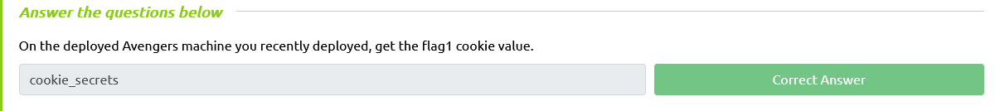
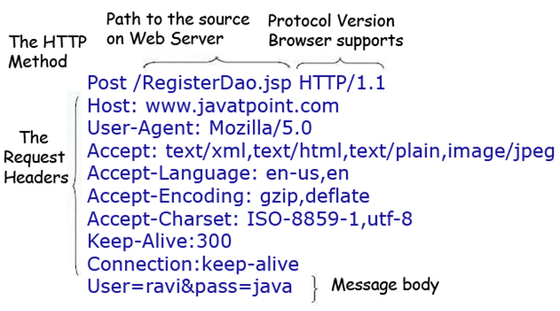
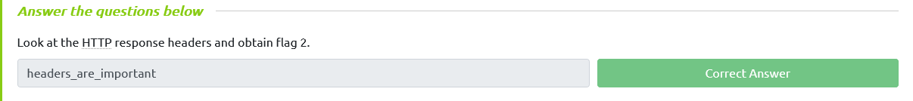
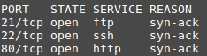
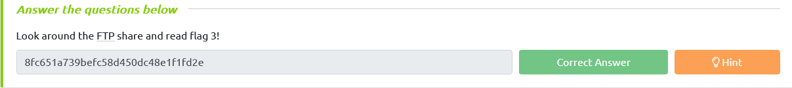
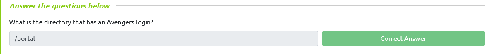
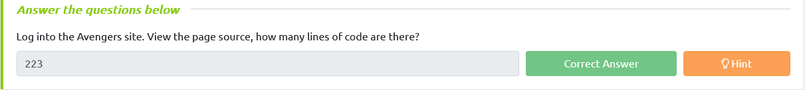
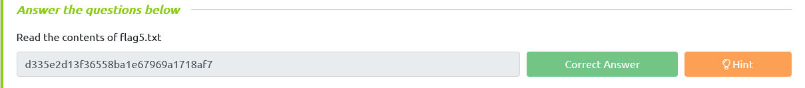

# Cookies                            

HTTP Cookies is a small piece of data sent from a website and stored on the  user's computer by the user's web browser while the user is browsing.  They're intended to remember things such as your login information,  items in your shopping cart or language you prefer.

Advertisers can use also *tracking* cookies to identify which sites you've previously visited or where about's on a web-page you've clicked. Some tracking cookies have become so  intrusive, many anti-virus programs classify them as spyware.

You can view & dynamically update your cookies directly in your browser. To do this, press **F12** (or right click and select *Inspect*) to open the developer tools on your browser, then click *Application* and then *Cookies.* 

#  HTTP Headers                            

HTTP Headers let a client and server pass information with a HTTP request or response. Header names and values are separated by a single colon and  are integral part of the HTTP protocol.

The main two HTTP Methods are POST and GET requests. The GET method us used to request  data from a resource and the POST method is used to send data to a  server.

We can view requests made to and from our browser by opening the *Developer Tools* again and navigating to the *Network* tab. Have this tab open and refresh the page to see all requests made. You  will be able to see the original request made from your browser to the  web server. 

# Enumeration and FTP                            

In this task we will scan the machine with nmap (a network scanner) and access the FTP service using reusable credentials.

Lets get started by scanning the machine, you will need nmap. If you don't  have the application installed you can use our web-based AttackBox that  has nmap pre-installed.

In your terminal, execute the following command:
`nmap <machine_ip> -v`

 This will scan the machine and determine what services on which ports are  running. For this machine, you will see the following ports open:

Port 80 has a HTTP web server running on
Port 22 is to SSH into the machine
Port 21 is used for FTP (file transfer)

We've accessed the web server, lets now access the FTP service. If you read the Avengers web page, you will see that Rocket  made a post asking for Groot's password to be reset, the post included  his old password too!

In your terminal, execute the following command:
`ftp <machine_ip>`

We will be asked for a username (*groot*) and a password (*iamgroot*). We should have now successfully logged into the FTP share using Groots credentials!

#  GoBuster                            

Lets use a fast directory discovery tool  called GoBuster. This program will locate a directory that you can use  to login to Mr. Starks Tarvis portal!

GoBuster is a tool used to brute-force URIs (directories and files), DNS subdomains and virtual host names. For this machine, we will focus on using it to brute-force directories.

You can either download GoBuster, or use the Kali Linux machine that has it pre-installed.

Lets run GoBuster with a wordlist (on Kali they're located under **/usr/share/wordlists**):
`gobuster dir -u http://<machine_ip> -w <word_list_location>`

#  SQL Injection                            

You should now see the following page above. We're going to manually exploit this page using an attack called SQL injection.

SQL Injection is a code injection technique that manipulates an SQL query.  You can execute you're own SQL that could destroy the database, reveal  all database data (such as usernames and passwords) or trick the web  server in authenticating you.

To exploit SQL, we first need to know how it works. A SQL query could be `SELECT * FROM Users WHERE username = {User Input} AND password = {User Input 2}` , if you insert additional SQL as the {User Input} we can manipulate this query. For example, if I have the {User Input 2} as `' 1=1` we could trick the query into authenticating us as the **'** character would break the SQL query and 1=1 would evaluate to be true.

To conclude, having our first {User Input} as the username of the account  and {User Input 2} being the condition to make the query true, the final query would be:
`SELECT * FROM Users WHERE username = ` ' or 1=1--` AND password = ` ' or 1=1--

This would authenticate us as the admin user.

# Remote Code Execution and Linux                            

ou should be logged into the Jarvis access panel! Here we can execute commands on the machine.. I wonder if we can exploit this to read files on the system.

Try executing the `ls` command to list all files in the current directory. Now try joining 2 Linux commands together to list files in the parent directory: `cd ../; ls` doing so will show a file called flag5.txt, we can add another command to read this file: `cd ../; ls; cat flag5.txt`

But oh-no! The cat command is disallowed! We will have to think of another Linux command we can use to read it! 

Read file using `tac `command `cd ../; ls; tac flag5.txt`

