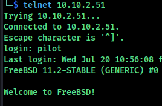
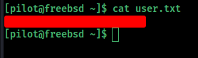
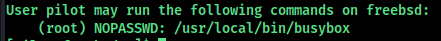
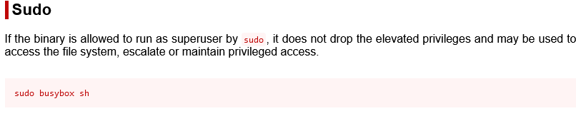
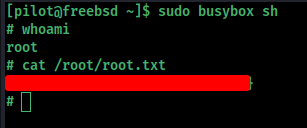

# nmap

```bash
tarting Nmap 7.92 ( https://nmap.org ) at 2022-07-20 16:29 IST
Nmap scan report for 10.10.2.51
Host is up (0.16s latency).
Not shown: 998 closed tcp ports (conn-refused)
PORT   STATE SERVICE VERSION
22/tcp open  ssh     OpenSSH 7.5 (FreeBSD 20170903; protocol 2.0)
| ssh-hostkey: 
|   2048 5b:e6:85:66:d8:dd:04:f0:71:7a:81:3c:58:ad:0b:b9 (RSA)
|   256 d5:4e:18:45:ba:d4:75:2d:55:2f:fe:c9:1c:db:ce:cb (ECDSA)
|_  256 96:fc:cc:3e:69:00:79:85:14:2a:e4:5f:0d:35:08:d4 (ED25519)
23/tcp open  telnet  BSD-derived telnetd
Service Info: OS: FreeBSD; CPE: cpe:/o:freebsd:freebsd

Service detection performed. Please report any incorrect results at https://nmap.org/submit/ .
Nmap done: 1 IP address (1 host up) scanned in 23.18 seconds

```

Two ports are open `22 ssh` and `23 telnet`

# telnet

The login name `pilot` 





For privilege escalation used command `sudo -l`



We can run busybox as root going to [gtfobins](https://gtfobins.github.io/gtfobins/busybox/#sudo)



