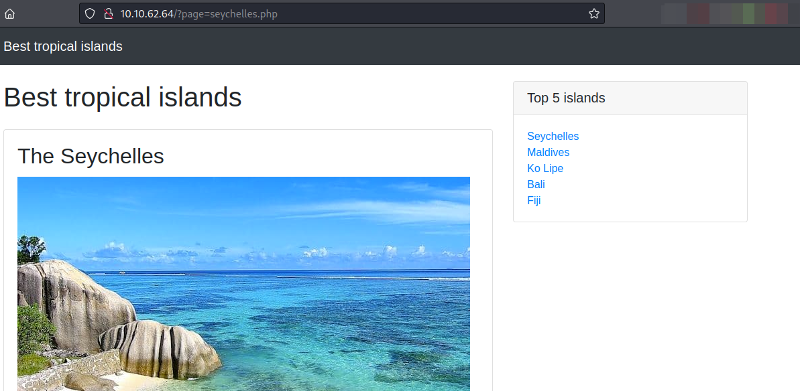
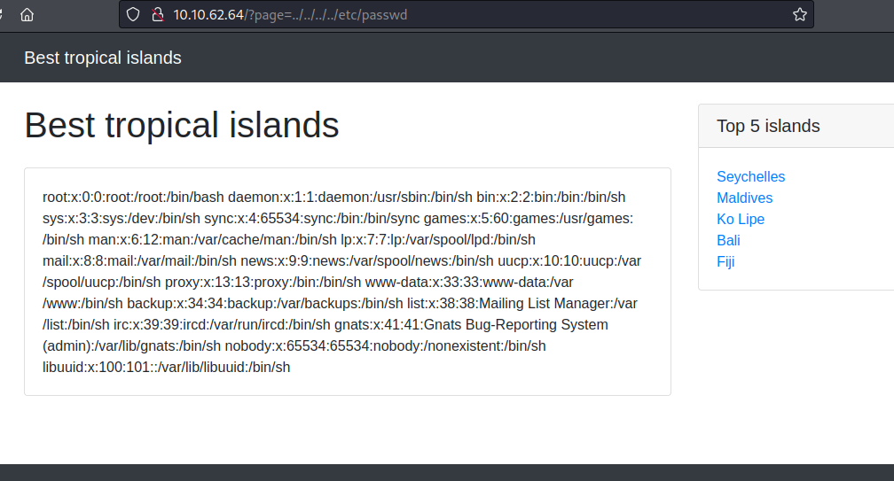
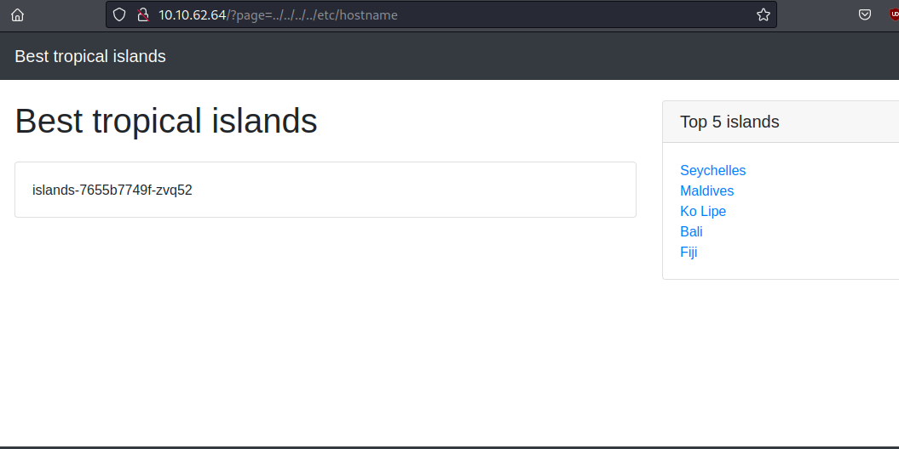
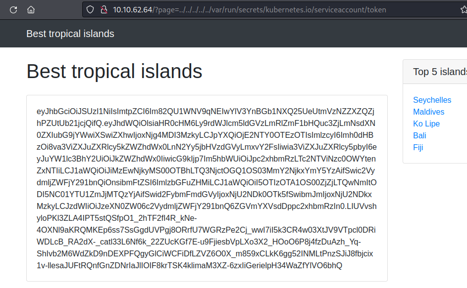

**Nmap**

```bash
Nmap scan report for 10.10.62.64
Host is up (0.16s latency).
Not shown: 997 closed tcp ports (conn-refused)
PORT     STATE SERVICE       VERSION
22/tcp   open  ssh           OpenSSH 8.2p1 Ubuntu 4ubuntu0.3 (Ubuntu Linux; protocol 2.0)
| ssh-hostkey: 
|   3072 9f:ae:04:9e:f0:75:ed:b7:39:80:a0:d8:7f:bd:61:06 (RSA)
|   256 cf:cb:89:62:99:11:d7:ca:cd:5b:57:78:10:d0:6c:82 (ECDSA)
|_  256 5f:11:10:0d:7c:80:a3:fc:d1:d5:43:4e:49:f9:c8:d2 (ED25519)
80/tcp   open  http          Apache httpd 2.2.22 ((Ubuntu))
|_http-title: Best tropical islands
|_http-server-header: Apache/2.2.22 (Ubuntu)
8443/tcp open  ssl/https-alt
| fingerprint-strings: 
|   FourOhFourRequest: 
|     HTTP/1.0 403 Forbidden
|     Audit-Id: e5e35773-d200-42ae-84ae-c87dc8aea6c4
|     Cache-Control: no-cache, private
|     Content-Type: application/json
|     X-Content-Type-Options: nosniff
|     X-Kubernetes-Pf-Flowschema-Uid: a5c8dc51-1beb-4524-9996-fcbdf17ad8d9
|     X-Kubernetes-Pf-Prioritylevel-Uid: 9a40dace-d4fe-4ce4-8625-787c338bd84b
|     Date: Wed, 29 Jun 2022 07:24:21 GMT
|     Content-Length: 212
|     {"kind":"Status","apiVersion":"v1","metadata":{},"status":"Failure","message":"forbidden: User "system:anonymous" cannot get path "/nice ports,/Trinity.txt.bak"","reason":"Forbidden","details":{},"code":403}
|   GetRequest: 
|     HTTP/1.0 403 Forbidden
|     Audit-Id: 2af3f8ac-df21-4b51-aa6a-2c85863fa890
|     Cache-Control: no-cache, private
|     Content-Type: application/json
|     X-Content-Type-Options: nosniff
|     X-Kubernetes-Pf-Flowschema-Uid: a5c8dc51-1beb-4524-9996-fcbdf17ad8d9
|     X-Kubernetes-Pf-Prioritylevel-Uid: 9a40dace-d4fe-4ce4-8625-787c338bd84b
|     Date: Wed, 29 Jun 2022 07:24:20 GMT
|     Content-Length: 185
|     {"kind":"Status","apiVersion":"v1","metadata":{},"status":"Failure","message":"forbidden: User "system:anonymous" cannot get path "/"","reason":"Forbidden","details":{},"code":403}
|   HTTPOptions: 
|     HTTP/1.0 403 Forbidden
|     Audit-Id: af8c1da8-cf7b-4895-94bf-c6319047173f
|     Cache-Control: no-cache, private
|     Content-Type: application/json
|     X-Content-Type-Options: nosniff
|     X-Kubernetes-Pf-Flowschema-Uid: a5c8dc51-1beb-4524-9996-fcbdf17ad8d9
|     X-Kubernetes-Pf-Prioritylevel-Uid: 9a40dace-d4fe-4ce4-8625-787c338bd84b
|     Date: Wed, 29 Jun 2022 07:24:20 GMT
|     Content-Length: 189
|_    {"kind":"Status","apiVersion":"v1","metadata":{},"status":"Failure","message":"forbidden: User "system:anonymous" cannot options path "/"","reason":"Forbidden","details":{},"code":403}
|_http-title: Site doesn't have a title (application/json).
| ssl-cert: Subject: commonName=minikube/organizationName=system:masters
| Subject Alternative Name: DNS:minikubeCA, DNS:control-plane.minikube.internal, DNS:kubernetes.default.svc.cluster.local, DNS:kubernetes.default.svc, DNS:kubernetes.default, DNS:kubernetes, DNS:localhost, IP Address:192.168.49.2, IP Address:10.96.0.1, IP Address:127.0.0.1, IP Address:10.0.0.1
| Not valid before: 2022-01-05T23:39:08
|_Not valid after:  2025-01-05T23:39:08
| tls-alpn: 
|   h2
|_  http/1.1
|_ssl-date: TLS randomness does not represent time
1 service unrecognized despite returning data. If you know the service/version, please submit the following fingerprint at https://nmap.org/cgi-bin/submit.cgi?new-service :
SF-Port8443-TCP:V=7.92%T=SSL%I=7%D=6/29%Time=62BBFE23%P=x86_64-pc-linux-gn
SF:u%r(GetRequest,22F,"HTTP/1\.0\x20403\x20Forbidden\r\nAudit-Id:\x202af3f
SF:8ac-df21-4b51-aa6a-2c85863fa890\r\nCache-Control:\x20no-cache,\x20priva
SF:te\r\nContent-Type:\x20application/json\r\nX-Content-Type-Options:\x20n
SF:osniff\r\nX-Kubernetes-Pf-Flowschema-Uid:\x20a5c8dc51-1beb-4524-9996-fc
SF:bdf17ad8d9\r\nX-Kubernetes-Pf-Prioritylevel-Uid:\x209a40dace-d4fe-4ce4-
SF:8625-787c338bd84b\r\nDate:\x20Wed,\x2029\x20Jun\x202022\x2007:24:20\x20
SF:GMT\r\nContent-Length:\x20185\r\n\r\n{\"kind\":\"Status\",\"apiVersion\
SF:":\"v1\",\"metadata\":{},\"status\":\"Failure\",\"message\":\"forbidden
SF::\x20User\x20\\\"system:anonymous\\\"\x20cannot\x20get\x20path\x20\\\"/
SF:\\\"\",\"reason\":\"Forbidden\",\"details\":{},\"code\":403}\n")%r(HTTP
SF:Options,233,"HTTP/1\.0\x20403\x20Forbidden\r\nAudit-Id:\x20af8c1da8-cf7
SF:b-4895-94bf-c6319047173f\r\nCache-Control:\x20no-cache,\x20private\r\nC
SF:ontent-Type:\x20application/json\r\nX-Content-Type-Options:\x20nosniff\
SF:r\nX-Kubernetes-Pf-Flowschema-Uid:\x20a5c8dc51-1beb-4524-9996-fcbdf17ad
SF:8d9\r\nX-Kubernetes-Pf-Prioritylevel-Uid:\x209a40dace-d4fe-4ce4-8625-78
SF:7c338bd84b\r\nDate:\x20Wed,\x2029\x20Jun\x202022\x2007:24:20\x20GMT\r\n
SF:Content-Length:\x20189\r\n\r\n{\"kind\":\"Status\",\"apiVersion\":\"v1\
SF:",\"metadata\":{},\"status\":\"Failure\",\"message\":\"forbidden:\x20Us
SF:er\x20\\\"system:anonymous\\\"\x20cannot\x20options\x20path\x20\\\"/\\\
SF:"\",\"reason\":\"Forbidden\",\"details\":{},\"code\":403}\n")%r(FourOhF
SF:ourRequest,24A,"HTTP/1\.0\x20403\x20Forbidden\r\nAudit-Id:\x20e5e35773-
SF:d200-42ae-84ae-c87dc8aea6c4\r\nCache-Control:\x20no-cache,\x20private\r
SF:\nContent-Type:\x20application/json\r\nX-Content-Type-Options:\x20nosni
SF:ff\r\nX-Kubernetes-Pf-Flowschema-Uid:\x20a5c8dc51-1beb-4524-9996-fcbdf1
SF:7ad8d9\r\nX-Kubernetes-Pf-Prioritylevel-Uid:\x209a40dace-d4fe-4ce4-8625
SF:-787c338bd84b\r\nDate:\x20Wed,\x2029\x20Jun\x202022\x2007:24:21\x20GMT\
SF:r\nContent-Length:\x20212\r\n\r\n{\"kind\":\"Status\",\"apiVersion\":\"
SF:v1\",\"metadata\":{},\"status\":\"Failure\",\"message\":\"forbidden:\x2
SF:0User\x20\\\"system:anonymous\\\"\x20cannot\x20get\x20path\x20\\\"/nice
SF:\x20ports,/Trinity\.txt\.bak\\\"\",\"reason\":\"Forbidden\",\"details\"
SF::{},\"code\":403}\n");
Service Info: OS: Linux; CPE: cpe:/o:linux:linux_kernel

```

open ports **22/ssh**, **80/http**, **8443/ssl/https-alt**

**port 80**



Running gobuster nothing interesting was found other then  

```bash
/index.php            (Status: 200) [Size: 3790]
/fiji.php             (Status: 200) [Size: 796] 
/maldives.php         (Status: 200) [Size: 518] 
/bali.php             (Status: 200) [Size: 495] 
/server-status        (Status: 403) [Size: 292] 
/seychelles.php       (Status: 200) [Size: 580] 
```

this site has **directory traversal vulnerability**



found **hostname**



Found **token**

