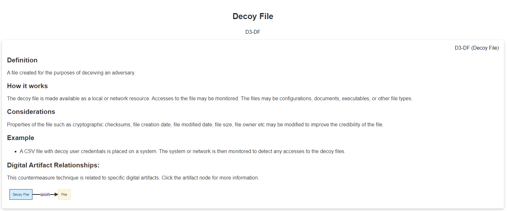

# Introduction to MITRE

For those that are new to the cybersecurity field, you probably never heard of MITRE. Those of us that have been around *might* only associate MITRE with CVEs ([**Common Vulnerabilities and Exposures**](https://cve.mitre.org)) list, which is one resource you'll probably check when searching for an exploit for a given vulnerability. But MITRE researches in many areas,  outside of cybersecurity, for the 'safety, stability, and well-being of  our nation.' These areas include artificial intelligence, health  informatics, space security, to name a few.

From [**Mitre.org**](https://www.mitre.org/about/corporate-overview): "*At MITRE, we solve problems for a safer world. Through our federally  funded R&D centers and public-private partnerships, we work across  government to tackle challenges to the safety, stability, and well-being of our nation.*"

In this room, we will focus on other projects/research that the US-based non-profit  MITRE Corporation has created for the cybersecurity community,  specifically:

- ATT&CK*®* (**Adversarial Tactics, Techniques, and Common Knowledge**) Framework
- CAR (**Cyber Analytics Repository**) Knowledge Base
- SHIELD (sorry, not a fancy acronym) Active Defense
- AEP (**ATT&CK Emulation Plans**)

# Basic Terminology

Before diving in, let's briefly discuss a few terms that you will  often hear when dealing with the framework, threat intelligence, etc.

**APT** is an acronym for **A****dvanced Persistent Threat**. This can be considered a team/group (***threat group\***), or even country (***nation-state group\***), that engages in long-term attacks against organizations and/or  countries. The term 'advanced' can be misleading as it will tend to  cause us to believe that each APT group all have some super-weapon, e.i. a zero-day exploit, that they use. That is not the case. As we will see a bit later, the techniques these APT groups use are quite common and  can be detected with the right implementations in place. You can view  FireEye's current list of APT groups [**here**](https://www.fireeye.com/current-threats/apt-groups.html). 

TTP is an acronym for **Tactics, Techniques, and Procedures,** but what does each of these terms mean?

- The **Tactic** is the adversary's goal or objective.
- The **Technique** is how the adversary achieves the goal or objective.
- The **Procedure** is how the technique is executed.

# ATT&CK® Framework                            

What is the ATT&CK® framework? According to the [**website**](https://attack.mitre.org/), "MITRE ATT&CK® is a globally-accessible knowledge base of adversary tactics and techniques based on real-world observations." In 2013,  MITRE began to address the need to record and document common TTPs (**Tactics, Techniques, and Procedures**) that APT (**Advanced Persistent Threat**) groups used against enterprise Windows networks. This started with an internal project known as FMX (**Fort Meade Experiment**). Within this project, selected security professionals were tasked to  emulated adversarial TTPs against a network, and data was collected from the attacks on this network. The gathered data helped construct the  beginning pieces of what we know today as the ATT&CK® framework. 

The ATT&CK® framework has grown and expanded throughout the years. One  notable expansion was that the framework focused solely on the Windows  platform but has expanded to cover other platforms, such as macOS and Linux. The framework is heavily contributed to by many sources, such as  security researchers and threat intelligence reports. Note this is not  only a tool for blue teamers. The tool is also useful for a penetration  tester and/or red teamer.

If you haven't done so, navigate to the ATT&CK® [**website**](https://attack.mitre.org/).

Direct your attention to the bottom of the page to view the **ATT&CK® Matrix for Enterprise**. Across the top of the matrix, there are 14 categories. Each category  contains the techniques an adversary could use to perform the tactic.  The categories cover the seven-stage Cyber Attack Lifecycle (credit  Lockheed Martin for the Cyber Kill Chain).

Under **Initial Access**, there are 9 techniques. Some of the techniques have sub-techniques, such as Phishing. 

If we click on the gray bar to the right, a new layer appears listing the sub-techniques. 

To get a better understanding of this technique and it's associated sub-techniques, click on Phishing.

We have been directed to a page dedicated to the technique known as Phishing and all related information regarding the technique, such as a brief description, **Procedure Examples**, and **Mitigations**. 

You can alternatively resort to using the Search feature to retrieve all  associated information regarding a given technique, sub-technique,  and/or group. 

Lastly, the same data can be viewed via the **MITRE ATT&CK® Navigator**: "*The ATT&CK® Navigator is designed to provide basic navigation and  annotation of ATT&CK® matrices, something that people are already  doing today in tools like Excel. We've designed it to be simple and  generic - you can use the Navigator to visualize your defensive  coverage, your red/blue team planning, the frequency of detected  techniques, or anything else you want to do*."

You can access the Navigator view when visiting a group or tool page. The ATT&CK® Navigator Layers button will be available.

In the sub-menu select **view**.

Let's get acquainted with this tool. Click [**here**](https://mitre-attack.github.io/attack-navigator//#layerURL=https%3A%2F%2Fattack.mitre.org%2Fgroups%2FG0008%2FG0008-enterprise-layer.json) to view the ATT&CK® Navigator for Carbanak. 

At the top left, there are 3 sets of controls: **selection controls**, **layer controls**, and **technique controls**. I encourage you to inspect each of the options under each control to  get familiar with them. The question mark at the far right will provide  additional information regarding the navigator. 

# CAR Knowledge Base

**[Cyber Analytics Repository](https://car.mitre.org/)**

The official definition of **CAR** is "*The MITRE Cyber Analytics Repository (CAR) is a knowledge base of analytics developed by MITRE based on the MITRE ATT&CK*® *adversary model. CAR defines a data model that is leveraged in its pseudocode  representations but also includes implementations directly targeted at  specific tools (e.g., Splunk, EQL) in its analytics. With respect to  coverage, CAR is focused on providing a set of validated and  well-explained analytics, in particular with regards to their operating  theory and rationale.*"

Instead of further attempting to explain what CAR is, let's dive in. With our  newly acquired knowledge from the previous section, we should feel  comfortable and understand the information that CAR is providing to us.

Let's begin our journey by reviewing **[CAR-2020-09-001: Scheduled Task - File Access](https://car.mitre.org/analytics/CAR-2020-09-001/)**.

Upon visiting the page, we're given a brief description of the analytic and references to ATT&CK (**technique**, **sub-technique**, and **tactic**).

We're also provided with Pseudocode and a query on how to search for this  specific analytic within Splunk. A pseudocode is a plain, human-readable way to describe a set of instructions or algorithms that a program or  system will perform.

Note the reference to Sysmon. We have not covered Sysmon as of yet, but you can read more about this tool [**here**](https://docs.microsoft.com/en-us/sysinternals/downloads/sysmon).

To take full advantage of CAR, we can view the **[Full Analytic List](https://car.mitre.org/analytics)** or the [**CAR ATT&CK® Navigator layer**](https://mitre-attack.github.io/attack-navigator/beta/enterprise/#layerURL=https%3A%2F%2Fraw.githubusercontent.com%2Fmitre-attack%2Fcar%2Fmaster%2Fdocs%2Fcar_attack%2Fcar_attack.json) to view all the analytics.

**Full Analytic List**

In the Full Analytic List view, we can see what implementations are  available for any given analytic at a single glance, along with what OS platform it applies to.

**CAR ATTACK Navigator**

(The techniques highlighted in blue are the analytics currently in CAR)

Let's look at another analytic to see a different implementation, [**CAR-2014-11-004: Remote PowerShell Sessions**](https://car.mitre.org/analytics/CAR-2014-11-004/).

Under Implementations, pseudocode is provided and an EQL version of the  pseudocode. EQL (pronounced as 'equal'), and it's an acronym for Event  Query Language. EQL can be utilized to query, parse, and organize Sysmon event data. You can read more about this [**here**](https://eql.readthedocs.io/en/latest/). 

To summarize, CAR is a great place for finding analytics that  takes us further than the Mitigation and Detection summaries in the  ATT&CK® framework. This tool is not a replacement for ATT&CK® but an added resource.

# Shield Active Defense                            

[**MITRE | SHIELD**](https://shield.mitre.org/)

Per the website, "*Shield is an active defense knowledge base MITRE is developing to capture and  organize what we are learning about active defense and adversary  engagement. Derived from over 10 years of adversary engagement  experience, it spans the range from high level, CISO ready  considerations of opportunities and objectives, to practitioner friendly discussions of the TTPs available to defenders.*"

The U.S. Department of Defense defines **active defense** as “*The employment of limited offensive action and counterattacks to deny a contested area or position to the enemy.*”

Shield Active Defense is similar to the ATT&CK® Matrix, but the tactics and techniques provided to us enable us to trap and/or  engage (with) an adversary active within the network. For example, we  can plant decoy credentials on a resource and monitor if/when the  account's credentials are used elsewhere within the network. By doing  this, we are alerted to the adversary's presence and provides the  opportunity to learn about their tools and tactics. The information that is gathered can be classified as **threat intelligence**. 

If you haven't done so, navigate to the Shield [**website**](https://shield.mitre.org/). Across the Shield (Active Defense Matrix) top are the tactics, similar to the ATT&CK® Matrix. 

Each column will list the techniques associated with each tactic (again, as the ATT&CK® Matrix). By clicking on any column headers, we will be redirected to a page providing more information.

Let's click on **Collect**. At this point, we should  already be familiar with how MITRE displays the information to us. Here  we see a brief definition of tactic, Collect, and associated ID along  with the list of techniques, each with a brief description.

Click on [**DTE0012 - Decoy Credentials**](https://shield.mitre.org/techniques/DTE0012/).

Aside from the summary, we are provided with **Opportunities**, **Use Cases**, and **Procedures** to perform this technique. Also, note that this technique maps to other Shield tactics (*yes, I will repeat it* - *this is also the case with the ATT&CK*® *Matrix*). Finally, at the bottom is listed the **ATT&CK****®** **Techniques** associated with this Shield Technique.

Exploring the navigation options across the top links are provided to us to view  the Shield Tactics and Techniques as individual pages. This view is good if you want a summary of each at a glance. 

Under **ATT&CK****®** **Mapping** **Overview** (in our case) for Initial Access [[TA0001](https://shield.mitre.org/attack_mapping/TA0001/)], the table lists the ATT&CK® Techniques and hints (**opportunities**) on how to use the suggestive Active Defense Technique in our environment. 

# ATT&CK® Emulation Plans

If these tools provided to us by MITRE are not enough, under [**MITRE ENGENUITY**](https://mitre-engenuity.org/), we have **CTID**, the **Adversary Emulation Library**, and **ATT&CK**® **Emulation Plans**.

**CITD**

MITRE formed an organization named The **[Center of Threat-Informed Defense](https://mitre-engenuity.org/ctid/)** (**CTID**). This organization consists of various companies and vendors from around the globe. Their objective is to conduct research on cyber threats and  their TTPs and share this research to improve cyber defense for all. 

Some of the companies and vendors who are participants of CTID:

- AttackIQ
- Verizon
- Microsoft
- Red Canary
- Splunk

Per the website, "*Our goal is to change the game on adversaries by relentlessly improving our collective ability to prevent, detect, and respond to cyber attacks.*"

**Adversary Emulation Library &** **ATT&CK**® **Emulations Plans**

The [**Adversary Emulation Library**](https://medium.com/mitre-engenuity/introducing-the-all-new-adversary-emulation-plan-library-234b1d543f6b) is a public library making adversary emulation plans a free resource for  blue/red teamers. The library and the emulations are a contribution from CTID. There are 3 [**ATT&CK® Emulation Plans**](https://mitre-engenuity.org/attackevaluations/) currently available: [**APT3**](https://attack.mitre.org/resources/adversary-emulation-plans/), [**APT29**](https://github.com/center-for-threat-informed-defense/adversary_emulation_library/tree/master/apt29), and **[FIN6](https://github.com/center-for-threat-informed-defense/adversary_emulation_library/tree/master/fin6)**. The next ATT&CK® Emulation in the pipeline is **FIN7**. The emulation plans are a step-by-step guide on how to mimic the  specific threat group. If any of the C-Suite were to ask, "how would we  fare if APT29 hits us?" This can easily be answered by referring to the  results of the execution of the emulation plan. 

# ATT&CK® and Threat Intelligence                            

**Threat Intelligence (TI)** or **Cyber Threat Intelligence (CTI)** is the information, or TTPs, attributed to the adversary. By using  threat intelligence, as defenders, we can make better decisions  regarding the defensive strategy. Large corporations might have an  in-house team whose primary objective is to gather threat intelligence  for other teams within the organization, aside from using threat intel  already readily available. Some of this threat intel can be open source  or through a subscription with a vendor, such as [**CrowdStrike**](https://www.crowdstrike.com). In contrast, many defenders wear multiple hats (roles) within some  organizations, and they need to take time from their other tasks to  focus on threat intelligence. To cater to the latter, we'll work on a  scenario of using ATT&CK® for threat intelligence. The goal of  threat intelligence is to make the information actionable. 

**Scenario**: You are a security analyst who works in the aviation sector. Your  organization is moving their infrastructure to the cloud. Your goal is  to use the ATT&CK® Matrix to gather threat intelligence on APT  groups who might target this particular sector and use techniques  targeting your areas of concern. You are checking to see if there are  any gaps in coverage. After selecting a group, look over the selected  group's information and their tactics, techniques, etc. 

#  MITRE D3FEND                            

What is this MITRE resource? Per the [**D3FEND**](https://d3fend.mitre.org/) website, this resource is "*A knowledge graph of cybersecurity countermeasures.*"

D3FEND is still in beta and is funded by the Cybersecurity Directorate of the NSA. 

**D3FEND** stands for **D**etection, **D**enial, and **D**isruption **F**ramework **E**mpowering **N**etwork **D**efense. 

At the time of this writing, there are 408 artifacts in the D3FEND matrix. See the below image.

Let's take a quick look at one of the D3FENDs artifacts, such as **Decoy File**. 

As you can see, you're provided with information on what is the technique (**definition**), how the technique works (**how it works**), things to think about when implementing the technique (**considerations**), and how to utilize the technique (**example**).

Note, as with other MITRE resources, you can filter based on the ATT&CK matrix. 

Since this resource is in beta and will change significantly in future releases, we won't spend that much time on D3FEND. 

The objective of this task is to make you aware of this MITRE resource and hopefully you'll keep an eye on it as it matures in the future. 
