#  du

`du` is a command in linux (short for disk usage) which helps you identify what  files/directories are consuming how much space. If you run a simple du  command in terminal...

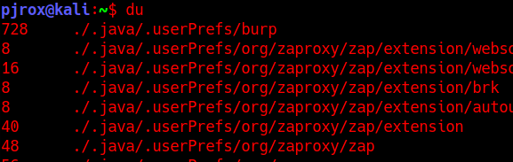

The folders in their respective folders are listed here with the size they  occupy on the disk. The size here is shown in KB. Note: The files inside a folder are not shown, only the folders are listed by running du  /<directory> command.

## Important flags

| Flag        | Description                                                  |
| ----------- | ------------------------------------------------------------ |
| -a          | Will list files as well with the folder.                     |
| -h          | Will list the file sizes in human readable format(B,MB,KB,GB) |
| -c          | Using this flag will print the total size at the end. Jic you want to find the size of directory you were enumerating |
| -d <number> | Flag to specify the depth-ness of a directory you want to view the results for (eg. -d 2) |
| --time      | To get the results with time stamp of last modified.         |

**Examples**

`du -a /home/` will list every file in the /home/ directory with their sizes in KB.

If there's a lot of output you can surely use grep...

`du -a /home/ | grep user` will list any file/directory whose name is containing the string "*user*" in it.

**Final Words**

du command can alternate `ls` with the following flags:

```
du --time -d 1 .
```

It won't specify you the user ownership though, so you can use `stat `command on the file you want to know who is the owner of that particular file 

Syntax: `stat `

# Grep, Egrep, Fgrep

IMPORTANT: To proceed further with this task, make sure you have completed the "[Regular Expressions](https://tryhackme.com/room/catregex)" room by [concatenate](https://tryhackme.com/p/concatenate). This room will brief you about the regular expressions that can come handy while working with egrep.

There are a lot of rooms that you must have already done where you used grep a lot of times, so most of this task will sound familiar to you, or this  is your first attempt on reading about grep, in any case, a 5 min read  won't harm your busy day...

## Introduction

It is a must known tool to everyone and that's why linux modules won't be  complete without doing a mention of its amazing charisma. This tool, is  what filters the good output we need from the residue. The official  documentation says, The grep filter searches a file for a particular pattern of characters, and displays all lines that contain that pattern. The pattern that is  searched in the file is referred to as the regular expression. The pattern is what I am gonna brief you about.

Syntax: `grep "PATTERN" file.txt` will search the file.txt for the specified "PATTERN" string, if the  string is found in the line, the grep will return the whole line  containing the "PATTERN" string. 

## The Family Tree

egrep and fgrep are no different from grep(other than 2 flags that can be  used with grep to function as both). In simple words, egrep matches the  regular expressions in a string, and fgrep searches for a fixed string  inside text. Now grep can do both their jobs by using -E and -F flag,  respectively.

In other terms, `grep -E` functions same as `egrep `and `grep -F` functions same as `fgrep`.

### Important Flags

| Flags | Description                                                  |
| ----- | ------------------------------------------------------------ |
| -R    | Does a recursive grep search for the files inside the folders(if found in  the specified path for pattern search; else grep won't traverse diretory for searching the pattern you specify) |
| -h    | If you're grepping recursively in a directory, this flag disables the prefixing of filenames in the results. |
| -c    | This flag won't list you the pattern only list an integer value, that how many times the pattern was found in the file/folder. |
| -i    | I prefer to use this flag most of the time, this is what specifies grep to search for the PATTERN while IGNORING the case |
| -l    | will only list the filename instead of pattern found in it.  |
| -n    | It will list the lines with their line number in the file containing the pattern. |
| -v    | This flag prints all the lines that are NOT containing the pattern |
| -E    | This flag we already read above... will consider the PATTERN as a regular expression to find the matching strings. |
| -e    | The official documentation says, it can be used to specify multiple  patterns and if any string matches with the pattern(s) it will list it. |

You might be wondering the difference between -E and -e flag. I suggest to understand this as the following:

-  -e flag can be used to specify multiple patterns, with multiple use of  -e flag( grep -e PATTERN1 -e PATTERN2 -e PATTERN3 file.txt), whereas, -E can be used to specify one single pattern(You can't use -E multiple  times within a single grep statement). 

Other point that you can use to understand the difference is, -e works on the BREs(Basic  Regular Expressions) and -E works on EREs (Extended Regular  Expressions).

- BREs tend to match a single pattern in a file (Simplest examples can be direct words like "sun", "comic")
- EREs tend to match 2 or more patterns in a file (To select a no of words  like (sun sunyon sandston) the pattern could be "^s.*n$"). 

Hope, you get an idea how this works. 

Here's a real short note, you might wanna read, on official GNU documentation: [Basic vs Extended (GNU Grep 3.5)](https://www.gnu.org/software/grep/manual/html_node/Basic-vs-Extended.html). If you didn't understand much from that paragraph, make sure, you've practiced your regex well. 

#  tr                            

 Translate command(`tr`) can help you in number of ways, ranging from changing character cases  in a string to replacing characters in a string. It's awesome at it's  usage. Plus, it's the easiest command and a must know module for quick  operations on strings.

Syntax: `tr [flags] [source]/[find]/[select] [destination]/[replace]/[change]`

This I guess is an appropriate representation of how you can use this tool.  Moreover, we have the following flags offered by this command:

| Flags | Description                                                  |
| ----- | ------------------------------------------------------------ |
| -d    | To delete a given set of characters                          |
| -t    | To concat source set with destination set(destination set comes first; t stands for truncate) |
| -s    | To replace the source set with the destination set(s stands for squeeze) |
| -c    | This is the REVERSE card in this game, for eg. If you specify -c with -d to  delete a set of characters then it will delete the rest of the  characters leaving the source set which we specified (c stands for  complement; as in doing reverse of something) |

You must have noticed the word "set" while reading the flags. Well that's true... tr command works in sets of character.

Examples

- If you want to convert every alphabetic character to upper case.

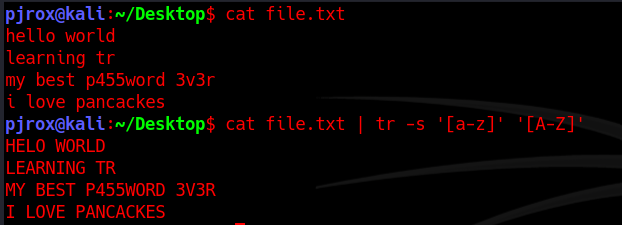

Or I am not sure, if you ever used emojis on discord, coz on desktop app  you could use emojis using :keyword:. Similarly, tr allows us to select a set by these keywords. In that case the output would be same.

```
cat file.txt | tr -s '[:lower:]' '[:upper:]'
```

There are more of these (interpreted sequences) which you can view, by just `tr --help` command. I am not including them here, because they are just straight  forward, and you've been using most of them, if you're familiar with  (mostly) any programming language out there.

- If you want to view creds of a user which are in digits.

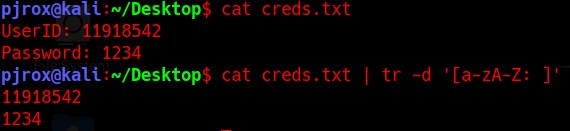

You can see that I used regex here, and deleted all lower/upper case characters, including the (:) symbol and a space.

Note: This is a short note on how you can use this tool. Now try out these  features on your own and get use to this tool. You can also refer to the following sites for more on the tool:

- [tr command in Unix/Linux with examples - GeeksforGeeks](https://www.geeksforgeeks.org/tr-command-in-unix-linux-with-examples/)
- [Tr Command in Linux with Examples | Linuxize](https://linuxize.com/post/linux-tr-command/)

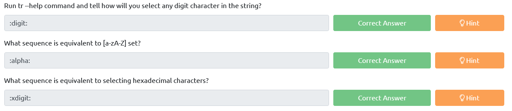

#  awk

This is the most-est powerful tool in my arsenal, I can't think of  any other command that can do something and not awk. It's like the  all-in-one tool. If you ever played CSGO, you can totally relate AWK with AWP. 

*"Awk is a scripting language used for manipulating data and generating  reports.The awk command programming language requires no compiling, and  allows the user to use variables, numeric functions, string functions,  and logical operators."*

Sidenote: Just because it's the super tool, that's not necessary that there is no need to learn about other tools. The awk commands can be fairly longer to solve an operation than that of sed or xargs. A GNU project of awk (namely, gawk) which is also the one installed on  every linux distro, is compatible with both awk and nawk( New-awk; also  project by AT&T).

Syntax: `awk [flags] [select pattern/find(sort)/commands] [input file]`

Note: awk does support getting output via piping.

- If the commands you wrote are in a script you can execute the script commands by using the `-f` flag and specifying the name of the script file. 

  (`awk -f script.awk input.txt`)

### Using AWK

- To simply print a file with awk.

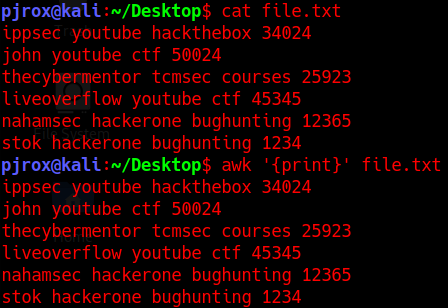

You can see it simply just printed out data from file.txt.

- To search for a pattern inside a file you enclose the pattern in forward slashes `/pattern/`. For instance, if I want to know who all plays CTF competitions the command should be like: `awk '/ctf/' file.txt`

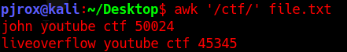

### Built-In variables in AWK

Let's talk a little bit about some of the in-built variables. Built-in  variables include field variables ($1, $2, $3 .. $n). These field  variables are used to specify a piece of data (data separated by a  delimeter defaulting to space). If I run `awk '{print $1 $3}' file.txt` it will list me the words that are at 1st and 3rd fields.

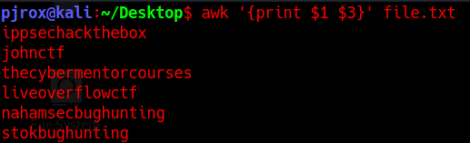

You can see, it joined the words together because we didn't specify the  output delimeter. We will come to that later in this task. Right now,  let's just use a ","(comma) to bring the space.

Note: You may notice the use of {} around the print statement, that's where  we used a function. To use commands in awk scripts, you need to mention  them inside a function.

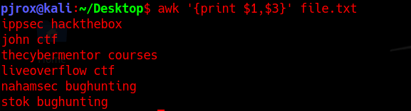

Great, this seems a little nice.

Note: The $0 variable points to the whole line. *Also, make sure to use single quotes('') to specify patterns, awk treats double quotes("") as a raw string. To use double quotes make sure that you escape the ($) sign(s) with a backslash (\) each, to make it work properly.*

### More on variables

**NR:** (Number Record) is the variable that keeps count of the rows after each line's execution... You can use NR command to number the lines (`awk '{print NR,$0}' file.txt`). Note that awk considers rows as records.

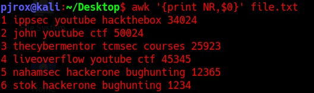

**FS:** (Field Separator) is the variable to set in case you want to define the field for input stream. The field separation (defaut to space) that we  talked above and can be altered to whatever you want while specifying  the pattern. FS can be defined to another character(s)(yea, can be  plural) at the BEGIN{command}.

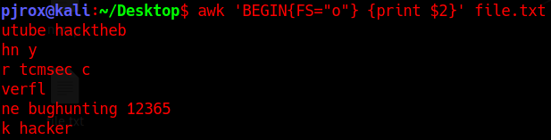 

If you don't know the BEGIN yet, take it as a pattern that we specify and  following is the action on that pattern. Similarly, there is END  command, this is also a pattern that we specify, following the action to perform on that pattern, and simply, we use them to define *actions* like Field Separator, Record Separator etc. that are to be performed at the start and at the end of the script, respectively.

```
awk "BEGIN {FS='o'} {print $1,$3} END{print 'Total Rows=',NR}"
```

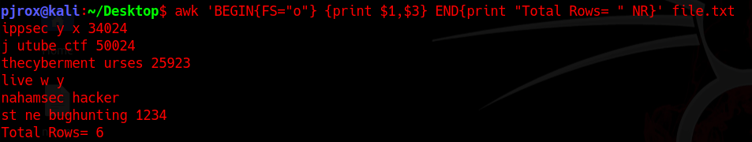

The output is weird because I separated the fields using a letter that was  making sense with the words in text. In short, this is actually how a  complete script is written in awk.

**RS**: (Record Separator): By default it separate rows with '\n', you can specify something else too.

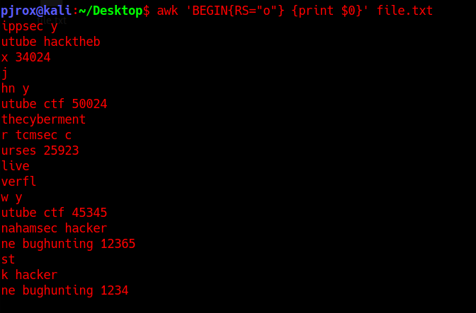

Notice that their has been a new line created wherever 'o' was used. It also  interpreted '\n' used in the text file, so there are new lines after end of every number too.

**OFS**(Output Field Separator) You must have gathered some idea by the full form, it is to specify a delimeter while outputing... 

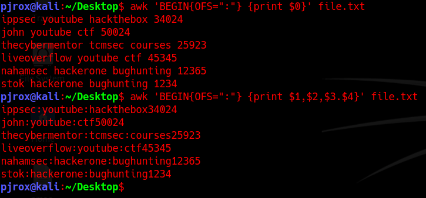

I used OFS in both the commands, you can see that only in 2nd one the  delimiter was used. Note that the output field separator will separate  fields using (:) only when the fields are defined with the print  statement. With $0 I didn't had anything else, if it were to be $0,$0  then the lines would be joining their reflection(non-laterally) with a  colon(:). 

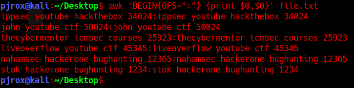

**ORS:** (Output Record Separator) I don't think I really need to specify it's usage...

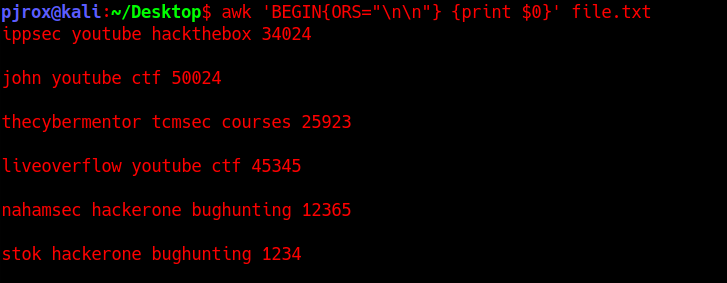

My delimiter was a double new-line character.

This is not it... There is a lot more on AWK, you can do operations, find  string length, use conditions to sort, regex within awk and other fun  stuff. But I guess the task is already went a lot longer. Let's quickly  move on to some important flags that can come in handy while doing  strops. 

JIC if you wanna read more on the tool, here are some great resources regarding awk scripting.

- [AWK - Workflow - Tutorialspoint](https://www.tutorialspoint.com/awk/awk_workflow.htm) (For learning awk scripting in brief and quick)
- [The printf statement in awk](http://osr5doc.xinuos.com/en/OSUserG/_The_printf_statement.html) (If you want to do more with formatting strings; you can use printf function also)
- [AWK command in Unix/Linux with examples - GeeksforGeeks](https://www.geeksforgeeks.org/awk-command-unixlinux-examples/)
- And if you really want to dive deep on this tool, do check out man pages on gawk 

Important Flags

| Flags | Description                                                  |
| ----- | ------------------------------------------------------------ |
| -F    | With this flag you can specify FIELD SEPARATOR (FS), and thus don't need to use the BEGIN rule |
| -v    | Can be used to specify variables(like we did in BEGIN{OFS=":"} |
| -D    | You can debug your .awk scripts specifying this flag(`awk -D script.awk`) |
| -o    | To specify the output file (if no name is given after the flag, the output is defaulted to awkprof.out) |

There are other flags as well, but they are of not much use. Especially if you're learning this as a beginner

Just relax if you don't get much of this task, learning a scripting language inside a single task is not an easy job. Just make sure you understood  the above told syntax well and followed the resources, rest is all  practice :-).

Ending this task with a fun fact, AWK is abbreviated after it's creators (Aho, Weinberger, and Kernighan).

# sed

sed(Stream  EDitor) is a tool that can perform a number of string operations.  Listing a few, could be: FIND AND REPLACE, searching, insertion,  deletion. I think sed of a stream-oriented vi editor... Ok so a few  questions popped up, like how? and what is stream-oriented? Let's not  dive deep into streams, just keep in mind that I said it in contrast  with "orientation with input stream". You can't call vi stream oriented, because it doesn't work with neither of input or output stream. So for  vi users, feel free to use your previous experience with vim to connect  the dots.

On the other hand, you can easily perform operations with sed command by either piping the input or redirecting(<) the  input from a file. I prefer sublime over vim for note taking (No offence to vim fanboys/fangirls out there, I just use sublime to keep things  like notes formatting in GUI :).

Syntax: `sed [flags] [pattern/script] [input file]`

**Important Flags**

| Flags | Description                                                  |
| ----- | ------------------------------------------------------------ |
| -e    | To add a script/command that needs to be executed with the pattern/script(on searching for pattern) |
| -f    | Specify the file containing string pattern                   |
| -E    | Use extended regular expressions                             |
| -n    | Suppress the automatic printing or pattern spacing           |

The sed command

There are endless ways of using sed. I am gonna walk you through a very  detailed general syntax of (mostly all) sed patterns, with some general  examples. Rest is your thinking and creativity, on how YOU utilize this  tool.

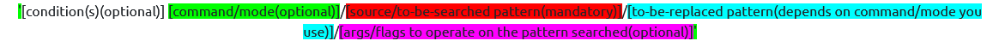

Hope these colors could have helped you identify the parts. If you have any  previous knowledge of sed, feel free to co-relate. Again, this is just  the pattern inside sed command (excluding external flags). Also, note  the single quotes at the start/end. 

Hmm, but may be, it's still not clear. Alright let's take a simple example to relate this.


Let's not care about what's meaning of 1,3 all that slashes, that s,g. And  focus on the color codes. Hope the syntax is now making a little sense... Great. Moving forward to modes and args.

Modes/Commands

| Commands | Description                                                  |
| -------- | ------------------------------------------------------------ |
| s        | (Most used)Substitute mode (find and replace mode)           |
| y        | Works same as substitution; the only difference is, it works on individual  bytes in the string provided(this mode takes no arguments/conditions) |

**[Update] I used the word "mode" in the rest of the task just to avoid the  confusion of using a command(s/y) within the command(sed). But just to  be clear, official documentation list them as commands used in sed.**

Args

| Flags/Args   | Description                                                  |
| ------------ | ------------------------------------------------------------ |
| /g           | globally(any pattern change will be affected globally, i.e. throughout the text; generally works with s mode) |
| /i           | To make the pattern search case-insensitive(can be combined with other flags) |
| /d           | To delete the pattern found(Deletes the whole line; takes no parameter like conditions/modes/to-be-replaced string) |
| /p           | prints the matching pattern(a duplicate will occur in output if not suppressed with -n flag.) |
| /1,/2,/3../n | To perform an operation on an nth occurrence in a line(works with s mode) |

Let's see these in action... Explaining the previously taken command, (sed -e '1,3 s/john/JOHN/g' file.txt)

- Starting with the sed keyword itself, initializes the sed command.
- With -e flag specifying that following is a script command.(you don't need  to specify -e if it's a single command; as it will be automatically  interpreted by sed as a positional argument)
- Then comes the pattern. Starting with the yellow portion is the condition (or range selection to be specific), specifying to  take range of lines 1,3 (line index starts from 1) and execute the  following code on that range of lines. Following a space comes the mode, specifying that we need to use a substitution mode(as we are  substituting a value) by using s. Then we specify / as a delimiter to  differentiate between the parts of code. After the first slash came the pattern we want to operate the substitution on(you may choose to use regex in this region too). Following the 2nd slash comes the string we want to replace the pattern with. Finally, after the last slash was an  arg/flag, /g specifying to operate this operation globally, wherever the pattern was found.
- Finally was the filename we want to take input from and apply operation/code that we specified beside it.

Hope there is no confusion as per sed is concerned. Hence, the output for the above command would be like:

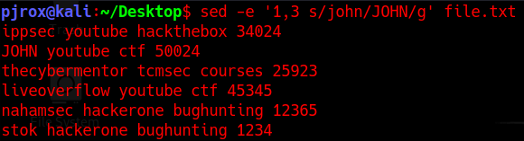


Let's view a few more examples to get the concept clear:

- Viewing a range of Lines

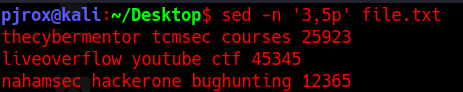

-n flag suppressed the output and we got the duplicates created by p arg.

- Viewing the entire file except a given range

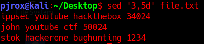

- Viewing multiple ranges of lines inside a file

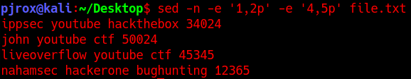

- To start searching from nth pattern occurrence in a line you can use combination of /g with /1,/2,/3.

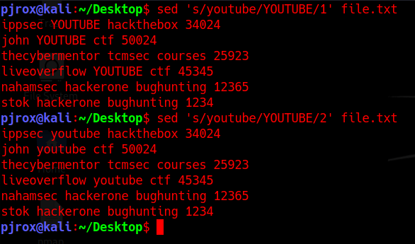

You can see when I specified /1 it gave a change in the text, with /2 it  didn't. This is because there was only 1 occurrence of the string  "youtube", and the 2nd occurrence couldn't be found. Also I didn't used  1g or 2g because there were no further occurrences of the pattern, so  there is no need to use it. Still it would have worked the same, if  used. Try it on your own. 

- If you have log files to view which have trailing white spaces, and it is hard to read them, then you can fix that using regex.

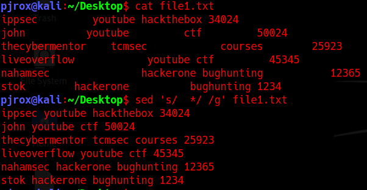

Let's take one last example on this sed command. 

- More on regex can be: Making every line to start with a bullet point and  enclose the digits in square brackets... Ok, but how? Let's first view  it, and then we'll take a look at the explanation.

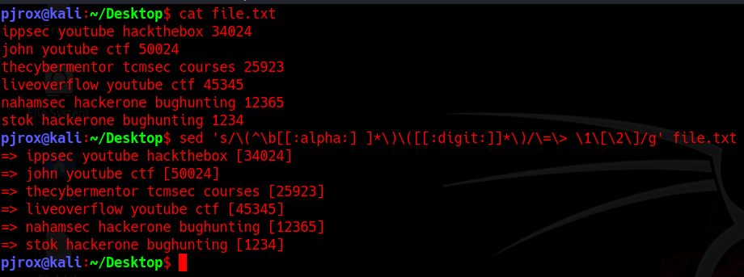

 "What is this?! where's that :alpha: came from? I understand the \b is part  of regex you used, following those, un-identifiable escape characters  and some \1 and \2 referenced either wrong, as it's /1, /2 to identify  the nth occurrence. I mean, it's so confusing".

I agree, it's so noisy, and hard to read. But believe 70% of it is nothing to do with `sed`, it's all regex, so take your time. Try to understand what the regex is  doing. Rest the "to-be-replaced" part is just a way sed is assigning the groups to it's default variables we created within regex.

Explanation

sed 's/\(^\b[[:alpha:] ]*\)\([[:digit:]]*\)/\=\> \1\[\2\]/g' file.txt

Hope things are a little clear, by undertaking the knowledge of previous  color coding. You can easily differentiate the mode, pattern,  to-be-replaced string. *Later I removed the background from the part  belonging to the keywords in sed. As there was some issue in changing  the font color, it just won't persist.*

- Starting with the regex part. Opening a group with escape character, ^ to put  the cursor at the starting of the line, and then \b represents to search for beginning of a word, and then defines a set of characters to  include, following a "*" to specify 'n' number of characters. Then  closes the group by escaping the closing brackets. Creating another  regex group, using escape sequence, we then initialized another set and  specified * at the end of the set to take n characters of that set, at  last group is closed using escape sequence. 
- At the replaced end, we are using escape sequences to make a bullet(it's  just a good practice to use escape sequence with every symbolic  character; even if the output is same), then we have escape characters  for the square brackets enclosing a sed variable /2 (after /1 which is  coming up).
- Now its turn for the sed's  keyword part. We used [:alpha:] in the set defined by regex, which is  nothing but another representation of using `a-zA-Z` in  regex, which means to capture any alphabetic characters. sed offers such keywords(calling them "bracket expressions"), which we can use to make  the input code look cleaner. Similarly we used the bracket expression  for specifying digit as well which we specified using [:digit:].

Note: There's a space after the first bracket expression inside the regex set ([[:alpha:]{space}]). As you see, this space was to indicate the regex  set *so that \* could take multiple words until the digits start occurring in the text**(regex logic)*.

- Then there are some in-built variables as we saw in ~~awp~~ awk, that we used in the to-be-replace part of sed. \1 depicted the  first group which selected everything until the first character  occurred. The second group comprised of a set consisting decimal  characters, which were enclosed with [\2] with the use of escseq.

Here, we finished learning about sed variables, the number of groups you  create with regex, can be later indexed as variable \n in sed.

Well this is pretty much it, on the sed command. If you want to learn more, check-out the resources on the sed command.

Resources:

- [Sed Command in Linux/Unix with examples - GeeksforGeeks](https://www.geeksforgeeks.org/sed-command-in-linux-unix-with-examples/)
- [sed, a stream editor (gnu.org)](https://www.gnu.org/software/sed/manual/sed.html) (Official Documentation)
- [15 Useful 'sed' Command Tips and Tricks for Daily Linux System Administration Tasks (tecmint.com)](https://www.tecmint.com/linux-sed-command-tips-tricks/)

# xargs