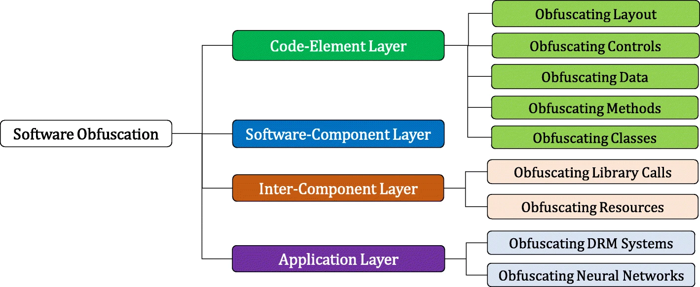
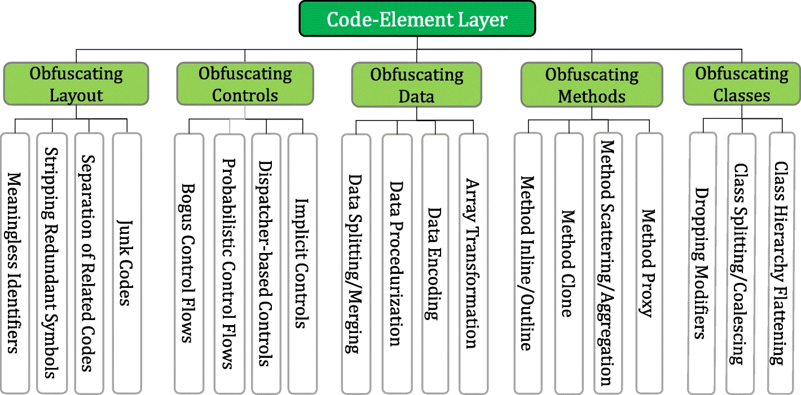
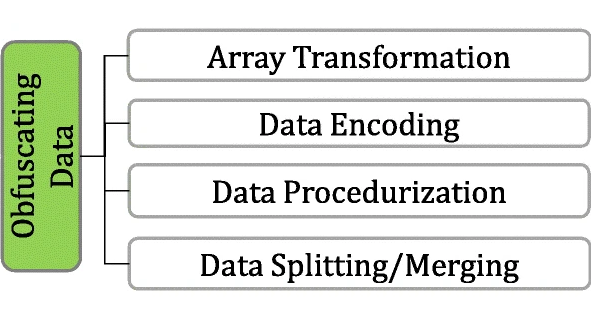

Obfuscation is an essential component of detection evasion methodology  and preventing analysis of malicious software. Obfuscation originated to protect software and intellectual property from being stolen or  reproduced. While it is still widely used for its original purpose,  adversaries have adapted its use for malicious intent.

# Origins of Obfuscation

Obfuscation is widely used in many software-related fields to protect **IP** (**I**ntellectual **P**roperty) and other proprietary information an application may contain.

For example, the popular game: Minecraft uses the obfuscator [ProGuard](https://github.com/Guardsquare/proguard) to obfuscate and minimize its Java classes. Minecraft also releases **obfuscation maps** with limited information as a translator between the old un-obfuscated  classes and the new obfuscated classes to support the modding community.

This is only one example of the wide range of ways obfuscation is publicly used. To document and organize the variety of obfuscation  methods, we can reference the [Layered obfuscation: a taxonomy of software obfuscation techniques for layered security paper](https://cybersecurity.springeropen.com/track/pdf/10.1186/s42400-020-00049-3.pdf). This research paper organizes obfuscation methods by **layers**, similar to the OSI model but for application data flow. Below is the  figure used as the complete overview of each taxonomy layer.



Each sub-layer is then broken down into specific methods that can achieve the overall objective of the sub-layer.

In this room, we will primarily focus on the **code-element layer** of the taxonomy, as seen in the figure below.



To use the taxonomy, we can determine an objective and then pick a method  that fits our requirements. For example, suppose we want to obfuscate  the layout of our code but cannot modify the existing code. In that  case, we can inject junk code, summarized by the taxonomy:

 `Code Element Layer` > `Obfuscating Layout` > `Junk Codes`.

But how could this be used maliciously? Adversaries and malware  developers can leverage obfuscation to break signatures or prevent  program analysis. In the upcoming tasks, we will discuss both  perspectives of malware obfuscation, including the purpose and  underlying techniques of each.

# Obfuscation's Function for Static Evasion                            

Two of the more considerable security boundaries in the way of an adversary are **anti-virus engines** and **EDR** (**E**ndpoint **D**etection & **R**esponse) solutions. As covered in the [Introduction to Anti-virus room](https://tryhackme.com/room/introtoav), both platforms will leverage an extensive database of known signatures referred to as **static** signatures as well as **heuristic** signatures that consider application behavior.

To evade signatures, adversaries can leverage an extensive range  of logic and syntax rules to implement obfuscation. This is commonly  achieved by abusing data obfuscation practices that hide important  identifiable information in legitimate applications.

The aforementioned white paper: [Layered Obfuscation Taxonomy](https://cybersecurity.springeropen.com/articles/10.1186/s42400-020-00049-3), summarizes these practices well under the **code-element** layer. Below is a table of methods covered by the taxonomy in the **obfuscating data** sub-layer**.**



| **Obfuscation Method** | **Purpose**                                                  |
| ---------------------- | ------------------------------------------------------------ |
| Array Transformation   | Transforms an array by splitting, merging, folding, and flattening |
| Data Encoding          | Encodes data with mathematical functions or ciphers          |
| Data Procedurization   | Substitutes static data with procedure calls                 |
| Data Splitting/Merging | Distributes information of one variable into several new variables |

In the upcoming tasks, we will primarily focus on **data splitting/merging**; because static signatures are weaker, we generally only need to focus on that one aspect in initial obfuscation.

Check out the Encoding/Packing/Binder/Crypters room for more information about **data encoding,** and the [Signature Evasion room](https://tryhackme.com/room/signatureevasion) for more information about **data procedurization** and **transformation**.

# Object Concatenation                            

**Concatenation** is a common programming concept that combines two separate objects into one object, such as a string.

A pre-defined operator defines where the concatenation will occur to  combine two independent objects. Below is a generic example of string  concatenation in Python.

```python
>>> A = "Hello "
>>> B = "THM"
>>> C = A + B
>>> print(C)
Hello THM
>>>
```

Depending on the language used in a program, there may be different  or multiple pre-defined operators than can be used for concatenation.  Below is a small table of common languages and their corresponding  pre-defined operators.

| **Language ** | **Concatenation Operator**                       |
| ------------- | ------------------------------------------------ |
| Python        | “**+**”                                          |
| PowerShell    | “**+**”, ”**,**”, ”**$**”, or no operator at all |
| C#            | “**+**”, “**String.Join**”, “**String.Concat**”  |
| C             | “**strcat**”                                     |
| C++           | “**+**”, “**append**”                            |

The aforementioned white paper: [Layered Obfuscation Taxonomy](https://cybersecurity.springeropen.com/articles/10.1186/s42400-020-00049-3), summarizes these practices well under the **code-element** layer’s **data splitting/merging** sub-layer.

------

What does this mean for attackers? Concatenation can open the doors to  several vectors to modify signatures or manipulate other aspects of an  application. The most common example of concatenation being used in  malware is breaking targeted **static signatures**, as covered in the [Signature Evasion room](https://tryhackme.com/room/signatureevasion). Attackers can also use it preemptively to break up all objects of a  program and attempt to remove all signatures at once without hunting  them down, commonly seen in obfuscators as covered in task 9.

Below we will observe a static **Yara** rule and attempt to use concatenation to evade the static signature.

```powershell
rule ExampleRule
{
    strings:
        $text_string = "AmsiScanBuffer"
        $hex_string = { B8 57 00 07 80 C3 }

    condition:
        $my_text_string or $my_hex_string
}
```

When a compiled binary is scanned with Yara, it will  create a positive alert/detection if the defined string is present.  Using concatenation, the string can be functionally the same but will  appear as two independent strings when scanned, resulting in no alerts.

```powershell
IntPtr ASBPtr = GetProcAddress(TargetDLL, "AmsiScanBuffer"); 
```

​                :arrow_down:

```powershell
IntPtr ASBPtr = GetProcAddress(TargetDLL, "Amsi" + "Scan" + "Buffer"); 
```

If the second code block were to be scanned with the Yara rule, there would be no alerts!

------


Extending from concatenation, attackers can also use **non-interpreted characters** to disrupt or confuse a static signature. These can be used  independently or with concatenation, depending on the  strength/implementation of the signature. Below is a table of some  common non-interpreted characters that we can leverage.

| **Character ** | **Purpose **                                                 | **Example**                 |
| -------------- | ------------------------------------------------------------ | --------------------------- |
| Breaks         | Break a single string into multiple sub strings and combine them | `('co'+'ffe'+'e')`          |
| Reorders       | Reorder a string’s components                                | `('{1}{0}'-f'ffee','co')`   |
| Whitespace     | Include white space that is not interpreted                  | `.( 'Ne' +'w-Ob' + 'ject')` |
| Ticks          | Include ticks that are not interpreted                       | `d`own`LoAd`Stri`ng`        |
| Random Case    | Tokens are generally not case sensitive and can be any arbitrary case | `dOwnLoAdsTRing`            |

------

Using the knowledge you have accrued throughout this task, obfuscate the  following PowerShell snippet until it evades Defender’s detections.

```powershell
[Ref].Assembly.GetType('System.Management.Automation.AmsiUtils').GetField('amsiInitFailed','NonPublic,Static').SetValue($null,$true)
```

To get you started, we recommend breaking up each  section of the code and observe how it interacts or is detected. You can then break the signature present in the independent section and add  another section to it until you have a clean snippet.