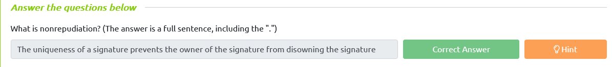
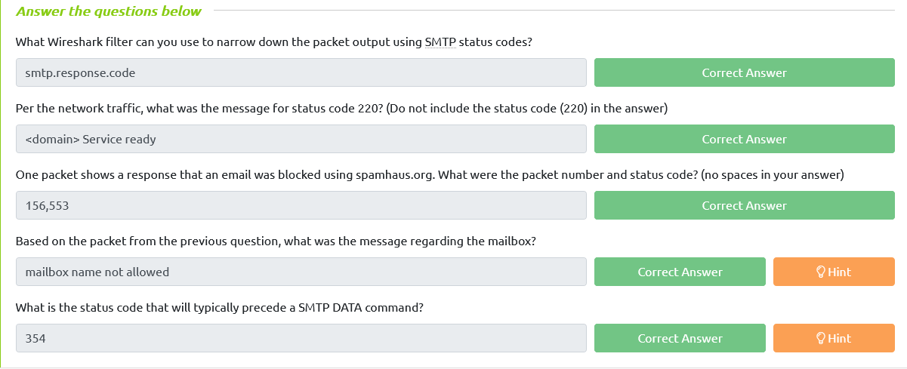

# Introduction                            

There are various actions a defender can take to help protect the users from falling victim to a malicious email. 

Some examples of these actions are listed below:

- Email Security (SPF, DKIM, DMARC)
- SPAM Filters (flags or blocks incoming emails based on reputation)
- Email Labels (alert users that an incoming email is from an outside source)
- Email Address/Domain/URL Blocking (based on reputation or explicit denylist)
- Attachment Blocking (based on the extension of the attachment) 
- Attachment Sandboxing (detonating email attachments in a sandbox environment to detect malicious activity)
- Security Awareness Training (internal phishing campaigns)

Per **MITRE ATT&CK** **Framework**, [Phishing](https://attack.mitre.org/techniques/T1598/) is classified as **Technique ID 1598** (**T1598**), and it contains three sub-techniques.

Visit the above link, look at the **Mitigation** section under **Software Configuration**. 


# SPF (Sender Policy Framework)                            

What is the **Sender Policy Framework** (**SPF**)?

Per [dmarcian](https://dmarcian.com/what-is-spf/), "*Sender Policy Framework (SPF) is used to authenticate the sender of an email. With an SPF record in  place, Internet Service Providers can verify that a mail server is  authorized to send email for a specific domain. An SPF record is a DNS  TXT record containing a list of the IP addresses that are allowed to  send email on behalf of your domain.*"

Below is a visual workflow for SPF.


**Note:** Credit to dmarcian for the above image.

How does a basic SPF record look like?

```
v=spf1 ip4:127.0.0.1 include:_spf.google.com -all
```

An explanation for the above record:

- `v=spf1` -> This is the start of the SPF record
- `ip4:127.0.0.1` -> This specifies which IP (in this case version IP4 & not IP6) can send mail
- `include:_spf.google.com` -> This specifies which domain can send mail
- `-all` -> non-authorized emails will be rejected

Refer to the SPF Record Syntax on dmarcian [here](https://dmarcian.com/spf-syntax-table/) and [here](https://dmarcian.com/what-is-the-difference-between-spf-all-and-all/).

Let's look at Twitter's SPF record using dmarcian's SPF Surveyor [tool](https://dmarcian.com/spf-survey/).


Refer to this resource on [dmarcian](https://dmarcian.com/create-spf-record/) on how to create your own SPF records. 

Let's look at another sample.

The image below is from [Google Admin Toolbox Messageheader](https://toolbox.googleapps.com/apps/messageheader/), which was used to analyze a malicious email.


The above image shows the status of an SPF record check. It reports back as **softfail**.

**Note**: Even though this task uses [dmarcian](https://dmarcian.com/) for SPF-related information and online checks, many other companies do the same. 


# DKIM (DomainKeys Identified Mail)

What is **DKIM**?

Per [dmarcian](https://dmarcian.com/what-is-dkim/), "*DKIM stands for DomainKeys Identified Mail and is used for the  authentication of an email that’s being sent. Like SPF, DKIM is an open  standard for email authentication that is used for DMARC alignment. A  DKIM record exists in the DNS, but it is a bit more complicated than  SPF. DKIM’s advantage is that it can survive forwarding, which makes it  superior to SPF and a foundation for securing your email.*"

How does a DKIM record look like?

```
v=DKIM1; k=rsa;  p=MIIBIjANBgkqhkiG9w0BAQEFAAOCAQ8AMIIBCgKCAQEAxTQIC7vZAHHZ7WVv/5x/qH1RAgMQI+y6Xtsn73rWOgeBQjHKbmIEIlgrebyWWFCXjmzIP0NYJrGehenmPWK5bF/TRDstbM8uVQCUWpoRAHzuhIxPSYW6k/w2+HdCECF2gnGmmw1cT6nHjfCyKGsM0On0HDvxP8I5YQIIlzNigP32n1hVnQP+UuInj0wLIdOBIWkHdnFewzGK2+qjF2wmEjx+vqHDnxdUTay5DfTGaqgA9AKjgXNjLEbKlEWvy0tj7UzQRHd24a5+2x/R4Pc7PF/y6OxAwYBZnEPO0sJwio4uqL9CYZcvaHGCLOIMwQmNTPMKGC9nt3PSjujfHUBX3wIDAQAB
```

An explanation of the above record:

- `v=DKIM1`-> This is the version of the DKIM record. This is optional. 
- `k=rsa` -> This is the key type. The default value is RSA. RSA is an encryption algorithm (cryptosystem).
- `p=` -> This is the public key that will be matched to the private key, which was created during the DKIM setup process. 

Refer to the DKIM resource [here](https://dmarcian.com/dkim-selectors/) and [here](https://help.returnpath.com/hc/en-us/articles/222481088-DKIM-DNS-record-overview) for additional information. 

The below image is a snippet of an email header for an email flagged as spam that contained a potentially malicious attachment. 


# DMARC (Domain-Based Message Authentication, Reporting, and Conformance)                            

What is **DMARC**?

Per [dmarcian](https://dmarcian.com/start-dmarc/), "*DMARC, (Domain-based Message Authentication Reporting, & Conformance) an  open source standard, uses a concept called alignment to tie the result  of two other open source standards, SPF (a published list of servers  that are authorized to send email on behalf of a domain) and DKIM (a  tamper-evident domain seal associated with a piece of email), to the  content of an email. If not already deployed, putting a DMARC record  into place for your domain will give you feedback that will allow you to troubleshoot your SPF and DKIM configurations if needed.*"

How does a basic DMARC record look like?

```
v=DMARC1; p=quarantine; rua=mailto:postmaster@website.com 
```

An explanation of the above record:

- `v=DMARC1` -> Must be in all caps, and it's not optional
- `p=quarantine` -> If a check fails, then an email will be sent to the spam folder (DMARC Policy)
- `rua=mailto:postmaster@website.com` -> Aggregate reports will be sent to this email address

Refer to the DMARC resources [here](https://dmarcian.com/dmarc-record/) and [here](https://dmarc.org/overview/) for additional information on DMARC tags. Review the following resource about DMARC [Alignment](https://dmarcian.com/alignment/). 

Let's use the **Domain Health Checker** from [dmarcian.com](https://dmarcian.com/domain-checker/) and check the DMARC status of **microsoft.com**. 


And the results are...


Microsoft passed all checks. We can drill down into **DMARC**, **SPF**, or **DKIM** to get more details.

**DMARC**:


In the details above, we can see that all emails that fail the DMARC check will be rejected.


# S/MIME (Secure/Multipurpose Internet Mail Extensions)                            

What is **[S/MIME](https://docs.microsoft.com/en-us/exchange/security-and-compliance/smime-exo/smime-exo)**?

Per Microsoft, "*S/MIME (Secure/Multipurpose internet Mail Extensions) is a widely accepted  protocol for sending digitally signed and encrypted messages*."

As you can tell from the definition above, the 2 main ingredients for S/MIME are:

1. **Digital Signatures**
2. **Encryption**

Using [Public Key Cryptography](https://www.ibm.com/docs/en/ztpf/1.1.0.14?topic=concepts-public-key-cryptography), S/MIME guarantees data integrity and nonrepudiation. 

- If Bob wishes to use S/MIME, then he'll need a digital certificate. This digital certificate will contain his public key. 
- With this digital certificate, Bob can "sign" the email message with his private key. 
- Mary can then decrypt Bob's message with Bob's public key. 
- Mary will do the same (send her certificate to Bob) when she replies to his email, and Bob complete the same process on his end.
- Both will now have each other's certificates for future correspondence. 

The illustration below will help you understand how public key cryptography works. 


Refer to this Microsoft documentation [here](https://docs.microsoft.com/en-us/exchange/security-and-compliance/smime-exo/smime-exo) for more information on S/MIME and steps on how to configure Office 365 to send/receive S/MIME emails.



# SMTP Status Codes

Here are two resources to assist you with this task:

- https://www.wireshark.org/docs/dfref/s/smtp.html
- https://www.mailersend.com/blog/smtp-codes



#  SMTP Traffic Analysis                            

The reference below may assist you with this task:

- https://www.wireshark.org/docs/dfref/i/imf.html


# SMTP and C&C Communication                            

Now we'll take a look at how SMTP has been abused by adversaries for C2 (Command and Control) communications. 

**MITRE ATT&CK**:

- **Techinique 1071 > Sub-Technique 3**: https://attack.mitre.org/techniques/T1071/003/

Per MITRE, "*Adversaries may communicate using application layer protocols associated with  electronic mail delivery to avoid detection/network filtering by  blending in with existing traffic. Commands to the remote system, and  often the results of those commands, will be embedded within the  protocol traffic between the client and server.*"

Several notable groups, such as **APT 28**, **APT 32**, and **Turla**, to name a few, have used this technique.

**Recommended mitigation (per MITRE)**: 

"*Network intrusion detection and prevention systems that use network signatures  to identify traffic for specific adversary malware can be used to  mitigate activity at the network level.*"

**Detection opportunity (per MITRE)**:

"*Analyze packet contents to detect application layer protocols that do not  follow the expected protocol standards regarding syntax, structure, or  any other variable adversaries could leverage to conceal data.*"

A **playbook** is a defined process that should be followed in a specific situation, in this case, a phishing incident. 

**Phishing IR Playbook:**

- https://www.incidentresponse.org/playbooks/phishing