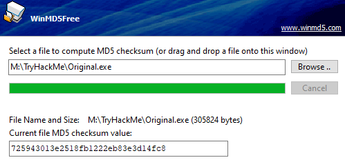
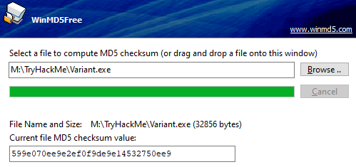
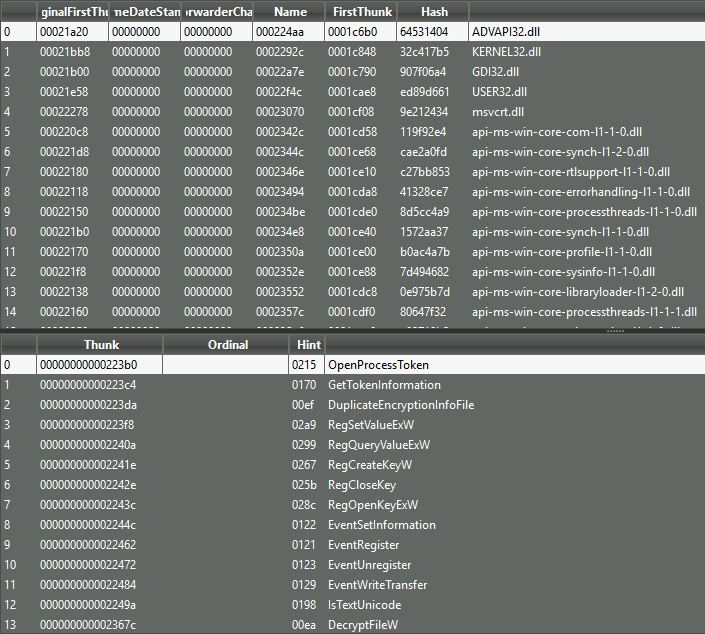

# Introduction

An adversary may struggle to overcome specific detections when facing an advanced anti-virus engine or **EDR** (**E**ndpoint **D**etection & **R**esponse) solution. Even after employing some of the most common obfuscation or evasion techniques discussed in [Obfuscation Principles](https://tryhackme.com/room/obfuscationprinciples), signatures in a malicious file may still be present.

To combat persistent signatures, adversaries can observe each individually and address them as needed.

In this room, we will understand what signatures are and how to find them, then attempt to break them following an agnostic thought process. To  dive deeper and combat heuristic signatures, we will also discuss more  advanced code concepts and “malware best practices.”

### Learning Objectives

1. Understand the origins of signatures and how to observe/detect them in malicious code
2. Implement documented obfuscation methodology to break signatures
3. Leverage non-obfuscation-based techniques to break non-function oriented signatures.

#  Signature Identification                            

Before jumping into breaking signatures, we need to understand and identify what we are looking for. As covered in [Introduction to Anti-Virus](https://tryhackme.com/room/introtoav), signatures are used by anti-virus engines to track and identify  possible suspicious and/or malicious programs. In this task, we will  observe how we can manually identify an exact byte where a signature  starts.

When identifying signatures, whether manually or  automated, we must employ an iterative process to determine what byte a  signature starts at. By recursively splitting a compiled binary in half  and testing it, we can get a rough estimate of a byte-range to  investigate further.

We can use the native utilities `head`, `dd`, or `split` to split a compiled binary. In the below command prompt, we will walk  through using head to find the first signature present in a msfvenom  binary.

```shell
-rw-r--r--  1 root root   58 Jul 27 23:53 example.exe                                                                                                        root@Pimpbuntu:/home/cry/TryHackMe# head --bytes 29 example.exe > half.exe

-rw-r--r--  1 root root   58 Jul 27 23:53 example.exe                                                                                                           -rw-r--r--  1 root root   29 Jul 27 23:56 half.exe
```

Once split, move the binary from your development environment to a  machine with the anti-virus engine you would like to test on. If an  alert appears, move to the lower half of the split binary and split it  again. If an alert does not appear, move to the upper half of the split  binary and split it again. Continue this pattern until you cannot  determine where to go; this will typically occur around the kilobyte  range.

Once you have reached the point at which you no longer accurately split the binary, you can use a **hex editor** to view the end of the  binary where the signature is present.

```
0000C2E0  43 68 6E E9 0A 00 00 00 0C 4D 1A 8E 04 3A E9 89  Chné.....M.Ž.:é‰
0000C2F0  67 6F BE 46 01 00 00 6A 40 90 68 00 10 00 00 E9  go¾F...j@.h....é
0000C300  0A 00 00 00 53 DF A1 7F 64 ED 40 73 4A 64 56 90  ....Sß¡.dí@sJdV.
0000C310  6A 00 68 58 A4 53 E5 E9 08 00 00 00 15 0D 69 B6  j.hX¤Såé......i¶
0000C320  F4 AB 1B 73 FF D5 E9 0A 00 00 00 7D 43 00 40 DB  ô«.sÿÕé....}C.@Û
0000C330  43 8B AC 55 82 89 C3 90 E9 08 00 00 00 E4 95 8E  C‹¬U‚‰Ã.é....ä•Ž
0000C340  2C 06 AC 29 A3 89 C7 90 E9 0B 00 00 00 0B 32 AC  ,.¬)£‰Ç.é.....2¬
```

We have the location of a signature; how human-readable it is will be determined by the tool itself and the compilation method.

Now… no one wants to spend hours going back and forth trying to  track down bad bytes; let’s automate it! In the next task, we will look  at a few **FOSS** (**F**ree and **O**pen-**S**ource **S**oftware) solutions to aid us in identifying signatures in compiled code.

# Automating Signature Identification

The process shown in  the previous task can be quite arduous. To speed it up, we can automate  it using scripts to split bytes over an interval for us. [Find-AVSignature](https://github.com/PowerShellMafia/PowerSploit/blob/master/AntivirusBypass/Find-AVSignature.ps1) will split a provided range of bytes through a given interval.

- **Find-AVSignature**        

```powershell
PS C:\> . .\FInd-AVSignature.ps1
PS C:\> Find-AVSignature

cmdlet Find-AVSignature at command pipeline position 1
Supply values for the following parameters:
StartByte: 0
EndByte: max
Interval: 1000

Do you want to continue?
This script will result in 1 binaries being written to "C:\Users\TryHackMe"!
[Y] Yes  [N] No  [S] Suspend  [?] Help (default is "Y"): y
        
```

This script relieves a lot of the manual work, but still has several limitations. Although it requires less  interaction than the previous task, it still requires an appropriate  interval to be set to function properly. This script will also only  observe strings of the binary when dropped to disk rather than scanning  using the full functionality of the anti-virus engine.

To solve this problem we can use other **FOSS** (**F**ree and **O**pen-**S**ource **S**oftware) tools that leverage the engines themselves to scan the file, including [DefenderCheck](https://github.com/matterpreter/DefenderCheck), [ThreatCheck](https://github.com/rasta-mouse/ThreatCheck), and [AMSITrigger](https://github.com/RythmStick/AMSITrigger). In this task, we will primarily focus on ThreatCheck and briefly mention the uses of AMSITrigger at the end.

------

### ThreatCheck

ThreatCheck is a fork of DefenderCheck and is arguably the most  widely used/reliable of the three. To identify possible signatures,  ThreatCheck leverages several anti-virus engines against split compiled  binaries and reports where it believes bad bytes are present.

ThreatCheck does not provide a pre-compiled release to the public.  For ease of use we have already compiled the tool for you; it can be  found in `C:\Users\Administrator\Desktop\Tools`of the attached machine.

Below is the basic syntax usage of ThreatCheck.

- **ThreatCheck Help Menu**        

```powershell
C:\>ThreatCheck.exe --help
  -e, --engine    (Default: Defender) Scanning engine. Options: Defender, AMSI
  -f, --file      Analyze a file on disk
  -u, --url       Analyze a file from a URL
  --help          Display this help screen.
  --version       Display version information.
```

For our uses we only need to supply a file and optionally an engine;  however, we will primarily want to use AMSITrigger when dealing with **AMSI** (**A**nti-**M**alware **S**can **I**nterface), as we will discuss later in this task.

- **ThreatCheck**        

```powershell
C:\>ThreatCheck.exe -f Downloads\Grunt.bin -e AMSI
	[+] Target file size: 31744 bytes
	[+] Analyzing...
	[!] Identified end of bad bytes at offset 0x6D7A
	00000000   65 00 22 00 3A 00 22 00  7B 00 32 00 7D 00 22 00   e·"·:·"·{·2·}·"·
	00000010   2C 00 22 00 74 00 6F 00  6B 00 65 00 6E 00 22 00   ,·"·t·o·k·e·n·"·
	00000020   3A 00 7B 00 33 00 7D 00  7D 00 7D 00 00 43 7B 00   :·{·3·}·}·}··C{·
	00000030   7B 00 22 00 73 00 74 00  61 00 74 00 75 00 73 00   {·"·s·t·a·t·u·s·
	00000040   22 00 3A 00 22 00 7B 00  30 00 7D 00 22 00 2C 00   "·:·"·{·0·}·"·,·
	00000050   22 00 6F 00 75 00 74 00  70 00 75 00 74 00 22 00   "·o·u·t·p·u·t·"·
	00000060   3A 00 22 00 7B 00 31 00  7D 00 22 00 7D 00 7D 00   :·"·{·1·}·"·}·}·
	00000070   00 80 B3 7B 00 7B 00 22  00 47 00 55 00 49 00 44   ·?³{·{·"·G·U·I·D
	00000080   00 22 00 3A 00 22 00 7B  00 30 00 7D 00 22 00 2C   ·"·:·"·{·0·}·"·,
	00000090   00 22 00 54 00 79 00 70  00 65 00 22 00 3A 00 7B   ·"·T·y·p·e·"·:·{
	000000A0   00 31 00 7D 00 2C 00 22  00 4D 00 65 00 74 00 61   ·1·}·,·"·M·e·t·a
	000000B0   00 22 00 3A 00 22 00 7B  00 32 00 7D 00 22 00 2C   ·"·:·"·{·2·}·"·,
	000000C0   00 22 00 49 00 56 00 22  00 3A 00 22 00 7B 00 33   ·"·I·V·"·:·"·{·3
	000000D0   00 7D 00 22 00 2C 00 22  00 45 00 6E 00 63 00 72   ·}·"·,·"·E·n·c·r
	000000E0   00 79 00 70 00 74 00 65  00 64 00 4D 00 65 00 73   ·y·p·t·e·d·M·e·s
	000000F0   00 73 00 61 00 67 00 65  00 22 00 3A 00 22 00 7B   ·s·a·g·e·"·:·"·{
```

It’s that simple! No other configuration or syntax is required and we can get straight to modifying our tooling. To efficiently use this tool we can identify any bad bytes that are first discovered then  recursively break them and run the tool again until no signatures are  identified.

Note: There may be instances of false positives, in which the tool  will report no bad bytes. This will require your own intuition to  observe and solve; however, we will discuss this further in task 4.

------

### AMSITrigger

As covered in [Runtime Detection Evasion](https://tryhackme.com/room/runtimedetectionevasion), AMSI leverages the runtime, making signatures harder to identify and  resolve. ThreatCheck also does not support certain file types such as  PowerShell that AMSITrigger does.

AMSITrigger will leverage the AMSI engine and scan functions against a provided PowerShell script and report any specific sections of code it  believes need to be alerted on.

AMSITrigger does provide a pre-compiled release on their GitHub and can also be found on the Desktop of the attached machine.

Below is the syntax usage of AMSITrigger

- **AMSITrigger Help Menu**        

```powershell
C:\>amsitrigger.exe --help
	-i, --inputfile=VALUE       Powershell filename
	-u, --url=VALUE             URL eg. <https://10.1.1.1/Invoke-NinjaCopy.ps1>
	-f, --format=VALUE          Output Format:
	                              1 - Only show Triggers
	                              2 - Show Triggers with Line numbers
	                              3 - Show Triggers inline with code
	                              4 - Show AMSI calls (xmas tree mode)
	-d, --debug                 Show Debug Info
	-m, --maxsiglength=VALUE    Maximum signature Length to cater for,
	                              default=2048
	-c, --chunksize=VALUE       Chunk size to send to AMSIScanBuffer,
	                              default=4096
	-h, -?, --help              Show Help
```

For our uses we only need to supply a file and the preferred format to report signatures.

- **AMSI Trigger Example**

```
PS C:\> .\amsitrigger.exe -i bypass.ps1 -f 3
[Ref].Assembly.GetType('System.Management.Automation.AmsiUtils').GetField('amsiInitFailed','NonPublic,Static').SetValue($null,$true)
```

In the next task we will discuss how you can use the information gathered from these tools to break signatures.

# Static Code-Based Signatures

Once we have identified a troublesome signature we need to decide how we want to deal with it. Depending on the strength and type of  signature, it may be broken using simple obfuscation as covered in [Obfuscation Principles](https://tryhackme.com/room/obfuscationprinciples), or it may require specific investigation and remedy. In this task, we  aim to provide several solutions to remedy static signatures present in  functions.

The [Layered Obfuscation Taxonomy](https://cybersecurity.springeropen.com/track/pdf/10.1186/s42400-020-00049-3.pdf) covers the most reliable solutions as part of the **Obfuscating Methods** and **Obfuscating Classes** layer.

Obfuscating methods

| **Obfuscation Method **       | **Purpose**                                                  |
| ----------------------------- | ------------------------------------------------------------ |
| Method Proxy                  | Creates a proxy method or a replacement object               |
| Method Scattering/Aggregation | Combine multiple methods into one or scatter a method into several |
| Method Clone                  | Create replicas of a method and randomly call each           |

Obfuscating Classes

| **Obfuscation Method **    | **Purpose**                                                  |
| -------------------------- | ------------------------------------------------------------ |
| Class Hierarchy Flattening | Create proxies for classes using interfaces                  |
| Class Splitting/Coalescing | Transfer local variables or instruction groups to another class |
| Dropping Modifiers         | Remove class modifiers (public, private) and make all members public |

Looking at the above tables, even though they may use specific technical terms  or ideas, we can group them into a core set of agnostic methods  applicable to any object or data structure.

The techniques **class splitting/coalescing** and **method scattering/aggregation** can be grouped into an overarching concept of splitting or merging any given **OOP** (**O**bject-**O**riented **P**rogramming) function.

Other techniques such as **dropping modifiers** or **method clone** can be grouped into an overarching concept of removing or obscuring identifiable information.

------

### Splitting and Merging Objects

The methodology required to split or merge objects is very similar to the objective of concatenation as covered in [Obfuscation Principles.](https://tryhackme.com/room/signatureevasion)

The premise behind this concept is relatively easy, we are looking to  create a new object function that can break the signature while  maintaining the previous functionality.

To provide a more concrete example of this, we can use the [well-known case study](https://offensivedefence.co.uk/posts/covenant-profiles-templates/) in Covenant present in the `GetMessageFormat` string. We will first look at how the solution was implemented then break it down and apply it to the obfuscation taxonomy.

**Original String**

Below is the original string that is detected

```csharp
string MessageFormat = @"{{""GUID"":""{0}"",""Type"":{1},""Meta"":""{2},""IV"":""{3}"",""EncryptedMessage"":""{4}"",""HMAC"":""{5}""}}";
```

**Obfuscated Method**

Below is the new class used to replace and concatenate the string.

```csharp
public static string GetMessageFormat // Format the public method
{
    get // Return the property value
    {
        var sb = new StringBuilder(@"{{""GUID"":""{0}"","); // Start the built-in concatenation method
        sb.Append(@"""Type"":{1},"); // Append substrings onto the string
        sb.Append(@"""Meta"":""{2}"",");
        sb.Append(@"""IV"":""{3}"",");
        sb.Append(@"""EncryptedMessage"":""{4}"",");
        sb.Append(@"""HMAC"":""{5}""}}");
        return sb.ToString(); // Return the concatenated string to the class
    }
}

string MessageFormat = GetMessageFormat
```

Recapping this case study, class splitting is used to create a  new class for the local variable to concatenate. We will cover how to  recognize when to use a specific method later in this task and  throughout the practical challenge.

------

### Removing and Obscuring Identifiable Information

The core concept behind removing identifiable information is similar to obscuring variable names as covered in [Obfuscation Principles](https://tryhackme.com/room/signatureevasion). In this task, we are taking it one step further by specifically  applying it to identified signatures in any objects including methods  and classes.

An example of this can be found in Mimikatz where an alert is generated for the string `wdigest.dll`. This can be solved by replacing the string with any random identifier  changed throughout all instances of the string. This can be categorized  in the obfuscation taxonomy under the method proxy technique.

This is almost no different than as discussed in [Obfuscation Principles](https://tryhackme.com/room/signatureevasion); however, it is applied to a specific situation.

# Static Property-Based Signatures

Various detection engines or analysts may consider different indicators rather than  strings or static signatures to contribute to their hypothesis.  Signatures can be attached to several file properties, including file  hash, entropy, author, name, or other identifiable information to be used individually or in conjunction. These properties are often used in rule sets such as **YARA** or **Sigma**.

Some properties may be easily manipulated, while others can be more  difficult, specifically when dealing with pre-compiled closed-source  applications.

This task will discuss manipulating the **file hash** and **entropy** of both open-source and closed-source applications.

Note: several other properties such as PE headers or module  properties can be used as indicators. Because these properties often  require an agent or other measures to detect, we will not cover them in  this room to keep the focus on signatures.

------

### File Hashes

A **file hash**, also known as a **checksum**, is used to tag/identify a unique file. They are commonly used to verify a file’s authenticity or its known purpose (malicious or not). File  hashes are generally arbitrary to modify and are changed due to any  modification to the file.

If we have access to the source for an application, we can modify any arbitrary section of the code and re-compile it to create a new hash.  That solution is straightforward, but what if we need a pre-compiled or  signed application?

When dealing with a signed or closed-source application, we must employ **bit-flipping**.

Bit-flipping is a common cryptographic attack that will mutate a  given application by flipping and testing each possible bit until it  finds a viable bit. By flipping one viable bit, it will change the  signature and hash of the application while maintaining all  functionality.

We can use a script to create a **bit-flipped list** by flipping each bit and creating a new **mutated variant** (~3000 - 200000 variants). Below is an example of a python bit-flipping implementation.

```python
import sys

orig = list(open(sys.argv[1], "rb").read())

i = 0
while i < len(orig):
	current = list(orig)
	current[i] = chr(ord(current[i]) ^ 0xde)
	path = "%d.exe" % i
	
	output = "".join(str(e) for e in current)
	open(path, "wb").write(output)
	i += 1
	
print("done")
```

Once the list is created, we must search for intact unique properties of the file. For example, if we are bit-flipping `msbuild`, we need to use `signtool` to search for a file with a useable certificate. This will guarantee  that the functionality of the file is not broken, and the application  will maintain its signed attribution.

We can leverage a script to loop through the bit-flipped list and  verify functional variants. Below is an example of a batch script  implementation.

```powershell
FOR /L %%A IN (1,1,10000) DO (
	signtool verify /v /a flipped\\%%A.exe
)
```

This technique can be very lucrative, although it can take a long  time and will only have a limited period until the hash is discovered.  Below is a comparison of the original MSBuild application and the  bit-flipped variation.



------

### Entropy

From [IBM](https://www.ibm.com/docs/en/qsip/7.4?topic=content-analyzing-files-embedded-malicious-activity), Entropy is defined as “the randomness of the data in a file used to  determine whether a file contains hidden data or suspicious scripts.”  EDRs and other scanners often leverage entropy to identify potential suspicious files or contribute to an overall malicious score.

Entropy can be problematic for obfuscated scripts, specifically when obscuring  identifiable information such as variables or functions.

To lower entropy, we can replace random identifiers with randomly selected English words. For example, we may change a variable from `q234uf` to `nature`.

To prove the efficacy of changing identifiers, we can observe how the entropy changes using [CyberChef](https://gchq.github.io/CyberChef/#recipe=Entropy('Shannon scale')).

Below is the Shannon entropy scale for a standard English paragraph.

**Shannon entropy: 4.587362034903882**

Below is the Shannon entropy scale for a small script with random identifiers.

**Shannon entropy: 5.341436973971389**


Depending on the EDR employed, a “suspicious” entropy value is **~ greater than 6.8**.**

The difference between a random value and English text will become amplified with a larger file and more occurrences.

Note that entropy will generally never be used alone and only to support a hypothesis. For example, the entropy for the command `pskill` and the hivenightmare exploit are almost identical.

To see entropy in action, let’s look at how an EDR would use it to contribute to threat indicators.

In the white paper, [An Empirical Assessment of Endpoint Detection and Response Systems against  Advanced Persistent Threats Attack Vectors](https://www.mdpi.com/2624-800X/1/3/21/pdf)*,* **SentinelOne** *is shown to detect a DLL due to high entropy, specifically through AES encryption.*

#  Behavioral Signatures                            

Obfuscating functions and properties can achieve a lot with minimal modification. Even after breaking static  signatures attached to a file, modern engines may still observe the  behavior and functionality of the binary. This presents numerous  problems for attackers that cannot be solved with simple obfuscation.

As covered in [Introduction to Anti-Virus](https://tryhackme.com/room/introtoav), modern anti-virus engines will employ two common methods to detect  behavior: observing imports and hooking known malicious calls. While  imports, as will be covered in this task, can be easily obfuscated or  modified with minimal requirements, hooking requires complex techniques  out of scope for this room. Because of the prevalence of API calls  specifically, observing these functions can be a significant factor in  determining if a file is suspicious, along with other behavioral  tests/considerations.

Before diving too deep into rewriting or  importing calls, let’s discuss how API calls are traditionally utilized  and imported. We will cover C-based languages first and then briefly  cover .NET-based languages later in this task.

API calls and other functions native to an operating system require a pointer to a function address and a structure to utilize them.

Structures for functions are simple; they are located in **import libraries** such as `kernel32` or `ntdll` that store function structures and other core information for Windows.

The most significant issue to function imports is the function addresses.  Obtaining a pointer may seem straightforward, although because of **ASLR** (**A**ddress **S**pace **L**ayout **R**andomization), function addresses are dynamic and must be found.

Rather than altering code at runtime, the **Windows loader** `windows.h` is employed. At runtime, the loader will map all modules to process  address space and list all functions from each. That handles the  modules, but how are function addresses assigned?

One of the most critical functions of the Windows loader is the **IAT (I**mport **A**ddress **T**able). The IAT will store function addresses for all imported functions that can assign a pointer for the function.

The IAT is stored in the **PE** (**P**ortable **E**xecutable) header `IMAGE_OPTIONAL_HEADER` and is filled by the Windows loader at runtime. The Windows loader obtains the function addresses or, more precisely, **thunks** from a pointer table, accessed from an API call or **thunk table**. Check out the [Windows Internals room](https://tryhackme.com/room/windowsinternals) for more information about the PE structure.


At a glance, an API is assigned a pointer to a thunk as the  function address from the Windows loader. To make this a little more  tangible, we can observe an example of the PE dump for a function.



------

The import table can provide a lot of insight into the functionality  of a binary that can be detrimental to an adversary. But how can we  prevent our functions from appearing in the IAT if it is required to  assign a function address?

As briefly mentioned, the thunk table is not the only way to obtain a pointer for a function address. We can also utilize an API call to  obtain the function address from the import library itself. This  technique is known as **dynamic loading** and can be used to avoid the IAT and minimize the use of the Windows loader.

We will write our structures and create new arbitrary names for functions to employ dynamic loading.

At a high level, we can break up dynamic loading in C languages into four steps,

1. Define the structure of the call
2. Obtain the handle of the module the call address is present in
3. Obtain the process address of the call
4. Use the newly created call

To begin dynamically loading an API call, we must first define a  structure for the call before the main function. The call structure will define any inputs or outputs that may be required for the call to  function. We can find structures for a specific call on the Microsoft  documentation. For example, the structure for `GetComputerNameA` can be found [here](https://docs.microsoft.com/en-us/windows/win32/api/winbase/nf-winbase-getcomputernamea). Because we are implementing this as a new call in C, the syntax must  change a little, but the structure stays the same, as seen below.

```cpp
// 1. Define the structure of the call
typedef BOOL (WINAPI* myNotGetComputerNameA)(
	LPSTR   lpBuffer,
	LPDWORD nSize
);
```

To access the address of the API call, we must first load the library where it is defined. We will define this in the main function. This is  commonly `kernel32.dll` or `ntdll.dll` for any Windows API calls. Below is an example of the syntax required to load a library into a module handle.

```cpp
// 2. Obtain the handle of the module the call address is present in 
HMODULE hkernel32 = LoadLibraryA("kernel32.dll");
```

Using the previously loaded module, we can obtain the process address for the specified API call. This will come directly after the `LoadLibrary` call. We can store this call by casting it along with the previously  defined structure. Below is an example of the syntax required to obtain  the API call.

```c
// 3. Obtain the process address of the call
myNotGetComputerNameA notGetComputerNameA = (myNotGetComputerNameA) GetProcAddress(hkernel32, "GetComputerNameA");
```

Although this method solves many concerns and problems, there are still several considerations that must be noted. Firstly, `GetProcAddress` and `LoadLibraryA` are still present in the IAT; although not a direct indicator it can  lead to or reinforce suspicion; this problem can be solved using **PIC** (**P**osition **I**ndependent **C**ode). Modern agents will also hook specific functions and monitor kernel interactions; this can be solved using **API unhooking**.

