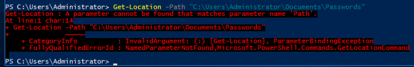

# What is Powershell?

Powershell is the Windows Scripting Language and shell environment that is built using the .NET framework.

This also allows Powershell to execute .NET functions directly from its shell. Most Powershell commands, called *cmdlets,* are written in .NET. Unlike other scripting languages and shell environments, the output of these *cmdlets* are objects — making Powershell somewhat object oriented. This also  means that running cmdlets allows you to perform actions on the output  object(which makes it convenient to pass output from one *cmdlet* to another). The normal format of a *cmdlet* is represented using **Verb-Noun**; for example the *cmdlet* to list commands is called `Get-Command.`

Common verbs to use include:

- Get
- Start
- Stop
- Read
- Write
- New
- Out

**#1** What is the command to get help about a particular cmdlet(without any parameters)?

```
GET-HELP
```

# Basic Powershell Commands

Now that we’ve understood how *cmdlets* works — let’s explore how to use them! The main thing to remember here is that Get-Command and Get-Help are your best friends!

Using Get-Help

Get-Help displays information about a *cmdlet.* To get help about a particular command, run the following:

```
Get-Help Command-Name
```

You can also understand how exactly to use the command by passing in the `-examples` flag. This would return output like the following:


Using Get-Command

Get-Command gets all the *cmdlets* installed on the current Computer. The great thing about this *cmdlet* is that it allows for pattern matching like the following

```
Get-Command Verb-*` or `Get-Command *-Noun
```

Running `Get-Command New-*` to view all the *cmdlets* for the verb new displays the following:


Object Manipulation

In the previous task, we saw how the output of every *cmdlet* is an object. If we want to actually manipulate the output, we need to figure out a few things:

- passing output to other *cmdlets*
- using specific object *cmdlets* to extract information

The Pipeline(|) is used to pass output from one *cmdlet* to another. A major difference compared to other shells is that instead of passing text or string to the command after the pipe, powershell  passes an object to the next cmdlet. Like every object in object  oriented frameworks, an object will contain methods and properties. You  can think of methods as functions that can be applied to output from the *cmdlet* and you can think of properties as variables in the output from a cmdlet. To view these details, pass the output of a *cmdlet* to the Get-Member *cmdlet*

```
Verb-Noun | Get-Member
```

An example of running this to view the members for Get-Command is:

```
Get-Command | Get-Member -MemberType Method
```


From the above flag in the command, you can see that you can also select between methods and properties.

Creating Objects From Previous *cmdlets*

One way of manipulating objects is pulling out the properties from the  output of a cmdlet and creating a new object. This is done using the `Select-Object` *cmdlet.*

Here’s an example of listing the directories and just selecting the mode and the name:


You can also use the following flags to select particular information:

- first — gets the first x object
- last — gets the last x object
- unique — shows the unique objects
- skip — skips x objects

Filtering Objects

When retrieving output objects, you may want to select objects that match a very specific value. You can do this using the `Where-Object` to filter based on the value of properties.

The general format of the using this *cmdlet* is

```
Verb-Noun | Where-Object -Property PropertyName -operator Value
Verb-Noun | Where-Object {$_.PropertyName -operator Value}
```

The second version uses the $_ operator to iterate through every object passed to the Where-Object cmdlet.

**Powershell is quite sensitive so make sure you don’t put quotes around the command!**

Where `-operator` is a list of the following operators:

- -Contains: if any item in the property value is an exact match for the specified value
- -EQ: if the property value is the same as the specified value
- -GT: if the property value is greater than the specified value

For a full list of operators, use [this](https://docs.microsoft.com/en-us/powershell/module/microsoft.powershell.core/where-object?view=powershell-6) link.

Here’s an example of checking the stopped processes:


Sort Object

When a *cmdlet* outputs a lot of information, you may need to sort it to extract the  information more efficiently. You do this by pipe lining the output of a *cmdlet* to the `Sort-Object` *cmdlet*.

The format of the command would be

```
Verb-Noun | Sort-Object
```

Here’s an example of sort the list of directories:

**#1** What is the location of the file “interesting-file.txt”

```
Get-ChildItem -Path C:\ -Include *interesting-file.txt* -File -Recurse -ErrorAction SilentlyContinue
```


```
C:\Program Files
```

**#2** Specify the contents of this file

```
Get-Content "C:\Program Files\interesting-file.txt.txt"
```


```
notsointerestingcontent
```

**#3** How many cmdlets are installed on the system(only cmdlets, not functions and aliases)?

```
Get-Command | Where-Object -Parameter CommandType -eq Cmdlet | measure
```


```
6638
```

**#4** Get the MD5 hash of interesting-file.txt

```
Get-FileHash -Path "C:\Program Files\interesting-file.txt.txt" -Algorithm MD5
```


```
49A586A2A9456226F8A1B4CEC6FAB329
```

**#5** What is the command to get the current working directory?

```
Get-Location
```


**#6** Does the path “C:\Users\Administrator\Documents\Passwords” Exist(Y/N)?

```
Get-Location -Path "C:\Users\Administrator\Documents\Passwords"
```



**#7** What command would you use to make a request to a web server?

```
Invoke-WebRequest
```


**#8** Base64 decode the file b64.txt on Windows.

```
Get-ChildItem -Path C:/ -Include b64.txt -Recurse -File
```


```
certutil -decode "C:\Users\Administrator\Desktop\b64.txt" decode.txt
```


```
Get-Content .\decode.txt
```


```
ihopeyoudidthisonwindows
```

# Enumeration

The first step when you have gained initial access to any machine would be to enumerate. We’ll be enumerating the following:

- users
- basic networking information
- file permissions
- registry permissions
- scheduled and running tasks
- insecure files

Your task will be to answer the following questions to enumerate the machine using Powershell commands!

**#1** How many users are there on the machine?

```
Get-LocalUser
```


```
5
```

**#2** Which local user does this SID(S-1–5–21–1394777289–3961777894–1791813945–501) belong to?

```
Get-LocalUser -SID "S-1-5-21-1394777289-3961777894-1791813945-501"
```


```
Guest
```

**#3** How many users have their password required values set to False?

```
Get-LocalUser | Where-Object -Property PasswordRequired -Match false
```


```
4
```

**#4** How many local groups exist?

```
Get-LocalGroup | measure
```


```
24
```

**#5** What command did you use to get the IP address info?

```
Get-NetIPAddress
```


**#6** How many ports are listed as listening?

```
GEt-NetTCPConnection | Where-Object -Property State -Match Listen | measure
```


```
20
```

**#7** What is the remote address of the local port listening on port 445?

```
GEt-NetTCPConnection | Where-Object -Property State -Match Listen
```


```
::
```

**#8** How many patches have been applied?

```
Get-Hotfix | measure
```


```
20
```

**#9** When was the patch with ID KB4023834 installed?

```
Get-Hotfix -Id KB4023834
```


```
6/15/2017 12:00:00 AM
```

**#10** Find the contents of a backup file.

```
Get-ChildItem -Path C:\ -Include *.bak* -File -Recurse -ErrorAction SilentlyContinueGet-Content "C:\Program Files (x86)\Internet Explorer\passwords.bak.txt"
```


```
backpassflag
```

**#11** Search for all files containing API_KEY

```
Get-ChildItem C:\* -Recurse | Select-String -pattern API_KEY
```


```
fakekey123
```

**#12** What command do you do to list all the running processes?

```
Get-Process
```

**#13** What is the path of the scheduled task called new-sched-task?

```
Get-ScheduleTask -TaskName new-sched-task
```


```
/
```

**#14**Who is the owner of the C:\

```
Get-Acl c:/
```


```
NT SERVICE\TrustedInstaller
```

#  Basic Scripting Challenge

Now that we have run powershell commands, let’s actually try write and run a script to do more complex and powerful actions.

For this ask, we’ll be using PowerShell ISE(which is the Powershell Text  Editor). To show an example of this script, let’s use a particular  scenario. Given a list of port numbers, we want to use this list to see  if the local port is listening. Open the listening-ports.ps1 script on  the Desktop using Powershell ISE. Powershell scripts usually have the *.ps1* file extension.

```
$system_ports = Get-NetTCPConnection -State Listen
$text_port = Get-Content -Path C:\Users\Administrator\Desktop\ports.txt
foreach($port in $text_port){
if($port -in $system_ports.LocalPort){
echo $port
```

}

```
}
```

On the first line, we want to get a list of all the ports on the system  that are listening. We do this using the Get-NetTCPConnection *cmdlet*. We are then saving the output of this *cmdlet* into a variable. The convention to create variables is used as:

```
$variable_name = value
```

On the next line, we want to read a list of ports from the file. We do this using the Get-Content *cmdlet.* Again, we store this output in the variables. The simplest next step is  iterate through all the ports in the file to see if the ports are  listening. To iterate through the ports in the file, we use the  following

```
foreach($new_var in $existing_var){}
```

This particular code block is used to loop through a set of object. Once we  have each individual port, we want to check if this port occurs in the  listening local ports. Instead of doing another for loop, we just use an if statement with the `-in`  operator to check if the port exists the LocalPort property of any  object. A full list of if statement comparison operators can be found [here](https://docs.microsoft.com/en-us/powershell/module/microsoft.powershell.core/about/about_comparison_operators?view=powershell-6). To run script, just call the script path using Powershell or click the green button on Powershell ISE:


Now that we’ve seen what a basic script looks like — it’s time to write one of your own. The emails folder on the Desktop contains copies of the  emails John, Martha and Mary have been sending to each other(and  themselves). Answer the following questions with regards to these  emails(try not to open the files and use a script to answer the  questions).

**#1** What file contains the password?

Write the script and save to run.ps1

```
$path = "C:\Users\Administrator\Desktop\emails\*"
$string_pattern = "password"
$command = Get-ChildItem -Path $path -Recurse | Select-String -Pattern $String_patternecho $command
```


```
Doc3M
```

**#2** What is the password?


```
johnisalegend99
```

Write the script and save to run.ps1

```
$path = "C:\Users\Administrator\Desktop\emails\*"
$string_pattern = "https://"
$command = Get-ChildItem -Path $path -Recurse | Select-String -Pattern $String_patternecho $command
```


```
Doc2Mary
```

# Intermediate Scripting

Now that you’ve learnt a little bit about how scripting works — let’s try  something a bit more interesting. Sometimes we may not have utilities  like nmap and python available, and we are forced to write scripts to do very rudimentary tasks. Why don’t you try writing a simple port scanner using Powershell. Here’s the general approach to use:

- Determine IP ranges to scan(in this case it will be localhost) and you can provide the input in any way you want
- Determine the port ranges to scan
- Determine the type of scan to run(in this case it will be a simple TCP Connect Scan)

**#1** How many open ports did you find between 130 and 140(inclusive of those two)?

Write the script and save to run.ps1

```
for($i=130; $i -le 140; $i++){
    Test-NetConnection localhost -Port $i
}
```


```
11
```