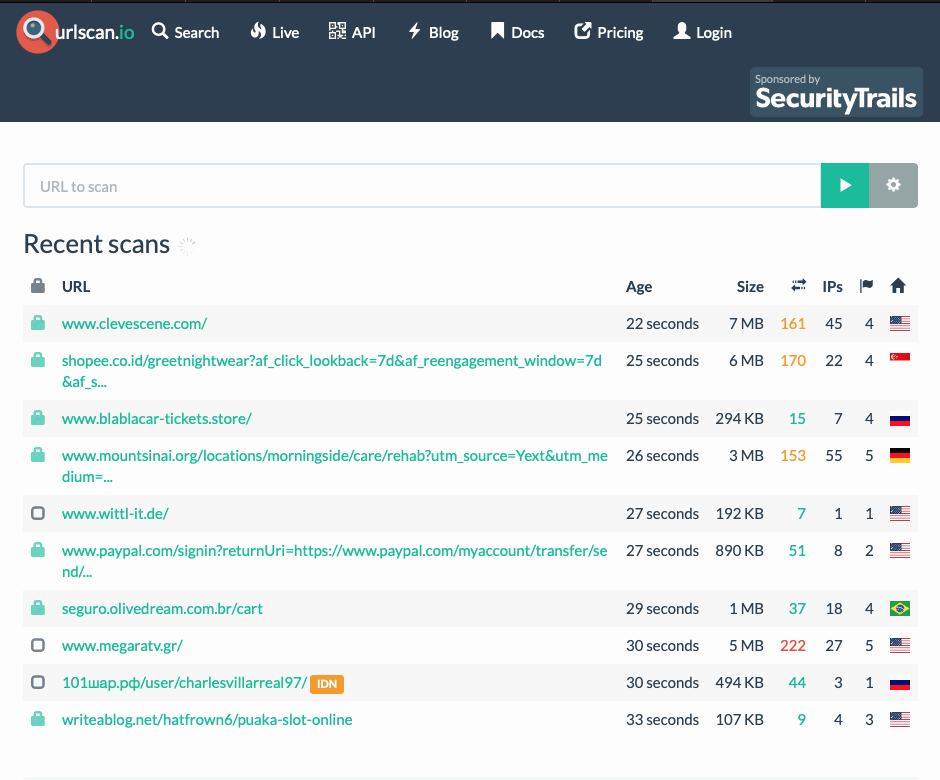
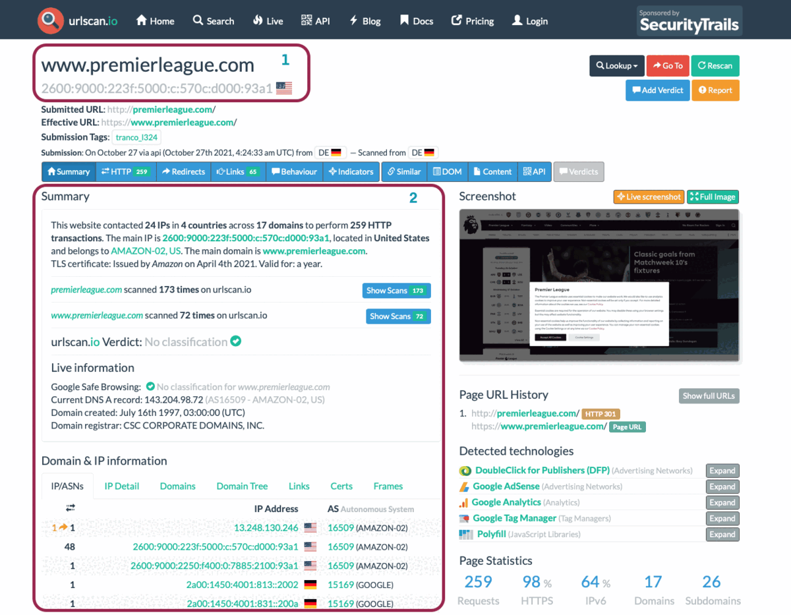
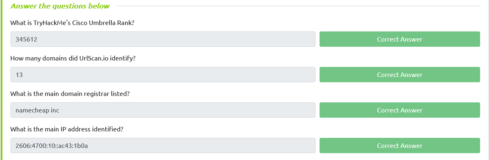

- Understanding the basics of threat intelligence & its classifications.
- Using UrlScan.io to scan for malicious URLs.
- Using Abuse.ch to track malware and botnet indicators.
- Investigate phishing emails using PhishTool
- Using Cisco's Talos Intelligence platform for intel gathering.

#  Threat Intelligence                            

Threat Intelligence is the analysis of data and information using tools and techniques to generate meaningful patterns on how to mitigate against potential risks associated with existing or emerging threats targeting organisations, industries, sectors or governments.

To mitigate against risks, we can start by trying to answer a few simple questions:

- Who's attacking you?
- What's their motivation?
- What are their capabilities?
- What artefacts and indicators of compromise should you look out for?

### Threat Intelligence Classifications:

Threat Intel is geared towards understanding the relationship between your  operational environment and your adversary. With this in mind, we can  break down threat intel into the following classifications: 

- **Strategic Intel:** High-level intel that looks into the organisation's threat landscape and maps out  the risk areas based on trends, patterns and emerging threats that may  impact business decisions.
- **Technical Intel:** Looks into evidence and artefacts of attack used by an adversary. Incident  Response teams can use this intel to create a baseline attack surface to analyse and develop defence mechanisms.
- **Tactical Intel:** Assesses adversaries' tactics, techniques, and procedures (TTPs). This intel can strengthen security controls and address vulnerabilities through  real-time investigations.
- **Operational Intel:** Looks into an adversary's specific motives and intent to perform an attack.  Security teams may use this intel to understand the critical assets  available in the organisation (people, processes, and technologies) that may be targeted.

#  UrlScan.io                            

[**Urlscan.io**](https://urlscan.io) is a free service developed to assist in scanning and analysing websites. It is used to automate the process of browsing and crawling through websites to record activities and interactions.

When a URL is submitted, the information recorded includes the domains and IP addresses contacted, resources requested from the domains, a snapshot of the web page, technologies utilised and other metadata about the website.

The site provides two views, the first one showing the most recent scans performed and the second one showing current live scans.

 

## Scan Results

URL scan results provide ample information, with the following key areas being essential to look at:

-  **Summary:** Provides general information about the  URL, ranging from the identified IP address, domain registration  details, page history and a screenshot of the site. 
-   **HTTP:** Provides information on the HTTP connections made by the scanner to the site, with details about the data fetched and the file types received. 
-  **Redirects:** Shows information on any identified HTTP and client-side redirects on the site. 
-  **Links:** Shows all the identified links outgoing from the site's homepage. 
-  **Behaviour:** Provides details of the variables and  cookies found on the site. These may be useful in identifying the  frameworks used in developing the site. 
-  **Indicators:** Lists all IPs, domains and hashes  associated with the site. These indicators do not imply malicious  activity related to the site.

### Scenario

You have been tasked to perform a scan on TryHackMe's domain. The results  obtained are displayed in the image below. Use the details on the image  to answer the questions:

#  Abuse.ch                            

[Abuse.ch](https://abuse.ch) is a research project hosted by the Institue for Cybersecurity and Engineering at the Bern University of Applied Sciences in Switzerland. It was developed to identify and  track malware and botnets through several operational platforms  developed under the project. These platforms are: 

- **Malware Bazaar:** A resource for sharing malware samples.
- **Feodo Tracker:** A resource used to track botnet command and control (C2) infrastructure linked with Emotet, Dridex and TrickBot.
- **SSL Blacklist:** A resource for collecting and providing a blocklist for malicious SSL certificates and JA3/JA3s fingerprints.
- **URL Haus:** A resource for sharing malware distribution sites.
- **Threat Fox:** A resource for sharing indicators of compromise (IOCs).

Let us look into these platforms individually.

## [MalwareBazaar](https://bazaar.abuse.ch)

As the name suggests, this project is an all in one malware collection and analysis database. The project supports the following features: 

- **Malware Samples Upload:** Security analysts can upload their  malware samples for analysis and build the intelligence database. This  can be done through the browser or an API.
- **Malware Hunting:** Hunting for malware samples is  possible through setting up alerts to match various elements such as  tags, signatures, YARA rules, ClamAV signatures and vendor detection.

## [FeodoTracker](https://feodotracker.abuse.ch)

With this project, Abuse.ch is targeting to share intelligence on botnet Command & Control (C&C) servers associated with Dridex, Emotes (aka Heodo), TrickBot, QakBot and BazarLoader/BazarBackdoor. This is achieved by providing a database of the C&C servers that security analysts can search through and investigate any suspicious IP addresses they have come across. Additionally, they provide various IP and IOC blocklists and mitigation information to be used to prevent botnet infections.

## [SSL Blacklist](https://sslbl.abuse.ch)

Abuse.ch developed this tool to identify and detect malicious  SSL connections. From these connections, SSL certificates used by botnet C2 servers would be identified and updated on a denylist that is provided for use. The denylist is also used to identify JA3 fingerprints that would help detect and block malware botnet C2 communications on the TCP layer.

You can browse through the SSL certificates and JA3 fingerprints lists or download them to add to your deny list or threat hunting rulesets.

## [URLhaus](https://urlhaus.abuse.ch)

As the name points out, this tool focuses on sharing malicious URLs used for malware distribution. As an analyst, you can search through the database for domains, URLs, hashes and filetypes that are suspected to be malicious and validate your investigations.

The tool also provides feeds associated with country, AS number and Top Level Domain that an analyst can generate based on specific search needs.

## [ThreatFox](https://threatfox.abuse.ch)

With ThreatFox,  security analysts can search for, share and export indicators of compromise associated with malware. IOCs can be exported in various formats such as MISP events, Suricata IDS Ruleset, Domain Host files, DNS Response Policy Zone, JSON files and CSV files.

