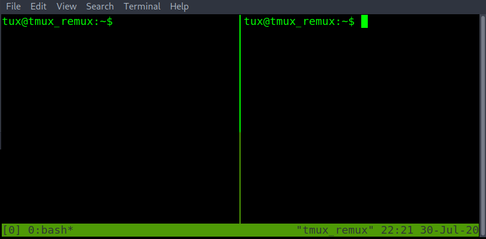
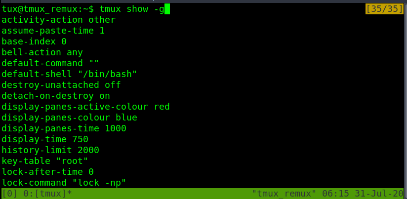
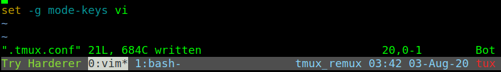

# Starting tmux "Sessions" and default tmux "prefix"

To start a new tmux session just run the tmux command with no arguments. The first session create will have the  name "0". By default, tmux status bar will be green. With session name  on the left. Windows in the middle and window names in the middle.  Hostname, time, and date on the right of the bottom green bar.

Tmux doesn't allow to create of a nested tmux within a tmux unless you force it to. When running the tmux command a second time.

To change the session name from "0" -> "box-dev". Must first learn how  tmux is called. All commands within a tmux session all start with the  tmux prefix is. By default, the tmux prefix is "Ctrl b".

After the tmux prefix. To the hotkeys to change the current tmux session's name is "shift $". 

**ctrl b shift $**

Retype the new name and then enter-key to save the new session name.

If there is a need to create another tmux session within the current one.  Use the -d argument with the tmux command. To spawn a new tmux session  without attaching to it. In the example image below. The -s argument is  used to specify the session name for the new session. Typed as "tmux new -s <new-session-name> -d".

To list all active tmux sessions. Run tmux with list-sessions. Or the  short version of list-sessions as ls. In the example below. Running tmux ls also shows the current session in use. Marked by "(attached)".

Exiting a tmux session without closing it can be done with the prefix. Followed by d

**ctrl b d**

Checking again with the tmux ls command. "(attached)" is missing from both  sessions. This means the sessions are active but we are detached and are unable to interact with either session.

To reattach to an active tmux session. Run tmux with the attach option and -t followed by the desired session name.

The tmux session name has changed to the attached session of "tryhackme".  Double-checking with tmux ls. Can confirm that "(attached)" also on the  "tryhackme" session name.

Delete a single session by its session name. Is done with the kill-session  option with tmux. Followed by -t and the  <target-session-name-to-delete>

Listing sessions with tmux ls. This shows that the session name of box-dev has  been removed. WARNING! By deleting the session. Anything open in that  session will be lost if not saved before the tmux kill-session.

In the example below there are many sessions open. Another way to swap  sessions without having to detach and reattach to another session. Is to use the prefix. Followed by the s-key to list all open sessions. Using  up or down arrow keys to navigate to the desired tmux session. Then  enter to select the new session.

**ctrl b s**

Change from session name "0" to "tmux_remux" without having to leave the current tmux session.

From the five active sessions above. If there was a need to kill all the  sessions except for a single one. When using the tmux kill-session. Use  the -a argument to close all sessions except the one specified by the -t argument. Closing all tmux sessions except for the one named  "is-0day-0k?". Checked with the tmux list-sessions.

When spiting the session into different sized panes ("which will be covered  in more detail in a later task"). The new pane will spawn in the  directory that the tmux session was first started in. 

To change the base starting directory. Must first learn about tmux prompt  or command mode. The tmux prompt allows tmux sessions to run tmux  commands without the tmux binary name. Useful when the terminal has been filled with other text. Enter a tmux prompt with prefix shift :

**ctrl b shift :**

Followed by "attach -c /path/to/new/starting/directory"

With the updated starting or base directory done above as /dev/shm. Creating a new pane start in the /dev/shm directory.

Even though at the start tmux doesn't allow nested tmux within a tmux.  Attaching or starting a new tmux session on another computer by an ssh  connection. Can make a nested tmux. Not a problem. Just by changing the  number of prefix used before the following command. Can determine which  session gets the command.

prefix, prefix, and command. This will run on the second nested tmux session of the ssh ubuntu machine.

prefix and command. This will run on the first tmux session. The session running on the current machine's localhost.

#  Manage tmux "Panes"

Within the current tmux session window.  Tmux panes are used to divide the current session into multiple-sized  terminals. That allows multiple commands to run within the same session  window.

To split the currently selected pane horizontally. Do the prefix. This followed by a shift **ctrl b shift**

To split the currently select pane vertically. Do the prefix. Followed by shift %

**ctrl b shift %**

j

The exit command can be used to close the currently selected pane.

Moving to another pane within the same window can be done with the prefix. Followed by the arrow keys. 

**ctrl b <arrow key>**

However, the main problem with this method is sometimes when using the arrow  keys again. For example, to move the terminal cursor box could move to  another tmux pane instead. 

To resolve this issue can prefix followed by o instead. This can cycle  through all the tmux panes. This has the added benefit of the line  cursor not escaping to another pane. 

**ctrl b o**

To swap between the most used tmux panes if more than two panes are open. "ctrl b ;" is the better option. "ctrl b o" is better when there are just two panes open.

**ctrl b ;**

With <arrow-keys> and or <o> in the image below to move the terminal cursor box from the left to the.

If a tmux pane isn't responsive and ctrl-c isn't resolving the issue.  Force close or kill the currently selected tmux pane with the prefix and x. Then y to confirm.

**ctrl b x y
**

If killing the pane was a mistake. Use the n option for no instead of y for yes when the kill-pane prompt is shown.

Managing the placement of panes. Can change the layout without having to exit panes or open create new panes.

To move the currently selected pane. In a clockwise rotation. Do prefix shift }

**ctrl b shift }**

Note. All other panes will move clockwise with the currently selected pane.

To move the currently selected pane counter-clockwise. Do prefix shift {

**ctrl b shift {**

Another way to manage the pane location is with five built-in layouts. This can be done with the prefix followed by the escape OR esc key and the  desired option from the number selected from 1 to 5.

**ctrl b esc 4**

Note that the layout result depends on how many panes are currently open.

To cycle through the built-in pane layouts one at a time. Do the prefix  with the spacebar. This can also be an alternative using a clockwise or  counter-clockwise option when there are only two panes open on the  current tmux window.

**ctrl b spacebar**

Lastly when it comes to managing panes. There might be a need to swap the  place between two panes. When cycling panes don't create the desired  pane layout.

Before swapping, you can identify pane numbers with `ctrl b q`. You must first check the number each pane has been assigned. This also provides the size of each pane.

For the swap pane example. It will be done within tmux prompt or command mode with prefix shift : then the commands swap-pane. With -s <source-pane> and -t <destination-pane>. This will send the move/swap the currently selected pane and keep the  currently selected pane selected after the swap.

:**swap-pane -s <source pane final swap location> -t <currently selected destination pane>**

With the command above in this example. The currently selected pane of the  parrot has moved to the bottom right and has followed the currently  selected pane. Still able to start typing within the parrot pane without having to switch to another pane.

To swap places with another pane and select the other open pane. Instead  of the currently selected pane. Have the -t <destination-pane>  first with the pane you want to swap with. Followed by the -s  <source-pane> or currently selected pane

:**swap-pane -t <pane to swap with> -s <currently selected pane>** 

Started with the parrot in the bottom right pane. After the command. Have  swapped places with the cow. Also, the new currently selected pane is  the cow.

#  Manage tmux "Windows"

Tmux windows are like a new terminal tab that you can easily swap from and more. To create a new empty tmux  window to work on. Do prefix c. Shown with the new window number and  name. Note the currently selected window will be marked with a * or  wildcard star. At the end of the current window name.te must be at least 1 minut

**ctrl b c**

To change the name of the current window. Do prefix ,. After retyping the new window name. Hit the enter key to save changes.

**ctrl b ,**

Oh NO. The recon window has been cluttered with multiple panes and can't  view the Nmap output. To detach a pane into its own window. move the  desired pane to move to its own window. Then prefix shift !.

**ctrl b shift !**

The Nmap has been sent to a new window named "bash". Now able to view the whole Nmap scan without run the Nmap scan again.

To cycle between windows can be done with **prefix n** for the next window. Or **prefix p** for the previous windows. 

Another method to switch to the desired window is to use **prefix w**. This will list all the tmux windows. Using the arrow keys to select the desired windows and enter-key to select the highlighted window.

Moving back to the recon window. Shows the Nmap pane is has been moved and there is more room to work.

If a tmux window has been borked and needs to be terminated quickly.  Killing the window will also close any panes open within the currently  selected tmux window. To kill or close a tmux window do prefix shift  & and followed by y to close the window. Or n to keep it open.

**ctrl b shift &**

Prompt after the command.

Closing the recon window. The name recon is removed from the status bar below.

Previously in this task was shown how to break off a pane into its own window.  However, sometimes the is a need to fuse two windows together as a single window. 

To join two different windows/panes back into one. Can be done with the  window name or number. The command is run within tmux prompt or command  mode. Prefix shift : then within the prompt :join-pane -t  <window-name> OR :join-pane -s <window-name>. Where -s is  the source name and -t is the destination window name.

First. Enter tmux prompt or command mode from the tmux session.

**ctrl b shift :**

Second. Type join-pane with the desired option and window name.

**join-pane -s <source-window-name>**

**join-pane -t <destination-window-name>** 

Third. Hit Enter to run the join-pane command.

For the join-pane commands adding -v on the end fuses the two panes  together horizontally. Adding -h on the end of the join-pane command  fuses two panes together vertically.

#  Tmux "copy" mode                            

Copy mode can be used to scroll up and  down the page. If the text is larger than the length of the pane or  window size. To start copy mode. Type **ctrl b [** and a number will show up in the top right corner of the current pane or window using copy mode. After scrolling. Exit copy mode with the q key.

**Allows scrolling through linpeas output.**

When manually searching for the block of text to copy. It can be easy to miss. This can be quickly solved by searching up or down the page.

To search up the page. Within copy mode. Type **ctrl r** and the search term or string to search for. To continue searching the  same string. Hold down ctrl and press r again to jump to the next string location. Resume scrolling by hitting the enter key. Will stop at the  search string/term.

To search down the page. Is the same basic idea as search up. However, this is done with s instead of r as **ctrl s** and then the search term or string. While holding down ctrl retype s to jump to the next string location. Again resume scrolling by hitting the enter key. Will stop at the search string/term.

To copy and paste within tmux copy-mode takes 4 steps. Note that this method will only apply to the tmux clipboard as follows.

\0) **ctrl b** [ # enter copy mode

\1) **scroll to the start of the block of text you would like to copy**

\2) enable highlighting with **ctrl spacebar**. Then use the arrow keys to up to select all the text. Down if you start from the top instead.

\3) copy all the highlighted text to the tmux clipboard with **alt w**. Note! Even though the highlight will disappear. The text still copied to the tmux clipboard.

\4) create a new file to paste the final text with **ctrl b ]**.

To double-check what the text that is currently copied to the tmux clipboard. Do prefix followed by shift #

**ctrl b shift #**

Note. Even though the text might look broken don't worry it will paste as it  was copied within a terminal file editor. To quit back to the terminal.  Hit the **q key** once.

Pasting again with prefix ] shows that it pasted corrected from the origin ASCII image.

**ctrl b ]**

# Oh My Tmux and beyond                          

The last four tasks have covered commands of how to use tmux with its  defaults. Tmux by default doesn't have a default configuration file.  That doesn't mean you can make one.

Before crafting a custom configuration file for tmux. It might be a good idea  to show all the options of the defaults. With tmux show -g argument for  global.

 

When creating the tmux configuration script it is important that. The file  name is .tmux.conf and .tmux.conf is saved within the user's home  directory /home/username/.tmux.conf

**set -g status-style bg='#44475a',fg='#8be9fd'
**This line is to modify the color of the status bar.

**setw -g window-status-current-style fg=black,bg=white** 

This line adds highlight in the color of white for the currently selected window.

**set -g prefix C-a** 

Allow changing the prefix from ctrl b to ctrl a. If there is any need to use  the alt key instead of ctrl. Then set prefix as M-b or another second  character, such as M-a. Changing the prefix from ctrl b to alt a.

\#IMPORTANT NOTE

bind or bind-key options allow adding extra hotkey options without overwriting the default hotkeys

set options overwrite the default tmux hotkeys for the updated ones written within the .tmux.conf file

Using bind-key with | and - to add extra ways to split-window and create a  new pane. The -c argument with "#{pane_current_path}" on the end. Allows any new pane within a different directory to keep that directory path.  Even if it is not the directory that session had started in.

**ctrl b shift |** # will split horizontally

**ctrl b -** # will split vertically

The set history limit allows copying mode to have a higher max character  limit. Useful for copying output that goes beyond the default tmux  history limit.

'

The left side of the status bar can be customized with status-left within  set or set-option. In the example below the first one status-left-length 15. Set the total amount of characters that can be shown on the left.  The following line displays 'Try Harderer' with the echo Linux command. 

After reloading the tmux configuration file within the session ctrl b shift : followed by source-file /home/username/.tmux.conf OR source-file  ~/.tmux.conf

\# NOTE the .tmux.conf can also be reloaded by closing and restarting a new session. Or with the tmux command as 

**tmux source /home/username/.tmux.conf**

When adding the output of Linux commands to the status bar. Sometimes  commands will not function correctly. To resolve the issue. Put the  desired one-liner or script into a file. Then make it executable with  chmod or it won't work.

Instead of running a Linux command. The following Linux includes the path to the script.

Reloading the .tmux.conf file again shows the output of whowami from the script.sh

In addition to calling script though .tmux.conf is calling custom plugins. The plugins are shown were sourced from GitHub.

https://github.com/tmux-plugins/tmux-resurrect.git # save sessions to resume after a system reboot.

https://github.com/tmux-plugins/tmux-logging.git # plugin for creating command history to review later.

https://github.com/tmux-plugins/tmux-yank.git # plugin copy text from outside the tmux clipboard to use with other programs.

For the example below add the two following lines for tmux-logging. A  plugin that can take pane screenshots, per pane history, and complete  history logging. 

\# NOTE. Double-check install instructions from their Github page if something doesn't follow up.

Another .tmux.conf reload. To start command history logging for the currently  selected pane do prefix shift p. This will start a log file within the  current user's home directory.

**ctrl b shift P**

Although there a problem. When reloading the .tmux.conf file. The whoami script.sh from before prints a duplicate string. 

This is because the first set status-right had used the -a or append  argument. Append give to option without having to redo everything.  However when reloading the tmux configuration .tmux.conf file. It prints duplicates. This can be resolved by only using the -g or global  argument.

Reloading the .tmux.conf file. Can see that only using the global argument -g  alone removes the hostname, time, and date from the status-right.  Whoops.

Resolving the issue will be done by value in the same order as was with -ga.

**#H** is the place holder for the hostname.

**%H:%M** is the hour and minutes of the clock.

**%d-%b-%y** will follow last for the day, month, and year.

A .tmux.conf reload later and everything is back to normal. Any attempt  to reload the .tmux.conf file doesn't print duplicate status-right from  the script.sh file.

Not a fan of copy modes hotkeys. Well by default they are set to emacs.

To changes, this adds the set -g mode-keys vi. Save the .tmux.conf script and reload. To copy with this setting.

\1) **ctrl b [** # enter copy mode

\3) # arrow key to the start or end of what you would like to copy

\2) **spacebar** # followed by the arrow keys to highlight all the text

\3) **enter** # copy the highlighted text to the tmux clipboard

\4) **ctrl b ]** # paste the tmux clipboard

To make copy mode feel more like as if copying blocks of text in vi file  editor. The code between mouse on and the last two lines.

This allows has mouse mode on. That allows us the use of the mouse to resize tmux panes or scroll without needing to use the hotkeys to enter copy  mode.

The last two lines below allow anything though vi y key to be also saved secondary Linux  keyboard. The secondary keyboard is the ctrl c ctrl v. This means that  the copy text will be pasted from the ctrl v buffer. Instead of the  copied text being trapped within tmux.

The alternative to building a custom .tmux.conf configuration script it  utilize a open-source .tmux.conf script. That can be easily found by  searching online with Oh My Tmux. For this example will use the  tmuxconfig repository from github. that can be found at the link below.

https://github.com/chaosma/tmuxconfig.git

First. Change the .tmux.conf to something new. For example, changing the name from .tmux.conf to custom-tmux.bak

Second. Install the tmuxconfig repository with git clone and copy the hidden  .tmux.conf file to the home directory of /home/username/

Third run a new tmux session or reload the tmux configuration .tmux.conf file to see changes

To change scripts back replace the .tmux.conf file again in the home  directory or call the desired .tmux.conf file when starting a new tmux  session with the -f argument for configuration file

**tmux -f /home/username/custom-tmux.bak**

\# NOTE. That using the tmuxconfig or other tmux.conf configuration files  is the only one that loads in. Regardless if the .tmux.conf had been  deleted or replaced with another .tmux.conf file. Tmux can be reset back to its default configuration by killing the tmux server. with  kill-server

**# IMPORTANT WARNING**. Before running the kill-server command backup and save everything. On  every session, window, and pane because this command will stop  everything. 

**tmux kill-server**

