# Manual Enumeration

We don't need to start unrolling the fancy toolkit from the get-go.  More often than not, the results of using our own initiative over  automated scans bare more results. For example, we may be able to find  the "golden ticket" without making all of the noise. Let's outline some  fundamentals skills involving you and your browser.

Your browser is as extensive as you are (and some!) and keeps records of the data it receives and who from. We can use this for a range of  activities: finding that exact photo or more usefully -- the location of certain files or assets being loaded. This could include things from  scripts to page URLs.

**Using our Browsers Developer Console**

Modern-day browsers including Chrome and Firefox have a suite of tools located in  the "Developer Tools/Console". We're going to be discussing Firefox's,  however, Chrome has a very similar suite. This suite includes a range of tools including:

- Viewing page source code
- Finding assets
- Debugging & executing code such as javascript on the client-side (our Browser)

Using "F12" on our keyboard, this is a shortcut to launch this suite of tools. 

**Inspecting Tool**

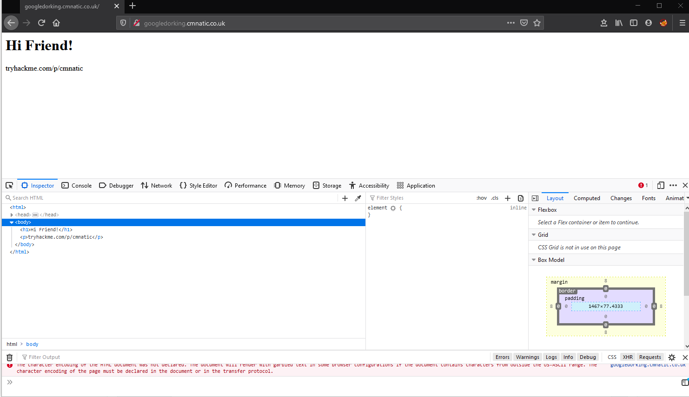

At first, we can see the web page with the heading "Hi Friend" and a  section of the screen filled with the "Inspector" tool. This allows us  to view the HTML source code of the webpage we have loaded in our  browser. This often contains things such as developer comments, and the  name to certain aspects of web page features including forms and the  likes. 

Developers often leave behind comments in the form of the **<!-- -->** tags...for example: <!-- This is a comment --> which are not rendered in the browser as we can see here:

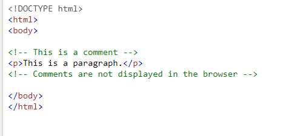

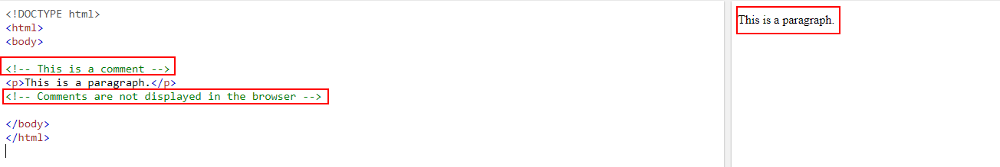

# Introduction to Gobuster                            

# **Introduction to Gobuster**

Welcome to the Gobuster portion of this room! This part of the room  is aimed at complete beginners to enumeration and penetration testing.  By completing this portion, you will have learned:

- How to install Gobuster on Kali Linux
- How to use the "dir" mode to enumerate directories and several of its most useful options
- How to use the "dns" mode to enumerate domains/subdomains and several of its most useful option
- Where to go for help

At the end of this section, you will have the opportunity to practice what you have learned by using Gobuster on another room, *[Blog](https://tryhackme.com/room/blog).* This room utilizes what's called a Content Management System (CMS) in order to make things easier for the user. These typically have large and varied directory structures...perfect for directory enumeration  with Gobuster!

# What is Gobuster?

# **Useful Global Flags**

There are some useful Global flags that can be used as well. I've included  them in the table below. You can review these in the main documentation  as well - [here](https://github.com/OJ/gobuster).

| Flag | Long Flag     | Description                               |
| ---- | ------------- | ----------------------------------------- |
| -t   | --threads     | Number of concurrent threads (default 10) |
| -v   | --verbose     | Verbose output                            |
| -z   | --no-progress | Don't display progress                    |
| -q   | --quiet       | Don't print the banner and other noise    |
| -o   | --output      | Output file to write results to           |

I will typically change the number of threads to 64 to increase the speed of my scans. If you don't change the number of threads, Gobuster can be a little slow.

## Gobuster Modes

# **"dir" Mode**

Dirbuster has a "dir" mode that allows the user to enumerate website directories. This is useful when you are performing a penetration test and would  like to see what the directory structure of a website is. Often,  directory structures of websites and web-apps follow a certain  convention, making them susceptible to brute-forcing using wordlists. At the end of this room, you'll run Gobuster on *[Blog](https://tryhackme.com/room/blog)* which uses WordPress, a very common *Content Management System* (CMS). WordPress uses a very specific directory structure for its websites.

Gobuster is powerful because it not only allows you to scan the website, but it  will return the status codes as well. This will immediately let you know if you as an outside user can request that directory or not. Additional functionality of Gobuster is that it lets you search for files as well  with the addition of a simple flag!

### **Using "dir" Mode**

To use "dir" mode, you start by typing `gobuster dir`. This isn't the full command, but just the start. This tells Gobuster  that you want to perform a directory search, instead of one of its other methods (which we'll get to). It has to be written like this or else  Gobuster will complain. After that, you will need to add the URL and  wordlist using the `-u` and `-w` options, respectively. Like so:

```
gobuster dir -u http://10.10.10.10 -w /usr/share/wordlists/dirbuster/directory-list-2.3-medium.txt
```

**Note**: The URL is going to be the base path where Gobuster starts looking  from. So the URL above is using the root web directory. For example, in a typical Apache installation on Linux, this is */var/www/html*. So if you have a "**products**" directory and you want to enumerate that directory, you'd set the URL as *http://10.10.10.10/**products***. You can also think of this like *http://example.com/path/to/folder*. Also notice that I specified the protocol of HTTP. This is important and required.

This is a very common, simple, and straightforward command for Gobuster.  This is typically what I will run when doing capture the flag style  rooms on TryHackMe. However, there are some other helpful flags that can be useful in certain scenarios

### **Other Useful Flags**

These flags are useful in certain scenarios. Note that these are not all of  the flag options, but some of the more common ones that you'll use in  penetration tests and in capture the flag events. If you'd like the full list, you can see that [here](https://github.com/OJ/gobuster#dir-mode-options).

| Flag | Long Flag                | Description                                                 |
| ---- | ------------------------ | ----------------------------------------------------------- |
| -c   | --cookies                | Cookies to use for requests                                 |
| -x   | --extensions             | File extension(s) to search for                             |
| -H   | --headers                | Specify HTTP headers, -H 'Header1: val1' -H 'Header2: val2' |
| -k   | --no-tls-validation      | Skip TLS certificate verification                           |
| -n   | --no-status              | Don't print status codes                                    |
| -P   | --password               | Password for Basic Auth                                     |
| -s   | --status-codes           | Positive status codes                                       |
| -b   | --status-codes-blacklist | Negative status codes                                       |
| -U   | --username               | Username for Basic Auth                                     |


A very common use of Gobuster's "dir" mode is the ability to use it's `-x` or` --extensions` flag to search for the contents of directories that you have already  enumerated by providing a list of file extensions. File extensions are  generally representative of the data they may contain. For example, **.conf** or **.config** files usually contain configurations for the application - including sensitive info such as database credentials.

A few other files that you may wish to search for are .txt files or other web application pages such as **.html** or **.php** . Let's assemble a command that would allow us to search the "myfolder" directory on a webserver for the following three files:

\1. html

\2. js

\3. css

```
gobuster dir -u http://10.10.252.123/myfolder -w /usr/share/wordlists/dirbuster/directory-list-2.3-medium.txt -x.html,.css,.js
```

### **The -k Flag**

The -k flag is special because it has an important use during penetration  tests and captures the flag events. In a capture the flag room on  TryHackMe for example, if HTTPS is enabled, you will most likely  encounter an invalid cert error like the one below

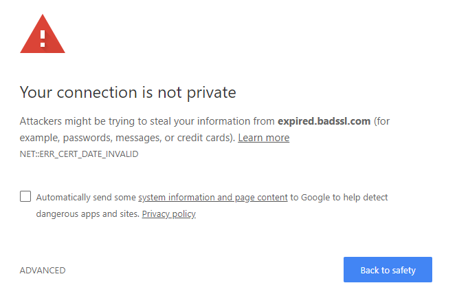
In instances like this, if you try to run Gobuster against this without the` -k` flag, it won't return anything and will most likely error out with  something gross and will leave you sad. Don't worry though, easy fix!  Just add the `-k` flag to your scan and it will bypass this invalid certification and continue scanning and deliver the goods! 

**Note:** This flag can be used with "dir" mode and "vhost" modes

# **"dns" Mode**

The next mode we'll focus on is the "dns" mode. This allows Gobuster to  brute-force subdomains. During a penetration test (or capture the flag), it's important to check sub-domains of your target's top domain. Just  because something is patched in the regular domain, does not mean it is  patched in the sub-domain. There may be a vulnerability for you to  exploit in one of these sub-domains. For example, if State Farm owns  statefarm.com and mobile.statefarm.com, there may be a hole in  mobile.statefarm.com that is not present in statefarm.com. This is why  it is important to search for subdomains too!

### **Using "dns" Mode**

To use "dns" mode, you start by typing `gobuster dns`. Just like "dir" mode, this isn't the full command, but just the start.  This tells Gobuster that you want to perform a sub-domain brute-force,  instead of one of one of the other methods as previously mentioned. It  has to be written like this or else Gobuster will complain. After that,  you will need to add the domain and wordlist using the -d and -w  options, respectively. Like so:

```
gobuster dns -d mydomain.thm -w /usr/share/wordlists/SecLists/Discovery/DNS/subdomains-top1million-5000.txt
```

This tells Gobuster to do a sub-domain scan on the domain "mydomain.thm". If there are any sub-domains available, Gobuster will find them and report them to you in the terminal.


### **Other Useful Flags**


-d and -w are the main flags that you'll need for *most* of your scans. But there are a few others that are worth mentioning that we can go over. They are in the table below.

| Flag | Long Flag    | Description                                                  |
| ---- | ------------ | ------------------------------------------------------------ |
| -c   | --show-cname | Show CNAME Records (cannot be used with '-i' option)         |
| -i   | --show-ips   | Show IP Addresses                                            |
| -r   | --resolver   | Use custom DNS server (format server.com or server.com:port) |


There aren't many additional flags to be used with this mode, but these are  the main useful ones that you may use from time to time. If you'd like  to see the full list of flags that can be used with this mode, check out the [documentation](https://github.com/OJ/gobuster#dns-mode-help)

# **"vhost" Mode**

The last and final mode we'll focus on is the "vhost" mode. This allows  Gobuster to brute-force virtual hosts. Virtual hosts are different  websites on the same machine. In some instances, they can appear to look like sub-domains, but don't be deceived! Virtual Hosts are IP based and are running on the same server. This is not usually apparent to the  end-user. On an engagement, it may be worthwhile to just run Gobuster in this mode to see if it comes up with anything. You never know, it might just find something! While participating in rooms on TryHackMe, virtual hosts would be a good way to hide a completely different website if  nothing turned up on your main port 80/443 scan.

### **Using "vhost" Mode**

To use "vhost" mode, you start by typing `gobuster vhost`. Just like the other modes, this isn't the full command, but just the  start. This tells Gobuster that you want to perform a virtual host  brute-force, instead of one of the other methods as previously  mentioned. It has to be written like this or else Gobuster will  complain. After that, you will need to add the domain and wordlist using the `-u` and `-w` options, respectively. Like so:

```
gobuster vhost -u http://example.com -w /usr/share/wordlists/SecLists/Discovery/DNS/subdomains-top1million-5000.txt
```

This will tell Gobuster to do a virtual host scan [http://example.com](http://example.com/) using the selected wordlist.

### **Other Useful Flags**

A lot of the same flags that are useful for "dir" mode actually still  apply to virtual host mode. Please check out the "dir" mode section for  these and take a look at the [official documentation](https://github.com/OJ/gobuster#vhost-mode-options) for the full list. There's really too many that are similar to put them back here.

# Introduction to WPScan

First released in June 2011, WPScan has survived the tests of time and stood  out as a tool that every pentester should have in their toolkits.

The WPScan framework is capable of enumerating & researching a few  security vulnerability categories present in WordPress sites - including - but not limited to:

- Sensitive Information Disclosure (Plugin & Theme installation versions for disclosed vulnerabilities or CVE's)
- Path Discovery (Looking for misconfigured file permissions i.e. wp-config.php)
- Weak Password Policies (Password bruteforcing)
- Presence of Default Installation (Looking for default files)
- Testing Web Application Firewalls (Common WAF plugins)

### Installing WPScan

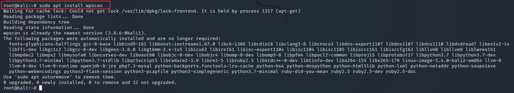

Installing WPScan on other operating systems such as Ubuntu or Debian involves  extra steps. Whilst the TryHackMe AttackBox comes pre-installed with  WPScan, you can follow the [developer's installation guide](https://github.com/wpscanteam/wpscan#install) for your local environment.

## A Primer on WPScan's Database 

WPScan uses information within a local database as a primary reference point  when enumerating for themes and plugins. As we'll come to detail later, a technique that WPScan uses when enumerating is looking for common  themes and plugins. Before using WPScan, it is highly recommended that  you update this database before performing any scans.

Thankfully, this is an easy process to do. Simply run `wpscan --update` 

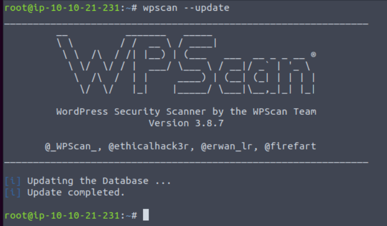

## WPScan Modes

**Enumerating for Installed Themes**

WPScan has a few methods of determining the active theme on a running  WordPress installation. At a premise, it boils down to a technique that  we can manually do ourselves. Simply, we can look at the assets our web  browser loads and then looks for the location of these on the webserver. Using the "Network" tab in your web browsers developer tools, you can  see what files are loaded when you visit a webpage.

Take the  screenshot below, we can see many assets are loaded, some of these will  be scripts & the stylings of the theme that determines how the  browser renders the website. Highlighted in the screenshot below is the  URL: http://redacted/wp-content/themes/twentytwentyone/assets/

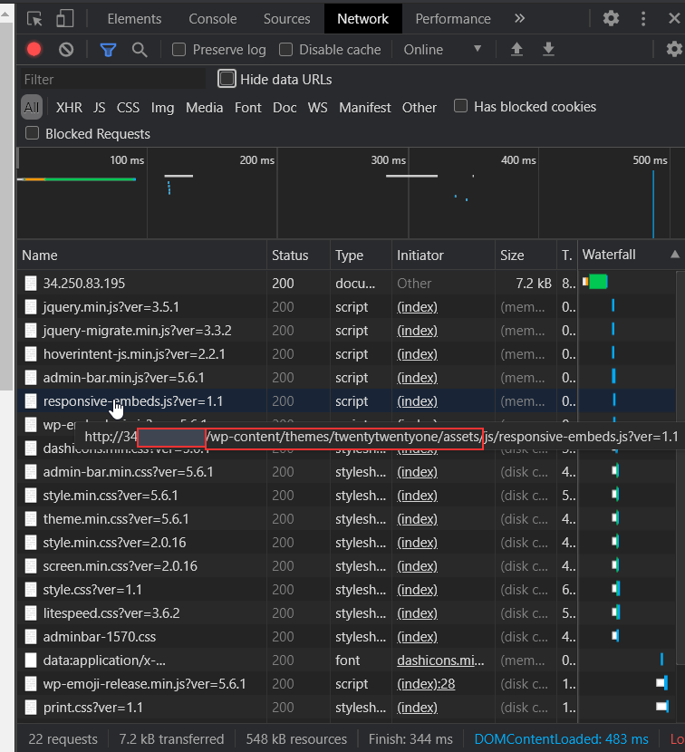 

 We can take a pretty good guess that the name of the current theme is  "twentytwentyone". After inspecting the source code of the website, we  can note additional references to "twentytwentyone"

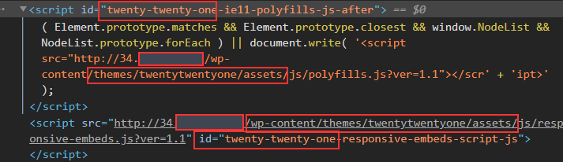

However, let's use WPScan to speed this process up by using the `--enumerate` flag with the `t` argument like so:

```
wpscan --url http://cmnatics.playground/ --enumerate t 
```

After a couple of minutes, we can begin to see some results:

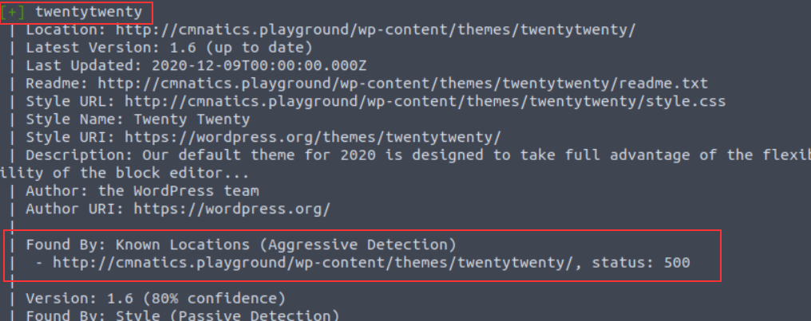

The great thing about WPScan is that the tool lets you know how it  determined the results it has got. In this case, we're told that the  "twentytwenty" theme was confirmed by scanning "*Known Locations*". The "twentytwenty" theme is the default WordPress theme for WordPress versions in 2020.

**Enumerating for Installed Plugins**

A very common feature of webservers is "Directory Listing" and is often  enabled by default. Simply, "Directory Listing" is the listing of files  in the directory that we are navigating to (just as if we were to use  Windows Explorer or Linux's `ls` command. URL's in this context are very similar to file paths. The URL http://cmnatics.playground/a/directory is actually the configured root of the *webserver/a/directory:*

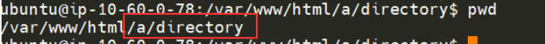


"Directory Listing" occurs when there is no file present that the webserver has  been told to process. A very common file is "index.html" and  "index.php". As these files aren't present in /a/directory, the contents are instead displayed:

 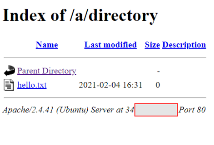

WPScan can leverage this feature as one technique to look for plugins  installed. Since they will all be located in  /wp-content/plugins/pluginname, WPScan can enumerate for common/known  plugins.

In the screenshot below, "easy-table-of-contents" has  been discovered. Great! This could be vulnerable. To determine that, we  need to know the version number. Luckily, this handed to us on a plate  by WordPress.

 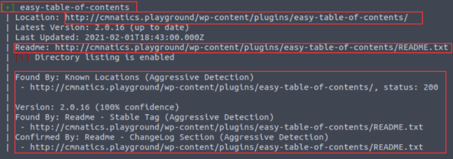

Reading through WordPress' developer documentation, we can learn about "[Plugin Readme's](https://developer.wordpress.org/plugins/wordpress-org/how-your-readme-txt-works/#how-the-readme-is-parsed)" to figure out how WPScan determined the version number. Simply, plugins must have a "README.txt" file. This file contains meta-information such as the plugin name, the versions of WordPress it is compatible with and a description.

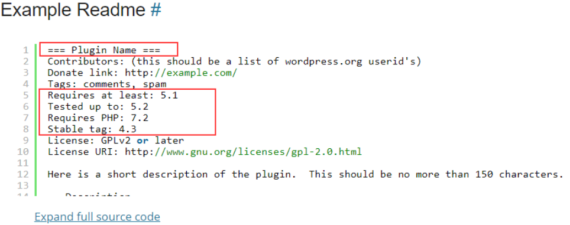

[An Example ReadMe. (WordPress Developer Documentation., 2021)](https://developer.wordpress.org/plugins/wordpress-org/how-your-readme-txt-works/#example-readme)

WPScan uses additional methods to discover plugins (such as looking for  references or embeds on pages for plugin assets). We can use the `--enumerate` flag with the `p` argument like so:

```
wpscan --url http://cmnatics.playground/ --enumerate p 
```

**Enumerating for Users**

We've highlighted that WPScan is capable of performing brute-forcing attacks. Whilst we must provide a password list such as *rockyou.txt*, the way how WPScan enumerates for users is interestingly simple.  WordPress sites use authors for posts. Authors are in fact a type of  user. 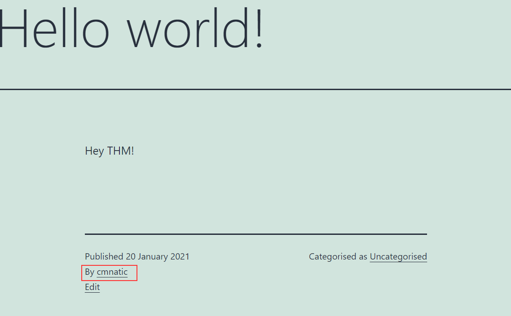

And sure enough, this author is picked up by our WPScan:

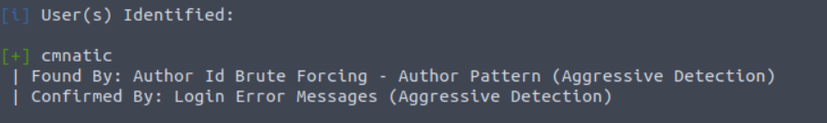

This scan was performed by using the `--enumerate` flag with the `u` argument like so:

```
wpscan --url http://cmnatics.playground/ --enumerate u 
```

**The "Vulnerable" Flag**

In the commands so far, we have only enumerated WordPress to discover what themes, plugins and users are present. At the moment, we'd have to look at the output and use sites such as MITRE, NVD and CVEDetails to look up the names of these plugins and the version numbers to determine any vulnerabilities.

WPScan has the `v` argument for the` --enumerate` flag. We provide this argument alongside another (such as `p` for plugins). For example, our syntax would like so: `wpscan --url http://cmnatics.playground/ --enumerate vp `

**Note, that this requires setting up WPScan to use the WPVulnDB API which is out-of-scope for this room.** 

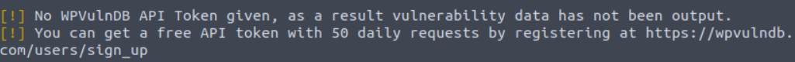**
**

**
**

**Performing a Password Attack**

After determining a list of possible usernames on the WordPress install, we  can use WPScan to perform a bruteforcing technique against the username  we specify and a password list that we provide. Simply, we use the  output of our username enumeration to build a command like so: `wpscan –-url http://cmnatics.playground –-passwords rockyou.txt –-usernames cmnatic`

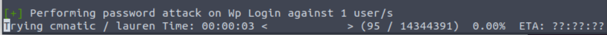


**Adjusting WPScan's Aggressiveness (WAF)**

Unless specified, WPScan will try to be as least "noisy" as possible. Lots of  requests to a web server can trigger things such as firewalls and  ultimately result in you being blocked by the server.

This means that some plugins and themes may be missed by our WPScan. Luckily, we can use arguments such as `--plugins-detection` and an aggressiveness profile (passive/aggressive) to specify this. For example: `--plugins-detection aggressive`

**Summary - Cheatsheet**

| Flag       | Description                                                  | Full Example                   |
| ---------- | ------------------------------------------------------------ | ------------------------------ |
| p          | Enumerate Plugins                                            | --enumerate p                  |
| t          | Enumerate Themes                                             | --enumerate t                  |
| u          | Enumerate Usernames                                          | --enumerate -u                 |
| v          | Use WPVulnDB to cross-reference for vulnerabilities. Example command looks for vulnerable plugins (p) | --enumerate vp                 |
| aggressive | This is an aggressiveness profile for WPScan to use.         | --plugins-detection aggressive |

# Nikto Modes                            

**Basic Scanning**

The most basic scan can be performed by using the -h flag and providing an  IP address or domain name as an argument. This scan type will retrieve  the headers advertised by the webserver or application (I.e. Apache2, Apache Tomcat, Jenkins or JBoss) and will look for any sensitive files or directories (i.e. login.php, /admin/, etc)

An example of this is the following: `nikto -h vulnerable_ip`

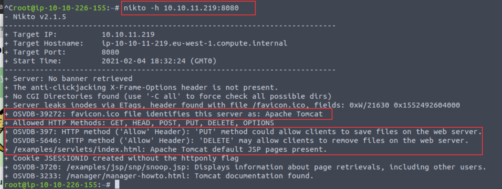

Note a few interesting things are given to us in this example:

- Nikto has identified that the application is Apache Tomcat using the favicon and the presence of "*/examples/servlets/index.html*" which is the location for the default Apache Tomcat application.
- HTTP Methods "*PUT*" and "*DELETE*" can be performed by clients - we may be able to leverage these to exploit the application by uploading or deleting files.


**Scanning Multiple Hosts & Ports**

Nikto is extensive in the sense that we can provide multiple arguments in a  way that's similar to tools such as Nmap. In fact, so much so, we can  take input directly from an Nmap scan to scan a host range. By scanning a subnet, we can look for hosts across an entire network range. We must  instruct Nmap to output a scan into a format that is friendly for Nikto  to read using Nmap's `-oG` flags

For example, we can  scan 172.16.0.0/24 (subnet mask 255.255.255.0, resulting in 254 possible hosts) with Nmap (using the default web port of 80) and parse the  output to Nikto like so: `nmap -p80 172.16.0.0/24 -oG - | nikto -h -` 

There are not many circumstances where you would use this other than when you have gained access to a network. A much more common scenario will be  scanning multiple ports on one specific host. We can do this by using  the` -p` flag and providing a list of port numbers delimited by a comma - such as the following: `nikto -h 10.10.10.1 -p 80,8000,8080`

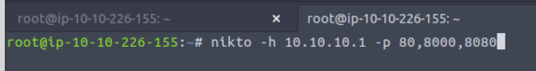


**Introduction to Plugins**

Plugins further extend the capabilities of Nikto. Using information gathered  from our basic scans, we can pick and choose plugins that are  appropriate to our target. You can use the `--list-plugins` flag with Nikto to list the plugins or [view the whole list in an easier to read format online](https://github.com/sullo/nikto/wiki/Plugin-list). 

Some interesting plugins include:

| Plugin Name   | Description                                                  |
| ------------- | ------------------------------------------------------------ |
| apacheusers   | Attempt to enumerate Apache HTTP Authentication Users        |
| cgi           | Look for CGI scripts that we may be able to exploit          |
| robots        | Analyse the robots.txt file which dictates what files/folders we are able to navigate to |
| dir_traversal | Attempt to use a directory traversal attack (i.e. LFI) to look for system files such as /etc/passwd on Linux (http://ip_address/application.php?view=../../../../../../../etc/passwd) |

We can specify the plugin we wish to use by using the` -Plugin` argument and the name of the plugin we wish to use...For example, to use the "*apacheuser*" plugin, our Nikto scan would look like so: `nikto -h 10.10.10.1 -Plugin apacheuser`

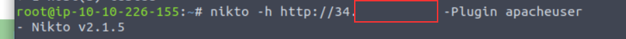


**Verbosing our Scan**

We can increase the verbosity of our Nikto scan by providing the following arguments with the` -Display` flag. Unless specified, the output given by Nikto is not the entire  output, as it can sometimes be irrelevant (but that isn't always the  case!)

| Argument | Description                                          | Reasons for Use                                              |
| -------- | ---------------------------------------------------- | ------------------------------------------------------------ |
| 1        | Show any redirects that are given by the web server. | Web servers may want to relocate us to a specific file or directory, so we will need to adjust our scan accordingly for this. |
| 2        | Show any cookies received                            | Applications often use cookies as a means of storing data. For example, web servers  use sessions, where e-commerce sites may store products in your basket  as these cookies. Credentials can also be stored in cookies. |
| E        | Output any errors                                    | This will be useful for debugging if your scan is not returning the results that you expect! |


**Tuning Your Scan for Vulnerability Searching**

Nikto has several categories of vulnerabilities that we can specify our scan  to enumerate and test for. The following list is not extensive and only  include the ones that you may commonly use. We can use the `-Tuning `flag and provide a value in our Nikto scan: 

| Category Name                     | Description                                                  | Tuning Option |
| --------------------------------- | ------------------------------------------------------------ | ------------- |
| File Upload                       | Search for anything on the web server that may permit us to upload a file.  This could be used to upload a reverse shell for an application to  execute. | 0             |
| Misconfigurations / Default Files | Search for common files that are sensitive (and shouldn't be accessible such as configuration files) on the web server. | 2             |
| Information Disclosure            | Gather information about the web server or application (i.e. verison numbers, HTTP headers, or any information that may be useful to leverage in our attack later) | 3             |
| Injection                         | Search for possible locations in which we can perform some kind of injection attack such as XSS or HTML | 4             |
| Command Execution                 | Search for anything that permits us to execute OS commands (such as to spawn a shell) | 8             |
| SQL Injection                     | Look for applications that have URL parameters that are vulnerable to SQL Injection | 9             |


**Saving Your Findings**

Rather than working with the output on the terminal, we can instead, just dump it directly into a file for further analysis - making our lives much  easier!

Nikto is capable of putting to a few file formats including:

- Text File
- HTML report

We can use the `-o` argument (short for `-Output`) and provide both a filename and compatible extension. We *can* specify the format (`-f`) specifically, but Nikto is smart enough to use the extension we provide in the` -o` argument to adjust the output accordingly.

For example, let's scan a web server and output this to "*report.html*": `nikto -h http://ip_address -o report.html`

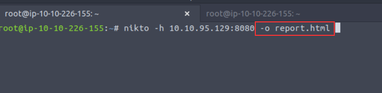

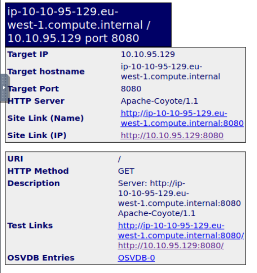