# Statistics | Summary                            

**Statistics**

This menu provides multiple statistics options ready to investigate to help  users see the big picture in terms of the scope of the traffic,  available protocols, endpoints and conversations, and some  protocol-specific details like DHCP, DNS and HTTP/2. For a security analyst, it is crucial to know how to  utilise the statical information. This section provides a quick summary  of the processed pcap, which will help analysts create a hypothesis for  an investigation. You can use the **"Statistics"** menu to view all available options. Now start the given VM, open the Wireshark, load the "Exercise.pcapng" file and go through the walkthrough.

**Resolved Addresses**

This option helps analysts identify IP addresses and DNS names available in the capture file by providing the list of the  resolved addresses and their hostnames. Note that the hostname  information is taken from DNS answers in the capture file. Analysts can  quickly identify the accessed resources by using this menu. Thus they  can spot accessed resources and evaluate them according to the event of  interest. You can use the **"Statistics --> Resolved Addresses"** menu to view all resolved addresses by Wireshark.

**Protocol Hierarchy**

This option breaks down all available protocols from the capture file and  helps analysts view the protocols in a tree view based on packet  counters and percentages. Thus analysts can view the overall usage of  the ports and services and focus on the event of interest. The golden rule mentioned in the previous room is valid in this section; you can right-click and filter the event of interest. You can use the **"Statistics --> Protocol Hierarchy"** menu to view this info.

**Conversations**

Conversation represents traffic between two specific endpoints. This option provides the list of the conversations in five base formats; ethernet, IPv4,  IPv6, TCP and UDP. Thus analysts can identify all conversations and contact endpoints for the event of interest. You can use the **"Statistic --> Conversations"** menu to view this info.

**Endpoints**

The endpoints option is similar to the conversations option. The only  difference is that this option provides unique information for a single  information field (Ethernet, IPv4, IPv6, TCP and UDP ). Thus analysts can identify the unique endpoints in the capture file and use it for the event of interest. You can use the **"Statistics --> Endpoints"** menu to view this info. 

Wireshark also supports resolving MAC addresses to human-readable format using the manufacturer name assigned by IEEE. Note that this conversion is done through the first three  bytes of the MAC address and only works for the known manufacturers.  When you review the ethernet endpoints, you can activate this option  with the **"Name resolution"** button in the lower-left corner of the endpoints window.

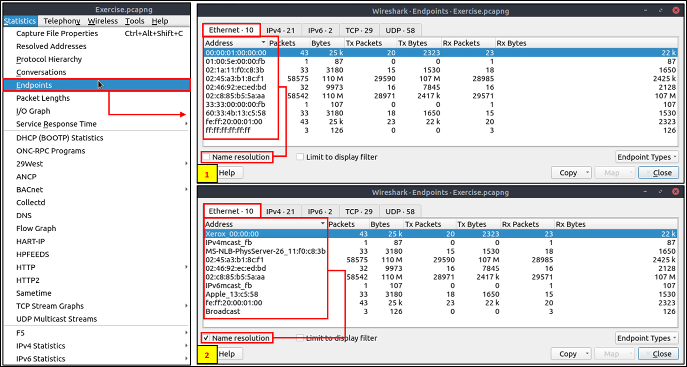

Name resolution is not limited only to MAC addresses. Wireshark provides IP and port name resolution options as  well. However, these options are not enabled by default. If you want to  use these functionalities, you need to activate them through the **"Edit --> Preferences --> Name Resolution"** menu. Once you enable IP and port name resolution, you will see the  resolved IP address and port names in the packet list pane and also will be able to view resolved names in the "Conversations" and "Endpoints"  menus as well.

Endpoint menu view with name resolution:

Besides name resolution, Wireshark also provides an IP geolocation mapping that helps analysts identify the map's source and destination addresses. But this feature is not activated by default and needs supplementary data  like the GeoIP database. Currently, Wireshark supports MaxMind  databases, and the latest versions of the Wireshark come configured  MaxMind DB resolver. However, you still need MaxMind DB files and  provide the database path to Wireshark by using the **"Edit --> Preferences --> Name Resolution --> MaxMind database directories"** menu. Once you download and indicate the path, Wireshark will automatically  provide GeoIP information under the IP protocol details for the matched IP addresses.

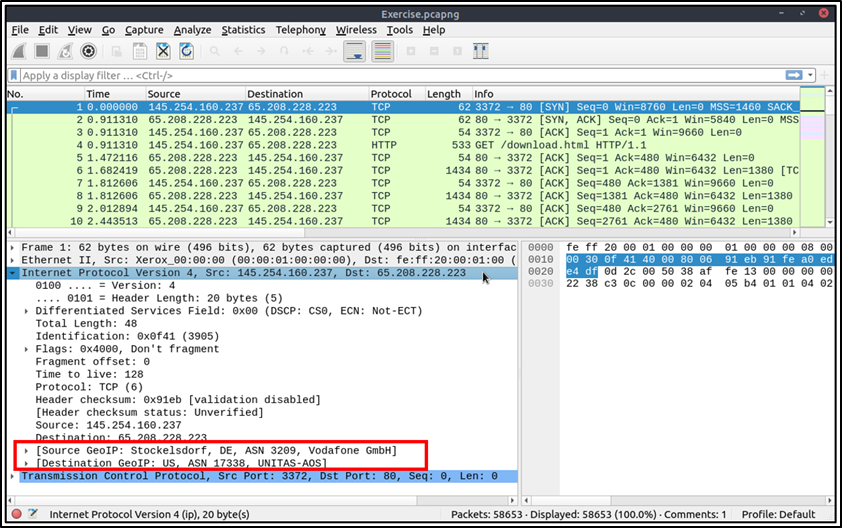

Endpoints and GeoIP view.

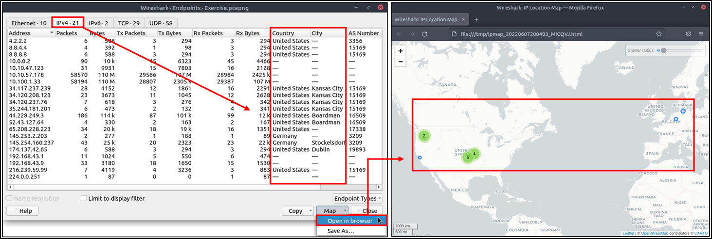

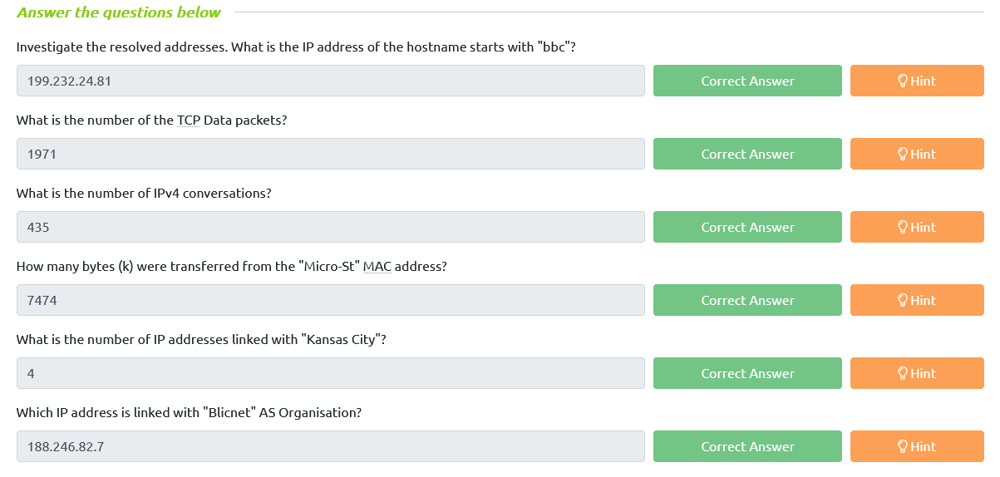

#  Statistics | Protocol Details

**IPv4 and IPv6**

Up to here, almost all options provided information that contained both  versions of the IP addresses. The statistics menu has two options for  narrowing the statistics on packets containing a specific IP version.  Thus, analysts can identify and list all events linked to specific IP  versions in a single window and use it for the event of interest. You  can use the **"Statistics --> IPvX Statistics"** menu to view this info.

**DNS**

This option breaks down all DNS packets from the capture file and helps analysts view the findings in a tree view based on packet counters and percentages of the DNS protocol. Thus analysts can view the DNS service's overall usage, including  rcode, opcode, class, query type, service and query stats and use it for the event of interest. You can use the **"Statistics --> DNS"** menu to view this info.

**HTTP**

This option breaks down all HTTP packets from the capture file and helps analysts view the findings in a tree view based on packet counters and percentages of the HTTP  protocol. Thus analysts can view the HTTP service's overall usage,  including request and response codes and the original requests. You can use the **"Statistics --> HTTP"** menu to view this info.

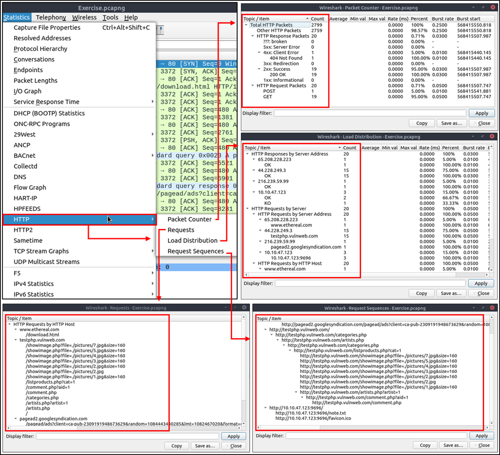

#  Packet Filtering | Principles                            

**Packet Filtering**

In the previous room ([**Wireshark | The Basics**](https://tryhackme.com/room/wiresharkthebasics)), we covered packet filtering and how to filter packets without using  queries. In this room, we will use queries to filter packets. As  mentioned earlier, there are two types of filters in Wireshark. While  both use similar syntax, they are used for different purposes. Let's  remember the difference between these two categories.

| **Capture Filters** | This type of filter is used to save only a specific part of the traffic. It  is set before capturing traffic and not changeable during the capture. |
| ------------------- | ------------------------------------------------------------ |
| **Display Filters** | This type of filter is used to investigate packets by reducing the number of visible packets, and it is changeable during the capture. |

**Note:** You cannot use the display filter expressions for capturing traffic and vice versa. 

The typical use case is capturing everything and filtering the packets  according to the event of interest. Only experienced professionals use  capture filters and sniff traffic. This is why Wireshark supports more  protocol types in display filters. Please ensure you thoroughly learn  how to use capture filters before using them in a live environment.  Remember, you cannot capture the event of interest if your capture  filter is not matching the specific traffic pattern you are looking for.

**Capture Filter Syntax**

These filters use byte offsets hex values and masks with boolean operators,  and it is not easy to understand/predict the filter's purpose at first  glance. The base syntax is explained below:

- **Scope:** host, net, port and portrange.
- **Direction:** src, dst, src or dst, src and dst,
- **Protocol:** ether, wlan, ip, ip6, arp, rarp, tcp and udp.
- **Sample filter to capture port 80 traffic:** `tcp port 80`

You can read more on capture filter syntax from [here](https://www.wireshark.org/docs/man-pages/pcap-filter.html) and [here](https://gitlab.com/wireshark/wireshark/-/wikis/CaptureFilters#useful-filters). A quick reference is available under the **"Capture --> Capture Filters"** menu.

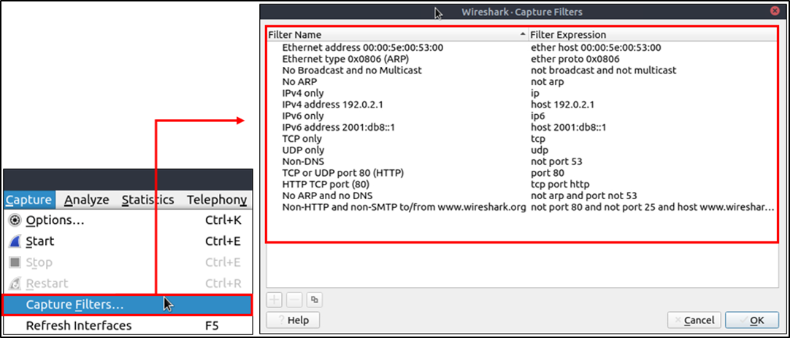

**Display Filter Syntax**

This is Wireshark's most powerful feature. It supports 3000 protocols and  allows conducting packet-level searches under the protocol breakdown.  The official "[Display Filter Reference](https://www.wireshark.org/docs/dfref/)" provides all supported protocols breakdown for filtering.

- **Sample filter to capture port 80 traffic:** `tcp.port == 80`

Wireshark has a built-in option (Display Filter Expression) that stores all  supported protocol structures to help analysts create display filters.  We will cover the "Display Filter Expression" menu later. Now let's  understand the fundamentals of the display filter operations. A quick  reference is available under the **"Analyse --> Display Filters"** menu.

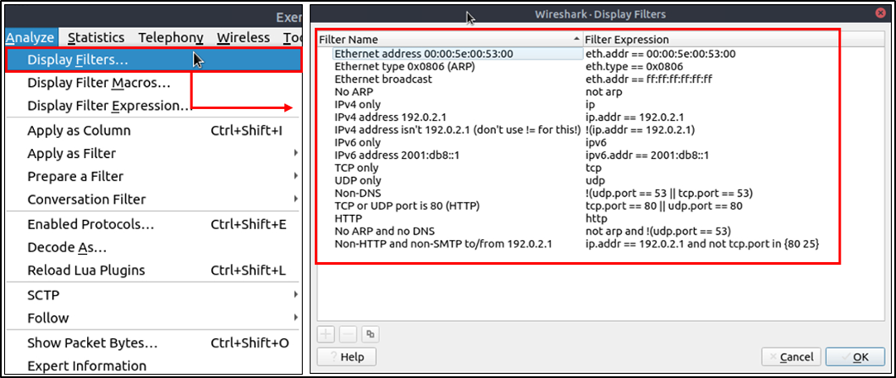

**Comparison Operators**

You can create display filters by using different comparison operators to  find the event of interest. The primary operators are shown in the table below.

| **English** | **C-Like** | **Description**          | **Example**              |
| ----------- | ---------- | ------------------------ | ------------------------ |
| eq          | ==         | Equal                    | `ip.src == 10.10.10.100` |
| ne          | !=         | Not equal                | `ip.src == 10.10.10.100` |
| gt          | >          | Greater than             | `ip.ttl > 250`           |
| lt          | <          | Less Than                | `ip.ttl < 10`            |
| ge          | >=         | Greater than or equal to | `ip.ttl >= 0xFA`         |
| le          | <=         | Less than or equal to    | `ip.ttl <= 0xA`          |

**Note:** Wireshark supports decimal and hexadecimal values in filtering. You can use any  format you want according to the search you will conduct.

**Logical Expressions**

Wireshark supports boolean syntax. You can create display filters by using logical operators as well.

| **English** | **C-Like** | **Description** | **Example**                                                  |
| ----------- | ---------- | --------------- | ------------------------------------------------------------ |
| and         | &&         | Logical AND     | `(ip.src == 10.10.10.100) AND (ip.src == 10.10.10.111)`      |
| or          | \|\|       | Logical OR      | `(ip.src == 10.10.10.100) OR (ip.src == 10.10.10.111)`       |
| not         | !          | Logical NOT     | `!(ip.src == 10.10.10.222)`**Note:** Usage of `!=value` is deprecated; using it could provide inconsistent results. Using the `!(value)` style is suggested for more consistent results. |

**Packet Filter Toolbar**

The filter toolbar is where you create and apply your display filters. It  is a smart toolbar that helps you create valid display filters with  ease. Before starting to filter packets, here are a few tips:

- Packet filters are defined in lowercase.
- Packet filters have an autocomplete feature to break down protocol details, and each detail is represented by a "dot".
- Packet filters have a three-colour representation explained below.

| **Green**  | Valid filter                                                 |
| ---------- | ------------------------------------------------------------ |
| **Red**    | Invalid filter                                               |
| **Yellow** | Warning filter. This filter works, but it is unreliable, and it is suggested to change it with a valid filter. |

Filter toolbar features are shown below.

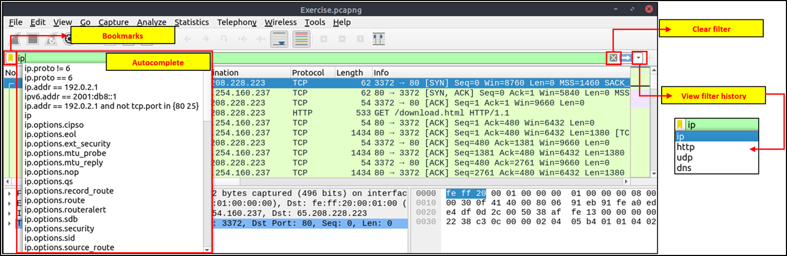

# Packet Filtering | Protocol Filters

**Protocol Filters**

As mentioned in the previous task, Wireshark supports 3000 protocols and  allows packet-level investigation by filtering the protocol fields. This task shows the creation and usage of filters against different protocol fields. 

**IP Filters**

IP filters help analysts filter the traffic according to the IP level  information from the packets (Network layer of the OSI model). This is  one of the most commonly used filters in Wireshark. These filters filter network-level information like IP addresses, version, time to live,  type of service, flags, and checksum values.

The common filters are shown in the given table.

| **Filter**                   | **Description**                                              |
| ---------------------------- | ------------------------------------------------------------ |
| `ip`                         | Show all IP packets.                                         |
| `ip.addr == 10.10.10.111`    | Show all packets containing IP address 10.10.10.111.         |
| `ip.addr == 10.10.10.0/24`   | Show all packets containing IP addresses from 10.10.10.0/24 subnet. |
| `ip.src == 10.10.10.111`     | Show all packets originated from 10.10.10.111                |
| `ip.dst == 10.10.10.111`     | Show all packets sent to 10.10.10.111                        |
| ip.addr **vs** ip.src/ip.dst | **Note:** The ip.addr filters the traffic without considering the packet direction.  The ip.src/ip.dst filters the packet depending on the packet direction. |

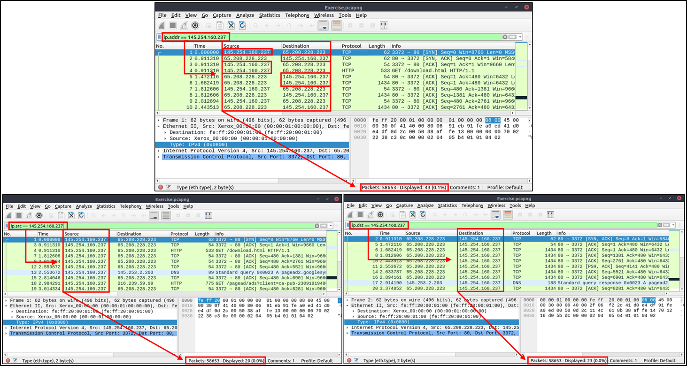

**TCP and UDP Filters**

TCP filters help analysts filter the traffic according to protocol-level  information from the packets (Transport layer of the OSI model). These  filters filter transport protocol level information like source and  destination ports, sequence number, acknowledgement number, windows  size, timestamps, flags, length and protocol errors.

| **Filter**            | **Description**                                 | **Filter**            | **Expression**                                  |
| --------------------- | ----------------------------------------------- | --------------------- | ----------------------------------------------- |
| `tcp.port == 80`      | Show all TCP packets with port 80               | `udp.port == 53`      | Show all UDP packets with port 53               |
| `tcp.srcport == 1234` | Show all TCP packets originating from port 1234 | `udp.srcport == 1234` | Show all UDP packets originating from port 1234 |
| `tcp.dstport == 80`   | Show all TCP packets sent to port 80            | `udp.dstport == 5353` | Show all UDP packets sent to port 5353          |

**Application Level Protocol Filters | HTTP and DNS**

Application-level protocol filters help analysts filter the traffic according to  application protocol level information from the packets (Application  layer of the OSI model ). These filters filter application-specific  information, like payload and linked data, depending on the protocol  type.

| **Filter**                      | **Description**                                | **Filter**                | **Description**          |
| ------------------------------- | ---------------------------------------------- | ------------------------- | ------------------------ |
| `http`                          | Show all HTTP packets                          | `dns`                     | Show all DNS packets     |
| `http.response.code == 200`     | Show all packets with HTTP response code "200" | `dns.flags.response == 0` | Show all DNS requests    |
| `http.request.method == "GET"`  | Show all HTTP GET requests                     | `dns.flags.response == 1` | Show all DNS responses   |
| `http.request.method == "POST"` | Show all HTTP POST requests                    | `dns.qry.type == 1`       | Show all DNS "A" records |

**Display Filter Expressions**

As mentioned earlier, Wireshark has a built-in option (Display Filter  Expression) that stores all supported protocol structures to help  analysts create display filters. When an analyst can't recall the  required filter for a specific protocol or is unsure about the  assignable values for a filter, the Display Filter Expressions menu  provides an easy-to-use display filter builder guide. It is available  under the **"Analyse --> Display Filter Expression"** menu.

It is impossible to memorise all details of the display filters for each  protocol. Each protocol can have different fields and can accept various types of values. The Display Filter Expressions menu shows all protocol fields, accepted value types (integer or string) and predefined values  (if any). Note that it will take time and require practice to master  creating filters and learning the protocol filter fields.

**Note:** The [**first room**](https://tryhackme.com/room/wiresharkthebasics) introduced the "Colouring Rules" (Task-2). Now you know how to create display filters and filter the event of interest. You can use the **"View --> Coloring Rules"** menu to assign colours to highlight your display filter results.

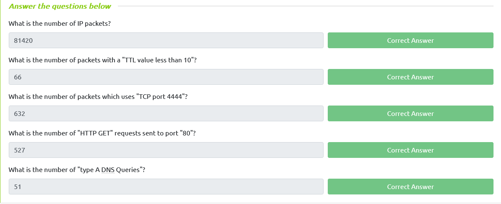

#  Advanced Filtering                            

**Advanced Filtering**

So far, you have learned the basics of packet filtering operations. Now it is time to focus on specific packet details for the event of interest.  Besides the operators and expressions covered in the previous room,  Wireshark has advanced operators and functions. These advanced filtering options help the analyst conduct an in-depth analysis of an event of  interest.

**Filter: "contains"**

| **Filter**      | **contains**                                                 |
| --------------- | ------------------------------------------------------------ |
| **Type**        | Comparison Operator                                          |
| **Description** | Search a value inside packets. It is case-sensitive and provides similar  functionality to the "Find" option by focusing on a specific field. |
| **Example**     | Find all "Apache" servers.                                   |
| **Workflow**    | List all HTTP packets where packets' "server" field contains the "Apache" keyword. |
| **Usage**       | `http.server contains "Apache"`                              |

**Filter: "matches"**

| **Filter**      | **matches**                                                  |
| --------------- | ------------------------------------------------------------ |
| **Type**        | Comparison Operator                                          |
| **Description** | Search a pattern of a regular expression. It is case insensitive, and complex queries have a margin of error. |
| **Example**     | Find all .php and .html pages.                               |
| **Workflow**    | List all HTTP packets where packets' "host" fields match keywords ".php" or ".html". |
| **Usage**       | `http.host matches "\.(php || html)"`                        |

**Filter: "in"**

| **Filter**      | **in**                                                       |
| --------------- | ------------------------------------------------------------ |
| **Type**        | Set Membership                                               |
| **Description** | Search a value or field inside of a specific scope/range.    |
| **Example**     | Find all packets that use ports 80, 443 or 8080.             |
| **Workflow**    | List all TCP packets where packets' "port" fields have values 80, 443 or 8080. |
| **Usage**       | `tcp.port in {80 443 8080}`                                  |

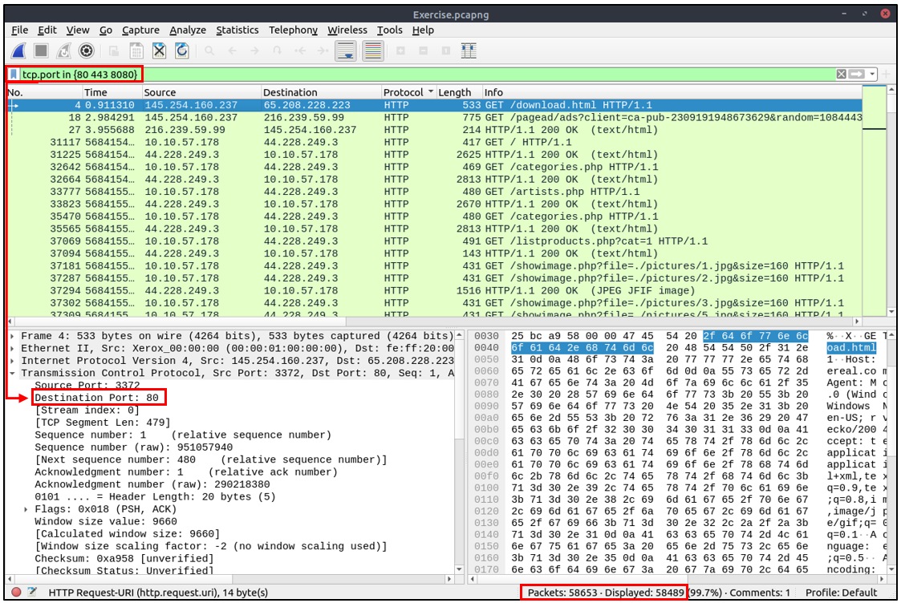

**Filter: "upper"**

| **Filter**      | **upper**                                                    |
| --------------- | ------------------------------------------------------------ |
| **Type**        | Function                                                     |
| **Description** | Convert a string value to uppercase.                         |
| **Example**     | Find all "APACHE" servers.                                   |
| **Workflow**    | Convert all HTTP packets' "server" fields to uppercase and list packets that contain the "APACHE" keyword. |
| **Usage**       | `upper(http.server) contains "APACHE"`                       |

**Filter: "lower"**

| **Filter**      | **lower**                                                    |
| --------------- | ------------------------------------------------------------ |
| **Type**        | Function                                                     |
| **Description** | Convert a string value to lowercase.                         |
| **Example**     | Find all "apache" servers.                                   |
| **Workflow**    | Convert all HTTP packets' "server" fields info to lowercase and list packets that contain the "apache" keyword. |
| **Usage**       | `lower(http.server) contains "apache"`                       |

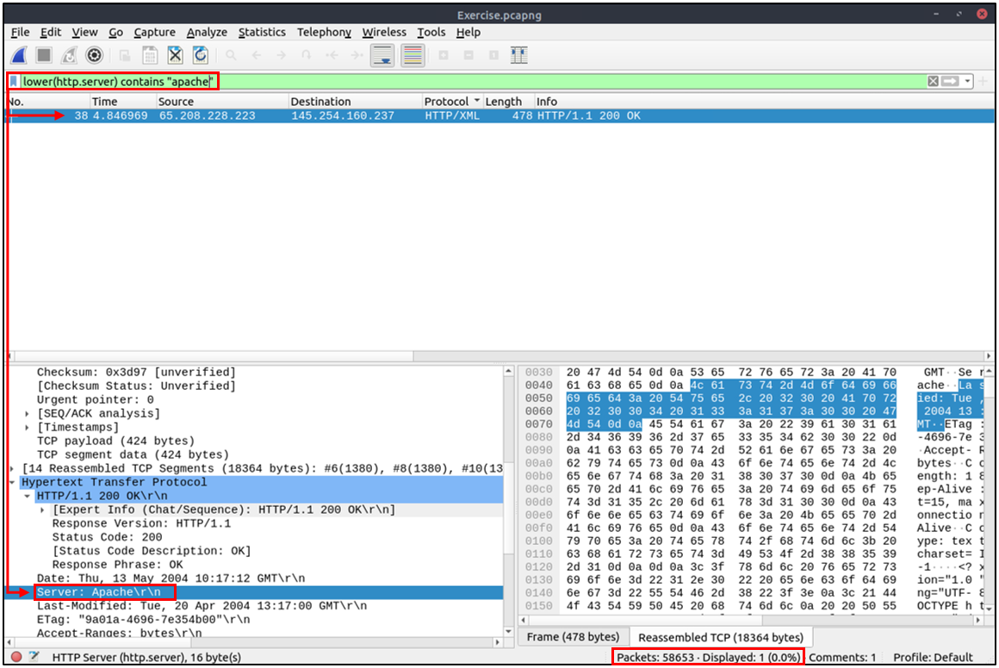

**Filter: "string"**

| **Filter**      | **string**                                                   |
| --------------- | ------------------------------------------------------------ |
| **Type**        | Function                                                     |
| **Description** | Convert a non-string value to a string.                      |
| **Example**     | Find all frames with odd numbers.                            |
| **Workflow**    | Convert all "frame number" fields to string values, and list frames end with odd values. |
| **Usage**       | `string(frame.number) matches "[13579]$"`                    |

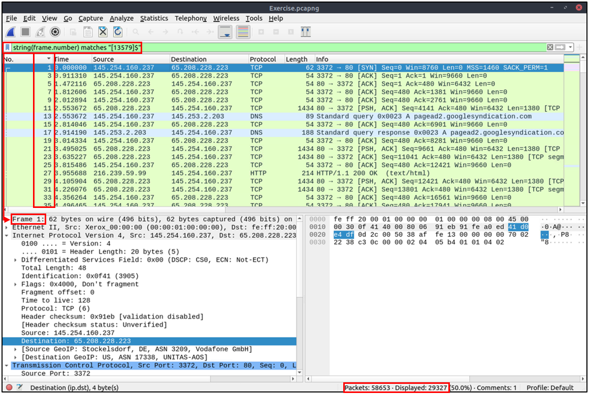

**Bookmarks and Filtering Buttons**

We've covered different types of filtering options, operators and functions.  It is time to create filters and save them as bookmarks and buttons for  later usage. As mentioned in the previous task, the filter toolbar has a filter bookmark section to save user-created filters, which helps  analysts re-use favourite/complex filters with a couple of clicks.  Similar to bookmarks, you can create filter buttons ready to apply with a single click. 

Creating and using bookmarks.

Creating and using display filter buttons.

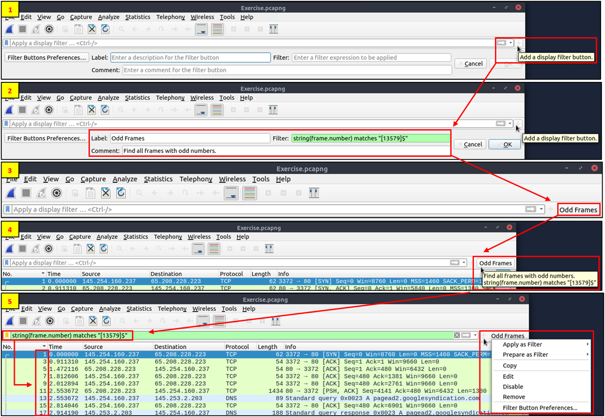

**Profiles**

Wireshark is a multifunctional tool that helps analysts to accomplish in-depth  packet analysis. As we covered during the room, multiple preferences  need to be configured to analyse a specific event of interest. It is  cumbersome to re-change the configuration for each investigation case,  which requires a different set of colouring rules and filtering buttons. This is where Wireshark profiles come into play. You can create  multiple profiles for different investigation cases and use them  accordingly. You can use the **"Edit --> Configuration Profiles"** menu or the **"lower right bottom of the status bar --> Profile"** section to create, modify and change the profile configuration.

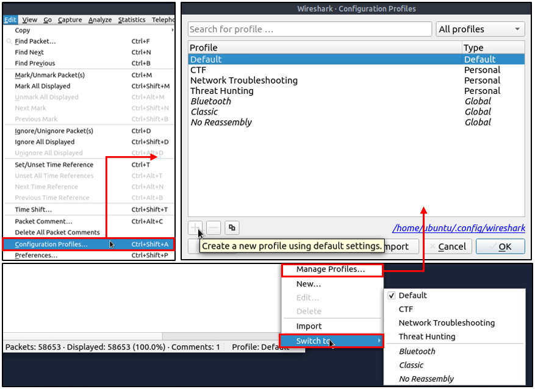